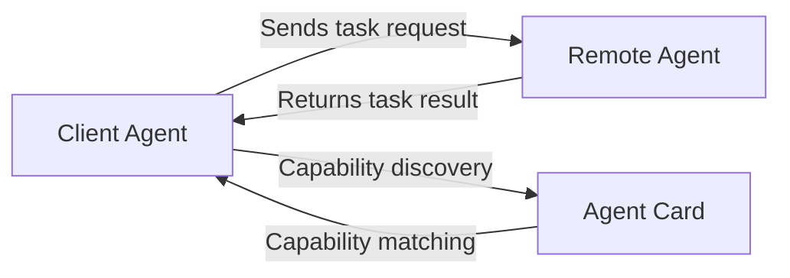
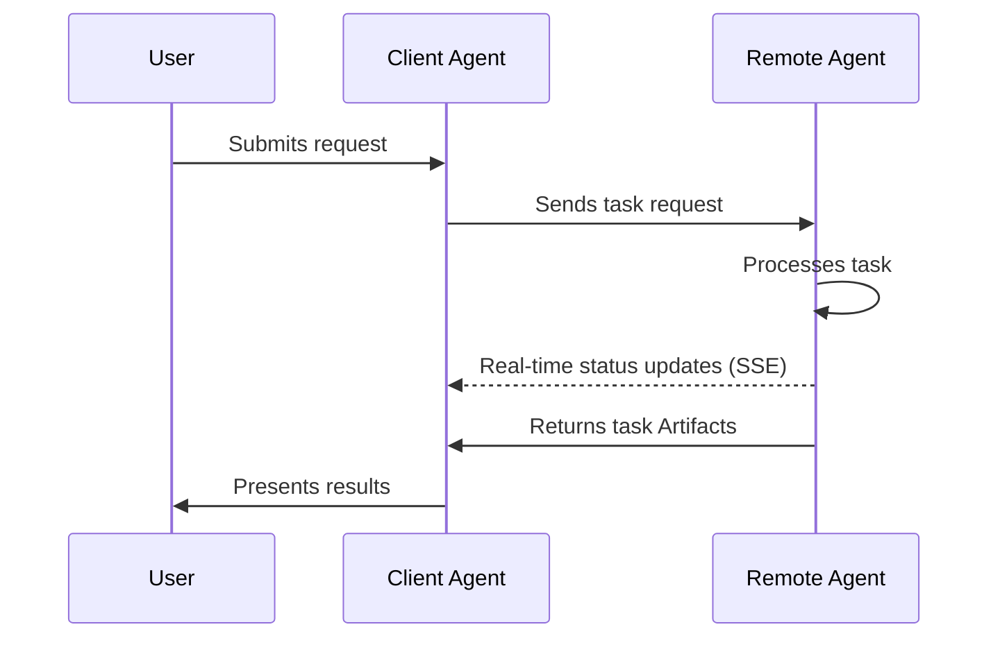
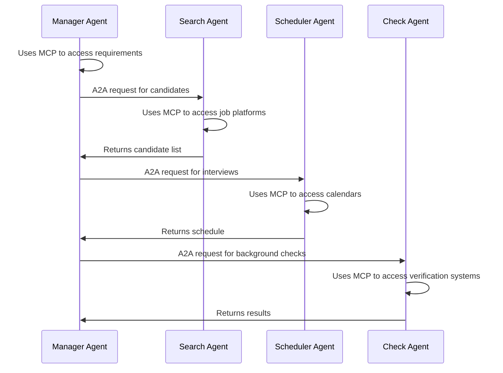

In today's rapidly evolving AI landscape, agent technology is emerging as the next major technological wave. To address the challenges of communication and collaboration among AIs, two critical protocol standards have emerged: Google's [A2A (Agent-to-Agent) Protocol](https://www.a2aprotocol.net) and Anthropic's [MCP (Model Context Protocol) Protocol](/). These protocols tackle key challenges in AI agent systems from different angles, collectively laying the foundation for the future AI agent ecosystem.

This article delves into the **A2A Protocol** and **MCP Protocol**, examining their features, distinctions, and collaborative potential to help developers and product designers navigate this emerging field.

## A2A Protocol: Bridging Communication Between Agents

### Core Concepts of the A2A Protocol

The **A2A Protocol** is an open standard developed by Google in collaboration with over 50 industry partners. It enables interoperability among AI agents from different vendors, regardless of their origin, hosting environment, or framework, allowing them to collaborate seamlessly.

### Technical Implementation of the A2A Protocol

The **A2A Protocol** employs **JSON-RPC 2.0 over HTTP(S)** for communication and supports **Server-Sent Events (SSE)** for real-time updates. This design ensures efficient information exchange across diverse platforms.

### Communication Model of the A2A Protocol

The **A2A Protocol** defines two agent roles:

1. **Client Agent**: Initiates requests or tasks.
2. **Remote Agent**: Receives requests and attempts to complete tasks.

The communication process may begin with **Capability Discovery** to identify the most suitable agent for a specific task.

### Agent Cards and Capability Discovery

Each agent can publish an **Agent Card**—a JSON metadata document typically hosted at a standard URL (e.g., `/.well-known/agent.json`). The Agent Card describes the agent's functionalities, skills, API endpoints, and authentication requirements.

By reviewing Agent Cards, client agents can identify the best partner agents for their tasks.

### Task Management Mechanism

All interactions in the **A2A Protocol** revolve around executing tasks. Tasks are structured objects defined by the protocol, containing request details and tracking their status. Results are returned as **Artifacts**, and agents can send structured **Messages** during execution for coordination or clarification.

## MCP Protocol: Connecting Models to the External World

### Framework of the MCP Protocol

The **MCP Protocol** (Model Context Protocol), developed by Anthropic, standardizes interactions between AI applications (e.g., chatbots, agents, and IDEs) and external tools, data sources, and services. It provides a unified interface for integrating contextual information, reducing fragmentation in AI development.

### Core Components of the MCP Protocol

The **MCP Protocol** consists of three key components:

1. **Tools**: Actions controlled by models (e.g., fetching data, writing to databases).
2. **Resources**: Data controlled by applications (e.g., files, JSON, attachments).
3. **Prompts**: User-controlled predefined templates (e.g., slash commands in IDEs).

### Value and Significance of the MCP Protocol

The **MCP Protocol** offers several advantages:

1. **Reduces Fragmentation**: Provides a standard way to connect AI applications with tools and data, eliminating custom integrations.
2. **Enables Composability**: Agents and applications can dynamically discover and use new tools without pre-programming.
3. **Supports Enterprise Workflows**: Teams can own specific services and expose them to others via the **MCP Protocol**.

### Applications of the MCP Protocol

The **MCP Protocol** is already being used in various domains:

- **IDEs (e.g., Cursor, Zed)**: Integrate code context, GitHub issues, and documentation.
- **Agents**: Autonomously invoke tools (e.g., web searches, database queries).
- **Remote Servers & OAuth**: Supports remote **MCP Protocol** servers and secure authentication.

## Synergies and Differences Between A2A and MCP Protocols

### Functional Positioning of the Protocols

The **A2A Protocol** and **MCP Protocol** address different challenges in the AI agent ecosystem:

- **A2A Protocol**: Focuses on agent-to-agent interactions (horizontal integration).
- **MCP Protocol**: Focuses on agent-to-tool or agent-to-external-context interactions (vertical integration).

### Complementary Roles

These protocols complement each other to solve core challenges in multi-agent, multi-LLM, and multi-context systems:

1. **A2A Protocol**: Standardizes communication between agents.
2. **MCP Protocol**: Standardizes interactions between agents and external tools/systems.

### Future Outlook for the Protocol Ecosystem

As the **A2A Protocol** and **MCP Protocol** gain traction, we can expect:

1. **Growth of MCP Servers**: Service providers will offer specialized **MCP servers**.
2. **Formation of Agent Networks**: Agents will collaborate via the **A2A Protocol** to form task-sharing networks.
3. **Evolution of Workflow Automation**: Complex tasks will be decomposed and handled by specialized agents.

## Practical Applications: Collaborative Use Cases

### Enterprise Scenarios

In enterprise settings, the **A2A Protocol** and **MCP Protocol** can work together to automate complex workflows:

#### Automated Recruitment Process

1. A hiring manager's agent (using **MCP Protocol** to access company data) identifies hiring needs.
2. Via the **A2A Protocol**, the agent collaborates with a talent-search agent.
3. The talent-search agent (using **MCP Protocol**) accesses platforms like LinkedIn for candidate data.
4. An interview-scheduling agent receives tasks via **A2A Protocol** and interacts with calendar systems via **MCP Protocol**.
5. A background-check agent completes its tasks similarly.

### Consumer Scenarios

In consumer applications, the protocols also enable innovative experiences:

#### Travel Planning Assistant

1. A user's personal assistant agent (using **MCP Protocol** to access preferences) gathers travel details.
2. The agent collaborates with a travel specialist agent via **A2A Protocol**.
3. The travel agent accesses flight, hotel, and attraction data via **MCP Protocol**.
4. A budget-management agent joins via **A2A Protocol** to handle finances.
5. The final plan is integrated into the user's calendar and travel apps via **MCP Protocol**.

## Developer Considerations: Integrating A2A and MCP Protocols

### Security Measures

Developers must prioritize security when implementing these protocols:

1. **Authentication & Authorization**: Protect credentials as agents act on behalf of users.
2. **Multi-Identity Federation**: Users may need distinct identities for different systems.
3. **Permission Scoping**: Limit agent access to necessary resources.

### Implementation Roadmap

For developers adopting these protocols, we recommend:

1. Start with **MCP Protocol** integration for tool and context access.
2. Implement **A2A Protocol** support for agent collaboration.
3. Create Agent Cards to declare capabilities and service boundaries.
4. Design user interfaces for controlling agent behavior and permissions.

## Conclusion: The Future Built by A2A and MCP Protocols

The **A2A Protocol** and **MCP Protocol** represent significant advancements in AI agent technology, collectively establishing the groundwork for a smarter, more collaborative agent ecosystem. These protocols are not just technical specifications but foundational pillars for next-gen AI architectures.

As adoption grows, we will witness:

1. Enhanced agent capabilities, transitioning from single-function to complex collaboration.
2. Cross-platform, cross-vendor agent collaboration becoming the norm.
3. New application and service models redefining human-AI interaction.

For developers and enterprises, understanding and adopting the **A2A Protocol** and **MCP Protocol** is crucial to harnessing the potential of AI agent technology.
