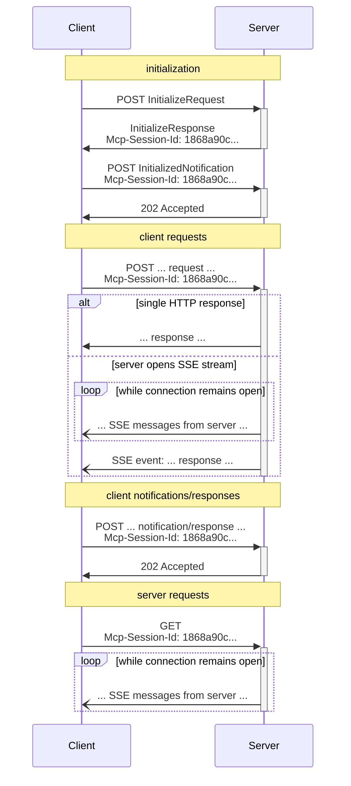

# Transports (Version 2025-03-26)

MCP (Model Context Protocol) is a JSON-RPC-based communication protocol designed for efficient and reliable interaction between clients and servers. This document details the Streamable HTTP transport mechanism in version 2025-03-26, which combines HTTP with Server-Sent Events (SSE) technology to provide flexible bidirectional communication capabilities for modern distributed systems.

> On April 17, the MCP TypeScript SDK officially supported this protocol in [version 1.10.0](https://github.com/modelcontextprotocol/typescript-sdk/releases/tag/1.10.0). This represents a major innovation over the existing SSE protocol, and we believe Streamable HTTP will become the future standard.

## Protocol Architecture and Design Principles

### Transport Layer Infrastructure

The Streamable HTTP transport is built on top of the standard HTTP protocol, achieving full-duplex communication through a carefully designed request-response pattern. Servers must provide a unified MCP endpoint (e.g., `https://example.com/mcp`) while supporting both POST and GET methods to handle different types of interaction requests.

MCP uses JSON-RPC-encoded messages, all of which **must** be UTF-8 encoded. The current protocol defines two standard transport mechanisms:

1. stdio (communication via standard input/output)
2. Streamable HTTP (the focus of this document)

During initial interaction, clients must include an Accept Header explicitly declaring support for both `application/json` and `text/event-stream` content types. This dual declaration ensures compatibility with servers of different versions, allowing the system to select the optimal communication method based on actual capabilities.

### Security Considerations

When implementing the Streamable HTTP transport, the following security measures must be observed:

1. Servers **must** validate the `Origin` header of all incoming connections to prevent DNS rebinding attacks.
2. For local runtime, servers **should** bind only to localhost (127.0.0.1) rather than all network interfaces (0.0.0.0).
3. Servers **should** implement appropriate authentication for all connections.

Without these protections, attackers could potentially use DNS rebinding to interact with local MCP servers from remote websites.

## Message Transmission Flow

### Client-to-Server Messages

Each JSON-RPC message sent by a client to a server **must** be a new HTTP POST request:

1. Clients **must** send JSON-RPC messages via HTTP POST to the MCP endpoint.
2. Clients **must** include an `Accept` header listing `application/json` and `text/event-stream` as supported content types.
3. The POST request body **must** be one of the following:
   - A single JSON-RPC _request_, *notification*, or *response*.
   - An array batching multiple *requests and/or notifications*.
   - An array batching multiple *responses*.
4. If the input consists solely of JSON-RPC *responses* or *notifications*:
   - If the server accepts the input, it **must** return an HTTP 202 Accepted status code with no response body.
   - If the server cannot accept the input, it **must** return an HTTP error status code (e.g., 400 Bad Request).
5. If the input contains any JSON-RPC _requests_, the server **must** return either `Content-Type: text/event-stream` (to initiate an SSE stream) or `Content-Type: application/json` (to return a JSON object).
6. If the server initiates an SSE stream:
   - The SSE stream **should** eventually include a JSON-RPC _response_ corresponding to each JSON-RPC *request* sent.
   - The server **may** send JSON-RPC *requests* and *notifications* before sending JSON-RPC *responses*.
   - The server **should not** close the SSE stream before sending a JSON-RPC *response* for each received JSON-RPC *request*.
   - After sending all JSON-RPC *responses*, the server **should** close the SSE stream.
   - Disconnections **may** occur at any time (e.g., due to network conditions); therefore:
     - Disconnections **should not** be interpreted as client cancellations of their requests.
     - To cancel, clients **should** explicitly send an MCP `CancelledNotification`.
     - To avoid message loss due to disconnections, servers **may** make the stream resumable.

### Listening for Server Messages

1. Clients **may** issue an HTTP GET request to the MCP endpoint. This can be used to open an SSE stream, allowing the server to communicate with the client without the client first sending data via HTTP POST.
2. Clients **must** include an `Accept` header listing `text/event-stream` as a supported content type.
3. Servers **must** return either `Content-Type: text/event-stream` or HTTP 405 Method Not Allowed.
4. If the server initiates an SSE stream:
   - The server **may** send JSON-RPC *requests* and *notifications* on the stream.
   - These messages **should** be unrelated to any concurrent JSON-RPC *requests* the client may be running.
   - The server **must not** send JSON-RPC _responses_ on the stream **unless** resuming a stream associated with a previous client request.
   - The server **may** close the SSE stream at any time.
   - Clients **may** close the SSE stream at any time.

## Multi-Connection Support

1. Clients **may** maintain connections to multiple SSE streams simultaneously.
2. Servers **must** send their JSON-RPC messages on only one connected stream; that is, they **must not** broadcast the same message across multiple streams.
   - The risk of message loss can be mitigated by making streams resumable.

## Recovery and Retransmission Mechanisms

To support recovery after disconnections and retransmission of potentially lost messages:

1. Servers **may** attach an `id` field to their SSE events per the SSE standard.
   - If present, the ID **must** be globally unique across all streams in that session.
2. If a client wishes to resume after a disconnection, it **should** issue an HTTP GET request to the MCP endpoint, including a `Last-Event-ID` header to indicate the last event ID it received.
   - The server **may** use this header to replay messages that should have been sent after the last event ID on the disconnected stream.
   - The server **must not** replay messages that should have been delivered on a different stream.

## Session Management

An MCP "session" consists of logically related interactions between a client and server, starting with an initialization phase:

1. Servers using the Streamable HTTP transport **may** assign a session ID during initialization by including an `Mcp-Session-Id` header in the HTTP response containing `InitializeResult`.
   - Session IDs **should** be globally unique and cryptographically secure (e.g., securely generated UUIDs, JWTs, or cryptographic hashes).
   - Session IDs **must** contain only visible ASCII characters (ranging from 0x21 to 0x7E).
2. If the server returns an `Mcp-Session-Id` during initialization, clients using the Streamable HTTP transport **must** include it in all subsequent HTTP requests.
   - Servers requiring session IDs **should** respond to requests (other than initialization) lacking the `Mcp-Session-Id` header with HTTP 400 Bad Request.
3. Servers **may** terminate a session at any time, after which they **must** respond to requests containing that session ID with HTTP 404 Not Found.
4. When a client receives an HTTP 404 in response to a request containing an `Mcp-Session-Id`, it **must** start a new session by sending a new `InitializeRequest` without attaching a session ID.
5. Clients no longer needing a specific session **should** send an HTTP DELETE to the MCP endpoint with the `Mcp-Session-Id` header to explicitly terminate the session.
   - Servers **may** respond to this request with HTTP 405 Method Not Allowed, indicating that the server does not allow clients to terminate sessions.

## Backward Compatibility

To maintain backward compatibility with the deprecated HTTP+SSE transport (protocol version 2024-11-05), clients and servers may take the following measures:

**Servers** supporting legacy clients:
- Continue hosting the old transport's SSE and POST endpoints alongside the new "MCP endpoint" defined for the Streamable HTTP transport.
- Alternatively, merge the old POST endpoint with the new MCP endpoint, though this may introduce unnecessary complexity.

**Clients** supporting legacy servers:
1. Accept user-provided MCP server URLs, which may point to servers using either the old or new transport.
2. Attempt to send a POST `InitializeRequest` to the server URL, including the `Accept` header as defined above:
   - If successful, the client can assume this is a server supporting the new Streamable HTTP transport.
   - If it fails with an HTTP 4xx status code (e.g., 405 Method Not Allowed or 404 Not Found):
     - Issue a GET request to the server URL, expecting this to open an SSE stream and return an `endpoint` event as the first event.
     - When the `endpoint` event arrives, the client can assume this is a server running the old HTTP+SSE transport and should use that transport for all subsequent communication.

## Custom Transports

Clients and servers **may** implement additional custom transport mechanisms to meet their specific needs. The protocol does not depend on the transport method and can be implemented over any communication channel supporting bidirectional message exchange.

Implementers choosing to support custom transports **must** ensure they preserve the JSON-RPC message format and lifecycle requirements defined by MCP. Custom transports **should** document their specific connection establishment and message exchange patterns to facilitate interoperability.

## Sequence Diagram

## Performance Optimization Recommendations

### Connection Management Optimization

1. **Connection Reuse**: Leverage HTTP/2 multiplexing to reduce connection establishment overhead.
2. **Configure Timeouts Appropriately**: Set connection and request timeout parameters based on business requirements.
3. **Implement Server-Side Buffering**: Configure appropriate stream buffer sizes for high-traffic scenarios.

### Message Processing Optimization

1. **Batch Messages**: Combine multiple requests to reduce network round trips.
2. **Compress Transmission Content**: Apply gzip or brotli compression to larger message bodies.
3. **Optimize JSON Serialization**: Use efficient JSON processing libraries to reduce serialization overhead.

## Implementation Best Practices

1. **Robust Error Handling**: Implement comprehensive error handling and retry logic.
2. **Traffic Control**: Apply appropriate rate limiting to prevent resource exhaustion.
3. **Monitoring and Logging**: Record key transport events and performance metrics.
4. **Security Hardening**: Implement TLS, authentication, and authorization mechanisms.
5. **Testing and Validation**: Thoroughly test behavior under various network conditions.

## Conclusion

The MCP Streamable HTTP transport mechanism provides a powerful, flexible way to implement communication between clients and servers. By combining HTTP and SSE technologies, it supports everything from simple request-response interactions to complex bidirectional streaming communication while maintaining compatibility with existing infrastructure. This document details the technical specifics, security considerations, and best practices for this transport mechanism, offering a comprehensive guide for implementing efficient, reliable MCP services.