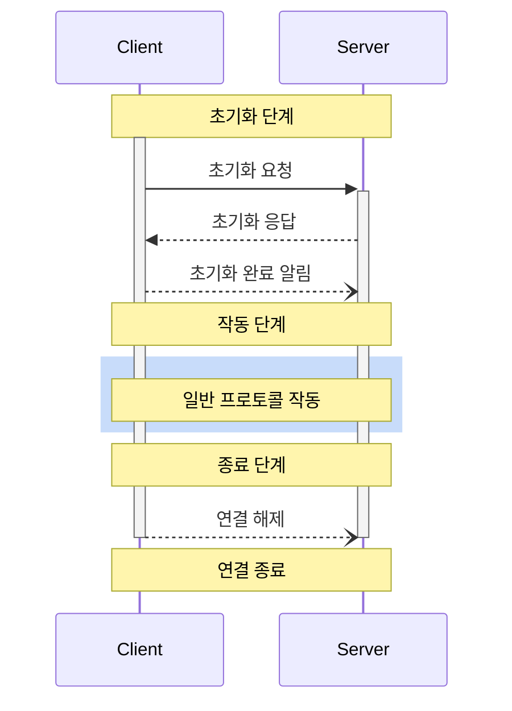
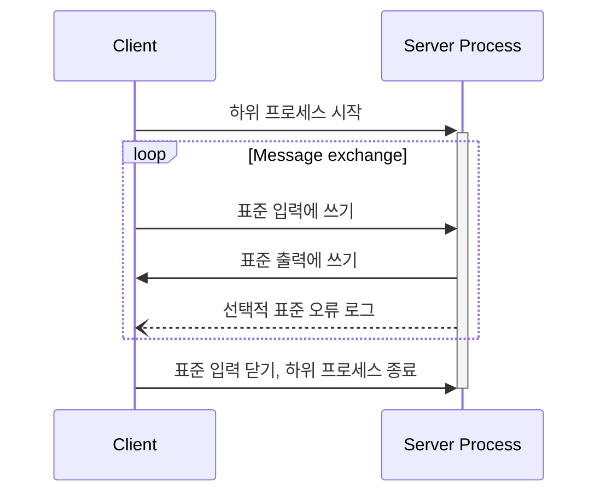
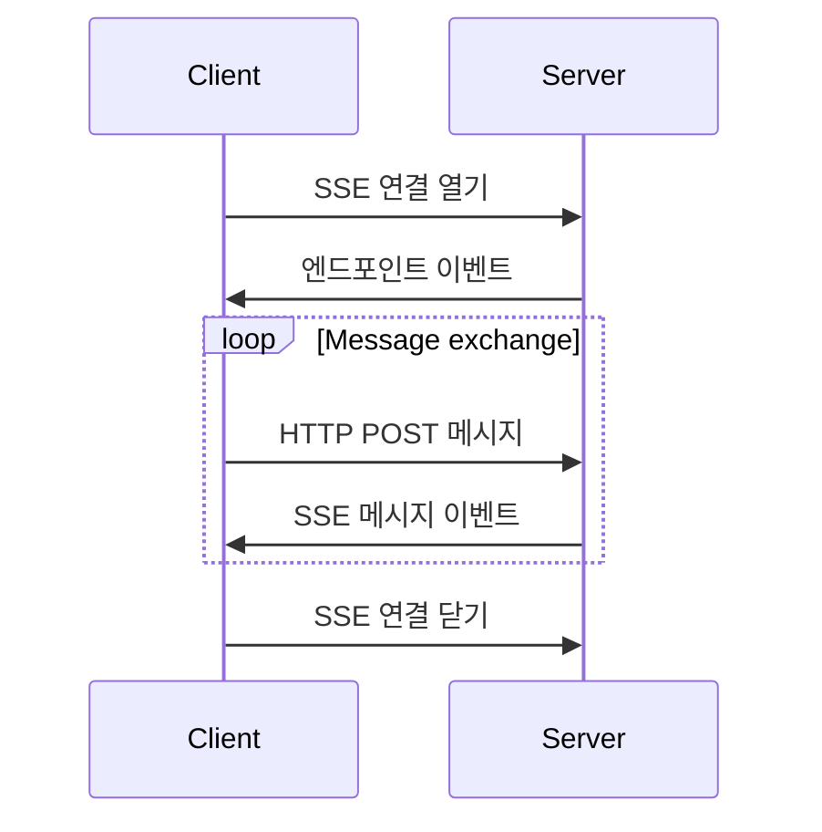

# MCP 프로토콜

MCP는 클라이언트-호스트-서버 아키텍처를 따릅니다. MCP 프로토콜은 본질적으로 구성 요소 간의 통신 프로토콜이며, MCP의 모든 메시지는 `JSON-RPC 2.0` 사양을 따라야 합니다.

## 메시지 유형

MCP는 세 가지 유형의 메시지를 정의합니다:

- `request`: 요청 메시지, 클라이언트에서 서버로 또는 그 반대로 요청을 보내는 데 사용됩니다.
- `response`: 응답 메시지, 요청에 응답하는 데 사용됩니다.
- `notification`: 알림 메시지, 서버에서 클라이언트로 알림을 보내는 데 사용됩니다.

### 요청 메시지

양방향 메시지로, 클라이언트에서 서버로 또는 그 반대로 보낼 수 있습니다. 다음은 요청 메시지의 예입니다:

```json
{
  "jsonrpc": "2.0",
  "id": "string | number",
  "method": "string",
  "param?": {
    "key": "value"
  }
}
```

요청 메시지에서 주의해야 할 몇 가지 사항이 있습니다:

- 문자열 또는 숫자 타입의 ID를 반드시 포함해야 합니다
- ID는 null이 될 수 없습니다
- 동일한 세션 내에서 요청자는 동일한 ID를 재사용할 수 없습니다
- 선택적 매개변수 객체를 포함할 수 있습니다

### 응답 메시지

응답 메시지는 요청에 대한 답변입니다. 응답 메시지의 구조는 다음과 같습니다:

```json
{
  "jsonrpc": "2.0",
  "id": "string | number",
  "result?": {
    "[key: string]": "unknown"
  },
  "error?": {
    "code": "number",
    "message": "string",
    "data?": "unknown"
  }
}
```

Similarly, in a response message, there are some points to note:

- Must contain the same ID as the corresponding request
- Must set either `result` or `error`, but not both
- Error code must be an integer
- Can contain optional result data

### 알림 메시지

알림 메시지는 응답이 필요 없는 단방향 메시지입니다:

```json
{
  "jsonrpc": "2.0",
  "method": "string",
  "params?": {
    "[key: string]": "unknown"
  }
}
```

알림 메시지에서 주의해야 할 몇 가지 사항이 있습니다:

- ID 필드를 포함해서는 안 됩니다
- 상태 업데이트 및 이벤트 알림에 사용됩니다
- 선택적 매개변수 객체를 포함할 수 있습니다
- 통신 오버헤드를 줄이고 비동기 작업을 지원합니다

## 생명 주기

MCP는 신뢰성과 안정성을 보장하기 위해 클라이언트-서버 연결에 대한 엄격한 생명 주기를 정의합니다. 주로 세 단계로 구성됩니다:

- 초기화: 기능 협상 및 프로토콜 버전 동의
- 작동: 일반 프로토콜 통신
- 종료: 연결의 정상적인 종료

다음과 같이 표시됩니다:



### 초기화 단계

초기화 단계는 클라이언트와 서버 간의 첫 번째 상호 작용이어야 합니다. 이 단계에서 양측은:

- 프로토콜 버전 호환성 설정
- 기능 협상
- 구현 세부 사항 공유

초기화 요청 예시:

```json
{
  "jsonrpc": "2.0",
  "id": 1,
  "method": "initialize",
  "params": {
    "protocolVersion": "2024-11-05",
    "capabilities": {
      "roots": {
        "listChanged": true
      },
      "sampling": {}
    },
    "clientInfo": {
      "name": "ExampleClient",
      "version": "1.0.0"
    }
  }
}
```

초기화 요청에서 클라이언트는 지원하는 프로토콜 버전을 보내야 합니다. 위의 JSON에서 `params.protocolVersion` 필드에 지정된 대로:

- 클라이언트는 지원하는 최신 버전을 보내야 합니다
- 서버는 동일한 버전 또는 지원하는 다른 버전으로 응답해야 합니다
- 클라이언트가 서버의 버전을 지원하지 않으면 연결을 종료해야 합니다

`params.capabilities` 필드는 기능 협상에 사용됩니다. 클라이언트와 서버 기능은 세션 중에 사용 가능한 선택적 프로토콜 기능을 결정합니다. 요청에서 클라이언트의 기능을 지정하고, 응답에서 서버는 자신의 기능을 지정합니다. 클라이언트는 다음 기능을 지정할 수 있습니다:

- `roots`：파일 시스템 루트 디렉토리 기능 제공
- `sampling`：LLM 샘플링 요청 지원
- `experimental`：비표준 실험적 기능에 대한 지원 설명

초기화 응답 예시:

```json
{
  "jsonrpc": "2.0",
  "id": 1,
  "result": {
    "protocolVersion": "2024-11-05",
    "capabilities": {
      "logging": {},
      "prompts": {
        "listChanged": true
      },
      "resources": {
        "subscribe": true,
        "listChanged": true
      },
      "tools": {
        "listChanged": true
      }
    },
    "serverInfo": {
      "name": "ExampleServer",
      "version": "1.0.0"
    }
  }
}
```

초기화 응답에서 서버는 동일한 버전 또는 지원하는 다른 버전으로 응답해야 합니다. 또한, 서버는 다음과 같이 자신의 기능을 응답합니다:

- `logging`：로깅 기능 제공
- `prompts`：프롬프트 템플릿 기능 제공
- `resources`：리소스 관리 기능 제공
- `tools`：도구 호출 기능 제공
- `experimental`：비표준 실험적 기능에 대한 지원 설명

초기화 후 서버는 초기화 완료 알림을 보내야 합니다:

```json
{
  "jsonrpc": "2.0",
  "method": "initialized"
}
```

### 작동 단계

초기화 후 클라이언트와 서버는 일반 프로토콜 통신을 진행할 수 있습니다. 이는 작동 단계로, 클라이언트와 서버는 협상된 기능에 기반하여 메시지를 교환합니다.

- 협상된 프로토콜 버전 준수
- 협상된 기능만 사용

### 종료 단계

클라이언트 또는 서버가 연결을 종료하기로 결정하면 연결 해제 알림을 보내야 합니다. 종료 단계에서 연결은 정상적으로 종료됩니다.

- 클라이언트는 연결 해제 알림을 보냅니다
- 서버는 연결을 종료합니다
- 관련 리소스 정리

이렇게 하여 MCP의 전체 생명 주기가 완료됩니다.

## 전송 메커니즘

위에서 MCP 프로토콜의 메시지 유형과 생명 주기를 소개했지만, 이러한 메시지는 클라이언트와 서버 간에 어떻게 전달되나요? MCP 프로토콜은 두 가지 표준 클라이언트-서버 통신 전송 메커니즘을 정의합니다:

- `stdio`
- HTTP based on `SSE`（Server-Sent Events）

클라이언트는 `stdio`를 가능한 한 지원해야 하며, 클라이언트와 서버는 또한 플러그인 가능한 방식으로 사용자 정의 전송 메커니즘을 구현할 수 있습니다.

### stdio

stdio 전송 메커니즘:

- 클라이언트는 MCP 서버를 하위 프로세스로 시작합니다
- 서버는 표준 입력(`stdin`)을 통해 `JSON-RPC` 메시지를 수신하고 표준 출력(`stdout`)을 통해 응답을 작성합니다
- 메시지는 줄 바꿈 문자로 구분되며, **포함되지 않아야 합니다**
- 서버 **can** 로깅을 위해 표준 오류(`stderr`)에 UTF-8 문자열을 작성합니다. 클라이언트 **can** 이러한 로그를 캡쳐, 전달 또는 무시할 수 있습니다
- 서버 **must not** 표준 출력(`stdout`)에 유효하지 않은 `MCP` 메시지 내용을 작성합니다
- 클라이언트 **must not** 서버의 표준 입력(`stdin`)에 유효하지 않은 `MCP` 메시지 내용을 작성합니다

다음 다이어그램은 stdio 전송 메커니즘의 상호 작용 과정을 보여줍니다:



### HTTP based on SSE

`SSE`는 `Server-Sent Events`를 의미하며, 서버가 실시간 업데이트를 클라이언트에 전송할 수 있는 HTTP 서버 푸시 기술입니다. MCP의 SSE 전송 메커니즘에서 서버는 독립적인 프로세스로 실행되며 여러 클라이언트 연결을 처리할 수 있습니다.

먼저, 서버 **must** 두 개의 엔드포인트를 제공해야 합니다:

- SSE 엔드포인트 - 연결을 설정하고 서버에서 메시지를 수신하는 데 사용됩니다
- HTTP POST 엔드포인트 - 클라이언트에서 서버로 메시지를 보내는 데 사용됩니다

클라이언트가 연결되면, 서버 **must** 클라이언트가 메시지를 보내는 데 사용하는 URI를 포함하는 엔드포인트 이벤트를 보냅니다. 이후 클라이언트의 모든 메시지는 이 엔드포인트에 대한 HTTP POST 요청으로 전송되어야 합니다. 서버 메시지는 SSE 메시지 이벤트로 전송되며, 이벤트 데이터에 JSON 형식으로 인코딩된 메시지 내용이 포함됩니다.

다음 다이어그램은 SSE 기반 HTTP 전송 메커니즘의 상호 작용 과정을 보여줍니다:



### Custom Transport Mechanism

클라이언트와 서버 **can** 플러그인 가능한 방식으로 사용자 정의 전송 메커니즘을 구현할 수 있습니다. 프로토콜은 전송 메커니즘과 독립적이며, 양방향 메시지 교환을 지원하는 모든 통신 채널에 구현할 수 있습니다.

사용자 정의 전송 메커니즘을 지원하는 구현자는 반드시 MCP에 정의된 `JSON-RPC` 메시지 형식과 생명 주기 요구 사항을 유지해야 합니다. 사용자 정의 전송 메커니즘 **should** 특정 연결 설정과 메시지 교환 패턴을 기록하여 상호 운용성을 돕습니다.
