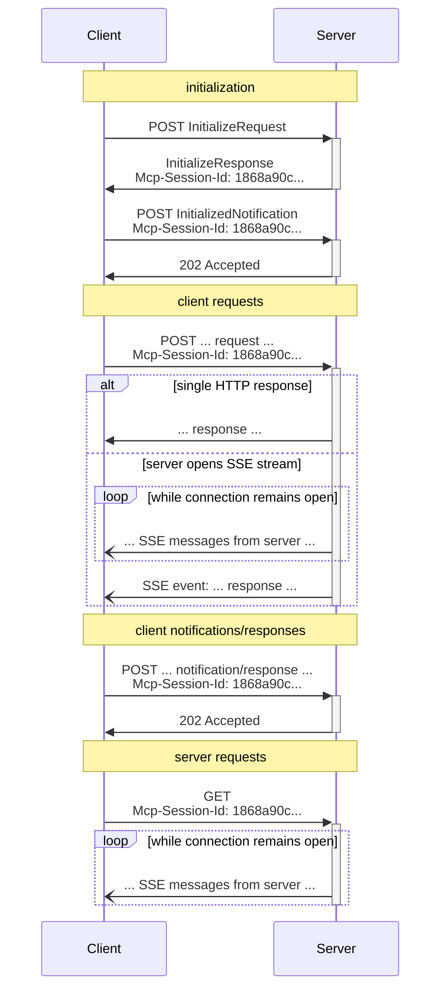

# Transports (2025-03-26 버전)

MCP(Model Context Protocol)는 JSON-RPC 기반의 통신 프로토콜로, 클라이언트와 서버 간의 효율적이고 신뢰할 수 있는 상호 작용을 목표로 합니다. 본 문서는 2025-03-26 버전의 Streamable HTTP 전송 메커니즘을 상세히 설명하며, 이는 HTTP와 Server-Sent Events(SSE) 기술을 결합하여 현대 분산 시스템에 유연한 양방향 통신 기능을 제공합니다.

> 4월 17일, MCP Typescript SDK가 [1.10.0 버전](https://github.com/modelcontextprotocol/typescript-sdk/releases/tag/1.10.0)에서 이 프로토콜을 공식 지원합니다. 이는 기존 SSE 프로토콜의 혁신적인 개선이며, Streamable HTTP가 미래 표준이 될 것이라고 확신합니다.

## 프로토콜 아키텍처 및 설계 원칙

### 전송 계층 기본 아키텍처

Streamable HTTP 전송은 표준 HTTP 프로토콜 위에 구축되며, 정교하게 설계된 요청-응답 모델을 통해 전이중 통신을 구현합니다. 서버는 `https://example.com/mcp`와 같은 통합 MCP 엔드포인트를 제공해야 하며, POST와 GET 메서드를 모두 지원하여 다양한 유형의 상호 작용 요청을 처리할 수 있어야 합니다.

MCP는 JSON-RPC로 메시지를 인코딩하며, 모든 메시지는 **반드시** UTF-8 인코딩을 사용해야 합니다. 현재 프로토콜은 두 가지 표준 전송 메커니즘을 정의합니다:

1. stdio(표준 입출력을 통한 통신)
2. Streamable HTTP(본 문서의 주요 내용)

클라이언트는 초기 상호 작용 시 `Accept` 헤더를 포함하여 `application/json`과 `text/event-stream` 두 가지 콘텐츠 유형을 명시적으로 선언해야 합니다. 이중 선언은 다양한 버전의 서버와의 호환성을 보장하며, 시스템은 실제 능력에 따라 최적의 통신 방식을 선택할 수 있습니다.

### 보안 고려 사항

Streamable HTTP 전송을 구현할 때는 다음 보안 조치를 준수해야 합니다:

1. 서버는 **반드시** 모든 수신 연결의 `Origin` 헤더를 검증하여 DNS 리바인딩 공격을 방지해야 합니다.
2. 로컬 실행 시 서버는 **가급적** 모든 네트워크 인터페이스(0.0.0.0)가 아닌 localhost(127.0.0.1)에만 바인딩해야 합니다.
3. 서버는 **가급적** 모든 연결에 적절한 인증을 적용해야 합니다.

이러한 보호 조치가 없으면 공격자가 DNS 리바인딩을 통해 원격 웹사이트에서 로컬 MCP 서버와 상호 작용할 수 있습니다.

## 메시지 전송 흐름

### 클라이언트에서 서버로 메시지 전송

클라이언트가 서버로 보내는 각 JSON-RPC 메시지는 **반드시** 새로운 HTTP POST 요청이어야 합니다:

1. 클라이언트는 **반드시** HTTP POST를 사용하여 MCP 엔드포인트에 JSON-RPC 메시지를 전송해야 합니다.
2. 클라이언트는 `Accept` 헤더를 포함하여 `application/json`과 `text/event-stream`을 지원하는 콘텐츠 유형으로 나열해야 합니다.
3. POST 요청의 본문은 다음 중 하나여야 합니다:
   - 단일 JSON-RPC _요청_, *알림* 또는 *응답*
   - 여러 *요청 및/또는 알림*을 일괄 처리하는 배열
   - 여러 *응답*을 일괄 처리하는 배열

4. 입력이 JSON-RPC *응답* 또는 *알림*으로만 구성된 경우:
   - 서버가 입력을 수락하면 서버는 **반드시** HTTP 상태 코드 202 Accepted를 반환하며 응답 본문이 없어야 합니다.
   - 서버가 입력을 수락할 수 없으면 **반드시** HTTP 오류 상태 코드(예: 400 Bad Request)를 반환해야 합니다.

5. 입력에 JSON-RPC _요청_이 포함된 경우 서버는 `Content-Type: text/event-stream`(SSE 스트림 시작) 또는 `Content-Type: application/json`(JSON 객체 반환)을 반환해야 합니다.

6. 서버가 SSE 스트림을 시작하는 경우:
   - SSE 스트림은 **가급적** 전송된 각 JSON-RPC *요청*에 해당하는 JSON-RPC _응답_을 최종적으로 포함해야 합니다.
   - 서버는 JSON-RPC *응답*을 보내기 전에 JSON-RPC *요청*과 *알림*을 보낼 **수 있습니다**.
   - 서버는 수신된 각 JSON-RPC *요청*에 대한 JSON-RPC *응답*을 보내기 전에 SSE 스트림을 닫아서는 **안 됩니다**.
   - 모든 JSON-RPC *응답*을 보낸 후 서버는 **가급적** SSE 스트림을 닫아야 합니다.
   - 연결은 언제든지 끊길 **수 있습니다**(예: 네트워크 조건으로 인해). 따라서:
     - 연결 끊김은 클라이언트가 요청을 취소한 것으로 해석되어서는 **안 됩니다**.
     - 취소하려면 클라이언트는 **가급적** 명시적으로 MCP `CancelledNotification`을 보내야 합니다.
     - 연결 끊김으로 인한 메시지 손실을 방지하기 위해 서버는 스트림을 복구 가능하게 만들 **수 있습니다**.

### 서버 메시지 수신 대기

1. 클라이언트는 MCP 엔드포인트에 HTTP GET 요청을 보낼 **수 있습니다**. 이는 SSE 스트림을 열기 위해 사용될 수 있으며, 클라이언트가 HTTP POST로 데이터를 먼저 보내지 않고도 서버가 클라이언트와 통신할 수 있게 합니다.
2. 클라이언트는 `Accept` 헤더를 포함하여 `text/event-stream`을 지원하는 콘텐츠 유형으로 나열해야 합니다.
3. 서버는 `Content-Type: text/event-stream`을 반환하거나 HTTP 405 Method Not Allowed를 반환해야 합니다.
4. 서버가 SSE 스트림을 시작하는 경우:
   - 서버는 스트림에서 JSON-RPC *요청*과 *알림*을 보낼 **수 있습니다**.
   - 이러한 메시지는 클라이언트가 동시에 실행 중인 JSON-RPC *요청*과 무관해야 **합니다**.
   - 서버는 이전 클라이언트 요청과 연관된 스트림을 복구하지 않는 한 스트림에서 JSON-RPC _응답_을 보내서는 **안 됩니다**.
   - 서버는 언제든지 SSE 스트림을 닫을 **수 있습니다**.
   - 클라이언트는 언제든지 SSE 스트림을 닫을 **수 있습니다**.

## 다중 연결 지원

1. 클라이언트는 동시에 여러 SSE 스트림 연결을 유지할 **수 있습니다**.
2. 서버는 **반드시** 연결된 하나의 스트림에서만 JSON-RPC 메시지를 보내야 합니다. 즉, 여러 스트림에 동일한 메시지를 브로드캐스트해서는 **안 됩니다**.
   - 메시지 손실 위험은 스트림을 복구 가능하게 만들어 완화할 **수 있습니다**.

## 복구 및 재전송 메커니즘

연결 끊김 후 복구 및 잠재적 메시지 손실 재전송을 지원하기 위해:

1. 서버는 SSE 표준에 따라 SSE 이벤트에 `id` 필드를 첨부할 **수 있습니다**.
   - ID가 있는 경우 **반드시** 해당 세션의 모든 스트림에서 전역적으로 고유해야 합니다.
2. 클라이언트가 연결 끊김 후 복구를 원하는 경우 **가급적** MCP 엔드포인트에 HTTP GET 요청을 보내고 `Last-Event-ID` 헤더를 포함하여 수신한 마지막 이벤트 ID를 표시해야 합니다.
   - 서버는 이 헤더를 사용하여 끊긴 스트림의 마지막 이벤트 ID 이후에 전송되어야 할 메시지를 재전송할 **수 있습니다**.
   - 서버는 다른 스트림에서 전달되어야 할 메시지를 재전송해서는 **안 됩니다**.

## 세션 관리

MCP "세션"은 초기화 단계부터 시작하는 클라이언트와 서버 간의 논리적 관련 상호 작용으로 구성됩니다:

1. Streamable HTTP 전송을 사용하는 서버는 초기화 시 `InitializeResult`를 포함하는 HTTP 응답에 `Mcp-Session-Id` 헤더를 포함하여 세션 ID를 할당할 **수 있습니다**.
   - 세션 ID는 **가급적** 전역적으로 고유하고 암호화적으로 안전해야 합니다(예: 안전하게 생성된 UUID, JWT 또는 암호화 해시).
   - 세션 ID는 **반드시** 표시 가능한 ASCII 문자(0x21에서 0x7E 범위)만 포함해야 합니다.
2. 서버가 초기화 중에 `Mcp-Session-Id`를 반환하면 Streamable HTTP 전송을 사용하는 클라이언트는 **반드시** 이후 모든 HTTP 요청에 이를 포함해야 합니다.
   - 세션 ID가 필요한 서버는 `Mcp-Session-Id` 헤더가 없는 요청(초기화 제외)에 대해 HTTP 400 Bad Request를 반환해야 **합니다**.
3. 서버는 언제든지 세션을 종료할 **수 있으며**, 이후 해당 세션 ID가 포함된 요청에 대해 HTTP 404 Not Found를 반환해야 합니다.
4. 클라이언트가 `Mcp-Session-Id`가 포함된 요청에 대한 HTTP 404 응답을 받으면 **반드시** 세션 ID를 첨부하지 않은 새로운 `InitializeRequest`를 보내 새 세션을 시작해야 합니다.
5. 특정 세션이 더 이상 필요하지 않은 클라이언트는 **가급적** `Mcp-Session-Id` 헤더와 함께 MCP 엔드포인트에 HTTP DELETE를 보내 명시적으로 세션을 종료해야 합니다.
   - 서버는 이 요청에 HTTP 405 Method Not Allowed로 응답할 **수 있으며**, 이는 서버가 클라이언트가 세션을 종료하는 것을 허용하지 않음을 나타냅니다.

## 이전 버전과의 호환성

더 이상 사용되지 않는 HTTP+SSE 전송(2024-11-05 프로토콜 버전)과의 호환성을 유지하기 위해 클라이언트와 서버는 다음 조치를 취할 수 있습니다:

**서버**는 이전 클라이언트를 지원하기 위해:
- 이전 전송의 SSE 및 POST 엔드포인트와 Streamable HTTP 전송을 위해 정의된 새로운 "MCP 엔드포인트"를 계속 호스팅합니다.
- 또는 이전 POST 엔드포인트와 새로운 MCP 엔드포인트를 통합할 수도 있지만, 이는 불필요한 복잡성을 초래할 수 있습니다.

**클라이언트**는 이전 서버를 지원하기 위해:
1. 사용자가 제공한 MCP 서버 URL을 수락하며, 이는 이전 전송 또는 새로운 전송을 사용하는 서버를 가리킬 수 있습니다.
2. 위에서 정의한 `Accept` 헤더와 함께 POST `InitializeRequest`를 서버 URL로 전송 시도:
   - 성공하면 클라이언트는 새로운 Streamable HTTP 전송을 지원하는 서버라고 가정할 수 있습니다.
   - HTTP 4xx 상태 코드(예: 405 Method Not Allowed 또는 404 Not Found)로 실패하면:
     - 서버 URL에 GET 요청을 보내고, 이는 SSE 스트림을 열고 첫 번째 이벤트로 `endpoint` 이벤트를 반환할 것으로 예상합니다.
     - `endpoint` 이벤트가 도착하면 클라이언트는 이전 HTTP+SSE 전송을 실행하는 서버라고 가정하고 모든 후속 통신에 해당 전송을 사용해야 합니다.

## 사용자 정의 전송

클라이언트와 서버는 특정 요구 사항을 충족하기 위해 추가적인 사용자 정의 전송 메커니즘을 구현할 **수 있습니다**. 프로토콜은 전송 방식에 의존하지 않으며, 양방향 메시지 교환을 지원하는 모든 통신 채널에서 구현될 수 있습니다.

사용자 정의 전송을 지원하기로 선택한 구현자는 MCP에서 정의한 JSON-RPC 메시지 형식과 수명 주기 요구 사항을 유지해야 **합니다**. 사용자 정의 전송은 상호 운용성을 촉진하기 위해 특정 연결 설정 및 메시지 교환 패턴을 문서화해야 **합니다**.

## 시퀀스 다이어그램

## 성능 최적화 권장 사항

### 연결 관리 최적화

1. **연결 재사용**: HTTP/2의 다중화 기능을 활용하여 연결 설정 오버헤드를 줄입니다.
2. **적절한 시간 초과 구성**: 비즈니스 요구 사항에 따라 연결 및 요청 시간 초과 매개변수를 설정합니다.
3. **적절한 서버 버퍼링 적용**: 높은 트래픽 시나리오에 적합한 스트림 버퍼 크기를 구성합니다.

### 메시지 처리 최적화

1. **메시지 일괄 처리**: 여러 요청을 병합하여 네트워크 왕복을 줄입니다.
2. **전송 내용 압축**: 큰 메시지 본문에 gzip 또는 brotli 압축을 적용합니다.
3. **JSON 직렬화 최적화**: 효율적인 JSON 처리 라이브러리를 사용하여 직렬화 오버헤드를 줄입니다.

## 구현 모범 사례

1. **강력한 오류 처리**: 완전한 오류 처리 및 재시도 로직을 구현합니다.
2. **트래픽 제어**: 리소스 고갈을 방지하기 위해 적절한 트래픽 제한을 구현합니다.
3. **모니터링 및 로깅**: 중요한 전송 이벤트 및 성능 지표를 기록합니다.
4. **보안 강화**: TLS, 인증 및 권한 부여 메커니즘을 구현합니다.
5. **테스트 및 검증**: 다양한 네트워크 조건에서의 동작을 철저히 테스트합니다.

## 결론

MCP Streamable HTTP 전송 메커니즘은 클라이언트와 서버 간의 통신을 구현하는 강력하고 유연한 방법을 제공합니다. HTTP와 SSE 기술을 결합하여 단순한 요청-응답 상호 작용부터 복잡한 양방향 스트리밍 통신까지 지원하며, 기존 인프라와의 호환성을 유지합니다. 본 문서는 이 전송 메커니즘의 기술적 세부 사항, 보안 고려 사항 및 모범 사례를 상세히 설명하여 효율적이고 신뢰할 수 있는 MCP 서비스 구현을 위한 포괄적인 가이드를 제공합니다.