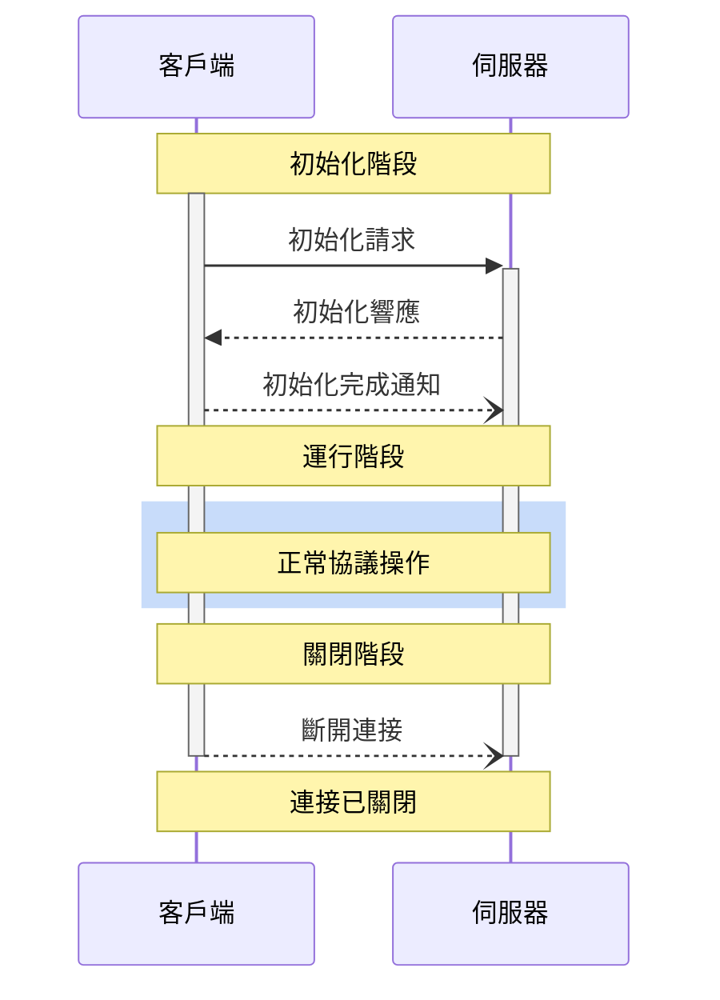
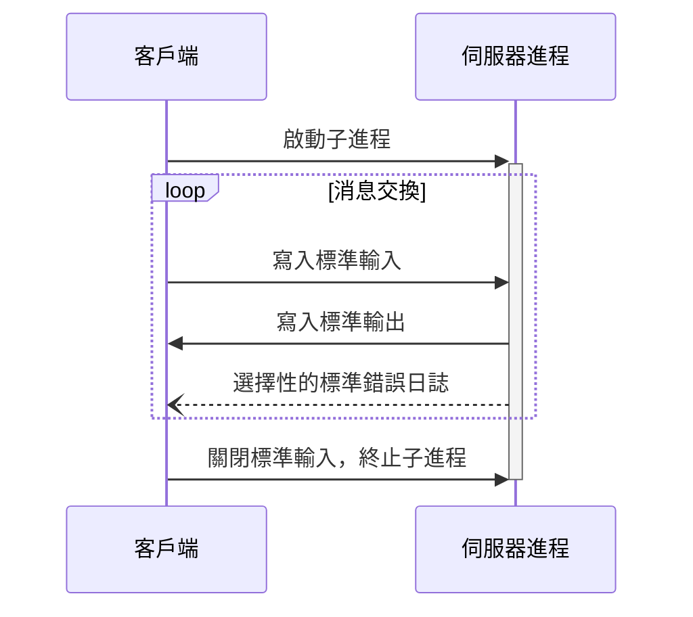
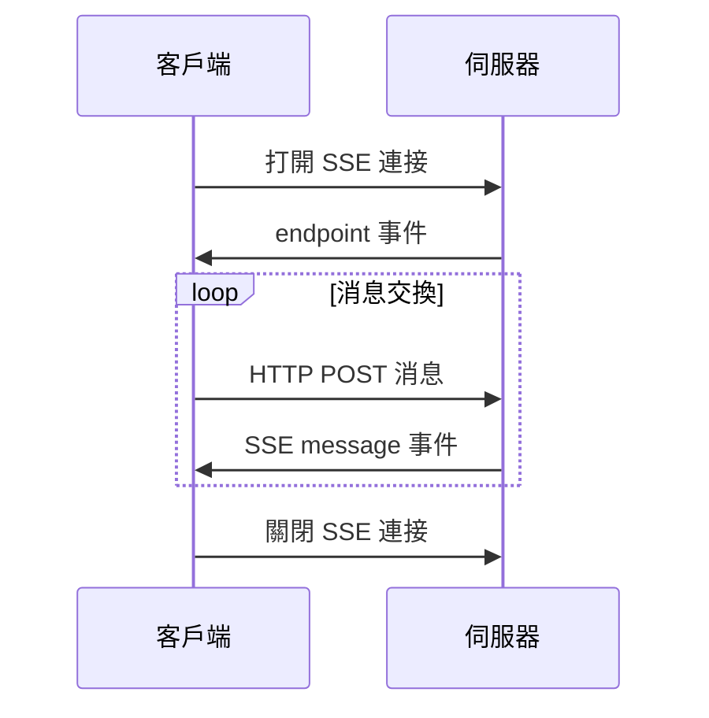

# MCP 基礎協議

MCP 協議遵循客戶端-主機-伺服器架構，MCP 協議其實就是規定的元件之間的通訊協議，而 MCP 中的所有訊息必須遵循 `JSON-RPC 2.0` 規範。

## 訊息類型

MCP 協議定義了三種類型的訊息：

- `request`：請求訊息，用於客戶端向伺服器發送請求，也可以從伺服器發送到客戶端。
- `response`：回應訊息，用於對請求的回應。
- `notification`：通知訊息，用於伺服器向客戶端發送通知。

### 請求訊息

雙向訊息，可以從客戶端發送到伺服器，也可以反向發送。如下所示就是一個請求訊息的示例：

```json
{
  "jsonrpc": "2.0",
  "id": "string | number",
  "method": "string",
  "param?": {
    "key": "value"
  }
}
```

在請求訊息中，有一些需要注意的點：

- 必須包含字符串或整數類型的 ID
- ID 不能為 null
- 在同會話中，請求方不能重複使用相同的 ID
- 可以包含可選的參數對象

### 響應訊息

響應訊息是對請求的回覆，響應訊息的結構如下所示：

```json
{
  "jsonrpc": "2.0",
  "id": "string | number",
  "result?": {
    "[key: string]": "unknown"
  },
  "error?": {
    "code": "number",
    "message": "string",
    "data?": "unknown"
  }
}
```

同样，在響應訊息中，也有一些需要注意的點：

- 必須包含與對應請求相同的 ID
- 必須設置 `result` 或 `error` 其中之一，不能同時設置
- 錯誤碼必須是整數
- 可以包含可選的結果數據

### 通知消息

通知是一種單向消息，不需要響應：

```json
{
  "jsonrpc": "2.0",
  "method": "string",
  "params?": {
    "[key: string]": "unknown"
  }
}
```

在通知消息中，有一些需要注意的點：

- 不能包含 ID 字段
- 用於狀態更新和事件通知
- 可以包含可選的參數對象
- 減少通信開銷，支持異步操作

## 生命週期

MCP 為客戶端-伺服器連接定義了嚴格的生命週期，確保連接的可靠性和穩定性。主要分為三個階段：

- 初始化：能力協商和協議版本約定
- 操作：正常協議通信
- 關閉：正常終止連接

如下圖所示：



### 初始化階段

初始化階段必須是客戶端和伺服器之間的第一次交互。在此階段，雙方：

- 建立協議版本兼容性
- 交換和協商能力
- 共享實現細節

初始化請求示例：

```json
{
  "jsonrpc": "2.0",
  "id": 1,
  "method": "initialize",
  "params": {
    "protocolVersion": "2024-11-05",
    "capabilities": {
      "roots": {
        "listChanged": true
      },
      "sampling": {}
    },
    "clientInfo": {
      "name": "ExampleClient",
      "version": "1.0.0"
    }
  }
}
```

要注意 ⚠️ 在初始化請求中，客戶端必須發送其支持的協議版本，上面 json 中的 `params.protocolVersion` 字段就是來指定協議版本的。

- 客戶端應發送其支持的最新版本
- 伺服器必須響應相同版本或其支持的其他版本
- 如果客戶端不支持伺服器的版本，應斷開連接

而 `params.capabilities` 字段用於能力協商，客戶端和伺服器能力確定會話期間可用的可選協議功能。在請求中我們指定客戶端的能力，在響應中伺服器會指定其能力，客戶端可以指定如下能力：

- `roots`：提供文件系統根目錄的能力
- `sampling`：支持 LLM 采樣請求
- `experimental`：描述對非標準實驗性功能的支持

初始化響應示例：

```json
{
  "jsonrpc": "2.0",
  "id": 1,
  "result": {
    "protocolVersion": "2024-11-05",
    "capabilities": {
      "logging": {},
      "prompts": {
        "listChanged": true
      },
      "resources": {
        "subscribe": true,
        "listChanged": true
      },
      "tools": {
        "listChanged": true
      }
    },
    "serverInfo": {
      "name": "ExampleServer",
      "version": "1.0.0"
    }
  }
}
```

在初始化響應中，伺服器必須響應相同版本或其支持的其他版本。此外伺服器會響應其能力，如下：

- `logging`：提供日志記錄的能力
- `prompts`：提供提示詞的模板能力
- `resources`：提供資源管理的能力
- `tools`：提供工具調用的能力
- `experimental`：描述對非標準實驗性功能的支持

初始化完成后，伺服器會發送初始化完成通知，如下所示：

```json
{
  "jsonrpc": "2.0",
  "method": "initialized"
}
```

### 操作階段

初始化完成后，客戶端和伺服器就可以進行正常的協議通信了，也就是上面的操作階段，客戶端和伺服器根據協商的能力交換消息。

- 遵守協商的協議版本
- 僅使用成功協商的能力

### 關閉階段

當客戶端或伺服器決定關閉連接時，會發送斷開連接通知，在關閉階段，連接被優雅地終止。

- 客戶端發送斷開連接通知
- 伺服器關閉連接
- 清理相關資源

這樣 MCP 的一個完整生命週期就結束了。

## 傳輸機制

上面我們介紹了 MCP 協議的消息類型和生命週期，但是這些消息是如何在客戶端和伺服器之間傳輸的呢？MCP 協議定義了兩種標準的客戶端-伺服器通信傳輸機制：

- `stdio`（標準輸入輸出）
- 基於 `SSE`（Server-Sent Events）的 HTTP

需要注意，客戶端應盡可能支持 `stdio`，此外，客戶端和伺服器也可以以可插拔的方式實現自定義傳輸機制。

### 標準輸入輸出（stdio）

在 stdio 傳輸機制中：

- 客戶端將 MCP 伺服器作為子進程啟動
- 伺服器通過標準輸入（`stdin`）接收 `JSON-RPC` 消息，並通過標準輸出（`stdout`）寫入響應
- 消息以換行符分隔，且**不能**包含嵌入的換行符
- 伺服器**可以**將 UTF-8 字符串寫入標準錯誤（`stderr`）用於日誌記錄。客戶端**可以**捕獲、轉發或忽略這些日誌
- 伺服器**不得**向標準輸出（`stdout`）寫入任何無效 `MCP` 消息的內容
- 客戶端**不得**向伺服器的標準輸入（`stdin`）寫入任何無效 `MCP` 消息的內容

下图展示了 `stdio` 傳輸機制的交互過程：



### 基於 SSE 的 HTTP

`SSE` 全稱是 `Server-Sent Events`，是一種 HTTP 伺服器推送技術，允許伺服器向客戶端發送實時更新。在 MCP 的 SSE 傳輸機制中，伺服器作為獨立進程運行，可以處理多個客戶端連接。

首先伺服器**必須**提供兩個端點：

- SSE 端點 - 用於客戶端建立連接並接收來自伺服器的消息
- HTTP POST 端點 - 用於客戶端向伺服器發送消息

當客戶端連接時，伺服器**必須**發送一個包含客戶端用於發送消息的 URI 的 endpoint 事件。所有後續的客戶端消息必須作為 HTTP POST 請求發送到此端點。伺服器消息作為 SSE message 事件發送，消息內容以 JSON 格式編碼在事件數據中。

下图展示了基于 SSE 的 HTTP 傳輸機制的交互過程：



### 自定義傳輸機制

客戶端和伺服器**可以**以可插拔的方式實現自定義傳輸機制。該協議與傳輸無關，可以在任何支持雙向消息交換的通信通道上實現。

選擇支持自定義傳輸的實施者**必須**確保他們保留 MCP 定義的 `JSON-RPC` 消息格式和生命週期要求。自定義傳輸**應該**記錄其特定的連接建立和消息交換模式，以幫助互操作性。
