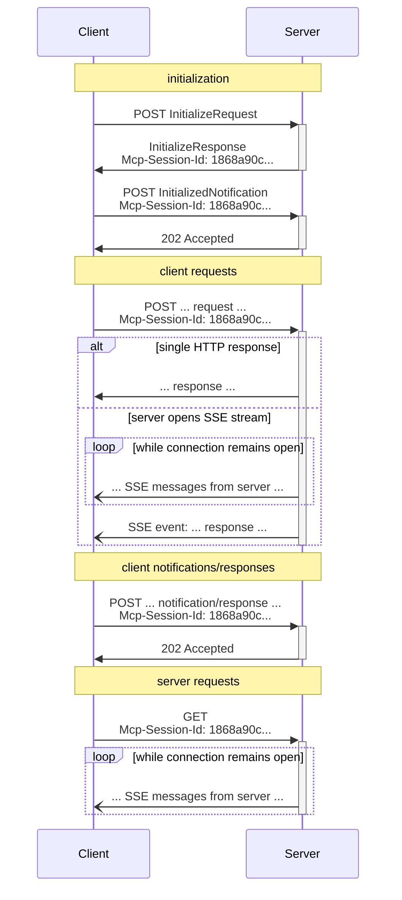

# Transports（2025-03-26 版本）

MCP（Model Context Protocol）是一種基於 JSON-RPC 的通訊協定，旨在實現客戶端與伺服器之間的高效、可靠互動。本文件詳細介紹了 2025-03-26 版本中的 Streamable HTTP 傳輸機制，該機制結合了 HTTP 與 Server-Sent Events (SSE) 技術，為現代分散式系統提供了靈活的雙向通訊能力。

> 4 月 17 日，MCP Typescript SDK 在 [1.10.0 版本](https://github.com/modelcontextprotocol/typescript-sdk/releases/tag/1.10.0)中正式支援該協定。這是對現有 SSE 協定的重大革新，我們相信 Streamable HTTP 將成為未來標準。

## 協定架構與設計原則

### 傳輸層基礎架構

Streamable HTTP 傳輸建立在標準 HTTP 協定之上，透過精心設計的請求-回應模式實現全雙工通訊。伺服器需提供統一的 MCP 端點（如`https://example.com/mcp`），同時支援 POST 和 GET 方法處理不同類型的互動請求。

MCP 使用 JSON-RPC 編碼訊息，所有訊息**必須**採用 UTF-8 編碼。當前協定定義了兩種標準傳輸機制：

1. stdio（透過標準輸入輸出進行通訊）
2. Streamable HTTP（本文件的重點）

客戶端在首次互動時必須包含 Accept Header，明確宣告支援 `application/json` 和 `text/event-stream` 兩種內容類型。這種雙重宣告確保了與不同版本伺服器的相容性，系統可根據實際能力選擇最佳通訊方式。

### 安全注意事項

實現 Streamable HTTP 傳輸時，必須注意以下安全措施：

1. 伺服器**必須**驗證所有傳入連接的 `Origin` 標頭，以防止 DNS 重綁定攻擊
2. 本地執行時，伺服器**應該**僅綁定到 localhost (127.0.0.1)，而不是所有網路介面 (0.0.0.0)
3. 伺服器**應該**為所有連接實施適當的身份驗證

如果沒有這些保護措施，攻擊者可能會使用 DNS 重綁定從遠端網站與本地 MCP 伺服器互動。

## 訊息傳輸流程

### 客戶端向伺服器發送訊息

客戶端向伺服器發送的每個 JSON-RPC 訊息**必須**是一個新的 HTTP POST 請求：

1. 客戶端**必須**使用 HTTP POST 向 MCP 端點發送 JSON-RPC 訊息
2. 客戶端**必須**包含`Accept`標頭，列出`application/json`和`text/event-stream`作為支援的內容類型
3. POST 請求的主體**必須**是以下之一：

   - 單個 JSON-RPC _請求_、*通知*或*回應*
   - 批次處理多個*請求和/或通知*的陣列
   - 批次處理多個*回應*的陣列

4. 如果輸入僅由 JSON-RPC *回應*或*通知*組成：

   - 如果伺服器接受輸入，伺服器**必須**返回 HTTP 狀態碼 202 Accepted，無回應體
   - 如果伺服器無法接受輸入，它**必須**返回 HTTP 錯誤狀態碼（例如 400 Bad Request）

5. 如果輸入包含任意數量的 JSON-RPC _請求_，伺服器**必須**返回`Content-Type: text/event-stream`（啟動 SSE 流）或`Content-Type: application/json`（返回一個 JSON 物件）

6. 如果伺服器啟動 SSE 流：
   - SSE 流**應該**最終包含每個發送的 JSON-RPC *請求*對應的一個 JSON-RPC _回應_
   - 伺服器**可以**在發送 JSON-RPC *回應*之前發送 JSON-RPC *請求*和*通知*
   - 伺服器**不應該**在為每個接收到的 JSON-RPC *請求*發送 JSON-RPC *回應*之前關閉 SSE 流
   - 發送完所有 JSON-RPC *回應*後，伺服器**應該**關閉 SSE 流
   - 斷開連接**可能**隨時發生（例如由於網路條件）；因此：
     - 斷開連接**不應該**被解釋為客戶端取消其請求
     - 要取消，客戶端**應該**明確發送 MCP `CancelledNotification`
     - 為避免由於斷開連接導致的訊息遺失，伺服器**可以**使流可恢復

### 監聽伺服器訊息

1. 客戶端**可以**向 MCP 端點發出 HTTP GET 請求。這可用於開啟 SSE 流，允許伺服器與客戶端通訊，而無需客戶端首先透過 HTTP POST 發送資料
2. 客戶端**必須**包含 `Accept` 標頭，列出 `text/event-stream` 作為支援的內容類型
3. 伺服器**必須**返回 `Content-Type: text/event-stream` 或返回 HTTP 405 Method Not Allowed
4. 如果伺服器啟動 SSE 流：
   - 伺服器**可以**在流上發送 JSON-RPC *請求*和*通知*
   - 這些訊息**應該**與客戶端並行執行的任何 JSON-RPC *請求*無關
   - 伺服器**不得**在流上發送 JSON-RPC _回應_，**除非**恢復與先前客戶端請求關聯的流
   - 伺服器**可以**隨時關閉 SSE 流
   - 客戶端**可以**隨時關閉 SSE 流

## 多連接支援

1. 客戶端**可以**同時保持與多個 SSE 流的連接
2. 伺服器**必須**僅在一個已連接的流上發送其 JSON-RPC 訊息；也就是說，它**不得**在多個流上廣播相同的訊息
   - 可透過使流可恢復來緩解訊息遺失的風險

## 恢復和重傳機制

為支援斷開連接後的恢復和可能遺失的訊息重傳：

1. 伺服器**可以**按照 SSE 標準為其 SSE 事件附加`id`欄位
   - 如果存在，ID**必須**在該階段作業中的所有流中全域唯一
2. 如果客戶端希望在連接斷開後恢復，它**應該**向 MCP 端點發出 HTTP GET 請求，並包含 `Last-Event-ID` 標頭以指示它接收到的最後一個事件 ID
   - 伺服器**可以**使用此標頭重播在斷開的流上最後一個事件 ID 之後應發送的訊息
   - 伺服器**不得**重播本應在不同流上傳遞的訊息

## 階段作業管理

MCP "階段作業"由客戶端和伺服器之間的邏輯相關互動組成，從初始化階段開始：

1. 使用 Streamable HTTP 傳輸的伺服器**可以**在初始化時分配階段作業 ID，方法是在包含 `InitializeResult` 的 HTTP 回應中包含 `Mcp-Session-Id` 標頭
   - 階段作業 ID**應該**全域唯一且加密安全（例如，安全產生的 UUID、JWT 或加密雜湊）
   - 階段作業 ID**必須**僅包含可見的 ASCII 字元（範圍從 0x21 到 0x7E）
2. 如果伺服器在初始化期間返回`Mcp-Session-Id`，使用 Streamable HTTP 傳輸的客戶端**必須**在所有後續 HTTP 請求中包含它
   - 需要階段作業 ID 的伺服器**應該**回應沒有`Mcp-Session-Id`標頭的請求（初始化除外）並返回 HTTP 400 Bad Request
3. 伺服器**可以**隨時終止階段作業，之後它**必須**對包含該階段作業 ID 的請求回應 HTTP 404 Not Found
4. 當客戶端收到回應包含`Mcp-Session-Id`的請求的 HTTP 404 時，它**必須**透過發送一個不附加階段作業 ID 的新`InitializeRequest`來開始一個新階段作業
5. 不再需要特定階段作業的客戶端**應該**向 MCP 端點發送帶有`Mcp-Session-Id`標頭的 HTTP DELETE，以明確終止階段作業
   - 伺服器**可以**以 HTTP 405 Method Not Allowed 回應此請求，表明伺服器不允許客戶端終止階段作業

## 向後相容性

為維持與已棄用的 HTTP+SSE 傳輸（2024-11-05 協定版本）的向後相容性，客戶端和伺服器可以採取以下措施：

**伺服器**為支援舊客戶端：

- 繼續託管舊傳輸的 SSE 和 POST 端點，以及為 Streamable HTTP 傳輸定義的新"MCP 端點"
- 也可以將舊 POST 端點和新 MCP 端點合併，但這可能會引入不必要的複雜性

**客戶端**為支援舊伺服器：

1. 接受使用者提供的 MCP 伺服器 URL，可能指向使用舊傳輸或新傳輸的伺服器
2. 嘗試向伺服器 URL 發送 POST `InitializeRequest`，並附上上文定義的`Accept`標頭：
   - 如果成功，客戶端可以假設這是一個支援新的 Streamable HTTP 傳輸的伺服器
   - 如果失敗並返回 HTTP 4xx 狀態碼（例如 405 Method Not Allowed 或 404 Not Found）：
     - 向伺服器 URL 發出 GET 請求，期望這將開啟一個 SSE 流並返回`endpoint`事件作為第一個事件
     - 當`endpoint`事件到達時，客戶端可以假設這是一個執行舊的 HTTP+SSE 傳輸的伺服器，並應使用該傳輸進行所有後續通訊

## 自訂傳輸

客戶端和伺服器**可以**實現額外的自訂傳輸機制以滿足其特定需求。協定不依賴於傳輸方式，可以在支援雙向訊息交換的任何通訊通道上實現。

選擇支援自訂傳輸的實現者**必須**確保它們保留 MCP 定義的 JSON-RPC 訊息格式和生命週期要求。自訂傳輸**應該**記錄其特定的連接建立和訊息交換模式，以促進互通性。

## 時序圖

## 效能優化建議

### 連接管理優化

1. **複用連接**：利用 HTTP/2 的多路複用能力，減少連接建立開銷
2. **合理配置超時**：根據業務需求設定連接和請求超時參數
3. **採用適當的服務端緩衝**：為高流量場景配置適當的流緩衝區大小

### 訊息處理優化

1. **批次處理訊息**：合併多個請求減少網路往返
2. **壓縮傳輸內容**：對較大的訊息體應用 gzip 或 brotli 壓縮
3. **最佳化 JSON 序列化**：使用高效的 JSON 處理庫減少序列化開銷

## 實現最佳實踐

1. **健壯的錯誤處理**：實現完整的錯誤處理和重試邏輯
2. **流量控制**：實現適當的流量限制以防止資源耗盡
3. **監控和日誌**：記錄關鍵傳輸事件和效能指標
4. **安全加固**：實施 TLS、身份驗證和授權機制
5. **測試和驗證**：全面測試各種網路條件下的行為

## 結論

MCP Streamable HTTP 傳輸機制提供了一種強大、靈活的方式來實現客戶端和伺服器之間的通訊。透過結合 HTTP 和 SSE 技術，它支援從簡單的請求-回應互動到複雜的雙向流式通訊，同時保持了與現有基礎設施的相容性。本文件詳細介紹了該傳輸機制的技術細節、安全考慮和最佳實踐，為實現高效、可靠的 MCP 服務提供了全面指南。