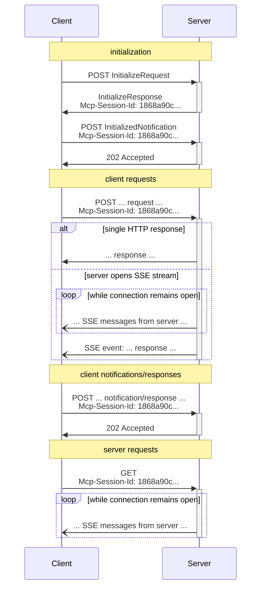

# Transports（2025-03-26 版本）

MCP（Model Context Protocol）是一种基于 JSON-RPC 的通信协议，旨在实现客户端与服务器之间的高效、可靠交互。本文档详细介绍了 2025-03-26 版本中的 Streamable HTTP 传输机制，该机制结合了 HTTP 与 Server-Sent Events (SSE) 技术，为现代分布式系统提供了灵活的双向通信能力。

> 4 月 17 日，MCP Typescript SDK 在 [1.10.0 版本](https://github.com/modelcontextprotocol/typescript-sdk/releases/tag/1.10.0)中正式支持该协议。这是对现有 SSE 协议的重大革新，我们相信 Streamable HTTP 将成为未来标准。

## 协议架构与设计原则

### 传输层基础架构

Streamable HTTP 传输建立在标准 HTTP 协议之上，通过精心设计的请求-响应模式实现全双工通信。服务器需提供统一的 MCP 端点（如`https://example.com/mcp`），同时支持 POST 和 GET 方法处理不同类型的交互请求。

MCP 使用 JSON-RPC 编码消息，所有消息**必须**采用 UTF-8 编码。当前协议定义了两种标准传输机制：

1. stdio（通过标准输入输出进行通信）
2. Streamable HTTP

客户端在首次交互时必须包含 Accept Header，明确声明支持 `application/json` 和 `text/event-stream` 两种内容类型。这种双重声明确保了与不同版本服务器的兼容性，系统可根据实际能力选择最佳通信方式。

### 安全注意事项

实现 Streamable HTTP 传输时，必须注意以下安全措施：

1. 服务器**必须**验证所有传入连接的 `Origin` 头部，以防止 DNS 重绑定攻击
2. 本地运行时，服务器**应该**仅绑定到 localhost (127.0.0.1)，而不是所有网络接口 (0.0.0.0)
3. 服务器**应该**为所有连接实施适当的身份验证

如果没有这些保护措施，攻击者可能会使用 DNS 重绑定从远程网站与本地 MCP 服务器交互。

## 消息传输流程

### 客户端向服务器发送消息

客户端向服务器发送的每个 JSON-RPC 消息**必须**是一个新的 HTTP POST 请求：

1. 客户端**必须**使用 HTTP POST 向 MCP 端点发送 JSON-RPC 消息
2. 客户端**必须**包含 `Accept` 头部，列出 `application/json` 和 `text/event-stream` 作为支持的内容类型
3. POST 请求的主体**必须**是以下之一：

   - 单个 JSON-RPC _请求_、*通知*或*响应*
   - 批处理多个*请求和/或通知*的数组
   - 批处理多个*响应*的数组

4. 如果输入仅由 JSON-RPC *响应*或*通知*组成：

   - 如果服务器接受输入，服务器**必须**返回 HTTP 状态码 202 Accepted，无响应体
   - 如果服务器无法接受输入，它**必须**返回 HTTP 错误状态码（例如 400 Bad Request）

5. 如果输入包含任意数量的 JSON-RPC _请求_，服务器**必须**返回`Content-Type: text/event-stream`（启动 SSE 流）或`Content-Type: application/json`（返回一个 JSON 对象）

6. 如果服务器启动 SSE 流：
   - SSE 流**应该**最终包含每个发送的 JSON-RPC *请求*对应的一个 JSON-RPC _响应_
   - 服务器**可以**在发送 JSON-RPC *响应*之前发送 JSON-RPC *请求*和*通知*
   - 服务器**不应该**在为每个接收到的 JSON-RPC *请求*发送 JSON-RPC *响应*之前关闭 SSE 流
   - 发送完所有 JSON-RPC *响应*后，服务器**应该**关闭 SSE 流
   - 断开连接**可能**随时发生（例如由于网络条件）；因此：
     - 断开连接**不应该**被解释为客户端取消其请求
     - 要取消，客户端**应该**明确发送 MCP `CancelledNotification`
     - 为避免由于断开连接导致的消息丢失，服务器**可以**使流可恢复

### 监听服务器消息

1. 客户端**可以**向 MCP 端点发出 HTTP GET 请求。这可用于打开 SSE 流，允许服务器与客户端通信，而无需客户端首先通过 HTTP POST 发送数据
2. 客户端**必须**包含 `Accept` 头部，列出 `text/event-stream` 作为支持的内容类型
3. 服务器**必须**返回 `Content-Type: text/event-stream` 或返回 HTTP 405 Method Not Allowed
4. 如果服务器启动 SSE 流：
   - 服务器**可以**在流上发送 JSON-RPC *请求*和*通知*
   - 这些消息**应该**与客户端并发运行的任何 JSON-RPC *请求*无关
   - 服务器**不得**在流上发送 JSON-RPC _响应_，**除非**恢复与先前客户端请求关联的流
   - 服务器**可以**随时关闭 SSE 流
   - 客户端**可以**随时关闭 SSE 流

## 多连接支持

1. 客户端**可以**同时保持与多个 SSE 流的连接
2. 服务器**必须**仅在一个已连接的流上发送其 JSON-RPC 消息；也就是说，它**不得**在多个流上广播相同的消息
   - 可通过使流可恢复来缓解消息丢失的风险

## 恢复和重传机制

为支持断开连接后的恢复和可能丢失的消息重传：

1. 服务器**可以**按照 SSE 标准为其 SSE 事件附加 `id` 字段
   - 如果存在，ID**必须**在该会话中的所有流中全局唯一
2. 如果客户端希望在连接断开后恢复，它**应该**向 MCP 端点发出 HTTP GET 请求，并包含 `Last-Event-ID` 请求头以指示它接收到的最后一个事件 ID
   - 服务器**可以**使用此头部重播在断开的流上最后一个事件 ID 之后应发送的消息
   - 服务器**不得**重播本应在不同流上传递的消息

## 会话管理

MCP "会话"由客户端和服务器之间的逻辑相关交互组成，从初始化阶段开始：

1. 使用 Streamable HTTP 传输的服务器**可以**在初始化时分配会话 ID，方法是在包含 `InitializeResult` 的 HTTP 响应中包含 `Mcp-Session-Id` 头部
   - 会话 ID**应该**全局唯一且加密安全（例如，安全生成的 UUID、JWT 或加密哈希）
   - 会话 ID**必须**仅包含可见的 ASCII 字符（范围从 0x21 到 0x7E）
2. 如果服务器在初始化期间返回`Mcp-Session-Id`，使用 Streamable HTTP 传输的客户端**必须**在所有后续 HTTP 请求中包含它
   - 需要会话 ID 的服务器**应该**响应没有`Mcp-Session-Id`头部的请求（初始化除外）并返回 HTTP 400 Bad Request
3. 服务器**可以**随时终止会话，之后它**必须**对包含该会话 ID 的请求响应 HTTP 404 Not Found
4. 当客户端收到响应包含`Mcp-Session-Id`的请求的 HTTP 404 时，它**必须**通过发送一个不附加会话 ID 的新`InitializeRequest`来开始一个新会话
5. 不再需要特定会话的客户端**应该**向 MCP 端点发送带有`Mcp-Session-Id`头部的 HTTP DELETE，以明确终止会话
   - 服务器**可以**以 HTTP 405 Method Not Allowed 响应此请求，表明服务器不允许客户端终止会话

## 向后兼容性

为维持与已弃用的 HTTP+SSE 传输（2024-11-05 协议版本）的向后兼容性，客户端和服务器可以采取以下措施：

**服务器**为支持旧客户端：

- 继续托管旧传输的 SSE 和 POST 端点，以及为 Streamable HTTP 传输定义的新"MCP 端点"
- 也可以将旧 POST 端点和新 MCP 端点合并，但这可能会引入不必要的复杂性

**客户端**为支持旧服务器：

1. 接受用户提供的 MCP 服务器 URL，可能指向使用旧传输或新传输的服务器
2. 尝试向服务器 URL 发送 POST `InitializeRequest`，并附上上文定义的`Accept`头部：
   - 如果成功，客户端可以假设这是一个支持新的 Streamable HTTP 传输的服务器
   - 如果失败并返回 HTTP 4xx 状态码（例如 405 Method Not Allowed 或 404 Not Found）：
     - 向服务器 URL 发出 GET 请求，期望这将打开一个 SSE 流并返回`endpoint`事件作为第一个事件
     - 当`endpoint`事件到达时，客户端可以假设这是一个运行旧的 HTTP+SSE 传输的服务器，并应使用该传输进行所有后续通信

## 自定义传输

客户端和服务器**可以**实现额外的自定义传输机制以满足其特定需求。协议不依赖于传输方式，可以在支持双向消息交换的任何通信通道上实现。

选择支持自定义传输的实现者**必须**确保它们保留 MCP 定义的 JSON-RPC 消息格式和生命周期要求。自定义传输**应该**记录其特定的连接建立和消息交换模式，以促进互操作性。

## 时序图

## 性能优化建议

### 连接管理优化

1. **复用连接**：利用 HTTP/2 的多路复用能力，减少连接建立开销
2. **合理配置超时**：根据业务需求设置连接和请求超时参数
3. **采用适当的服务端缓冲**：为高流量场景配置适当的流缓冲区大小

### 消息处理优化

1. **批处理消息**：合并多个请求减少网络往返
2. **压缩传输内容**：对较大的消息体应用 gzip 或 brotli 压缩
3. **优化 JSON 序列化**：使用高效的 JSON 处理库减少序列化开销

## 实现最佳实践

1. **健壮的错误处理**：实现完整的错误处理和重试逻辑
2. **流量控制**：实现适当的流量限制以防止资源耗尽
3. **监控和日志**：记录关键传输事件和性能指标
4. **安全加固**：实施 TLS、身份验证和授权机制
5. **测试和验证**：全面测试各种网络条件下的行为

## 结论

MCP Streamable HTTP 传输机制提供了一种强大、灵活的方式来实现客户端和服务器之间的通信。通过结合 HTTP 和 SSE 技术，它支持从简单的请求-响应交互到复杂的双向流式通信，同时保持了与现有基础设施的兼容性。本文档详细介绍了该传输机制的技术细节、安全考虑和最佳实践，为实现高效、可靠的 MCP 服务提供了全面指南。
