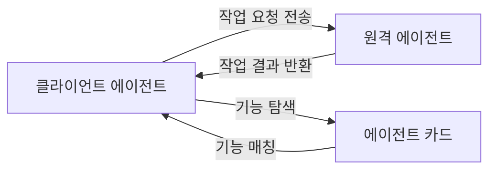
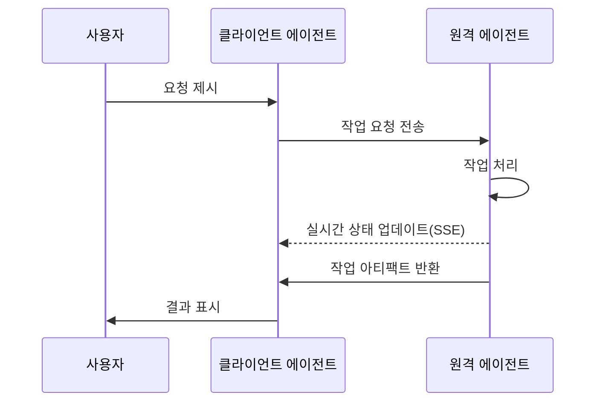
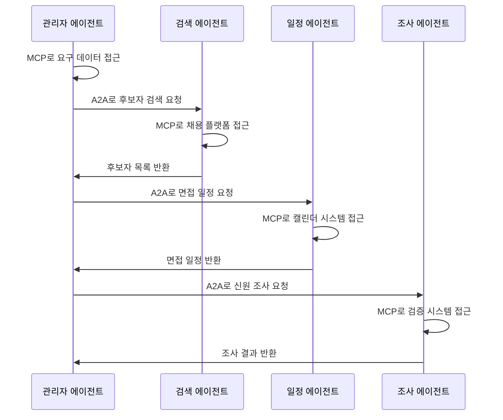

AI가 급속도로 발전하는 오늘날, 에이전트 기술은 다음 중요한 기술 물결로 부상하고 있습니다. AI 간의 교류와 협업 문제를 해결하기 위해 두 가지 중요한 프로토콜 표준이 등장했습니다: Google의 [A2A(Agent-to-Agent) 프로토콜](https://www.a2aprotocol.net)과 Anthropic의 [MCP(Model Context Protocol) 프로토콜](/). 이 두 프로토콜은 AI 에이전트 시스템의 핵심 과제를 서로 다른 각도에서 해결하며, 미래 AI 에이전트 생태계의 기반 인프라를 공동으로 구축하고 있습니다.

이 글에서는 **A2A 프로토콜**과 **MCP 프로토콜**의 특징, 차이점, 상호 보완적 역할을 살펴보며, 개발자와 제품 디자이너가 이 신흥 기술 영역을 더 잘 이해할 수 있도록 돕겠습니다.

## A2A 프로토콜: 에이전트 간 소통의 다리

### A2A 프로토콜의 핵심 개념

**A2A 프로토콜**은 Google과 50여 개의 업계 파트너들이 공동 개발한 개방형 프로토콜로, 다양한 공급업체의 AI 에이전트 간 상호 운용성을 가능하게 합니다. 에이전트의 제작자, 호스팅 위치, 사용 프레임워크와 무관하게 **A2A 프로토콜**은 이들이 원활하게 협력할 수 있도록 합니다.

### A2A 프로토콜의 기술 구현

**A2A 프로토콜**은 통신 메커니즘으로 **JSON-RPC 2.0 over HTTP(S)**를 채택하며, 실시간 업데이트 스트리밍을 위한 **Server-Sent Events (SSE)**를 지원합니다. 이 설계는 다양한 플랫폼의 에이전트가 효율적으로 정보를 교환할 수 있게 합니다.

### A2A 프로토콜의 통신 모델

**A2A 프로토콜**에서는 두 가지 에이전트 역할이 정의됩니다:

1. **클라이언트 에이전트**: 요청 또는 작업을 시작
2. **원격 에이전트**: 요청을 수신하고 작업 완료 시도

통신 과정은 특정 작업 수행에 가장 적합한 에이전트를 결정하기 위한 **기능 탐색(Capability Discovery)**을 포함할 수 있습니다.

### 에이전트 카드와 기능 탐색

각 에이전트는 **에이전트 카드(Agent Card)**를 발행할 수 있습니다. 이는 JSON 메타데이터 문서로, 일반적으로 표준 URL(예: `/.well-known/agent.json`)에 호스팅됩니다. 에이전트 카드는 해당 에이전트의 기능, 기술, API 엔드포인트 및 인증 요구 사항을 설명합니다.

클라이언트 에이전트는 에이전트 카드를 읽음으로써 현재 작업에 가장 적합한 파트너 에이전트를 식별할 수 있습니다.

### 작업 관리 메커니즘

**A2A 프로토콜**의 모든 상호작용은 작업 실행을 중심으로 이루어집니다. 작업은 프로토콜에서 정의한 구조화된 객체로, 요청 세부 정보를 포함하며 상태를 추적합니다. 결과는 **아티팩트(Artifacts)** 형태로 반환되며, 에이전트는 실행 과정에서 구조화된 **메시지(Messages)**를 보내 조정이나 설명을 요청할 수 있습니다.

## MCP 프로토콜: 모델과 외부 세계의 연결자

### MCP 프로토콜의 기본 프레임워크

**MCP 프로토콜**(Model Context Protocol)은 Anthropic이 개발한 개방형 프로토콜로, AI 애플리케이션(예: 챗봇, 에이전트, IDE)과 외부 도구, 데이터 소스, 서비스의 상호작용 방식을 표준화합니다. 이는 통합된 인터페이스를 제공하여 컨텍스트 정보를 통합함으로써 AI 개발의 파편화 문제를 줄입니다.

### MCP 프로토콜의 핵심 구성 요소

**MCP 프로토콜**에는 세 가지 주요 구성 요소가 포함됩니다:

1. **도구(Tools)**: 모델이 제어하는 동작(예: 데이터 가져오기, 데이터베이스 쓰기)
2. **리소스(Resources)**: 애플리케이션이 제어하는 데이터(예: 파일, JSON, 첨부 파일)
3. **프롬프트(Prompts)**: 사용자가 제어하는 사전 정의된 템플릿(예: IDE의 슬래시 명령)

### MCP 프로토콜의 가치와 의의

**MCP 프로토콜**이 제공하는 주요 가치는 다음과 같습니다:

1. **파편화 감소**: AI 애플리케이션과 도구 및 데이터를 연결하는 표준 방식 제공, 맞춤형 통합 구축 필요성 감소
2. **조합성 구현**: 에이전트와 애플리케이션이 사전 프로그래밍 없이 새 도구를 동적으로 발견하고 사용 가능
3. **기업 워크플로 지원**: 팀이 특정 서비스를 보유하고 **MCP 프로토콜**을 통해 다른 팀이 사용할 수 있도록 노출 가능

### MCP 프로토콜의 적용 사례

**MCP 프로토콜**은 여러 분야에서 활용되고 있습니다:

- **IDE(예: Cursor, Zed)**: **MCP 프로토콜**을 사용하여 코드 컨텍스트, GitHub 이슈 및 문서 도입
- **에이전트**: 자율적으로 도구 호출(예: 네트워크 검색, 데이터베이스 쿼리)
- **원격 서버와 OAuth**: 원격 **MCP 프로토콜** 서버 및 보안 인증 지원

## A2A 프로토콜과 MCP 프로토콜의 협력과 차이

### 두 프로토콜의 기능적 위치

**A2A 프로토콜**과 **MCP 프로토콜**은 AI 에이전트 생태계의 서로 다른 층위의 과제를 해결합니다:

- **A2A 프로토콜**: 에이전트 간 상호 작용 방식 해결(수평 통합)
- **MCP 프로토콜**: 에이전트가 도구 또는 외부 컨텍스트와 상호 작용하는 방식 해결(수직 통합)

### 기능적 상호 보완성 분석

이 두 프로토콜은 서로 보완적이며, 다중 에이전트, 다중 LLM 및 다중 소스 컨텍스트 시스템 구축의 핵심 과제를 공동으로 해결합니다:

1. **A2A 프로토콜**: 에이전트 간 표준화된 통신에 집중(에이전트 대 에이전트)
2. **MCP 프로토콜**: 에이전트와 외부 도구 및 시스템의 상호 작용에 집중(에이전트 대 도구)

### 프로토콜 생태계의 미래 전망

**A2A 프로토콜**과 **MCP 프로토콜**의 보급으로 다음과 같은 변화를 예상할 수 있습니다:

1. **MCP 서버** 증가: 다양한 서비스 제공업체가 특정 기능의 **MCP 서버** 제공 가능
2. **에이전트 네트워크** 형성: 에이전트가 **A2A 프로토콜**을 통해 협력 네트워크를 구성하고 역할 분담 가능
3. **워크플로 자동화** 진화: 복잡한 작업이 분해되어 여러 전문 에이전트의 협력으로 완료 가능

## 실제 적용: A2A 프로토콜과 MCP 프로토콜의 협력 사용 시나리오

### 기업 적용 시나리오

기업 환경에서 **A2A 프로토콜**과 **MCP 프로토콜**은 협력하여 복잡한 자동화 시나리오를 구현할 수 있습니다:

#### 채용 프로세스 자동화

1. 채용 관리자의 에이전트(**MCP 프로토콜**로 회사 데이터베이스 접근)가 채용 요구 사항 결정
2. **A2A 프로토콜**을 통해 이 에이전트가 전문 인재 검색 에이전트와 협력
3. 인재 검색 에이전트(**MCP 프로토콜**로) LinkedIn 등의 플랫폼에서 인재 정보 획득
4. 면접 일정 에이전트가 **A2A 프로토콜**로 작업 수신, **MCP 프로토콜**로 캘린더 시스템과 상호 작용
5. 신원 조사 에이전트가 유사한 방식으로 작업 완료

### 소비자 적용 시나리오

소비자 분야에서도 두 프로토콜의 결합은 새로운 사용자 경험을 제공할 수 있습니다:

#### 여행 계획 도우미

1. 사용자의 개인 비서 에이전트(**MCP 프로토콜**로 사용자 데이터 접근)가 여행 선호도 수집
2. 이 에이전트가 **A2A 프로토콜**로 전문 여행 에이전트와 협력
3. 여행 에이전트가 **MCP 프로토콜**로 항공편, 호텔, 관광지 데이터 접근
4. **A2A 프로토콜**로 예산 관리 에이전트가 재무 계획에 참여
5. 최종 계획이 **MCP 프로토콜**로 사용자의 캘린더 및 여행 앱에 통합

## 개발자 주의 사항: A2A 프로토콜과 MCP 프로토콜 통합

### 보안 고려 사항

**A2A 프로토콜**과 **MCP 프로토콜** 구현 시 개발자는 특히 보안 문제에 주의해야 합니다:

1. **인증 및 권한 부여**: 에이전트가 사용자를 대신하여 행동하므로 전체 프로세스에서 자격 증명 보호 필요
2. **다중 신원 연합**: 사용자가 다른 시스템에 대해 다른 신원 제공 필요 가능
3. **권한 범위 제어**: 에이전트가 필요한 리소스만 접근할 수 있도록 보장

### 구현 경로 권장 사항

이 프로토콜들을 채택하려는 개발자에게는 다음 구현 경로를 권장합니다:

1. 먼저 **MCP 프로토콜** 통합 구현하여 에이전트가 도구와 컨텍스트에 접근할 수 있도록 함
2. 그 다음 **A2A 프로토콜** 지원 구현하여 에이전트가 다른 에이전트와 협력할 수 있도록 함
3. 에이전트 카드 생성하여 에이전트의 기능과 서비스 경계를 명확히 선언
4. 사용자가 에이전트 행동과 권한 범위를 제어할 수 있는 적절한 사용자 인터페이스 설계

## 결론: A2A 프로토콜과 MCP 프로토콜이 공동으로 구축하는 미래

**A2A 프로토콜**과 **MCP 프로토콜**은 AI 에이전트 기술의 중요한 진보를 나타내며, 더 지능적이고 협력적인 에이전트 생태계의 기반을 공동으로 마련합니다. 이 프로토콜들은 단순한 기술 사양이 아니라 차세대 AI 애플리케이션 아키텍처의 초석입니다.

이 프로토콜들이 성숙되고 광범위하게 채택됨에 따라 우리는 다음을 목격할 것입니다:

1. AI 에이전트 능력의 현저한 향상, 단일 기능에서 복잡한 협력으로 진화
2. 플랫폼과 공급업체를 초월한 AI 에이전트 협력이 일상화
3. 새로운 유형의 애플리케이션과 서비스 모델 등장, 사용자와 AI의 상호 작용 방식 재정의

개발자와 기업에게 **A2A 프로토콜**과 **MCP 프로토콜**을 이해하고 채택하는 것은 AI 에이전트 기술 물결을 잡는 핵심 단계가 될 것입니다.
