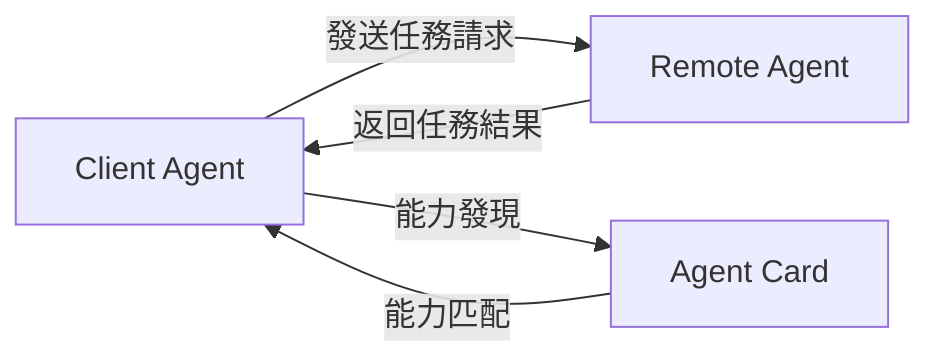
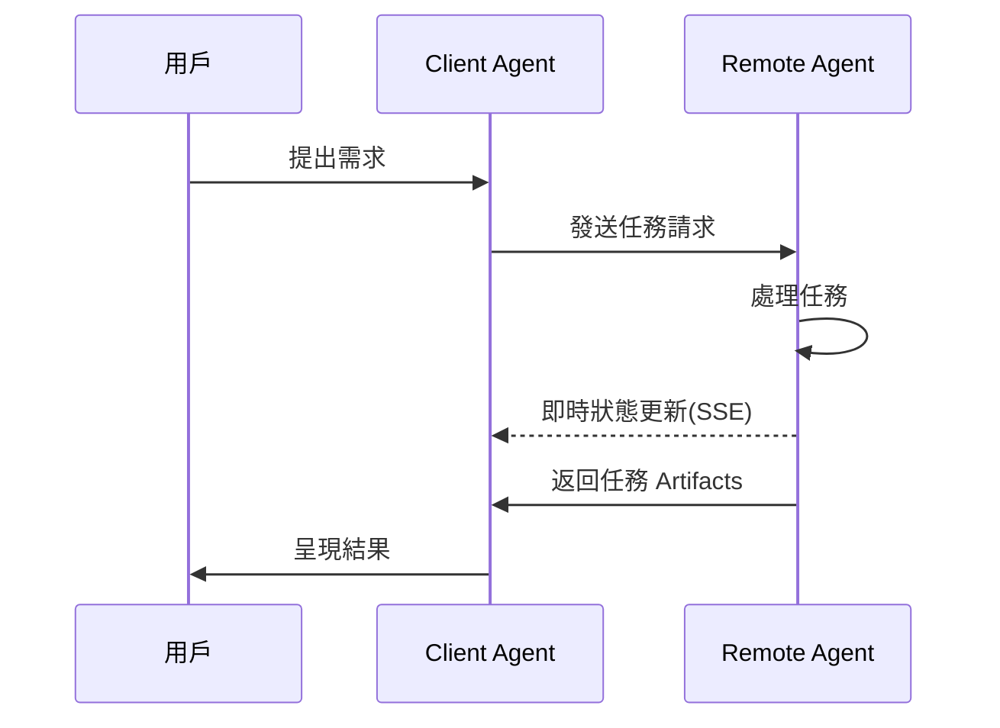
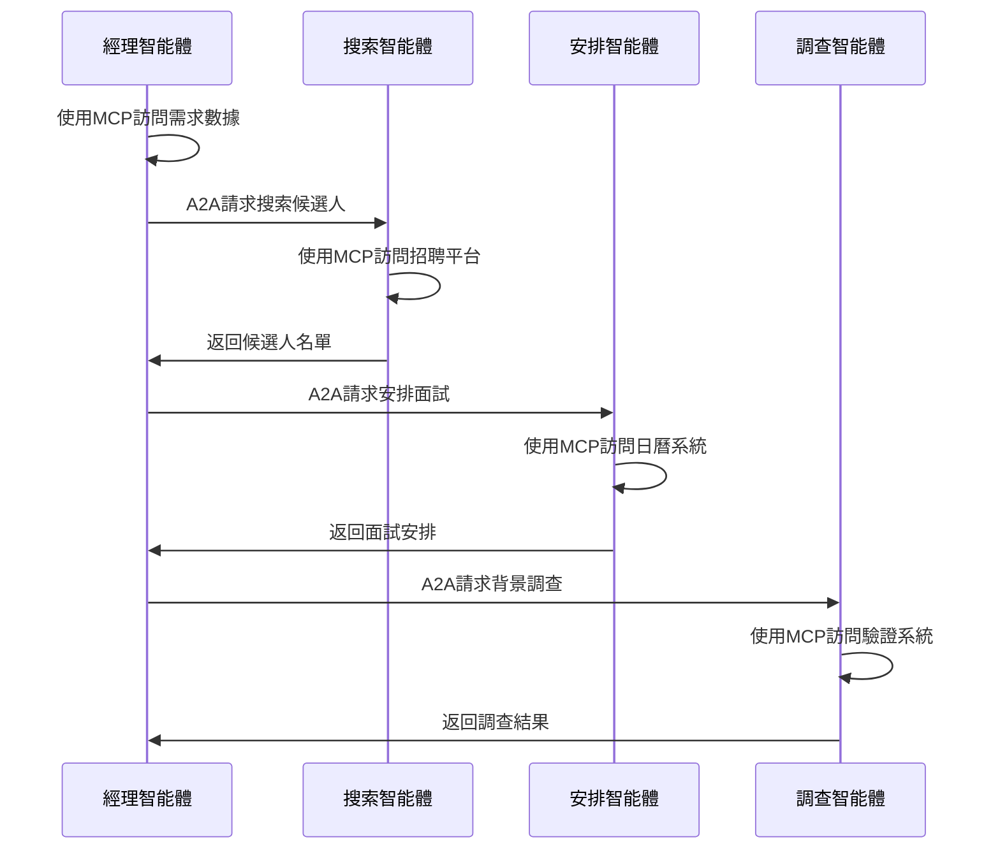

在 AI 快速發展的今天，代理技術（Agent）正在成為下一個重要的技術浪潮。為了解決 AI 之間的交流與協作問題，兩個重要的協定標準應運而生：Google 的 [A2A（Agent-to-Agent）協定](https://www.a2aprotocol.net) 和 Anthropic 的 [MCP（Model Context Protocol）協定](/)。這兩個協定從不同角度解決了 AI 智能體系統中的關鍵挑戰，共同構建起未來 AI 智能體生態系統的基礎架構。

本文將探討**A2A 協定**與**MCP 協定**的特點、區別及協同作用，幫助開發者和產品設計師更好地理解這一新興技術領域。

## A2A 協定：打造代理間的溝通橋樑

### A2A 協定的核心概念

**A2A 協定**是由 Google 與 50 多家行業合作夥伴共同開發的開放協定，旨在實現不同供應商的 AI 智能體之間的互操作性。無論這些代理是誰構建的、在哪裡託管或使用什麼框架，**A2A 協定**都能使它們無縫協作。

### A2A 協定的技術實現

**A2A 協定**採用**JSON-RPC 2.0 over HTTP(S)**作為通信機制，並支援**Server-Sent Events (SSE)**進行即時更新流。這種設計使得不同平台上的代理能夠高效地交換資訊。

### A2A 協定的通信模型

在**A2A 協定**中，定義了兩種代理角色：

1. **Client Agent**：發起請求或任務
2. **Remote Agent**：接收請求並嘗試完成任務

通信過程首先可能涉及**能力發現（Capability Discovery）**，以確定哪個代理最適合執行特定任務。

### 智能體卡片與能力發現

每個智能體可以發布**智能體卡片（Agent Card）** — 一個 JSON 元數據文檔，通常託管在標準 URL（如`/.well-known/agent.json`）。智能體卡片描述了該智能體的功能、技能、API 端點和身份驗證要求。

客戶端智能體通過閱讀智能體卡片，可以識別出最適合當前任務的合作夥伴智能體。

### 任務管理機制

**A2A 協定**中的所有互動都圍繞執行任務展開。任務是由協定定義的結構化對象，包含請求詳情並追蹤其狀態。結果以 **Artifacts** 的形式返回，智能體可以在執行過程中發送結構化**訊息（Messages）**進行協調或澄清。

## MCP 協定：模型與外部世界的連接器

### MCP 協定的基本框架

**MCP 協定**（Model Context Protocol）是 Anthropic 開發的開放協定，旨在標準化 AI 應用（如聊天機器人、代理和 IDE）與外部工具、數據源和服務的互動方式。它通過提供統一的接口來整合上下文資訊，從而減少 AI 開發中的碎片化問題。

### MCP 協定的核心組件

**MCP 協定**包含三個關鍵組件：

1. **工具（Tools）**：模型控制的動作（如獲取數據、寫入數據庫）
2. **資源（Resources）**：應用控制的數據（如文件、JSON、附件）
3. **提示（Prompts）**：用戶控制的預定義模板（如 IDE 中的斜槓命令）

### MCP 協定的價值與意義

**MCP 協定**帶來的主要價值包括：

1. **減少碎片化**：提供標準方式連接 AI 應用與工具和數據，避免團隊構建自訂整合
2. **實現組合性**：代理和應用可以動態發現和使用新工具，無需預編程
3. **支援企業工作流**：團隊可以擁有特定服務並通過**MCP 協定**暴露給其他團隊使用

### MCP 協定的應用場景

**MCP 協定**已在多個領域得到應用：

- **IDE（如 Cursor、Zed）**：使用**MCP 協定**引入代碼上下文、GitHub 問題和文檔
- **代理**：自主調用工具（如搜索網絡、查詢數據庫）
- **遠程伺服器與 OAuth**：支援遠程**MCP 協定**伺服器和安全認證

## A2A 協定與 MCP 協定的協同與區別

### 兩種協定的功能定位

**A2A 協定**與**MCP 協定**解決了 AI 智能體生態系統中不同層面的挑戰：

- **A2A 協定**：解決代理之間如何互相互動（水平整合）
- **MCP 協定**：解決代理如何與工具或外部上下文互動（垂直整合）

### 功能互補性分析

這兩種協定相互補充，共同解決構建多代理、多 LLM 和多源上下文系統的核心挑戰：

1. **A2A 協定**專注於代理之間的標準化通信（代理到代理）
2. **MCP 協定**專注於代理與外部工具和系統的互動（代理到工具）

### 協定生態系統的未來展望

隨著**A2A 協定**和**MCP 協定**的普及，我們可以預見：

1. **MCP 伺服器**的增長：各種服務提供商可能會提供特定功能的**MCP 伺服器**
2. **智能體網絡**的形成：智能體可以通過**A2A 協定**組成協作網絡，分工合作
3. **工作流自動化**的進化：複雜任務可以被分解並由多個專業智能體協作完成

## 實際應用：A2A 協定與 MCP 協定的協同使用場景

### 企業應用場景

在企業環境中，**A2A 協定**和**MCP 協定**可以協同工作，實現複雜的自動化場景：

#### 招聘流程自動化

1. 招聘經理的智能體（使用**MCP 協定**訪問公司數據庫）確定招聘需求
2. 通過**A2A 協定**，該智能體與專業的人才搜索智能體協作
3. 人才搜索智能體（通過**MCP 協定**）訪問 LinkedIn 等平台獲取人才資訊
4. 面試安排智能體通過**A2A 協定**接收任務，並使用**MCP 協定**與日曆系統互動
5. 背景調查智能體通過類似方式完成其任務

### 消費者應用場景

在消費者領域，兩種協定的結合同樣能帶來全新的用戶體驗：

#### 旅行規劃助手

1. 用戶的個人助理智能體（通過**MCP 協定**訪問用戶數據）收集旅行偏好
2. 該智能體使用**A2A 協定**與專業旅行代理協作
3. 旅行智能體通過**MCP 協定**訪問航班、酒店和景點數據
4. 通過**A2A 協定**，預算管理智能體參與規劃財務安排
5. 最終計劃通過**MCP 協定**被整合到用戶的日曆和旅行應用中

## 開發者注意事項：整合 A2A 協定與 MCP 協定

### 安全性考量

在實現**A2A 協定**和**MCP 協定**時，開發者需要特別注意安全性問題：

1. **身份驗證與授權**：代理將代表用戶行動，憑證必須在整個流程中得到保護
2. **多身份聯合**：用戶可能需要為不同系統提供不同身份
3. **權限範圍控制**：確保代理只能訪問必要的資源

### 實施路徑建議

對於希望採用這些協定的開發者，建議以下實施路徑：

1. 首先實現**MCP 協定**整合，使代理能夠訪問工具和上下文
2. 然後實現**A2A 協定**支援，使代理能夠與其他代理協作
3. 創建代理卡片，明確聲明代理的能力和服務邊界
4. 設計適當的用戶界面，使用戶能夠控制代理行為和授權範圍

## 結論：A2A 協定與 MCP 協定共同構建的未來

**A2A 協定**和**MCP 協定**代表了 AI 智能體技術的重要進步，它們共同為更智能、更協作的代理生態系統奠定了基礎。這些協定不僅僅是技術規範，更是新一代 AI 應用架構的基石。

隨著這些協定的成熟和廣泛採用，我們將看到：

1. AI 智能體能力的顯著增強，從單一功能走向複雜協作
2. 跨平台、跨供應商的 AI 智能體協作成為常態
3. 新型應用和服務模式的出現，重新定義用戶與 AI 的互動方式

對於開發者和企業來說，了解並採用**A2A 協定**和**MCP 協定**將是把握 AI 智能體技術浪潮的關鍵一步。
