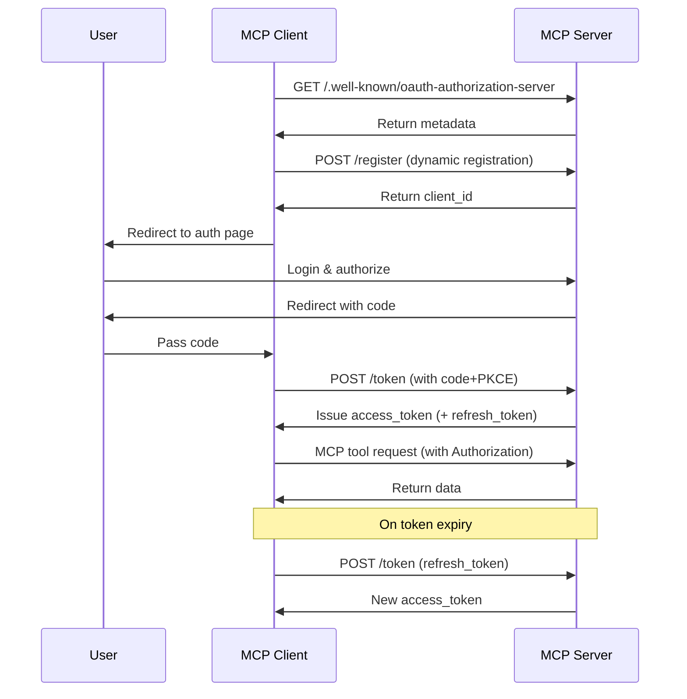

# MCP Authorization Mechanism

The initial version of MCP released on 2024-11-05 did not support authorization. However, in the 2025-03-26 update, the MCP protocol introduced an OAuth 2.1-based authorization mechanism. In the latest MCP Draft, the community has refined the OAuth 2.1-based authorization protocol to accommodate HTTP, SSE, Streamable HTTP, and other transmission modes. Through authorization, MCP clients can securely access restricted MCP tools and resources on behalf of users or applications.


## MCP Authorization Specification

The MCP Authorization Specification defines the authentication process between MCP servers (remote) and MCP clients. As an authorization framework, OAuth addresses how users can grant third-party applications access to their resources. If you are unfamiliar with OAuth, refer to [AuthWiki-OAuth](https://auth.wiki/zh/oauth-2.0) for more details.

In the context of MCP clients and servers, this involves "users authorizing MCP clients to access their resources on MCP servers." Currently, "user resources on MCP servers" primarily refer to tools provided by MCP servers or resources offered by backend services.

To implement the OAuth 2.1 authentication process, the protocol requires MCP servers to provide the following endpoints, collaborating with MCP clients to complete the OAuth 2.1 flow:

- `/.well-known/oauth-authorization-server`: OAuth server metadata
- `/authorize`: Authorization endpoint for authorization requests
- `/token`: Token endpoint for token exchange and refresh
- `/register`: Client registration endpoint for dynamic client registration

The authentication process is illustrated below:


The specification also outlines how MCP servers can support delegated authorization via third-party authorization servers. An example flow is shown below:


In this scenario, even if the MCP server delegates authorization to a third-party server, it still acts as the authorization server for the MCP client because it must issue its own access tokens.

This approach seems more suitable for cases where the MCP server proxies client access to third-party resources (e.g., GitHub repositories) rather than accessing its own resources.

In summary, the protocol designates the MCP server as both an authorization server and a resource server in the OAuth framework.

Next, let's examine the responsibilities of the MCP server in these roles.

### MCP Server as an Authorization Server

When the MCP server acts as an authorization server, it implies that end users have identities on the MCP server. The server authenticates these users and issues access tokens for accessing MCP server resources.

The required authorization endpoints mean the MCP server must implement an authorization server. However, this poses challenges for developers:

- Many developers may lack familiarity with OAuth concepts.
- Implementing an authorization server involves numerous security considerations.

The protocol does not restrict the MCP server to self-implementing this functionality. Developers can redirect or proxy these endpoints to third-party authorization servers. For MCP clients, this is indistinguishable from the MCP server handling authorization itself.


You might wonder whether this approach should use the delegated third-party authorization method mentioned earlier.

This depends on whether the third-party authorization service shares the same user base as the MCP server:

- If yes, the MCP server can forward Auth-related endpoints to the third-party service.
- If no, the delegated third-party authorization method specified in the protocol should be used, requiring the MCP server to maintain a mapping between its tokens and third-party tokens.

The delegated method appears ambiguous in practical scenarios. The protocol requires the MCP server to issue its own tokens even when delegating, which complicates implementation. This may stem from security concerns (e.g., token leakage/misuse).

From experience, the delegated method best suits scenarios where "users authorize the MCP server to access third-party resources." For example, the MCP server might need access to a user's GitHub repository to deploy code. Here, the MCP server acts as the client's authorization server (for its own resources) and as a client to GitHub (for third-party resources).

Thus, the delegated protocol addresses **how to authorize the MCP server to access user resources on third-party servers**.

### MCP Server as a Resource Server

As a resource server, the MCP server validates whether client requests carry valid access tokens and checks scopes to determine resource access permissions.

Under MCP's definition, resources should be tools for MCP clients. However, in practice, these tools often interact with the MCP server's backend resources. Here, the access token obtained from the client is reused for backend access.

In such cases, the MCP server and backend resource server are typically operated by the same developer, sharing tokens issued by a single authorization server.

While the protocol accommodates this, it's preferable to limit MCP server resources to tools for clients, with tools fetching additional resources from other servers (first- or third-party). This covers all practical scenarios.

## Dynamic Client Registration

The specification also defines how authorization servers identify clients. OAuth 2.1's dynamic client registration protocol allows MCP clients to obtain OAuth client IDs automatically.

MCP servers should support this protocol to enable seamless client registration. This is recommended because:

- Clients cannot pre-register with all possible servers.
- Manual registration burdens users.
- It simplifies connecting to new servers.
- Servers can enforce registration policies.

However, in practice, manual OAuth client management may offer better control and security.

## How MCP Authorization Works

After understanding the MCP server's roles, here's the authorization workflow:



1. The MCP Client accesses the MCP Server without a token.
2. The server rejects the request (401 Unauthorized).
3. The client fetches metadata from `/.well-known/oauth-authorization-server`. A standard response includes:

   ```json
   {
     "issuer": "https://mcp.example.com",
     "authorization_endpoint": "https://mcp.example.com/authorize",
     "token_endpoint": "https://mcp.example.com/token",
     "registration_endpoint": "https://mcp.example.com/register",
     "scopes_supported": [
       "openid",
       "profile",
       "mcp:tool:read",
       "mcp:tool:write"
     ]
   }
   ```

   If discovery fails (404), clients fall back to default paths (`/authorize`, `/token`, `/register`).

4. The server returns metadata.
5. The client registers dynamically:
   - Request:
     ```http
     POST /register
     Content-Type: application/json
     {
         "client_name": "my-mcp-client",
         "redirect_uris": ["https://myapp.com/callback"],
         "grant_types": ["authorization_code"],
         "token_endpoint_auth_method": "none"
     }
     ```
   - Response:
     ```json
     {
       "client_id": "abc123",
       "client_secret": null,
       "redirect_uris": ["https://myapp.com/callback"]
     }
     ```
   - Clients must securely store `client_id`; public clients should not store `client_secret`.
6. The MCP Server returns the client ID and client credentials to the MCP Client.
7. To prevent man-in-the-middle attacks, the MCP Client initiates the PKCE flow, generating information such as `code_verifier` and `code_challenge`.
8. The MCP Client launches the user agent, guiding the user to the authorization page with `code_challenge` and other details for login and authorization.
9. After user authorization, the MCP Server redirects the user agent back to the MCP Client using the previously provided redirect URI (either in the request or during client registration). The redirect URI includes an authorization code.
10. The MCP Client requests an access token (access_token and optional refresh_token) from the MCP Server's token endpoint by including the authorization code received in the previous step and its `code_verifier`.
11. After authenticating the client, the MCP Server returns the access token and refresh token. If a `refresh_token` is provided, the client can automatically refresh the token once the access_token expires.

## Token Usage and Security

- **Authorization Header**: All MCP HTTP requests must include `Authorization: Bearer <access_token>`.
- **Token Scope**: Tokens can only access MCP tools authorized by their scope.
- **Token Refresh**: Upon encountering a 401/403 error, automatically refresh the token using the refresh_token.
- **Token Storage Security**: Tokens should only be stored in secure environments. For browser-side storage, use httpOnly cookies or secure storage mechanisms.
- **Multiple Sessions/Users**: Clients must distinguish tokens for different users/sessions to prevent misuse.

## Common Issues

- **Token Leakage Risk**: Tokens must only be included in headers and never in URLs.
- **PKCE Implementation Required**: Prevents authorization codes from being intercepted by third parties.
- **redirect_uri Validation**: The server must strictly validate redirect_uri to prevent open redirect vulnerabilities.
- **Minimal Token Scope**: Only request/grant necessary permissions to reduce risk.
- **Token Expiration Handling**: Clients should automatically refresh tokens or reauthorize to avoid service interruptions.
- **Multi-MCP Service Compatibility**: Clients must independently manage discovery, registration, authorization, and token management for each MCP service.
- **HTTPS Enforcement**: All authentication traffic must be encrypted to prevent man-in-the-middle attacks.
- **Dynamic Registration Compatibility**: Some MCP services may not support dynamic registration, requiring manual `client_id` configuration.

## Authentication Example

Next, we will use the MCP Python SDK to test OAuth authentication via the Streamable HTTP or SSE transport protocol. We will implement a GitHub OAuth-integrated MCP server example to demonstrate the core components required for OAuth authentication and authorization.

First, we need to create a GitHub OAuth application by visiting [https://github.com/settings/applications/new](https://github.com/settings/applications/new) to register a new OAuth application.


The most important field here is the `Authorization callback URL`, which we set to `http://localhost:8000/github/callback`. This means we need to handle GitHub's OAuth callback requests on this endpoint. The homepage URL is `http://localhost:8000`. Click "Register application."

After creation, we need to save the `Client ID` and `Client Secret` values for later use.

Next, create a new project using `uv`:

```bash
uv init auth-mcp --python 3.13
cd auth-mcp
uv add mcp[cli]
```

Then, create a `.env` file in the root directory and add the `Client ID` and `Client Secret` values from GitHub:

```bash
MCP_GITHUB_CLIENT_ID=your_client_id
MCP_GITHUB_CLIENT_SECRET=your_client_secret
```

Now, implement a GitHub OAuth Provider in the `main.py` file to handle basic OAuth functionality. To achieve this, we can directly implement the `OAuthAuthorizationServerProvider` class provided by the SDK, which includes core OAuth features such as:

- Fetching client information
- Client registration
- Authorization
- Callback handling
- Token refresh
- Token validation
- Token revocation

The detailed code is as follows:

```python
import os
import logging
import secrets
import time
from typing import Any
from dotenv import load_dotenv
from pydantic import AnyHttpUrl
from pydantic_settings import BaseSettings
from starlette.exceptions import HTTPException
from starlette.requests import Request
from starlette.responses import JSONResponse, RedirectResponse, Response

# Import MCP authentication and server modules
from mcp.server.auth.middleware.auth_context import get_access_token
from mcp.server.auth.provider import (
    AccessToken,
    AuthorizationCode,
    AuthorizationParams,
    OAuthAuthorizationServerProvider,
    RefreshToken,
    construct_redirect_uri,
)
from mcp.server.auth.settings import AuthSettings, ClientRegistrationOptions
from mcp.server.fastmcp.server import FastMCP
from mcp.shared._httpx_utils import create_mcp_http_client
from mcp.shared.auth import OAuthClientInformationFull, OAuthToken


# Configure logger
logger = logging.getLogger(__name__)

# Load environment variables
load_dotenv()


class ServerSettings(BaseSettings):
    """Server settings class for configuring GitHub MCP server parameters."""
    # Basic server settings
    host: str = "localhost"  # Server host address
    port: int = 8000  # Server port
    server_url: AnyHttpUrl = AnyHttpUrl("http://localhost:8000")  # Server URL

    # GitHub OAuth configuration - must be provided via environment variables
    github_client_id: str = os.getenv("MCP_GITHUB_CLIENT_ID", "")  # GitHub client ID
    github_client_secret: str = os.getenv("MCP_GITHUB_CLIENT_SECRET", "")  # GitHub client secret
    github_callback_path: str = "http://localhost:8000/github/callback"  # OAuth callback path

    # GitHub OAuth URLs
    github_auth_url: str = "https://github.com/login/oauth/authorize"  # GitHub authorization URL
    github_token_url: str = "https://github.com/login/oauth/access_token"  # GitHub token URL

    # OAuth scope settings
    mcp_scope: str = "user"  # MCP scope
    github_scope: str = "read:user"  # GitHub scope

    def __init__(self, **data):
        """Initialize settings, loading configurations from environment variables.

        Note: github_client_id and github_client_secret are required but can be loaded
        automatically from environment variables (MCP_GITHUB_GITHUB_CLIENT_ID and
        MCP_GITHUB_GITHUB_CLIENT_SECRET) without explicit input.
        """
        super().__init__(**data)


class MyGitHubOAuthProvider(OAuthAuthorizationServerProvider): # type: ignore
    """GitHub OAuth Provider class implementing basic OAuth functionality."""

    def __init__(self, settings: ServerSettings):
        """Initialize the OAuth provider.

        Args:
            settings: Server settings object
        """
        self.settings = settings
        self.clients: dict[str, OAuthClientInformationFull] = {}  # Stores client information
        self.auth_codes: dict[str, AuthorizationCode] = {}  # Stores authorization codes
        self.tokens: dict[str, AccessToken] = {}  # Stores access tokens
        self.state_mapping: dict[str, dict[str, str]] = {}  # Stores state mappings
        self.token_mapping: dict[str, str] = {}  # Maps MCP tokens to GitHub tokens

    async def get_client(self, client_id: str) -> OAuthClientInformationFull | None:
        """Retrieve OAuth client information.

        Args:
            client_id: Client ID

        Returns:
            Client information object or None
        """
        return self.clients.get(client_id)

    async def register_client(self, client_info: OAuthClientInformationFull):
        """Register a new OAuth client.

        Args:
            client_info: Client information object
        """
        self.clients[client_info.client_id] = client_info

    async def authorize(
        self, client: OAuthClientInformationFull, params: AuthorizationParams
    ) -> str:
        """Generate a GitHub OAuth authorization URL.

        Args:
            client: Client information object
            params: Authorization parameters

        Returns:
            Authorization URL
        """
        state = params.state or secrets.token_hex(16)
        # Store state mapping information
        self.state_mapping[state] = {
            "redirect_uri": str(params.redirect_uri),
            "code_challenge": params.code_challenge,
            "redirect_uri_provided_explicitly": str(
                params.redirect_uri_provided_explicitly
            ),
            "client_id": client.client_id,
        }
        # Construct GitHub authorization URL
        auth_url = (
            f"{self.settings.github_auth_url}"
            f"?client_id={self.settings.github_client_id}"
            f"&redirect_uri={self.settings.github_callback_path}"
            f"&scope={self.settings.github_scope}"
            f"&state={state}"
        )
        return auth_url

    async def handle_github_callback(self, code: str, state: str) -> str:
        """Handle GitHub OAuth callback.

        Args:
            code: Authorization code
            state: State parameter

        Returns:
            Redirect URI

        Raises:
            HTTPException: If the state parameter is invalid or token exchange fails
        """
        state_data = self.state_mapping.get(state)
        if not state_data:
            raise HTTPException(400, "Invalid state parameter")

        redirect_uri = state_data["redirect_uri"]
        code_challenge = state_data["code_challenge"]
        redirect_uri_provided_explicitly = (
            state_data["redirect_uri_provided_explicitly"] == "True"
        )
        client_id = state_data["client_id"]

        # Exchange authorization code for access token
        async with create_mcp_http_client() as client:
            response = await client.post(
                self.settings.github_token_url,
                data={
                    "client_id": self.settings.github_client_id,
                    "client_secret": self.settings.github_client_secret,
                    "code": code,
                    "redirect_uri": self.settings.github_callback_path,
                },
                headers={"Accept": "application/json"},
            )

            if response.status_code != 200:
                raise HTTPException(400, "Failed to exchange code for token")

            data = response.json()

            if "error" in data:
                raise HTTPException(400, data.get("error_description", data["error"]))

            github_token = data["access_token"]

            # Create MCP authorization code
            new_code = f"mcp_{secrets.token_hex(16)}"
            auth_code = AuthorizationCode(
                code=new_code,
                client_id=client_id,
                redirect_uri=AnyHttpUrl(redirect_uri),
                redirect_uri_provided_explicitly=redirect_uri_provided_explicitly,
                expires_at=time.time() + 300,  # 5-minute validity
                scopes=[self.settings.mcp_scope],
                code_challenge=code_challenge,
            )
            self.auth_codes[new_code] = auth_code

            # Store GitHub token
            self.tokens[github_token] = AccessToken(
                token=github_token,
                client_id=client_id,
                scopes=[self.settings.github_scope],
                expires_at=None,
            )

        del self.state_mapping[state]
        return construct_redirect_uri(redirect_uri, code=new_code, state=state)

    async def load_authorization_code(
        self, client: OAuthClientInformationFull, authorization_code: str
    ) -> AuthorizationCode | None:
        """Load an authorization code.

        Args:
            client: Client information object
            authorization_code: Authorization code

        Returns:
            Authorization code object or None
        """
        return self.auth_codes.get(authorization_code)

    async def exchange_authorization_code(
        self, client: OAuthClientInformationFull, authorization_code: AuthorizationCode
    ) -> OAuthToken:
        """Exchange an authorization code for an access token.

        Args:
            client: Client information object
            authorization_code: Authorization code object

        Returns:
            OAuth token object

        Raises:
            ValueError: If the authorization code is invalid
        """
        if authorization_code.code not in self.auth_codes:
            raise ValueError("Invalid authorization code")

        # Generate MCP access token
        mcp_token = f"mcp_{secrets.token_hex(32)}"

        # Store MCP token
        self.tokens[mcp_token] = AccessToken(
            token=mcp_token,
            client_id=client.client_id,
            scopes=authorization_code.scopes,
            expires_at=int(time.time()) + 3600,
        )

        # Find the GitHub token associated with this client
        github_token = next(
            (
                token
                for token, data in self.tokens.items()
                # see https://github.blog/engineering/platform-security/behind-githubs-new-authentication-token-formats/
                # which you get depends on your GH app setup.
                if (token.startswith("ghu_") or token.startswith("gho_"))
                and data.client_id == client.client_id
            ),
            None,
        )
        # Store mapping between MCP token and GitHub token
        if github_token:
            self.token_mapping[mcp_token] = github_token

        del self.auth_codes[authorization_code.code]

        return OAuthToken(
            access_token=mcp_token,
            token_type="bearer",
            expires_in=3600,
            scope=" ".join(authorization_code.scopes),
        )

    async def load_access_token(self, token: str) -> AccessToken | None:
        """Load and validate access token"""
        access_token = self.tokens.get(token)
        if not access_token:
            return None

        # Check if token has expired
        if access_token.expires_at and access_token.expires_at < time.time():
            del self.tokens[token]
            return None

        return access_token

    async def load_refresh_token(
        self, client: OAuthClientInformationFull, refresh_token: str
    ) -> RefreshToken | None:
        """Load refresh token - Not supported"""
        return None

    async def exchange_refresh_token(
        self,
        client: OAuthClientInformationFull,
        refresh_token: RefreshToken,
        scopes: list[str],
    ) -> OAuthToken:
        """Exchange refresh token"""
        raise NotImplementedError("Not supported")

    async def revoke_token(
        self, token: str, token_type_hint: str | None = None
    ) -> None:
        """Revoke token"""
        if token in self.tokens:
            del self.tokens[token]
```

The code above first defines a `ServerSettings` class to configure GitHub OAuth settings, containing the necessary configuration information. The key part is the definition of the `MyGitHubOAuthProvider` class, which implements basic OAuth functionality. This class inherits from `OAuthAuthorizationServerProvider` and implements all its methods, following the standard GitHub OAuth authentication flow.

Next, the focus shifts to creating a `FastMCP` server instance:

```python
def create_my_mcp_server(settings: ServerSettings) -> FastMCP:
    """Create a FastMCP server with GitHub OAuth"""
    # Instantiate GitHub OAuth provider
    oauth_provider = MyGitHubOAuthProvider(settings)

    # Configure authentication settings
    auth_settings = AuthSettings(
        issuer_url=settings.server_url,
        client_registration_options=ClientRegistrationOptions(
            enabled=True,
            valid_scopes=[settings.mcp_scope],
            default_scopes=[settings.mcp_scope],
        ),
        required_scopes=[settings.mcp_scope],
    )

    # Create FastMCP server instance with GitHub OAuth provider and authentication settings
    app = FastMCP(
        name="Simple GitHub MCP Server",
        instructions="A simple MCP server with GitHub OAuth authentication",
        auth_server_provider=oauth_provider,
        host=settings.host,
        port=settings.port,
        debug=True,
        auth=auth_settings,
    )

    @app.custom_route("/github/callback", methods=["GET"])
    async def github_callback_handler(request: Request) -> Response: # type: ignore
        """Handle GitHub OAuth callback"""
        code = request.query_params.get("code")
        state = request.query_params.get("state")

        if not code or not state:
            raise HTTPException(400, "Missing code or state parameter")

        try:
            redirect_uri = await oauth_provider.handle_github_callback(code, state)
            return RedirectResponse(status_code=302, url=redirect_uri)
        except HTTPException:
            raise
        except Exception as e:
            logger.error("Unexpected error", exc_info=e)
            return JSONResponse(
                status_code=500,
                content={
                    "error": "server_error",
                    "error_description": "Unexpected error",
                },
            )

    def get_github_token() -> str:
        """Retrieve GitHub token for authenticated user"""
        access_token = get_access_token()
        if not access_token:
            raise ValueError("Not authenticated")

        # Retrieve GitHub token from mapping
        github_token = oauth_provider.token_mapping.get(access_token.token)

        if not github_token:
            raise ValueError("No GitHub token found for user")

        return github_token

    @app.tool()
    async def get_user_profile() -> dict[str, Any]: # type: ignore
        """Retrieve GitHub profile information for authenticated user.

        This is the only tool in our simple example. It requires the 'user' scope.
        """
        github_token = get_github_token()

        # Create an HTTP client to interact with GitHub API
        async with create_mcp_http_client() as client:
            # Fetch user profile using GitHub API
            response = await client.get(
                "https://api.github.com/user",
                headers={
                    "Authorization": f"Bearer {github_token}",
                    "Accept": "application/vnd.github.v3+json",
                },
            )
            if response.status_code != 200:
                raise ValueError(
                    f"GitHub API error: {response.status_code} - {response.text}"
                )
            return response.json()
    return app
```

In the above code, we instantiate a `FastMCP` server instance. The key difference here is that we pass an `auth_server_provider` parameter (the `MyGitHubOAuthProvider` class defined earlier) and an `auth` parameter (the `AuthSettings` class) when creating the `FastMCP` server instance. This implements an MCP server with GitHub OAuth authentication.

We also define a handler for GitHub OAuth callback requests using the `@app.custom_route("/github/callback", methods=["GET"])` decorator. This handler processes the callback requests sent to the `Authorization callback URL` configured in the GitHub OAuth application.

Finally, we add a `get_user_profile` tool to our MCP server to fetch the authenticated user's GitHub profile information. Once the GitHub token is obtained, we can use it to retrieve the profile data.

The entry code to start the service is configured as follows:

```python
if __name__ == "__main__":
    """Run GitHub MCP server"""
    import argparse
    # Create command-line argument parser
    parser = argparse.ArgumentParser(description="GitHub MCP Server")
    parser.add_argument(
        "--transport",
        choices=["sse", "streamable-http"],
        default="sse",
        help="Specify transport protocol (default: sse)"
    )
    args = parser.parse_args()
    mcp_server = create_my_mcp_server(ServerSettings())
    logger.info(f"Starting server with {args.transport} transport protocol")
    mcp_server.run(transport=args.transport)
    sys.exit(0)
```

Simply run `python main.py` to start the server. We support two transport protocols: `sse` (default) and `streamable-http`, which can be specified using the `--transport` argument.

```bash
$ python main.py --help
usage: main.py [-h] [--transport {sse,streamable-http}]

GitHub MCP Server

options:
  -h, --help            show this help message and exit
  --transport {sse,streamable-http}
                        Specify transport protocol (default: sse)
$ python main.py --transport streamable-http
INFO:__main__:Starting server with streamable-http transport protocol
INFO:     Started server process [68004]
INFO:     Waiting for application startup.
INFO:mcp.server.streamable_http_manager:StreamableHTTP session manager started
INFO:     Application startup complete.
INFO:     Uvicorn running on http://localhost:8000 (Press CTRL+C to quit)
```

At this point, we have implemented an MCP server with OAuth authentication.

Currently, many MCP clients do not yet support OAuth authentication, so we can use the `inspector` tool (provided by MCP) to test the server. For detailed usage, refer to [https://github.com/modelcontextprotocol/inspector](https://github.com/modelcontextprotocol/inspector).

```bash
$ npx @modelcontextprotocol/inspector

Starting MCP inspector...
⚙️ Proxy server listening on port 6277
🔍 MCP Inspector is up and running at http://127.0.0.1:6274 🚀
```

Open `http://127.0.0.1:6274` in a browser to access the MCP Inspector interface. We can then use this tool to test our MCP server.

First, set `Transport Type` to `Streamable HTTP` and update the URL to `http://localhost:8000/mcp`. Click the `Connect` button to establish a connection. Since we've added OAuth authentication, the MCP server will initially return a 401 status code, and the `Inspector` will redirect to GitHub's authorization page for user consent.


After granting authorization, the tool will redirect back to the `Inspector` interface.

Switch to the `Auth` tab to view the authentication status after successful authorization.


Navigate to the `Tools` tab to see our `get_user_profile` tool, which retrieves the authenticated user's GitHub profile. Click `Run Tool` to fetch and display the profile data, including username, email, and bio.


We have now implemented an MCP server with OAuth authentication and tested it using the `inspector` tool. Alternatively, you could develop your own MCP client with OAuth support to interact with this server.
