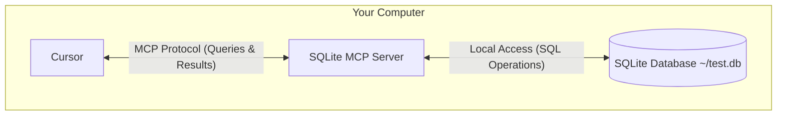

# Developing MCP Servers and Clients with the MCP Python SDK

After understanding the basics of MCP, we will now demonstrate how to use the MCP protocol through a simple example.

## How to Use MCP in Cursor

Here, we will connect Cursor (which already supports the MCP protocol) to a local SQLite database using the MCP protocol, perform queries, and conduct security analysis. The entire process is illustrated below:



The communication between the SQLite MCP server and the local SQLite database occurs entirely on your computer. The MCP protocol ensures that Cursor can only perform approved database operations through well-defined interfaces. This provides a secure way for Cursor to analyze and interact with your local data while maintaining full control over what it can access.

### Prerequisites

Before starting, ensure your system has the following components installed:

- macOS or Windows OS
- Latest version of Claude Desktop
- uv 0.4.18 or higher (check with `uv --version`)
- Git (`git --version`)
- SQLite (`sqlite3 --version`)

For macOS users, these components can be installed using [Homebrew](https://brew.sh/):

```bash
# Using Homebrew
brew install uv git sqlite3

# Or download directly:
# uv: https://docs.astral.sh/uv/
# Git: https://git-scm.com
# SQLite: https://www.sqlite.org/download.html
```

For Windows users, use [winget](https://docs.microsoft.com/en-us/windows/package-manager/winget/):

```bash
# Using winget
winget install --id=astral-sh.uv -e
winget install git.git sqlite.sqlite

# Or download directly:
# uv: https://docs.astral.sh/uv/
# Git: https://git-scm.com
# SQLite: https://www.sqlite.org/download.html
```

We will use macOS as an example; Windows users can refer to the macOS installation steps.

### Creating an SQLite Database

First, let's create a simple SQLite database and insert some data:

```bash
# Create a new SQLite database
sqlite3 ~/test.db <<EOF
CREATE TABLE products (
  id INTEGER PRIMARY KEY,
  name TEXT,
  price REAL
);

INSERT INTO products (name, price) VALUES
  ('Widget', 19.99),
  ('Gadget', 29.99),
  ('Gizmo', 39.99),
  ('Smart Watch', 199.99),
  ('Wireless Earbuds', 89.99),
  ('Portable Charger', 24.99),
  ('Bluetooth Speaker', 79.99),
  ('Phone Stand', 15.99),
  ('Laptop Sleeve', 34.99),
  ('Mini Drone', 299.99),
  ('LED Desk Lamp', 45.99),
  ('Keyboard', 129.99),
  ('Mouse Pad', 12.99),
  ('USB Hub', 49.99),
  ('Webcam', 69.99),
  ('Screen Protector', 9.99),
  ('Travel Adapter', 27.99),
  ('Gaming Headset', 159.99),
  ('Fitness Tracker', 119.99),
  ('Portable SSD', 179.99);
EOF
```

Next, download the latest [Cursor](https://www.cursor.com/cn/downloads) and install it. Open the Cursor Settings page, switch to the MCP tab, and click the **+ Add new global MCP server** button.


You will be redirected to a global MCP configuration file in JSON format, where you can define all MCP servers. Add an MCP server named `mcp-server-sqlite` as shown below:

```json
{
  "mcpServers": {
    "sqlite": {
      "command": "uvx",
      "args": ["mcp-server-sqlite", "--db-path", "/Users/YOUR_USERNAME/test.db"]
    }
  }
}
```

Replace `YOUR_USERNAME` with your actual username. The configuration above defines an MCP server named `sqlite`, specifying the `uvx` command to start the server and the database path as `/Users/YOUR_USERNAME/test.db` in the `args` parameter.

> You can also create a `.cursor/mcp.json` file in the root directory of a specific project to configure MCP servers for that project, allowing different MCP servers to be used across projects.

After saving the configuration, return to the MCP settings page in Cursor. Shortly, you should see the `sqlite` MCP server listed.


All tools provided by this MCP server will be listed, and you can now use these tools directly in Cursor.

### Testing

Now, let's test the MCP server in Cursor. For example, send the following prompt to Cursor (using Agent mode):

```bash
Can you connect to my SQLite database and tell me what products are available and their prices?
```

Cursor will then query the SQLite database based on your prompt. It will first use the `list-tables` MCP tool to check which tables exist in the database, then call the `describe_table` tool to view the table structure.


Next, it will query the database to retrieve products and their prices, even providing additional statistical information via the `read_query` tool.


### Analysis

You might still have questions: Why can we query the database just by adding an SQLite MCP server in Cursor? What exactly happens behind the scenes?

The interaction flow between MCP and Cursor is as follows:

1. **Server Discovery**: Cursor connects to the configured MCP server upon startup.
2. **Protocol Handshake**: When you request data, Cursor:
   1. Determines (via LLM) which MCP server can help (in this case, `sqlite`).
   2. Negotiates capabilities through the protocol.
   3. Requests data or operations from the MCP server.
3. **Interaction Flow**:

   ```mermaid
   sequenceDiagram
      participant C as Cursor
      participant M as MCP Server
      participant D as SQLite Database

      C->>M: Initialize connection
      M-->>C: Return available capabilities

      C->>M: Query request
      M->>D: SQL query
      D-->>M: Return results
      M-->>C: Format results
   ```

4. **Security**:
   - The MCP server only exposes specific, controlled functionalities.
   - The MCP server runs on your local machine, and its accessed resources are not exposed to the internet.
   - Cursor requires user confirmation for sensitive operations.

You might wonder about the MCP server—we didn't write any code for it. This is because Cursor has built-in implementations of several MCP servers, including one for SQLite. We only need to configure the database path. You can view the [list of built-in MCP servers](https://github.com/modelcontextprotocol/servers/tree/main/src) in the official repository.


The SQLite MCP server provides database interaction and intelligent business capabilities, supporting SQL queries and business data analysis. If you have custom business needs, you can refer to these built-in implementations to create your own MCP server.

## Developing an MCP Server

After understanding the basics of MCP, let's demonstrate how to develop an MCP server through a simple example.

We will use the [MCP Python SDK](https://github.com/modelcontextprotocol/python-sdk) to create a weather server that provides current weather data as a resource and allows Cursor to fetch weather forecasts using tools.

We'll use the [OpenWeatherMap API](https://openweathermap.org/api) to fetch weather data. Register and obtain a free API key from the [API keys](https://home.openweathermap.org/api_keys) page.

### Environment Setup

We'll use [uv](https://docs.astral.sh/uv/) to manage the Python environment.

First, initialize a uv-managed project with the following command:

```bash
uv init mcp-server-weather --python 3.13 # Specify the version
cd mcp-server-weather
```

Then install the MCP Python SDK dependencies:

```bash
uv add "mcp[cli]"
```

Now, you can run the `mcp` development tool command:

```bash
$ uv run mcp

 Usage: mcp [OPTIONS] COMMAND [ARGS]...

 MCP development tools


╭─ Options ────────────────────────────────────────────────────────────────────────────────────────────────────────────────────────────────────────────────────────╮
│ --help          Show this message and exit.                                                                                                                      │
╰──────────────────────────────────────────────────────────────────────────────────────────────────────────────────────────────────────────────────────────────────╯
╭─ Commands ───────────────────────────────────────────────────────────────────────────────────────────────────────────────────────────────────────────────────────╮
│ version   Show the MCP version.                                                                                                                                  │
│ dev       Run a MCP server with the MCP Inspector.                                                                                                               │
│ run       Run a MCP server.                                                                                                                                      │
│ install   Install a MCP server in the Claude desktop app.                                                                                                        │
╰──────────────────────────────────────────────────────────────────────────────────────────────────────────────────────────────────────────────────────────────────╯
```

### Implementing the MCP Server

Next, let's implement our MCP server.

Create a weather MCP server in the `main.py` file as shown below:

```python
"""
MCP Weather Server

A weather MCP server based on the OpenWeatherMap API
Provides functionality to fetch current weather and forecasts
"""

import os
from typing import Dict, Any, List
from datetime import datetime
import requests
from dotenv import load_dotenv

from mcp.server.fastmcp import FastMCP

# Load environment variables
load_dotenv()

# Create MCP server
mcp = FastMCP("Weather")

# OpenWeatherMap API configuration
OPENWEATHER_API_KEY = os.getenv("OPENWEATHER_API_KEY")
if not OPENWEATHER_API_KEY:
    print("Warning: OPENWEATHER_API_KEY environment variable not found")
    print("Set your OpenWeatherMap API key in the .env file")

OPENWEATHER_BASE_URL = "https://api.openweathermap.org/data/2.5"

def format_temperature(temp_kelvin: float) -> str:
    """Format temperature display (Kelvin to Celsius)"""
    celsius = temp_kelvin - 273.15
    fahrenheit = celsius * 9/5 + 32
    return f"{celsius:.1f}°C ({fahrenheit:.1f}°F)"

def format_weather_info(weather_data: Dict[str, Any]) -> str:
    """Format weather information into a readable string"""
    main = weather_data.get("main", {})
    weather = weather_data.get("weather", [{}])[0]
    wind = weather_data.get("wind", {})
    clouds = weather_data.get("clouds", {})

    location = weather_data.get("name", "Unknown location")
    country = weather_data.get("sys", {}).get("country", "")
    if country:
        location += f", {country}"

    # Basic weather info
    description = weather.get("description", "").title()
    temp = format_temperature(main.get("temp", 0))
    feels_like = format_temperature(main.get("feels_like", 0))

    # Detailed info
    humidity = main.get("humidity", 0)
    pressure = main.get("pressure", 0)
    wind_speed = wind.get("speed", 0)
    wind_deg = wind.get("deg", 0)
    cloudiness = clouds.get("all", 0)

    # Visibility (convert meters to km)
    visibility = weather_data.get("visibility", 0) / 1000

    result = f"""🌍 **{location}**

🌤️ **Current Weather**: {description}
🌡️ **Temperature**: {temp}
🤒 **Feels Like**: {feels_like}
💧 **Humidity**: {humidity}%
🌪️ **Pressure**: {pressure} hPa
💨 **Wind Speed**: {wind_speed} m/s
🧭 **Wind Direction**: {wind_deg}°
☁️ **Cloudiness**: {cloudiness}%
👁️ **Visibility**: {visibility:.1f} km"""

    # Add sunrise/sunset times if available
    sys_info = weather_data.get("sys", {})
    if "sunrise" in sys_info and "sunset" in sys_info:
        sunrise = datetime.fromtimestamp(sys_info["sunrise"]).strftime("%H:%M")
        sunset = datetime.fromtimestamp(sys_info["sunset"]).strftime("%H:%M")
        result += f"
🌅 **Sunrise**: {sunrise}"
        result += f"
🌇 **Sunset**: {sunset}"

    return result

def format_forecast_info(forecast_data: Dict[str, Any]) -> str:
    """Format forecast information"""
    city = forecast_data.get("city", {})
    location = city.get("name", "Unknown location")
    country = city.get("country", "")
    if country:
        location += f", {country}"

    forecasts = forecast_data.get("list", [])

    result = f"📅 **{location} - 5-Day Weather Forecast**

"

    # Group forecasts by date
    daily_forecasts: Dict[str, List[Dict[str, Any]]] = {}
    for forecast in forecasts:
        dt = datetime.fromtimestamp(forecast["dt"])
        date_key = dt.strftime("%Y-%m-%d")

        if date_key not in daily_forecasts:
            daily_forecasts[date_key] = []
        daily_forecasts[date_key].append(forecast)

    # Display daily forecasts
    for date_key, day_forecasts in list(daily_forecasts.items())[:5]:  # Show only 5 days
        date_obj = datetime.strptime(date_key, "%Y-%m-%d")
        date_str = date_obj.strftime("%m/%d (%A)")

        result += f"**{date_str}**
"

        # Get daily temperature range
        temps = [f["main"]["temp"] for f in day_forecasts]
        min_temp = format_temperature(min(temps))
        max_temp = format_temperature(max(temps))

        # Get most frequent weather description
        descriptions = [f["weather"][0]["description"] for f in day_forecasts]
        main_desc = max(set(descriptions), key=descriptions.count).title()

        # Calculate average humidity and wind speed
        avg_humidity = sum(f["main"]["humidity"] for f in day_forecasts) / len(day_forecasts)
        avg_wind_speed = sum(f["wind"]["speed"] for f in day_forecasts) / len(day_forecasts)

        result += f"  🌤️ {main_desc}
"
        result += f"  🌡️ {min_temp} - {max_temp}
"
        result += f"  💧 Humidity: {avg_humidity:.0f}%
"
        result += f"  💨 Wind Speed: {avg_wind_speed:.1f} m/s

"

    return result

@mcp.tool()
def get_current_weather(city: str) -> str:
    """
    Fetch current weather information for a specified city

    Args:
        city: City name (English or Chinese)

    Returns:
        Formatted current weather information
    """
    if not OPENWEATHER_API_KEY:
        return "❌ Error: OpenWeatherMap API key not configured. Set the OPENWEATHER_API_KEY environment variable."

    print(f"Fetching current weather for {city}...")

    try:
        response = requests.get(
            f"{OPENWEATHER_BASE_URL}/weather",
            params={
                "q": city,
                "appid": OPENWEATHER_API_KEY,
                "lang": "zh_cn"
            },
            timeout=10
        )

        if response.status_code == 404:
            return f"❌ Error: City '{city}' not found. Check the city name."
        elif response.status_code == 401:
            return "❌ Error: Invalid API key. Check OPENWEATHER_API_KEY configuration."
        elif response.status_code != 200:
            return f"❌ Error: API request failed (status code: {response.status_code})"

        weather_data = response.json()
        return format_weather_info(weather_data)

    except requests.RequestException as e:
        return f"❌ Network error: {str(e)}"
    except Exception as e:
        return f"❌ Unknown error: {str(e)}"

@mcp.tool()
def get_weather_forecast(city: str, days: int = 5) -> str:
    """
    Fetch weather forecast for a specified city

    Args:
        city: City name (English or Chinese)
        days: Forecast days (1-5 days, default 5 days)

    Returns:
        Formatted weather forecast information
    """
    if not OPENWEATHER_API_KEY:
        return "❌ Error: OpenWeatherMap API key not configured. Set the OPENWEATHER_API_KEY environment variable."

    if days < 1 or days > 5:
        return "❌ Error: Forecast days must be between 1-5 days."

    print(f"Fetching {days}-day weather forecast for {city}...")

    try:
        response = requests.get(
            f"{OPENWEATHER_BASE_URL}/forecast",
            params={
                "q": city,
                "appid": OPENWEATHER_API_KEY,
                "lang": "zh_cn"
            },
            timeout=10
        )

        if response.status_code == 404:
            return f"❌ Error: City '{city}' not found. Check the city name."
        elif response.status_code == 401:
            return "❌ Error: Invalid API key. Check OPENWEATHER_API_KEY configuration."
        elif response.status_code != 200:
            return f"❌ Error: API request failed (status code: {response.status_code})"

        forecast_data = response.json()
        return format_forecast_info(forecast_data)

    except requests.RequestException as e:
        return f"❌ Network error: {str(e)}"
    except Exception as e:
        return f"❌ Unknown error: {str(e)}"

@mcp.resource("weather://current/{city}")
def get_current_weather_resource(city: str) -> str:
    """Fetch current weather resource for a specified city"""
    return f"Current weather information resource: {city}"

@mcp.resource("weather://forecast/{city}")
def get_forecast_resource(city: str) -> str:
    """Fetch weather forecast resource for a specified city"""
    return f"Weather forecast resource: {city}"

@mcp.resource("weather://api-status")
def get_api_status() -> str:
    """Fetch API status information"""
    if OPENWEATHER_API_KEY:
        return "✅ OpenWeatherMap API key configured"
    else:
        return "❌ OpenWeatherMap API key not configured"

def main():
    """Run the MCP server"""
    print("🌤️ Starting Weather MCP Server...")
    print("📍 Supported functionalities:")
    print("  - Fetch current weather (get_current_weather)")
    print("  - Fetch weather forecast (get_weather_forecast)")
    print()

    if not OPENWEATHER_API_KEY:
        print("⚠️ Warning: OpenWeatherMap API key not configured")
        print("Create a .env file and add the following:")
        print("OPENWEATHER_API_KEY=your_api_key_here")
        print()
        print("Get API key: https://openweathermap.org/api")
        print()

    mcp.run()

if __name__ == "__main__":
    main()
```

The code above is quite simple. Most of it involves requesting weather data from the OpenWeatherMap API and formatting it as needed. The core code consists of two tool functions decorated with `@mcp.tool()`, corresponding to fetching current weather and weather forecasts respectively.

```python
@mcp.tool()
def get_current_weather(city: str) -> str:

@mcp.tool()
def get_weather_forecast(city: str, days: int = 5) -> str:
```

Here, we use the `tool` method of the `mcp` object to decorate these two functions. This wrapper returns an MCP tool object containing the tool's name, description, parameters, and return value. The `mcp` object is created using the `FastMCP` class, an implementation of an MCP server that provides convenient methods for creating MCP servers.

```python
from mcp.server.fastmcp import FastMCP

# Create MCP server
mcp = FastMCP("Weather")
```

Besides tools, if you want to provide resources, you can use the `resource` method of the `mcp` object to decorate a resource function:

```python
@mcp.resource("weather://current/{city}")
def get_current_weather_resource(city: str) -> str:
    """Fetch current weather resource for a specified city"""
    return f"Current weather information resource: {city}"
```

Then, create a `.env` file in the project root directory and add the following environment variable:

```bash
OPENWEATHER_API_KEY=your_api_key_here
```

### Debugging the MCP Server

You can debug the MCP server using the following command:

```bash
$ mcp dev main.py
Starting MCP inspector...
⚙️ Proxy server listening on port 6277
New connection
# ......
Stdio transport: command=/opt/homebrew/bin/uv, args=run,--with,mcp,mcp,run,main.py
Spawned stdio transport
Connected MCP client to backing server transport
Created web app transport
Set up MCP proxy
🔍 MCP Inspector is up and running at http://127.0.0.1:6274 🚀
New connection
```

This command starts an MCP Inspector, accessible via `http://127.0.0.1:6274` in your browser. Click the `Connect` button on the left to connect to the current MCP server. Switch to the `Tools` tab and click `List Tools` to see all tools provided by the server.


The current MCP server provides two tools: `get_current_weather` and `get_weather_forecast`. You can click on a tool, enter parameters, and click `Run Tool` to see the result.


### Testing in Cursor

Once testing in the MCP Inspector is successful, install the MCP server in Cursor to use it.

In Cursor settings, go to the `MCP` tab, click `+ Add new global MCP server`, and add the following configuration to the `mcp.json` file:

```json
{
  "mcpServers": {
    "weather": {
      "command": "uv",
      "args": ["--directory", "/Users/cnych/your-mcp-path", "run", "main.py"],
      "env": {
        "OPENWEATHER_API_KEY": "xxxxx"
      }
    }
  }
}
```

After saving, you should see the MCP server and its two tools in Cursor.


You can then ask weather-related questions in Cursor Agent mode.

  


When asking about today's weather, Cursor will call the `get_current_weather` tool. When asking about future weather, it will call the `get_weather_forecast` tool.

Finally, you can package this weather MCP server and publish it to PyPI, allowing other users to install it directly.

This MCP server is a typical stdio-type server, interacting with clients via standard input/output. It can also interact via SSE and Streamable HTTP.

## Developing an MCP Client

We have implemented a simple MCP server and tested it in Cursor. But what if we want to use this server elsewhere? This requires implementing an MCP client.

The MCP Python SDK provides a high-level client interface for connecting to MCP servers in various ways:

```python
from mcp import ClientSession, StdioServerParameters, types
from mcp.client.stdio import stdio_client

# Create stdio-type MCP server parameters
server_params = StdioServerParameters(
    command="python",  # Executable file
    args=["example_server.py"],  # Optional command-line arguments
    env=None,  # Optional environment variables
)

async def run():
    async with stdio_client(server_params) as (read, write):  # Create an stdio-type client
        async with ClientSession(read, write) as session:  # Create a client session
            # Initialize connection
            await session.initialize()

            # List available prompts
            prompts = await session.list_prompts()

            # Get a prompt
            prompt = await session.get_prompt(
                "example-prompt", arguments={"arg1": "value"}
            )

            # List available resources
            resources = await session.list_resources()

            # List available tools
            tools = await session.list_tools()

            # Read a resource
            content, mime_type = await session.read_resource("file://some/path")

            # Call a tool
            result = await session.call_tool("tool-name", arguments={"arg1": "value"})

if __name__ == "__main__":
    import asyncio

    asyncio.run(run())
```

The code above creates an stdio-type MCP client, uses the `stdio_client` function to create a client session, and then uses the `ClientSession` class to manage the session. It initializes the connection, lists prompts, gets a prompt, lists resources, lists tools, reads a resource, and calls a tool—these are common MCP client methods.

However, in actual MCP clients or hosts, we typically integrate with an LLM for more intelligent interaction. For example, how would we implement an OpenAI-based MCP client? We can follow Cursor's approach:

- Configure MCP servers via a JSON configuration file.
- Read the configuration file to load the list of MCP servers.
- Get the list of available tools from the MCP servers.
- Pass the user's input and the list of tools to the LLM (if the LLM doesn't support tool calls, instruct it how to call these tools in the system prompt).
- Based on the LLM's response, call the tools provided by the MCP servers.
- Send the tool results back to the LLM to get a response that better matches the user's intent.

This flow is more aligned with real-world interaction. Below is an example of a simple OpenAI-based MCP client:

```python
#!/usr/bin/env python
"""
MyMCP Client - Using OpenAI Native Tool Calls
"""

import asyncio
import json
import os
import sys
from typing import Dict, List, Any, Optional
from dataclasses import dataclass

from openai import AsyncOpenAI
from mcp import StdioServerParameters
from mcp.client.stdio import stdio_client
from mcp.client.session import ClientSession
from mcp.types import Tool, TextContent
from rich.console import Console
from rich.prompt import Prompt
from rich.panel import Panel
from rich.markdown import Markdown
from rich.table import Table
from rich.spinner import Spinner
from rich.live import Live
from dotenv import load_dotenv

# Load environment variables
load_dotenv()

# Initialize Rich console
console = Console()

@dataclass
class MCPServerConfig:
    """MCP Server Configuration"""
    name: str
    command: str
    args: List[str]
    description: str
    env: Optional[Dict[str, str]] = None

class MyMCPClient:
    """MyMCP Client"""

    def __init__(self, config_path: str = "mcp.json"):
        self.config_path = config_path
        self.servers: Dict[str, MCPServerConfig] = {}
        self.all_tools: List[tuple[str, Any]] = []  # (server_name, tool)
        self.openai_client = AsyncOpenAI(
            api_key=os.getenv("OPENAI_API_KEY")
        )

    def load_config(self):
        """Load MCP server configuration from file"""
        try:
            with open(self.config_path, 'r', encoding='utf-8') as f:
                config = json.load(f)

            for name, server_config in config.get("mcpServers", {}).items():
                env_dict = server_config.get("env", {})
                self.servers[name] = MCPServerConfig(
                    name=name,
                    command=server_config["command"],
                    args=server_config.get("args", []),
                    description=server_config.get("description", ""),
                    env=env_dict if env_dict else None
                )

            console.print(f"[green]✓ Loaded {len(self.servers)} MCP server configurations[/green]")
        except Exception as e:
            console.print(f"[red]✗ Failed to load configuration file: {e}[/red]")
            sys.exit(1)

    async def get_tools_from_server(self, name: str, config: MCPServerConfig) -> List[Tool]:
        """Fetch list of tools from a single server"""
        try:
            console.print(f"[blue]→ Connecting to server: {name}[/blue]")

            # Prepare environment variables
            env = os.environ.copy()
            if config.env:
                env.update(config.env)

            # Create server parameters
            server_params = StdioServerParameters(
                command=config.command,
                args=config.args,
                env=env
            )

            # Use async with context manager (nested)
            async with stdio_client(server_params) as (read, write):
                async with ClientSession(read, write) as session:
                    await session.initialize()

                    # Fetch list of tools
                    tools_result = await session.list_tools()
                    tools = tools_result.tools

                    console.print(f"[green]✓ {name}: {len(tools)} tools[/green]")
                    return tools

        except Exception as e:
            console.print(f"[red]✗ Failed to connect to server {name}: {e}[/red]")
            console.print(f"[red]  Error type: {type(e).__name__}[/red]")
            import traceback
            console.print(f"[red]  Detailed error: {traceback.format_exc()}[/red]")
            return []

    async def load_all_tools(self):
        """Load tools from all servers"""
        console.print("
[blue]→ Fetching list of available tools...[/blue]")

        for name, config in self.servers.items():
            tools = await self.get_tools_from_server(name, config)
            for tool in tools:
                self.all_tools.append((name, tool))

    def display_tools(self):
        """Display all available tools"""
        table = Table(title="Available MCP Tools", show_header=True)
        table.add_column("Server", style="cyan")
        table.add_column("Tool Name", style="green")
        table.add_column("Description", style="white")

        # Group by server
        current_server = None
        for server_name, tool in self.all_tools:
            # Display server name only when it changes
            display_server = server_name if server_name != current_server else ""
            current_server = server_name

            table.add_row(
                display_server,
                tool.name,
                tool.description or "No description"
            )
        console.print(table)

    def build_openai_tools(self) -> List[Dict[str, Any]]:
        """Build tool definitions in OpenAI tools format"""
        openai_tools = []

        for server_name, tool in self.all_tools:
            # Build OpenAI function format
            function_def = {
                "type": "function",
                "function": {
                    "name": f"{server_name}_{tool.name}",  # Add server prefix to avoid conflicts
                    "description": f"[{server_name}] {tool.description or 'No description'}",
                    "parameters": tool.inputSchema or {"type": "object", "properties": {}}
                }
            }
            openai_tools.append(function_def)

        return openai_tools

    def parse_tool_name(self, function_name: str) -> tuple[str, str]:
        """Parse tool name to extract server and tool names"""
        # Format: server_name_tool_name
        parts = function_name.split('_', 1)
        if len(parts) == 2:
            return parts[0], parts[1]
        else:
            # If no underscore, assume it's a tool from the first server
            if self.all_tools:
                return self.all_tools[0][0], function_name
            return "unknown", function_name

    async def call_tool(self, server_name: str, tool_name: str, arguments: Dict[str, Any]) -> Any:
        """Call the specified tool"""
        config = self.servers.get(server_name)
        if not config:
            raise ValueError(f"Server {server_name} does not exist")

        try:
            # Prepare environment variables
            env = os.environ.copy()
            if config.env:
                env.update(config.env)

            # Create server parameters
            server_params = StdioServerParameters(
                command=config.command,
                args=config.args,
                env=env
            )

            # Use async with context manager (nested)
            async with stdio_client(server_params) as (read, write):
                async with ClientSession(read, write) as session:
                    await session.initialize()

                    # Call tool
                    result = await session.call_tool(tool_name, arguments)
                    return result

        except Exception as e:
            console.print(f"[red]✗ Failed to call tool {tool_name}: {e}[/red]")
            raise

    def extract_text_content(self, content_list: List[Any]) -> str:
        """Extract text content from MCP response"""
        text_parts: List[str] = []
        for content in content_list:
            if isinstance(content, TextContent):
                text_parts.append(content.text)
            elif hasattr(content, 'text'):
                text_parts.append(str(content.text))
            else:
                # Handle other content types
                text_parts.append(str(content))
        return "
".join(text_parts) if text_parts else "✅ Operation completed, but no text content returned"

    async def process_user_input(self, user_input: str) -> str:
        """Process user input and return final response"""

        # Build tool definitions
        openai_tools = self.build_openai_tools()

        try:
            # First call - let LLM decide if tools are needed
            messages = [
                {"role": "system", "content": "You are an intelligent assistant that can use various MCP tools to help users. If no tools are needed, respond directly."},
                {"role": "user", "content": user_input}
            ]

            # Call OpenAI API
            kwargs = {
                "model": "deepseek-chat",
                "messages": messages,
                "temperature": 0.7
            }

            # Add tools parameter only if tools are available
            if openai_tools:
                kwargs["tools"] = openai_tools
                kwargs["tool_choice"] = "auto"

            # Use loading effect
            with Live(Spinner("dots", text="[blue]Thinking...[/blue]"), console=console, refresh_per_second=10):
                response = await self.openai_client.chat.completions.create(**kwargs)  # type: ignore
            message = response.choices[0].message

            # Check for tool calls
            if hasattr(message, 'tool_calls') and message.tool_calls:  # type: ignore
                # Add assistant message to history
                messages.append({  # type: ignore
                    "role": "assistant",
                    "content": message.content,
                    "tool_calls": [
                        {
                            "id": tc.id,
                            "type": "function",
                            "function": {
                                "name": tc.function.name,
                                "arguments": tc.function.arguments
                            }
                        } for tc in message.tool_calls  # type: ignore
                    ]
                })

                # Execute each tool call
                for tool_call in message.tool_calls:
                    function_name = tool_call.function.name  # type: ignore
                    arguments = json.loads(tool_call.function.arguments)  # type: ignore

                    # Parse server and tool names
                    server_name, tool_name = self.parse_tool_name(function_name)  # type: ignore

                    try:
                        # Use loading effect to call tool
                        with Live(Spinner("dots", text=f"[cyan]Calling {server_name}.{tool_name}...[/cyan]"), console=console, refresh_per_second=10):
                            result = await self.call_tool(server_name, tool_name, arguments)

                        # Extract text content from MCP response
                        result_content = self.extract_text_content(result.content)
                        # Add tool call result
                        messages.append({
                            "role": "tool",
                            "tool_call_id": tool_call.id,
                            "content": result_content
                        })
                        console.print(f"[green]✓ {server_name}.{tool_name} called successfully[/green]")

                    except Exception as e:
                        # Add error message
                        messages.append({
                            "role": "tool",
                            "tool_call_id": tool_call.id,
                            "content": f"Error: {str(e)}"
                        })
                        console.print(f"[red]✗ Failed to call {server_name}.{tool_name}: {e}[/red]")

                # Get final response
                with Live(Spinner("dots", text="[blue]Generating final response...[/blue]"), console=console, refresh_per_second=10):
                    final_response = await self.openai_client.chat.completions.create(
                        model="deepseek-chat",
                        messages=messages,  # type: ignore
                        temperature=0.7
                    )

                final_content = final_response.choices[0].message.content
                return final_content or "Sorry, I couldn't generate a final answer."

            else:
                # No tool calls, return response directly
                return message.content or "Sorry, I couldn't generate an answer."

        except Exception as e:
            console.print(f"[red]✗ Error processing request: {e}[/red]")
            return f"Sorry, an error occurred while processing your request: {str(e)}"

    async def interactive_loop(self):
        """Interactive loop"""
        console.print(Panel.fit(
            "[bold cyan]MyMCP Client Started[/bold cyan]
"
            "Enter your questions, and I'll use available MCP tools to help.
"
            "Type 'tools' to see available tools
"
            "Type 'exit' or 'quit' to exit.",
            title="Welcome to MCP Client"
        ))

        while True:
            try:
                # Get user input
                user_input = Prompt.ask("
[bold green]You[/bold green]")

                if user_input.lower() in ['exit', 'quit', 'q']:
                    console.print("
[yellow]Goodbye![/yellow]")
                    break

                if user_input.lower() == 'tools':
                    self.display_tools()
                    continue

                # Process user input
                response = await self.process_user_input(user_input)

                # Display response
                console.print("
[bold blue]Assistant[/bold blue]:")
                console.print(Panel(Markdown(response), border_style="blue"))

            except KeyboardInterrupt:
                console.print("
[yellow]Interrupted[/yellow]")
                break
            except Exception as e:
                console.print(f"
[red]Error: {e}[/red]")

    async def run(self):
        """Run the client"""
        # Load configuration
        self.load_config()

        if not self.servers:
            console.print("[red]✗ No configured servers[/red]")
            return

        # Get all tools
        await self.load_all_tools()

        if not self.all_tools:
            console.print("[red]✗ No available tools[/red]")
            return

        # Display available tools
        self.display_tools()

        # Enter interactive loop
        await self.interactive_loop()

async def main():
    """Main function"""
    # Check OpenAI API Key
    if not os.getenv("OPENAI_API_KEY"):
        console.print("[red]✗ Please set the OPENAI_API_KEY environment variable[/red]")
        console.print("Hint: Create a .env file and add: OPENAI_API_KEY=your-api-key")
        sys.exit(1)

    # Create and run client
    client = MyMCPClient()
    await client.run()

if __name__ == "__main__":
    try:
        asyncio.run(main())
    except KeyboardInterrupt:
        console.print("
[yellow]Program exited[/yellow]")
    except Exception as e:
        console.print(f"
[red]Program error: {e}[/red]")
        sys.exit(1)
```

The code above first loads the `mcp.json` file, with a configuration format consistent with Cursor's, to fetch all self-configured MCP servers. For example, if we configure the `mcp.json` file as follows:

```json
{
  "mcpServers": {
    "weather": {
      "command": "uv",
      "args": ["--directory", ".", "run", "main.py"],
      "description": "Weather Information Server - Fetches current weather and forecasts",
      "env": {
        "OPENWEATHER_API_KEY": "xxxx"
      }
    },
    "filesystem": {
      "command": "npx",
      "args": ["-y", "@modelcontextprotocol/server-filesystem", "/tmp"],
      "description": "File System Operations Server - File read/write and directory management"
    }
  }
}
```

In the `run` method, we then call `load_all_tools` to load the list of all tools. The core implementation here involves calling the MCP server-side tool list:

```python
async def get_tools_from_server(self, name: str, config: MCPServerConfig) -> List[Tool]:
    """Fetch list of tools from a single server"""
    try:
        console.print(f"[blue]→ Connecting to server: {name}[/blue]")

        # Prepare environment variables
        env = os.environ.copy()
        if config.env:
            env.update(config.env)

        # Create server parameters
        server_params = StdioServerParameters(
            command=config.command,
            args=config.args,
            env=env
        )

        # Use async with context manager (nested)
        async with stdio_client(server_params) as (read, write):
            async with ClientSession(read, write) as session:
                await session.initialize()

                # Fetch list of tools
                tools_result = await session.list_tools()
                tools = tools_result.tools

                console.print(f"[green]✓ {name}: {len(tools)} tools[/green]")
                return tools

    except Exception as e:
        console.print(f"[red]✗ Failed to connect to server {name}: {e}[/red]")
        console.print(f"[red]  Error type: {type(e).__name__}[/red]")
        import traceback
        console.print(f"[red]  Detailed error: {traceback.format_exc()}[/red]")
        return []
```

The core here is to directly use the client interface provided by the MCP Python SDK to call the MCP server and fetch the list of tools.

Next is handling user input. First, we need to convert the fetched MCP tool list into a format that OpenAI's function tools can recognize. Then, send the user's input and the tools to OpenAI for processing. Based on the response, determine if a tool needs to be called. If so, call the MCP tool directly. Finally, combine the results and send them to OpenAI to get a more complete answer. This process is not complex, but many details can be optimized based on specific needs.

Now, let's test the results:

```bash
$ python simple_client.py
✓ Loaded 1 MCP server configuration

→ Fetching list of available tools...
→ Connecting to server: weather
[05/25/25 11:42:51] INFO     Processing request of type ListToolsRequest  server.py:551
✓ weather: 2 tools
                              Available MCP Tools
┏━━━━━━━━━┳━━━━━━━━━━━━━━━━━━━━━━┳━━━━━━━━━━━━━━━━━━━━━━━━━━━━━━━━━━━━━━┓
┃ Server  ┃ Tool Name            ┃ Description                          ┃
┡━━━━━━━━━╇━━━━━━━━━━━━━━━━━━━━━━╇━━━━━━━━━━━━━━━━━━━━━━━━━━━━━━━━━━━━━━┩
│ weather │ get_current_weather  │                                      │
│         │                      │ Fetch current weather for a city     │
│         │                      │                                      │
│         │                      │ Args:                                │
│         │                      │     city: City name (English)        │
│         │                      │                                      │
│         │                      │ Returns:                             │
│         │                      │     Formatted current weather info   │
│         │                      │                                      │
│         │ get_weather_forecast │                                      │
│         │                      │ Fetch weather forecast for a city    │
│         │                      │                                      │
│         │                      │ Args:                                │
│         │                      │     city: City name (English)        │
│         │                      │     days: Forecast days (1-5, default 5)│
│         │                      │                                      │
│         │                      │ Returns:                             │
│         │                      │     Formatted weather forecast info  │
│         │                      │                                      │
└─────────┴──────────────────────┴──────────────────────────────────────┘
╭────────────── Welcome to MCP Client ──────────────╮
│ MyMCP Client Started                              │
│ Enter your questions, and I'll use available MCP tools to help. │
│ Type 'tools' to see available tools               │
│ Type 'exit' or 'quit' to exit.                    │
╰─────────────────────────────────────────────────╯

You: Hello, who are you?
⠹ Thinking...

Assistant:
╭──────────────────────────────────────────────────────────────────────────────────────────────────────────────────────────────────────────╮
│ Hello! I'm an intelligent assistant who can help you with various tasks, like answering questions, checking the weather, providing suggestions, and more. Feel free to ask me anything! 😊 │
╰──────────────────────────────────────────────────────────────────────────────────────────────────────────────────────────────────────────╯

You: What's the weather like in Chengdu today? Is it suitable for wearing a skirt tomorrow?
⠧ Thinking...
⠴ Calling weather.get_current_weather...[05/25/25 11:44:03] INFO     Processing request of type CallToolRequest                                                        server.py:551
⠴ Calling weather.get_current_weather...
✓ weather.get_current_weather called successfully
⠸ Calling weather.get_weather_forecast...[05/25/25 11:44:04] INFO     Processing request of type CallToolRequest                                                        server.py:551
⠋ Calling weather.get_weather_forecast...
✓ weather.get_weather_forecast called successfully
⠧ Generating final response...

Assistant:
╭──────────────────────────────────────────────────────────────────────────────────────────────────────────────────────────────────────────╮
│ Chengdu is sunny today with a current temperature of 26.9°C, 44% humidity, and light wind, making it very suitable for outdoor activities.   │
│                                                                                                                                          │
│ Tomorrow's (May 25th) weather forecast:                                                                                                  │
│                                                                                                                                          │
│  • Weather: Cloudy                                                                                                                       │
│  • Temperature: 26.4°C - 29.3°C                                                                                                          │
│  • Wind: 3.1 m/s                                                                                                                         │
│  • Humidity: 41%                                                                                                                         │
│                                                                                                                                          │
│ Recommendation: Tomorrow's temperature is moderate with light wind, so wearing a skirt is perfectly fine. However, consider pairing it with a light jacket or sunscreen, as UV radiation can be strong even on cloudy days. If you plan to be outdoors for an extended period, an umbrella for sun/rain might be useful. │
╰──────────────────────────────────────────────────────────────────────────────────────────────────────────────────────────────────────────╯

You:
```

The output shows that it can correctly call the tools provided by our configured MCP server.

</rewritten_file>
