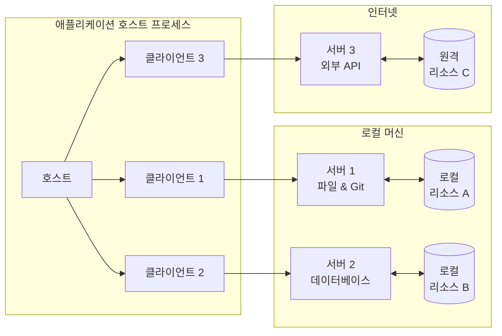

# MCP 아키텍처

MCP 프로토콜은 각 호스트가 여러 클라이언트 인스턴스를 실행할 수 있는 클라이언트-호스트-서버 아키텍처를 따릅니다. 이 아키텍처는 사용자가 명확한 보안 경계를 유지하고 문제를 격리하면서 애플리케이션 전반에 AI 기능을 통합할 수 있게 합니다. `JSON-RPC`를 기반으로 구축된 MCP는 클라이언트와 서버 간의 컨텍스트 교환 및 샘플링 조정에 중점을 둔 상태 유지 세션 프로토콜을 제공합니다.

## MCP 프로토콜 아키텍처

MCP는 클라이언트-서버 아키텍처를 따릅니다. MCP 프로토콜 아키텍처는 아래 다이어그램에 표시되어 있습니다:

여기서는 주로 세 가지 역할이 관여합니다: **호스트**, **서버**, 그리고 **클라이언트**.

- 호스트는 연결을 시작하는 LLM 애플리케이션(Claude Desktop 또는 IDE와 같은)입니다.
- 클라이언트는 호스트 애플리케이션 내에서 서버와 1:1 연결을 유지합니다.
- 서버는 클라이언트에게 컨텍스트, 도구 및 프롬프트를 제공합니다.

### 호스트

호스트 프로세스는 MCP 프로토콜의 중심 구성 요소로, 클라이언트 인스턴스의 수명 주기를 관리하고 클라이언트와 서버 간의 통신을 조정합니다. 호스트는 여러 클라이언트 인스턴스를 실행할 수 있으며, 각 인스턴스는 서로 다른 서버에 연결할 수 있습니다. 호스트는 JSON-RPC 프로토콜을 사용하여 클라이언트 및 서버와 통신합니다.

- 클라이언트 인스턴스의 수명 주기 관리
- 연결 권한 제어 및 보안 정책 실행
- AI/LLM 통합 조정
- 시스템 안정성 보장

### 서버

서버는 MCP 프로토콜의 리소스 저장 및 처리 센터로, 로컬 및 원격 리소스를 저장하고 관리하며 이를 클라이언트에 제공합니다. 서버는 여러 서버 인스턴스를 실행할 수 있으며, 각 인스턴스는 서로 다른 유형의 리소스를 처리할 수 있습니다. 서버는 JSON-RPC 프로토콜을 사용하여 호스트 및 클라이언트와 통신합니다.

- 특정 리소스 및 도구 노출
- 독립적으로 실행 및 관리
- 클라이언트를 통한 요청 처리
- 로컬 및 원격 서비스 지원

### 클라이언트

클라이언트는 호스트와 서버 간의 독립적인 연결을 유지하고 사용자 입력 및 출력을 처리하는 데 사용됩니다. 각 클라이언트는 서버와 1:1 관계를 유지하여 연결의 격리 및 보안을 보장합니다.

- 서버와 독립적인 연결 유지
- 상태 유지 세션 설정
- 프로토콜 협상 처리
- 메시지 라우팅 관리
