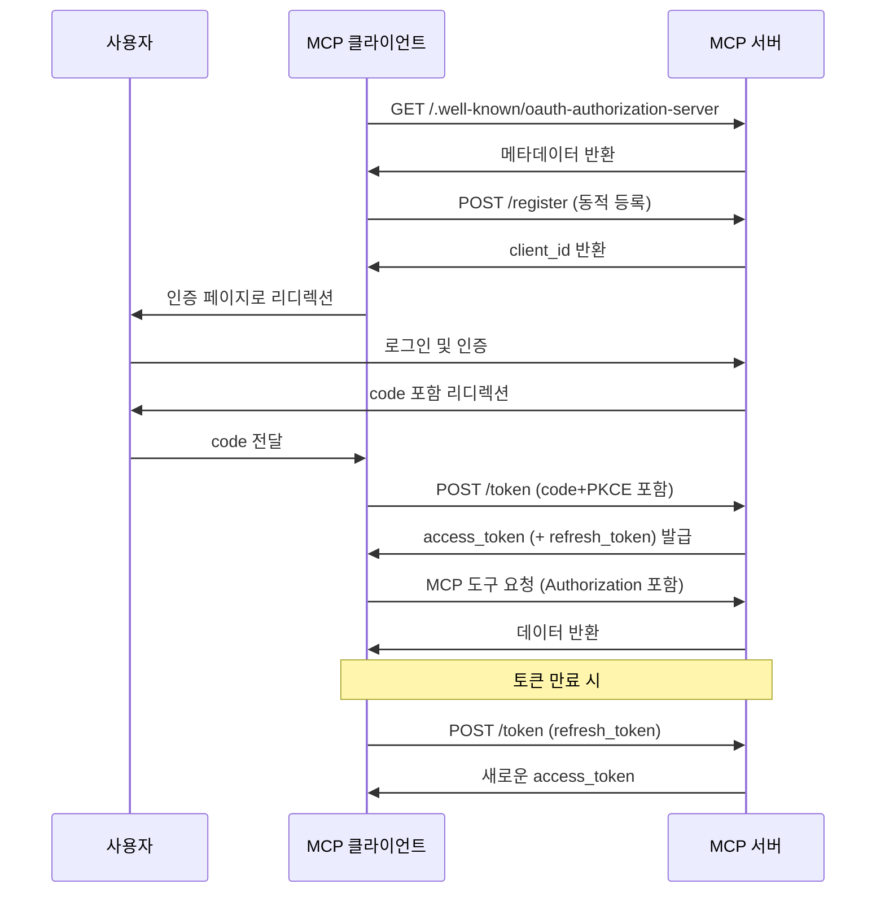

# MCP 인증 메커니즘 분석

2024년 11월 5일에 출시된 MCP 초기 버전에는 인증 기능이 포함되지 않았습니다. 2025년 3월 26일 업데이트에서 MCP 프로토콜은 OAuth 2.1 기반의 인증 메커니즘을 도입했습니다. 최신 MCP 초안에서는 커뮤니티가 HTTP, SSE, Streamable HTTP 등 다양한 전송 모드를 지원하는 이 인증 프로토콜을 더욱 개선했습니다. 인증 메커니즘을 통해 MCP 클라이언트는 사용자나 애플리케이션을 대신하여 제한된 MCP 도구와 리소스에 안전하게 접근할 수 있습니다.


## MCP 인증 규격

MCP 인증 규격은 MCP 서버(원격)와 MCP 클라이언트 간의 인증 절차를 정의합니다. OAuth는 인증 프레임워크로, 사용자가 어떻게 제3자 애플리케이션에게 자신의 리소스 접근을 허용할지 해결합니다. OAuth에 대한 자세한 내용은 [AuthWiki-OAuth](https://auth.wiki/ko/oauth-2.0)를 참조하세요.

MCP 클라이언트와 서버 시나리오에서 이는 "사용자가 MCP 클라이언트에게 MCP 서버의 리소스 접근을 허용"하는 것으로 나타납니다. 현재 "MCP 서버의 사용자 리소스"는 주로 MCP 서버가 제공하는 도구나 백엔드 서비스 리소스를 의미합니다.

OAuth 2.1 인증 절차를 구현하기 위해 프로토콜은 MCP 서버가 다음 엔드포인트를 제공하고 클라이언트와 협력하여 OAuth 2.1 절차를 완료할 것을 요구합니다:

- `/.well-known/oauth-authorization-server`: OAuth 서비스 메타데이터
- `/authorize`: 인증 요청 엔드포인트
- `/token`: 토큰 교환 및 갱신 엔드포인트
- `/register`: 클라이언트 동적 등록 엔드포인트

인증 절차는 다음과 같이 나타낼 수 있습니다:


규격은 또한 MCP 서버가 어떻게 제3자 인증 서버를 통해 위임 인증을 지원할지 명시합니다. 예시는 다음과 같습니다:


이 시나리오에서 MCP 서버가 인증을 제3자에게 위임하더라도, MCP 클라이언트에게는 여전히 인증 서버로 간주됩니다. 왜냐하면 자신의 접근 토큰을 발급해야 하기 때문입니다.

이 방식은 MCP 서버가 GitHub 저장소와 같은 제3자 리소스에 접근하는 시나리오에 더 적합하며, 자체 리소스 접근에는 적합하지 않습니다.

종합하면, 프로토콜은 MCP 서버를 OAuth 프레임워크 내에서 인증 서버와 리소스 서버의 이중 역할로 위치시킵니다.

이제 MCP 서버가 이러한 역할에서 어떤 책임을 지는지 살펴보겠습니다.

### 인증 서버로서의 MCP 서버

MCP 서버가 인증 서버 역할을 할 때, 최종 사용자는 MCP 서버에 신원을 가지고 있습니다. 서버는 이러한 사용자를 인증하고 리소스 접근을 위한 접근 토큰을 발급해야 합니다.

필수 인증 엔드포인트는 MCP 서버가 인증 서버 기능을 구현해야 함을 의미하며, 이는 개발자에게 다음과 같은 도전을 제기합니다:

- 많은 개발자가 OAuth 개념에 익숙하지 않음
- 인증 서버 구현에는 많은 보안 고려 사항이 포함됨

프로토콜은 MCP 서버가 이 기능을 직접 구현할 것을 요구하지 않습니다. 개발자는 이러한 엔드포인트를 제3자 인증 서버로 리디렉션하거나 프록시할 수 있습니다. MCP 클라이언트에게는 서버가 직접 인증을 처리하는 것과 차이가 없습니다.


이 방법이 앞서 언급한 제3자 인증 위임 방법을 사용해야 하는지 궁금할 수 있습니다.

이는 제3자 인증 서비스가 MCP 서버와 동일한 사용자 그룹을 공유하는지에 따라 달라집니다:

- 그렇다면, MCP 서버는 인증 관련 엔드포인트를 제3자 서비스로 전달할 수 있습니다.
- 그렇지 않다면, 프로토콜에 명시된 제3자 인증 위임 방법을 사용해야 하며, MCP 서버는 자신의 토큰과 제3자 토큰 간의 매핑을 유지해야 합니다.

위임 방식은 실제 시나리오에서 다소 모호합니다. 프로토콜은 위임 시에도 MCP 서버가 자신의 토큰을 발급해야 함을 요구하며, 이는 구현 복잡성을 증가시킵니다. 이는 토큰 유출/남용과 같은 보안 고려 사항 때문일 수 있습니다.

경험적으로, 위임 방식은 "사용자가 MCP 서버에게 제3자 서버의 리소스 접근을 허용"하는 시나리오에 가장 적합합니다. 예를 들어 MCP 서버가 코드 배포를 위해 사용자의 GitHub 저장소에 접근해야 할 때입니다. 이 경우 MCP 서버는 클라이언트의 인증 서버(자체 리소스에 대해)이자 GitHub의 클라이언트(제3자 리소스에 대해)입니다.

따라서 위임 프로토콜은 **MCP 서버가 어떻게 제3자 서버의 사용자 리소스에 접근할 권한을 얻을지** 해결합니다.

### 리소스 서버로서의 MCP 서버

리소스 서버로서 MCP 서버는 클라이언트 요청이 유효한 접근 토큰을 포함하는지 확인하고, scope을 통해 리소스 접근 권한을 검사해야 합니다.

MCP 정의에 따르면, 리소스는 MCP 클라이언트를 위한 도구여야 합니다. 그러나 실제로 이러한 도구는 종종 MCP 서버 백엔드 리소스와 상호 작용합니다. 이 경우 클라이언트에서 얻은 접근 토큰은 백엔드 접근에 재사용됩니다.

이러한 패턴에서 MCP 서버와 백엔드 리소스 서버는 일반적으로 동일한 개발자가 운영하며, 동일한 인증 서버에서 발급한 토큰을 공유합니다.

프로토콜이 이 모델을 지원하지만, 더 나은 실천 방법은 MCP 서버 리소스를 클라이언트를 위한 도구로 제한하고, 도구가 다른 서버(제1자 또는 제3자)에서 추가 리소스를 얻도록 하는 것입니다. 이는 모든 실제 시나리오를 포괄할 수 있습니다.

## 동적 클라이언트 등록

규격은 또한 인증 서버가 클라이언트를 어떻게 식별할지 정의합니다. OAuth 2.1의 동적 클라이언트 등록 프로토콜은 MCP 클라이언트가 OAuth 클라이언트 ID를 자동으로 얻을 수 있도록 합니다.

MCP 서버가 이 프로토콜을 지원하여 원활한 클라이언트 등록을 구현할 것을 권장하며, 그 이유는 다음과 같습니다:

- 클라이언트가 가능한 모든 서버를 미리 등록할 수 없음
- 수동 등록은 사용자 부담을 증가시킴
- 새로운 서버 연결 절차를 단순화함
- 서버가 등록 정책을 시행할 수 있음

그러나 실제로는 OAuth 클라이언트를 수동으로 관리하는 것이 더 나은 제어와 보안을 제공할 수 있습니다.

## MCP 인증 작업 흐름

MCP 서버 역할을 이해한 후, 인증 절차는 다음과 같습니다:



1.  MCP 클라이언트가 토큰 없이 MCP 서버에 접근합니다.
2.  서버가 요청을 거부합니다(401 Unauthorized).
3.  클라이언트가 `/.well-known/oauth-authorization-server`에서 메타데이터를 가져옵니다. 표준 응답은 다음과 같습니다:
    ```json
    {
      "issuer": "https://mcp.example.com",
      "authorization_endpoint": "https://mcp.example.com/authorize",
      "token_endpoint": "https://mcp.example.com/token",
      "registration_endpoint": "https://mcp.example.com/register",
      "scopes_supported": [
        "openid",
        "profile",
        "mcp:tool:read",
        "mcp:tool:write"
      ]
    }
    ```
    404 오류가 발생하면 클라이언트는 기본 경로(`/authorize`, `/token`, `/register`)로 되돌아갑니다.
4.  서버가 메타데이터를 반환합니다.
5.  클라이언트가 동적 등록을 수행합니다:
    - 요청:
      ```http
      POST /register
      Content-Type: application/json
      {
          "client_name": "my-mcp-client",
          "redirect_uris": ["https://myapp.com/callback"],
          "grant_types": ["authorization_code"],
          "token_endpoint_auth_method": "none"
      }
      ```
    - 응답:
      ```json
      {
        "client_id": "abc123",
        "client_secret": null,
        "redirect_uris": ["https://myapp.com/callback"]
      }
      ```
    - 클라이언트는 `client_id`를 안전하게 저장해야 합니다; 공개 클라이언트는 `client_secret`을 저장하지 않아야 합니다.
6.  MCP 서버가 클라이언트 ID와 자격 증명을 MCP 클라이언트에 반환합니다.
7.  중간자 공격을 방지하기 위해 MCP 클라이언트는 PKCE 절차를 시작하고 `code_verifier`와 `code_challenge` 등을 생성합니다.
8.  MCP 클라이언트가 사용자 에이전트를 시작하고 `code_challenge` 등의 정보와 함께 사용자를 인증 페이지로 안내합니다.
9.  사용자가 인증하면 MCP 서버는 미리 제공된 리디렉션 URI(요청 중 또는 클라이언트 등록 시)를 사용하여 사용자 에이전트를 MCP 클라이언트로 리디렉션하며, URI에 인증 코드를 포함합니다.
10. MCP 클라이언트는 MCP 서버의 token 엔드포인트에 접근 토큰(access_token 및 선택적 refresh_token)을 요청하며, 이전 단계에서 얻은 인증 코드와 `code_verifier`를 포함해야 합니다.
11. 클라이언트를 인증한 후, MCP 서버는 접근 토큰과 갱신 토큰을 반환합니다. `refresh_token`이 제공되면 클라이언트는 access_token이 만료된 후 자동으로 토큰을 갱신할 수 있습니다.

## 토큰 사용 및 보안

- **Authorization 헤더**: 모든 MCP HTTP 요청은 `Authorization: Bearer <access_token>`을 포함해야 합니다.
- **토큰 범위**: 토큰은 해당 scope이 허용하는 MCP 도구에만 접근할 수 있습니다.
- **토큰 갱신**: 401/403 오류 발생 시 자동으로 refresh_token을 사용하여 토큰을 갱신합니다.
- **토큰 저장 보안**: 토큰은 안전한 환경에만 저장해야 합니다. 브라우저 측 저장은 httpOnly 쿠키나 안전한 저장 메커니즘을 사용해야 합니다.
- **다중 세션/사용자**: 클라이언트는 남용을 방지하기 위해 다른 사용자/세션의 토큰을 구분해야 합니다.

## 일반적인 문제

- **토큰 유출 위험**: 토큰은 반드시 헤더에만 포함해야 하며 URL에는 절대 포함하지 않아야 합니다.
- **PKCE 구현 필수**: 인증 코드가 제3자에 의해 가로채지는 것을 방지합니다.
- **redirect_uri 검증**: 서버는 리디렉션 URI를 엄격히 검증하여 개방형 리디렉션 취약점을 방지해야 합니다.
- **최소 토큰 범위**: 위험을 줄이기 위해 필요한 권한만 요청/부여해야 합니다.
- **토큰 만료 처리**: 서비스 중단을 피하기 위해 클라이언트는 자동으로 토큰을 갱신하거나 재인증해야 합니다.
- **다중 MCP 서비스 호환성**: 클라이언트는 각 MCP 서비스에 대해 독립적으로 탐색, 등록, 인증 및 토큰 관리를 수행해야 합니다.
- **HTTPS 강제**: 모든 인증 트래픽은 중간자 공격을 방지하기 위해 암호화해야 합니다.
- **동적 등록 호환성**: 일부 MCP 서비스는 동적 등록을 지원하지 않을 수 있으며, `client_id`를 수동으로 구성해야 할 수 있습니다.

## 인증 실습 예제

이제 MCP Python SDK를 사용하여 Streamable HTTP 또는 SSE 전송 프로토콜로 OAuth 인증을 테스트해 보겠습니다. GitHub OAuth와 통합된 MCP 서버 예제를 구현하여 OAuth 인증 및 인증에 필요한 핵심 구성 요소를 보여드리겠습니다.

먼저 [https://github.com/settings/applications/new](https://github.com/settings/applications/new)에서 GitHub OAuth 앱을 생성합니다.


가장 중요한 것은 `Authorization callback URL` 필드로, `http://localhost:8000/github/callback`로 설정합니다. 이는 GitHub의 OAuth 콜백 요청을 처리하기 위해 해당 엔드포인트가 필요함을 의미합니다. 홈페이지 URL은 `http://localhost:8000`로 설정합니다. "Register application"을 클릭합니다.

생성 후 `Client ID`와 `Client Secret` 값을 저장해 둡니다.

다음으로 `uv`를 사용하여 새 프로젝트를 생성합니다:

```bash
uv init auth-mcp --python 3.13
cd auth-mcp
uv add mcp[cli]
```

그런 다음 루트 디렉터리에 `.env` 파일을 생성하고 GitHub의 `Client ID`와 `Client Secret` 값을 추가합니다:

```bash
MCP_GITHUB_CLIENT_ID=your_client_id
MCP_GITHUB_CLIENT_SECRET=your_client_secret
```

이제 `main.py`에서 GitHub OAuth Provider를 구현하여 기본 OAuth 기능을 처리합니다. SDK에서 제공하는 `OAuthAuthorizationServerProvider` 클래스를 직접 구현할 수 있으며, 여기에는 다음과 같은 OAuth 핵심 기능이 포함됩니다:

- 클라이언트 정보 가져오기
- 클라이언트 등록
- 인증
- 콜백 처리
- 토큰 갱신
- 토큰 검증
- 토큰 취소

자세한 코드는 다음과 같습니다:

```python
import os
import logging
import secrets
import time
from typing import Any
from dotenv import load_dotenv
from pydantic import AnyHttpUrl
from pydantic_settings import BaseSettings
from starlette.exceptions import HTTPException
from starlette.requests import Request
from starlette.responses import JSONResponse, RedirectResponse, Response

# MCP 인증 및 서버 모듈 임포트
from mcp.server.auth.middleware.auth_context import get_access_token
from mcp.server.auth.provider import (
    AccessToken,
    AuthorizationCode,
    AuthorizationParams,
    OAuthAuthorizationServerProvider,
    RefreshToken,
    construct_redirect_uri,
)
from mcp.server.auth.settings import AuthSettings, ClientRegistrationOptions
from mcp.server.fastmcp.server import FastMCP
from mcp.shared._httpx_utils import create_mcp_http_client
from mcp.shared.auth import OAuthClientInformationFull, OAuthToken


# 로거 설정
logger = logging.getLogger(__name__)

# 환경 변수 로드
load_dotenv()


class ServerSettings(BaseSettings):
    """GitHub MCP 서버 매개변수 구성을 위한 서버 설정 클래스."""
    # 기본 서버 설정
    host: str = "localhost"  # 서버 호스트 주소
    port: int = 8000  # 서버 포트
    server_url: AnyHttpUrl = AnyHttpUrl("http://localhost:8000")  # 서버 URL

    # GitHub OAuth 구성 - 환경 변수를 통해 제공해야 함
    github_client_id: str = os.getenv("MCP_GITHUB_CLIENT_ID", "")  # GitHub 클라이언트 ID
    github_client_secret: str = os.getenv("MCP_GITHUB_CLIENT_SECRET", "")  # GitHub 클라이언트 시크릿
    github_callback_path: str = "http://localhost:8000/github/callback"  # OAuth 콜백 경로

    # GitHub OAuth URL
    github_auth_url: str = "https://github.com/login/oauth/authorize"  # GitHub 인증 URL
    github_token_url: str = "https://github.com/login/oauth/access_token"  # GitHub 토큰 URL

    # OAuth 범위 설정
    mcp_scope: str = "user"  # MCP 범위
    github_scope: str = "read:user"  # GitHub 범위

    def __init__(self, **data):
        """환경 변수에서 구성을 로드하여 설정 초기화.

        참고: github_client_id 및 github_client_secret는 필수이지만
        환경 변수(MCP_GITHUB_GITHUB_CLIENT_ID 및
        MCP_GITHUB_GITHUB_CLIENT_SECRET)에서 자동으로 로드할 수 있으므로 명시적으로 입력할 필요가 없습니다.
        """
        super().__init__(**data)


class MyGitHubOAuthProvider(OAuthAuthorizationServerProvider): # type: ignore
    """기본 OAuth 기능을 구현하는 GitHub OAuth Provider 클래스."""

    def __init__(self, settings: ServerSettings):
        """OAuth provider 초기화.

        Args:
            settings: 서버 설정 객체
        """
        self.settings = settings
        self.clients: dict[str, OAuthClientInformationFull] = {}  # 클라이언트 정보 저장
        self.auth_codes: dict[str, AuthorizationCode] = {}  # 인증 코드 저장
        self.tokens: dict[str, AccessToken] = {}  # 접근 토큰 저장
        self.state_mapping: dict[str, dict[str, str]] = {}  # 상태 매핑 저장
        self.token_mapping: dict[str, str] = {}  # MCP 토큰을 GitHub 토큰에 매핑

    async def get_client(self, client_id: str) -> OAuthClientInformationFull | None:
        """OAuth 클라이언트 정보 가져오기.

        Args:
            client_id: 클라이언트 ID

        Returns:
            클라이언트 정보 객체 또는 None
        """
        return self.clients.get(client_id)

    async def register_client(self, client_info: OAuthClientInformationFull):
        """새 OAuth 클라이언트 등록.

        Args:
            client_info: 클라이언트 정보 객체
        """
        self.clients[client_info.client_id] = client_info

    async def authorize(
        self, client: OAuthClientInformationFull, params: AuthorizationParams
    ) -> str:
        """GitHub OAuth 인증 URL 생성.

        Args:
            client: 클라이언트 정보 객체
            params: 인증 매개변수

        Returns:
            인증 URL
        """
        state = params.state or secrets.token_hex(16)
        # 상태 매핑 정보 저장
        self.state_mapping[state] = {
            "redirect_uri": str(params.redirect_uri),
            "code_challenge": params.code_challenge,
            "redirect_uri_provided_explicitly": str(
                params.redirect_uri_provided_explicitly
            ),
            "client_id": client.client_id,
        }
        # GitHub 인증 URL 구성
        auth_url = (
            f"{self.settings.github_auth_url}"
            f"?client_id={self.settings.github_client_id}"
            f"&redirect_uri={self.settings.github_callback_path}"
            f"&scope={self.settings.github_scope}"
            f"&state={state}"
        )
        return auth_url

    async def handle_github_callback(self, code: str, state: str) -> str:
        """GitHub OAuth 콜백 처리.

        Args:
            code: 인증 코드
            state: 상태 매개변수

        Returns:
            리디렉션 URI

        Raises:
            HTTPException: 상태 매개변수가 유효하지 않거나 토큰 교환에 실패한 경우
        """
        state_data = self.state_mapping.get(state)
        if not state_data:
            raise HTTPException(400, "잘못된 상태 매개변수")

        redirect_uri = state_data["redirect_uri"]
        code_challenge = state_data["code_challenge"]
        redirect_uri_provided_explicitly = (
            state_data["redirect_uri_provided_explicitly"] == "True"
        )
        client_id = state_data["client_id"]

        # 인증 코드로 접근 토큰 교환
        async with create_mcp_http_client() as client:
            response = await client.post(
                self.settings.github_token_url,
                data={
                    "client_id": self.settings.github_client_id,
                    "client_secret": self.settings.github_client_secret,
                    "code": code,
                    "redirect_uri": self.settings.github_callback_path,
                },
                headers={"Accept": "application/json"},
            )

            if response.status_code != 200:
                raise HTTPException(400, "인증 코드로 토큰 교환 실패")

            data = response.json()

            if "error" in data:
                raise HTTPException(400, data.get("error_description", data["error"]))

            github_token = data["access_token"]

            # MCP 인증 코드 생성
            new_code = f"mcp_{secrets.token_hex(16)}"
            auth_code = AuthorizationCode(
                code=new_code,
                client_id=client_id,
                redirect_uri=AnyHttpUrl(redirect_uri),
                redirect_uri_provided_explicitly=redirect_uri_provided_explicitly,
                expires_at=time.time() + 300,  # 5분 유효 기간
                scopes=[self.settings.mcp_scope],
                code_challenge=code_challenge,
            )
            self.auth_codes[new_code] = auth_code

            # GitHub 토큰 저장
            self.tokens[github_token] = AccessToken(
                token=github_token,
                client_id=client_id,
                scopes=[self.settings.github_scope],
                expires_at=None,
            )

        del self.state_mapping[state]
        return construct_redirect_uri(redirect_uri, code=new_code, state=state)

    async def load_authorization_code(
        self, client: OAuthClientInformationFull, authorization_code: str
    ) -> AuthorizationCode | None:
        """인증 코드 로드.

        Args:
            client: 클라이언트 정보 객체
            authorization_code: 인증 코드

        Returns:
            인증 코드 객체 또는 None
        """
        return self.auth_codes.get(authorization_code)

    async def exchange_authorization_code(
        self, client: OAuthClientInformationFull, authorization_code: AuthorizationCode
    ) -> OAuthToken:
        """인증 코드로 접근 토큰 교환.

        Args:
            client: 클라이언트 정보 객체
            authorization_code: 인증 코드 객체

        Returns:
            OAuth 토큰 객체

        Raises:
            ValueError: 인증 코드가 유효하지 않은 경우
        """
        if authorization_code.code not in self.auth_codes:
            raise ValueError("잘못된 인증 코드")

        # MCP 접근 토큰 생성
        mcp_token = f"mcp_{secrets.token_hex(32)}"

        # MCP 토큰 저장
        self.tokens[mcp_token] = AccessToken(
            token=mcp_token,
            client_id=client.client_id,
            scopes=authorization_code.scopes,
            expires_at=int(time.time()) + 3600,
        )

        # 이 클라이언트와 관련된 GitHub 토큰 찾기
        github_token = next(
            (
                token
                for token, data in self.tokens.items()
                # https://github.blog/engineering/platform-security/behind-githubs-new-authentication-token-formats/ 참조
                # GH 앱 설정에 따라 어떤 것을 얻을지 달라짐.
                if (token.startswith("ghu_") or token.startswith("gho_"))
                and data.client_id == client.client_id
            ),
            None,
        )
        # MCP 토큰과 GitHub 토큰 간의 매핑 저장
        if github_token:
            self.token_mapping[mcp_token] = github_token

        del self.auth_codes[authorization_code.code]

        return OAuthToken(
            access_token=mcp_token,
            token_type="bearer",
            expires_in=3600,
            scope=" ".join(authorization_code.scopes),
        )

    async def load_access_token(self, token: str) -> AccessToken | None:
        """접근 토큰 로드 및 검증"""
        access_token = self.tokens.get(token)
        if not access_token:
            return None

        # 토큰이 만료되었는지 확인
        if access_token.expires_at and access_token.expires_at < time.time():
            del self.tokens[token]
            return None

        return access_token

    async def load_refresh_token(
        self, client: OAuthClientInformationFull, refresh_token: str
    ) -> RefreshToken | None:
        """갱신 토큰 로드 - 지원하지 않음"""
        return None

    async def exchange_refresh_token(
        self,
        client: OAuthClientInformationFull,
        refresh_token: RefreshToken,
        scopes: list[str],
    ) -> OAuthToken:
        """갱신 토큰 교환"""
        raise NotImplementedError("지원하지 않음")

    async def revoke_token(
        self, token: str, token_type_hint: str | None = None
    ) -> None:
        """토큰 취소"""
        if token in self.tokens:
            del self.tokens[token]
```

위 코드는 먼저 `ServerSettings` 클래스를 정의하여 GitHub OAuth 설정을 구성하며 필요한 구성 정보를 포함합니다. 핵심 부분은 기본 OAuth 기능을 구현하는 `MyGitHubOAuthProvider` 클래스를 정의하는 것입니다. 이 클래스는 `OAuthAuthorizationServerProvider`를 상속하고 모든 메서드를 구현하며 표준 GitHub OAuth 인증 절차를 따릅니다.

다음으로 `FastMCP` 서버 인스턴스를 생성하는 것이 중요합니다:

```python
def create_my_mcp_server(settings: ServerSettings) -> FastMCP:
    """GitHub OAuth가 포함된 FastMCP 서버 생성"""
    # GitHub OAuth provider 인스턴스화
    oauth_provider = MyGitHubOAuthProvider(settings)

    # 인증 설정 구성
    auth_settings = AuthSettings(
        issuer_url=settings.server_url,
        client_registration_options=ClientRegistrationOptions(
            enabled=True,
            valid_scopes=[settings.mcp_scope],
            default_scopes=[settings.mcp_scope],
        ),
        required_scopes=[settings.mcp_scope],
    )

    # GitHub OAuth provider와 인증 설정이 포함된 FastMCP 서버 인스턴스 생성
    app = FastMCP(
        name="Simple GitHub MCP Server",
        instructions="GitHub OAuth 인증이 포함된 간단한 MCP 서버",
        auth_server_provider=oauth_provider,
        host=settings.host,
        port=settings.port,
        debug=True,
        auth=auth_settings,
    )

    @app.custom_route("/github/callback", methods=["GET"])
    async def github_callback_handler(request: Request) -> Response: # type: ignore
        """GitHub OAuth 콜백 처리"""
        code = request.query_params.get("code")
        state = request.query_params.get("state")

        if not code or not state:
            raise HTTPException(400, "code 또는 state 매개변수 누락")

        try:
            redirect_uri = await oauth_provider.handle_github_callback(code, state)
            return RedirectResponse(status_code=302, url=redirect_uri)
        except HTTPException:
            raise
        except Exception as e:
            logger.error("예상치 못한 오류", exc_info=e)
            return JSONResponse(
                status_code=500,
                content={
                    "error": "server_error",
                    "error_description": "예상치 못한 오류",
                },
            )

    def get_github_token() -> str:
        """인증된 사용자의 GitHub 토큰 가져오기"""
        access_token = get_access_token()
        if not access_token:
            raise ValueError("인증되지 않음")

        # 매핑에서 GitHub 토큰 가져오기
        github_token = oauth_provider.token_mapping.get(access_token.token)

        if not github_token:
            raise ValueError("사용자의 GitHub 토큰을 찾을 수 없음")

        return github_token

    @app.tool()
    async def get_user_profile() -> dict[str, Any]: # type: ignore
        """인증된 사용자의 GitHub 프로필 정보 가져오기.

        이것은 간단한 예제의 유일한 도구입니다. 'user' 범위가 필요합니다.
        """
        github_token = get_github_token()

        # GitHub API와 상호 작용하기 위한 HTTP 클라이언트 생성
        async with create_mcp_http_client() as client:
            # GitHub API를 사용하여 사용자 프로필 가져오기
            response = await client.get(
                "https://api.github.com/user",
                headers={
                    "Authorization": f"Bearer {github_token}",
                    "Accept": "application/vnd.github.v3+json",
                },
            )
            if response.status_code != 200:
                raise ValueError(
                    f"GitHub API 오류: {response.status_code} - {response.text}"
                )
            return response.json()
    return app
```

위 코드에서는 `FastMCP` 서버 인스턴스를 인스턴스화했습니다. 중요한 차이점은 `FastMCP` 서버 인스턴스를 생성할 때 `auth_server_provider` 매개변수(이전에 정의한 `MyGitHubOAuthProvider` 클래스)와 `auth` 매개변수(`AuthSettings` 클래스)를 전달하여 GitHub OAuth 인증이 포함된 MCP 서버를 구현했다는 점입니다.

또한 `@app.custom_route("/github/callback", methods=["GET"])` 데코레이터를 사용하여 GitHub OAuth 콜백 요청 처리기를 정의했습니다. 이 처리기는 GitHub OAuth 앱에 구성된 `Authorization callback URL`로 전송된 콜백 요청을 처리합니다.

마지막으로, 인증된 사용자의 GitHub 프로필 정보를 가져오는 `get_user_profile` 도구를 MCP 서버에 추가했습니다. GitHub 토큰을 얻은 후에는 이를 사용하여 프로필 데이터를 가져올 수 있습니다.

서비스를 시작하기 위한 진입점 코드는 다음과 같이 구성됩니다:

```python
if __name__ == "__main__":
    """GitHub MCP 서버 실행"""
    import argparse
    import sys
    # 명령줄 인수 파서 생성
    parser = argparse.ArgumentParser(description="GitHub MCP Server")
    parser.add_argument(
        "--transport",
        choices=["sse", "streamable-http"],
        default="sse",
        help="전송 프로토콜 지정 (기본값: sse)"
    )
    args = parser.parse_args()
    mcp_server = create_my_mcp_server(ServerSettings())
    logger.info(f"{args.transport} 전송 프로토콜을 사용하여 서버 시작")
    mcp_server.run(transport=args.transport)
    sys.exit(0)
```

`python main.py`를 실행하면 서버가 시작됩니다. 두 가지 전송 프로토콜인 `sse`(기본값)와 `streamable-http`를 지원하며, `--transport` 매개변수로 지정할 수 있습니다.

```bash
$ python main.py --help
사용법: main.py [-h] [--transport {sse,streamable-http}]

GitHub MCP Server

옵션:
  -h, --help            이 도움말 메시지를 표시하고 종료
  --transport {sse,streamable-http}
                        전송 프로토콜 지정 (기본값: sse)
$ python main.py --transport streamable-http
INFO:__main__:streamable-http 전송 프로토콜을 사용하여 서버 시작
INFO:     서버 프로세스 시작 [68004]
INFO:     애플리케이션 시작 대기.
INFO:mcp.server.streamable_http_manager:StreamableHTTP 세션 관리자 시작됨
INFO:     애플리케이션 시작 완료.
INFO:     Uvicorn이 http://localhost:8000에서 실행 중 (CTRL+C로 종료)
```

이로써 OAuth 인증이 포함된 MCP 서버를 구현했습니다.

현재 많은 MCP 클라이언트가 OAuth 인증을 지원하지 않으므로, MCP에서 제공하는 `inspector` 도구를 사용하여 서버를 테스트할 수 있습니다. 자세한 사용법은 [https://github.com/modelcontextprotocol/inspector](https://github.com/modelcontextprotocol/inspector)를 참조하세요.

```bash
$ npx @modelcontextprotocol/inspector

MCP inspector 시작...
⚙️  프록시 서버가 포트 6277에서 수신 대기 중
🔍 MCP Inspector가 http://127.0.0.1:6274에서 시작되어 실행 중 🚀
```

브라우저에서 `http://127.0.0.1:6274`를 열어 MCP Inspector 인터페이스에 액세스할 수 있습니다. 이 도구를 사용하여 MCP 서버를 테스트할 수 있습니다.

먼저 `Transport Type`을 `Streamable HTTP`로 설정하고 URL을 `http://localhost:8000/mcp`로 업데이트합니다. `Connect` 버튼을 클릭하여 연결을 설정합니다. OAuth 인증을 추가했으므로 MCP 서버는 처음에 401 상태 코드를 반환하고 `Inspector`는 사용자 동의를 요청하기 위해 GitHub의 인증 페이지로 리디렉션됩니다.


인증 후, 도구는 `Inspector` 인터페이스로 다시 리디렉션됩니다.

`Auth` 탭으로 전환하여 인증 성공 후의 인증 상태를 확인할 수 있습니다.


`Tools` 탭으로 이동하면 인증된 사용자의 GitHub 프로필을 가져오는 `get_user_profile` 도구를 볼 수 있습니다. `Run Tool`을 클릭하면 사용자 이름, 이메일, 자기소개를 포함한 프로필 데이터를 가져와 표시합니다.


이로써 OAuth 인증이 포함된 MCP 서버를 구현하고 `inspector` 도구를 사용하여 테스트했습니다. 물론, 이 서버와 상호 작용하기 위해 OAuth를 지원하는 자신만의 MCP 클라이언트를 개발할 수도 있습니다.
