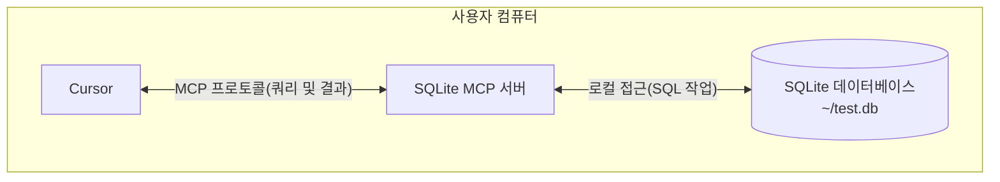

# MCP Python SDK로 MCP 서버와 클라이언트 개발하기

MCP의 기본 개념을 이해한 후, 간단한 예제를 통해 MCP 프로토콜 사용 방법을 알아보겠습니다.

## Cursor에서 MCP 사용하기

MCP 프로토콜을 사용하여 Cursor(MCP 프로토콜 지원)를 로컬 SQLite 데이터베이스에 연결하고 쿼리 및 보안 분석을 수행하는 과정을 설명합니다.



SQLite MCP 서버와 로컬 SQLite 데이터베이스 간 통신은 사용자 컴퓨터 내에서만 이루어집니다. MCP 프로토콜은 Cursor가 명확히 정의된 인터페이스를 통해 승인된 데이터베이스 작업만 수행할 수 있도록 보장합니다.

### 준비 작업

시작하기 전에 시스템에 다음 필수 구성 요소가 설치되어 있는지 확인하세요:

- macOS 또는 Windows 운영체제
- 최신 버전 Claude Desktop
- uv 0.4.18 이상 (`uv --version`으로 확인)
- Git (`git --version`으로 확인)
- SQLite (`sqlite3 --version`으로 확인)

macOS 사용자는 [Homebrew](https://brew.sh/)를 사용하여 설치할 수 있습니다:

```bash
# Homebrew 사용
brew install uv git sqlite3
```

Windows 사용자는 [winget](https://docs.microsoft.com/en-us/windows/package-manager/winget/)을 사용할 수 있습니다:

```bash
# winget 사용
winget install --id=astral-sh.uv -e
winget install git.git sqlite.sqlite
```

### SQLite 데이터베이스 생성

간단한 SQLite 데이터베이스를 생성하고 데이터를 삽입합니다:

```bash
# 새 SQLite 데이터베이스 생성
sqlite3 ~/test.db <<EOF
CREATE TABLE products (
  id INTEGER PRIMARY KEY,
  name TEXT,
  price REAL
);

INSERT INTO products (name, price) VALUES
  ('Widget', 19.99),
  ('Gadget', 29.99),
  ('Gizmo', 39.99),
  ('Smart Watch', 199.99),
  ('Wireless Earbuds', 89.99),
  ('Portable Charger', 24.99),
  ('Bluetooth Speaker', 79.99),
  ('Phone Stand', 15.99),
  ('Laptop Sleeve', 34.99),
  ('Mini Drone', 299.99),
  ('LED Desk Lamp', 45.99),
  ('Keyboard', 129.99),
  ('Mouse Pad', 12.99),
  ('USB Hub', 49.99),
  ('Webcam', 69.99),
  ('Screen Protector', 9.99),
  ('Travel Adapter', 27.99),
  ('Gaming Headset', 159.99),
  ('Fitness Tracker', 119.99),
  ('Portable SSD', 179.99);
EOF
```

### Cursor 설정

Cursor 설정 페이지에서 MCP 탭으로 이동하여 **+ Add new global MCP server** 버튼을 클릭합니다.

```json
{
  "mcpServers": {
    "sqlite": {
      "command": "uvx",
      "args": ["mcp-server-sqlite", "--db-path", "/Users/YOUR_USERNAME/test.db"]
    }
  }
}
```

### 테스트

Cursor에서 다음과 같은 프롬프트를 입력합니다:

```bash
내 SQLite 데이터베이스에 연결하여 어떤 제품들이 있고 가격이 어떻게 되는지 알려줄 수 있나요?
```

## MCP 서버 개발

[MCP Python SDK](https://github.com/modelcontextprotocol/python-sdk)를 사용하여 MCP 서버를 개발하는 방법을 알아봅니다.

### 환경 준비

[uv](https://docs.astral.sh/uv/)를 사용하여 Python 환경을 관리합니다.

```bash
uv init mcp-server-weather --python 3.13
cd mcp-server-weather
uv add "mcp[cli]"
```

### MCP 서버 구현

`main.py` 파일에 날씨 MCP 서버를 구현합니다:

```python
"""
MCP Weather Server

OpenWeatherMap API 기반 날씨 MCP 서버
현재 날씨 정보와 예보 기능 제공
"""

import os
from typing import Dict, Any, List
from datetime import datetime
import requests
from dotenv import load_dotenv

from mcp.server.fastmcp import FastMCP

# 환경 변수 로드
load_dotenv()

# MCP 서버 생성
mcp = FastMCP("Weather")

# OpenWeatherMap API 설정
OPENWEATHER_API_KEY = os.getenv("OPENWEATHER_API_KEY")

@mcp.tool()
def get_current_weather(city: str) -> str:
    """
    지정된 도시의 현재 날씨 정보 가져오기

    Args:
        city: 도시 이름 (영어 또는 중국어)

    Returns:
        포맷된 현재 날씨 정보
    """
    if not OPENWEATHER_API_KEY:
        return "❌ 오류: OpenWeatherMap API 키가 설정되지 않았습니다."

    try:
        response = requests.get(
            f"{OPENWEATHER_BASE_URL}/weather",
            params={
                "q": city,
                "appid": OPENWEATHER_API_KEY,
                "lang": "zh_cn"
            },
            timeout=10
        )
        weather_data = response.json()
        return format_weather_info(weather_data)
    except Exception as e:
        return f"❌ 오류: {str(e)}"

def main():
    """MCP 서버 실행"""
    print("🌤️ 날씨 MCP 서버 시작...")
    mcp.run()

if __name__ == "__main__":
    main()
```

### MCP 서버 디버깅

다음 명령으로 MCP 서버를 디버깅합니다:

```bash
mcp dev main.py
```

## MCP 클라이언트 개발

MCP Python SDK는 MCP 서버에 연결하기 위한 고급 클라이언트 인터페이스를 제공합니다.

```python
from mcp import ClientSession, StdioServerParameters, types
from mcp.client.stdio import stdio_client

async def run():
    server_params = StdioServerParameters(
        command="python",
        args=["example_server.py"],
    )

    async with stdio_client(server_params) as (read, write):
        async with ClientSession(read, write) as session:
            await session.initialize()
            tools = await session.list_tools()
            result = await session.call_tool("tool-name", arguments={"arg1": "value"})

if __name__ == "__main__":
    import asyncio
    asyncio.run(run())
```

### OpenAI 통합 MCP 클라이언트

OpenAI와 통합된 MCP 클라이언트를 구현합니다:

```python
#!/usr/bin/env python
"""
MyMCP 클라이언트 - OpenAI 도구 호출 사용
"""

import asyncio
import json
import os
from typing import Dict, List, Any, Optional
from dataclasses import dataclass

from openai import AsyncOpenAI
from mcp import StdioServerParameters
from mcp.client.stdio import stdio_client
from mcp.client.session import ClientSession
from mcp.types import Tool, TextContent
from rich.console import Console
from dotenv import load_dotenv

load_dotenv()
console = Console()

class MyMCPClient:
    def __init__(self, config_path: str = "mcp.json"):
        self.config_path = config_path
        self.servers: Dict[str, Any] = {}
        self.all_tools: List[tuple[str, Any]] = []
        self.openai_client = AsyncOpenAI(api_key=os.getenv("OPENAI_API_KEY"))

    async def run(self):
        """클라이언트 실행"""
        if not os.getenv("OPENAI_API_KEY"):
            console.print("[red]✗ OPENAI_API_KEY 환경 변수를 설정하세요[/red]")
            return

        # 서버 구성 로드 및 도구 목록 가져오기
        await self.interactive_loop()

async def main():
    client = MyMCPClient()
    await client.run()

if __name__ == "__main__":
    try:
        asyncio.run(main())
    except KeyboardInterrupt:
        console.print("
[yellow]프로그램 종료[/yellow]")
```
