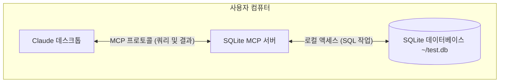

# 빠른 시작

MCP에 대한 기본 지식을 이해한 후, 간단한 예제를 통해 MCP 프로토콜을 사용하는 방법을 보여드리겠습니다. 여기서는 공식 사이트에서 제공하는 [MCP 예제](https://modelcontextprotocol.io/quickstart)를 사용하겠습니다.

이 예제에서는 MCP 프로토콜을 사용하여 Claude 데스크톱을 로컬 SQLite 데이터베이스에 연결하고, 쿼리를 수행하며, 안전한 분석을 진행하는 방법을 다음 다이어그램과 같이 보여드립니다:



SQLite MCP 서버와 로컬 SQLite 데이터베이스 간의 통신은 완전히 사용자의 컴퓨터 내에서 이루어집니다 — SQLite 데이터베이스는 인터넷에 노출되지 않습니다. MCP 프로토콜은 Claude 데스크톱이 명시적으로 정의된 인터페이스를 통해 승인된 데이터베이스 작업만 수행할 수 있도록 보장합니다. 이를 통해 Claude가 로컬 데이터를 안전하게 분석하고 상호작용할 수 있으며, 동시에 접근 가능한 범위에 대한 완전한 제어권을 유지할 수 있습니다.

> Claude 데스크톱의 MCP 지원은 현재 개발자 프리뷰 단계이며, 사용자 기기에서 실행 중인 로컬 MCP 서버에만 연결을 지원합니다. 원격 MCP 연결은 아직 지원되지 않습니다. 이 통합 기능은 Claude 데스크톱 앱에서만 사용 가능하며, Claude 웹 인터페이스(Claude.ai)에서는 사용할 수 없습니다.

## 준비 사항

시작하기 전에 시스템에 다음 필수 요소가 설치되어 있는지 확인하세요:

- macOS 또는 Windows 운영 체제
- 최신 버전의 Claude 데스크톱
- uv 0.4.18 이상 (`uv --version`으로 확인)
- Git (`git --version`으로 확인)
- SQLite (`sqlite3 --version`으로 확인)

macOS 사용자는 [Homebrew](https://brew.sh/)를 사용하여 이러한 구성 요소를 설치할 수 있습니다:

```bash
# Using Homebrew 사용
brew install uv git sqlite3

# 또는 직접 다운로드:
# uv: https://docs.astral.sh/uv/
# Git: https://git-scm.com
# SQLite: https://www.sqlite.org/download.html
```

Windows 사용자는 [winget](https://docs.microsoft.com/en-us/windows/package-manager/winget/)을 사용하여 이러한 구성 요소를 설치할 수 있습니다:

```bash
# Using winget
winget install --id=astral-sh.uv -e
winget install git.git sqlite.sqlite

# Or download directly:
# uv: https://docs.astral.sh/uv/
# Git: https://git-scm.com
# SQLite: https://www.sqlite.org/download.html
```

## 설치

다음으로, macOS를 예시로 설치 과정을 설명하겠습니다. Windows 사용자는 macOS 설치 단계를 참고하시면 됩니다.

먼저, 간단한 SQLite 데이터베이스를 생성하고 데이터를 삽입해 보겠습니다:

```bash
# Create a new SQLite database
sqlite3 ~/test.db <<EOF
CREATE TABLE products (
  id INTEGER PRIMARY KEY,
  name TEXT,
  price REAL
);

INSERT INTO products (name, price) VALUES
  ('Widget', 19.99),
  ('Gadget', 29.99),
  ('Gizmo', 39.99),
  ('Smart Watch', 199.99),
  ('Wireless Earbuds', 89.99),
  ('Portable Charger', 24.99),
  ('Bluetooth Speaker', 79.99),
  ('Phone Stand', 15.99),
  ('Laptop Sleeve', 34.99),
  ('Mini Drone', 299.99),
  ('LED Desk Lamp', 45.99),
  ('Keyboard', 129.99),
  ('Mouse Pad', 12.99),
  ('USB Hub', 49.99),
  ('Webcam', 69.99),
  ('Screen Protector', 9.99),
  ('Travel Adapter', 27.99),
  ('Gaming Headset', 159.99),
  ('Fitness Tracker', 119.99),
  ('Portable SSD', 179.99);
EOF
```

그런 다음 최신 [Claude 데스크톱 앱](https://claude.ai/download)을 다운로드하여 직접 설치하고, Claude 계정으로 로그인하여 정상적으로 사용하세요.

그 후 아무 편집기나 사용하여 Claude 데스크톱의 설정 파일 `~/Library/Application Support/Claude/claude_desktop_config.json`을 엽니다.

예를 들어, VSCode를 사용하여 설정 파일을 여는 방법은 다음과 같습니다:

```json
{
  "mcpServers": {
    "sqlite": {
      "command": "uvx",
      "args": ["mcp-server-sqlite", "--db-path", "/Users/YOUR_USERNAME/test.db"]
    }
  }
}
```

`YOUR_USERNAME`을 실제 사용자 이름으로 바꿔야 합니다. 위의 구성 파일은 `sqlite`라는 MCP 서버를 정의하고, `uvx` 명령을 사용하여 서버를 시작하며, `args` 매개변수에서 MCP 서버와 실제 데이터베이스 경로를 `/Users/YOUR_USERNAME/test.db`로 지정합니다.

위 구성을 저장한 후 Claude 데스크톱 애플리케이션을 다시 시작해야 하며, 그러면 애플리케이션에서 `sqlite` MCP 서버를 볼 수 있습니다.

## 테스트

Claude 데스크톱이 다시 시작되면 홈페이지의 입력 상자에서 다음 그림과 같은 아이콘을 찾을 수 있습니다:


이는 Claude 데스크톱이 SQLite MCP 서버를 성공적으로 로드했으며 정상적으로 사용할 수 있음을 나타냅니다. 이 버튼을 클릭하면 다음 그림과 같이 사용 가능한 MCP 도구 목록을 볼 수 있습니다:


위 그림에서 볼 수 있듯이 데이터베이스의 데이터 쿼리, 새 데이터 생성, 데이터 업데이트, 데이터 삭제 등 많은 작업을 수행할 수 있습니다.
위 그림에서 볼 수 있듯이 데이터베이스의 데이터 쿼리, 새 데이터 생성, 데이터 업데이트, 데이터 삭제 등 많은 작업을 수행할 수 있습니다.

예를 들어, Claude 데스크톱에 다음과 같은 프롬프트를 보냅니다:

```
제 SQLite 데이터베이스에 연결하여 어떤 제품들과 그 가격들이 있는지 알려주실 수 있나요?
```

그러면 Claude 데스크톱이 우리의 프롬프트에 따라 SQLite 데이터베이스를 쿼리하게 되며, 처음 실행 시 다음 그림과 같이 권한 부여 대화 상자가 나타납니다:


여기서 `list-tables` MCP 도구를 사용하기로 선택했음을 확인할 수 있으며, `이 채팅에 허용` 버튼을 클릭하여 권한을 부여해야 합니다. 이후 다른 도구들도 마찬가지로 권한 부여가 필요할 수 있습니다.


권한 부여 후, 다음 그림과 같이 쿼리 결과를 확인할 수 있습니다:


일반적으로 Claude 데스크톱은 우리의 프롬프트에 따라 데이터베이스를 쿼리하고 결과를 반환합니다. 이 과정에서 문제가 발생하면 Claude 데스크톱의 로그를 확인하여 문제를 해결할 수 있습니다.

```bash
tail -n 20 -f ~/Library/Logs/Claude/mcp*.log


==> /Users/cnych/Library/Logs/Claude/mcp-server-sqlite.log <==
Installed 18 packages in 19ms

==> /Users/cnych/Library/Logs/Claude/mcp.log <==
2024-12-02T08:00:38.208Z [info] Attempting to connect to MCP server sqlite...
2024-12-02T08:00:38.217Z [info] Connected to MCP server sqlite!
```

## 분석

여전히 많은 질문이 있을 수 있습니다. 왜 Claude 데스크톱에 단순히 sqlite MCP 서버를 추가하면 데이터베이스에서 데이터를 쿼리할 수 있을까요? 무슨 일이 일어나고 있나요?

MCP와 Claude 데스크톱 간의 상호 작용 과정은 다음과 같습니다:

1. **Server Discovery**: Claude 데스크톱은 시작할 때 구성한 MCP 서버에 연결합니다

2. **Protocol Negotiation**: 데이터를 요청할 때 Claude 데스크톱:

   1. 도움을 줄 수 있는 MCP 서버를 결정합니다 (이 예제에서는 sqlite)
   2. 프로토콜을 통해 기능 협상
   3. MCP 서버에서 데이터 또는 작업 요청

3. **Interaction Process**:

   ```mermaid
   sequenceDiagram
      participant C as Claude 데스크톱
      participant M as MCP 서버
      participant D as SQLite 데이터베이스

      C->>M: 연결 초기화
      M-->>C: 사용 가능한 기능 반환

      C->>M: 쿼리 요청
      M->>D: SQL 쿼리
      D-->>M: 결과 반환
      M-->>C: 결과 형식화
   ```

4. **Security**:

   - MCP 서버는 특정 제어된 기능만 노출합니다
   - MCP 서버는 로컬 컴퓨터에서 실행되며, 접근하는 리소스는 인터넷에 노출되지 않습니다
   - Claude 데스크톱은 민감한 작업에 대해 사용자 확인이 필요합니다

여기에 대해 여전히 많은 질문이 있을 수 있습니다. 우리는 아무 코드도 작성하지 않았습니다. 이유는 Claude 데스크톱에 내장된 다양한 MCP 서버가 있기 때문입니다. 우리는 데이터베이스 경로를 적절히 구성하기만 하면 됩니다. 공식 깃허브 저장소에서 [내장 MCP 서버 목록](https://github.com/modelcontextprotocol/servers/tree/main/src)을 볼 수 있습니다.


우리는 이것이 내장된 SQLite MCP 서버를 포함한다는 것을 알 수 있습니다. SQLite를 통해 데이터베이스 상호작용 및 비즈니스 기능을 제공하여 이 서버는 SQL 쿼리 실행, 비즈니스 데이터 분석 등을 지원하므로 직접 구성하고 사용할 수 있습니다. 우리 자신의 비즈니스 요구 사항이 있는 경우 이 내장 구현을 참조하여 MCP 서버를 사용자 지정할 수 있습니다.

## 파일 시스템 접근

마찬가지로, 우리는 로컬 파일 시스템을 관리할 수 있도록 Claude 데스크톱에 파일 시스템 MCP 서버를 추가할 수 있습니다. 우리는 직접 `filesystem` MCP 서버를 사용할 수 있습니다.

`filesystem` MCP 서버는 파일 시스템 작업을 위한 모델 컨텍스트 프로토콜(MCP)을 구현합니다:

- 파일 읽기/쓰기
- 디렉토리 생성/목록/삭제
- 파일/디렉토리 이동
- 파일 검색
- 파일 메타데이터 가져오기

이 서버는 다음 도구를 지원합니다:

- `read_file`:

  - 파일의 전체 내용 읽기
  - Input: `path`
  - UTF-8 인코딩을 사용하여 파일의 전체 내용 읽기

- `read_multiple_files`:

  - 여러 파일 동시 읽기
  - Input: `paths`
  - 읽기 실패는 전체 작업을 중단하지 않습니다

- `write_file`:

  - 새 파일 생성 또는 기존 파일 덮어쓰기
  - Input:
    - `path`: 파일 위치
    - `content`: 파일 내용

- `create_directory`:

  - 새 디렉토리 생성 또는 존재 확인
  - Input: `path`
  - 필요한 경우 부모 디렉토리 생성
  - 디렉토리가 이미 존재하면 무시

- `list_directory`:

  - [file] 또는 [dir] 접두사가 있는 디렉토리 또는 파일 목록
  - Input: `path`

- `move_file`:

  - 파일 또는 디렉토리 이동 또는 이름 변경
  - Input:
    - `source`
    - `destination`
  - 대상이 이미 존재하면 실패

- `search_files`:

  - 재귀적으로 파일/디렉토리 검색
  - Input:
    - `path`: 시작 디렉토리
    - `pattern`: 검색 패턴
  - 일치하는 파일의 전체 경로 반환

- `get_file_info`:

  - 상세한 파일/디렉토리 메타데이터 가져오기
  - Input: `path`
  - Returns:
    - 파일 크기
    - 생성 시간
    - 수정 시간
    - 접근 시간
    - 유형 (파일/디렉토리)
    - 권한

- `list_allowed_directories`:

  - 서버가 액세스할 수 있는 모든 디렉토리 목록
  - 입력 필요 없음
  - 반환:
    - 이 서버가 읽을/쓸 수 있는 디렉토리

마찬가지로, Claude 데스크톱에서 이 MCP 서버를 사용하려면 파일 경로를 적절히 구성하기만 하면 됩니다. 예를 들어, 여기서는 데스크톱 경로를 사용합니다:

```bash
code ~/Library/Application\ Support/Claude/claude_desktop_config.json
```

그런 다음 다음 구성을 추가합니다:

```json
{
  "mcpServers": {
    "filesystem": {
      "command": "npx",
      "args": [
        "-y",
        "@modelcontextprotocol/server-filesystem",
        "/Users/username/Desktop",
        "/path/to/other/allowed/dir"
      ]
    }
  }
}
```

실제 경로로 경로 매개변수를 바꿉니다. 예를 들어, 완전한 구성은 다음과 같습니다:

```json
{
  "mcpServers": {
    "sqlite": {
      "command": "uvx",
      "args": ["mcp-server-sqlite", "--db-path", "/Users/cnych/test.db"]
    },
    "filesystem": {
      "command": "npx",
      "args": [
        "-y",
        "@modelcontextprotocol/server-filesystem",
        "/Users/cnych/src"
      ]
    }
  }
}
```

여기서는 `/Users/cnych/src` 디렉토리를 지정했습니다. 그런 다음 구성 파일을 저장하고 Claude 데스크톱 애플리케이션을 다시 시작하면 입력 상자의 오른쪽 하단에 `15` 버튼을 볼 수 있습니다:


이 버튼을 클릭하면 다음 그림과 같이 사용 가능한 MCP 도구 목록을 표시합니다:


우리는 파일을 읽을 수 있고, 파일을 생성할 수 있고, 디렉토리를 나열할 수 있고, 파일을 이동할 수 있고, 파일을 검색할 수 있습니다.

우리는 프롬프트 `Can you list the contents of my src directory?`를 보내고 Claude 데스크톱은 지정된 디렉토리 아래의 모든 파일과 디렉토리를 나열할 것입니다. 물론, 이 과정도 권한 부여가 필요합니다.


마크다운 사용 가이드를 작성하고 `markdown-usage.md` 파일에 저장하도록 요청해 보겠습니다. `마크다운에 대한 완전한 가이드를 작성하고 markdown-usage.md 파일에 저장해 주세요`라고 입력합니다.


권한 부여 후, 우리는 Claude 데스크톱이 자동으로 지정된 경로에 파일을 쓰는 것을 볼 수 있습니다. 다음 그림과 같습니다:


