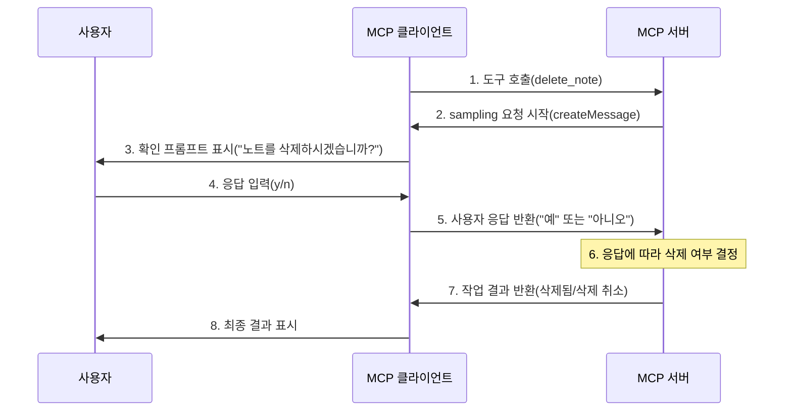

# MCP의 Sampling 기능

앞서 MCP에는 `Resources`, `Prompts`, `Tools` 외에도 `Sampling` 기능이 제공된다고 언급했습니다. 표면적으로는 이해하기 어려울 수 있지만, 실제로 이 기능은 서버가 특정 작업을 수행할 때 사용자 확인을 요청하거나 대화형 결정을 내릴 수 있도록 합니다. 예를 들어 로컬 파일 삭제 도구를 호출할 때는 반드시 확인 후 삭제를 원할 텐데, 이때 이 기능을 사용할 수 있습니다.

이는 MCP 프로토콜의 특별한 능력으로, 개발자가 중요한 작업 전에 사용자 입력을 요청할 수 있게 합니다. MCP에서 샘플링(Sampling)이란 서버가 클라이언트에게 요청을 보내 사용자(일반적으로 대형 언어 모델을 통해)로부터 특정 입력을 제공받는 것을 의미합니다. 이 입력은 어떤 질문에 대한 답변이거나 특정 작업에 대한 확인일 수 있습니다.

이는 전통적인 서버-클라이언트 모델과는 다릅니다. MCP에서는 서버가 클라이언트에게 적극적으로 요청을 보내 어떤 형태의 "샘플"이나 "입력"을 제공하도록 요구할 수 있으며, 이것이 바로 "샘플링"의 의미입니다.

## 작동 원리

`Sampling` 기능의 전체 흐름은 다음과 같습니다:

1. 서버가 클라이언트에 `sampling/createMessage` 요청 전송
2. 클라이언트가 요청 검토 및 수정 가능
3. 클라이언트가 LLM에서 `sampling` 수행
4. 클라이언트가 완성 결과 검토
5. 클라이언트가 결과를 서버에 반환

이러한 인간-컴퓨터 상호작용 설계는 사용자가 LLM이 보고 생성하는 내용을 제어할 수 있도록 합니다.

## 메시지 형식

마찬가지로 `Sampling` 기능 요청은 표준화된 메시지 형식을 사용합니다:

```json
{
  messages: [
    {
      role: "user" | "assistant",
      content: {
        type: "text" | "image",
        // 텍스트의 경우:
        text?: string,
        // 이미지의 경우:
        data?: string,             // base64 인코딩
        mimeType?: string
      }
    }
  ],
  modelPreferences?: {  // 모델 선호도
    hints?: [{
      name?: string                // 모델 이름
    }],
    costPriority?: number,         // 비용 우선순위
    speedPriority?: number,        // 속도 우선순위
    intelligencePriority?: number  // 지능 우선순위
  },
  systemPrompt?: string,          // 시스템 프롬프트
  includeContext?: "none" | "thisServer" | "allServers", // 컨텍스트 포함
  temperature?: number,           // 온도
  maxTokens: number,             // 최대 토큰 수
  stopSequences?: string[],      // 중단 시퀀스
  metadata?: Record<string, unknown> // 메타데이터
}
```

여기서 `messages` 배열은 LLM에 보낼 대화 기록을 포함합니다. 각 메시지에는 다음이 있습니다:

- `role`: `user` 또는 `assistant`
- `content`: 메시지 내용으로 다음 중 하나일 수 있습니다:
  - `text` 필드가 있는 텍스트 내용
  - `data (base64)` 및 `mimeType` 필드가 있는 이미지 내용

다음은 모델 선호도 설정입니다. `modelPreferences` 객체를 통해 서버는 모델 선택 선호도를 지정할 수 있습니다:

- `hints`: 모델 이름 제안 배열로, 클라이언트가 적절한 모델을 선택하는 데 사용할 수 있습니다:
  - `name`: 전체 또는 부분 모델 이름과 일치할 수 있는 문자열(예: "claude-3", "sonnet")
  - 클라이언트는 힌트를 다른 공급자의 동등한 모델에 매핑할 수 있음
  - 여러 힌트는 우선순위에 따라 평가됨
- 우선순위:
  - `costPriority`: 비용 최소화의 중요성
  - `speedPriority`: 낮은 지연 응답의 중요성
  - `intelligencePriority`: 고급 모델 기능의 중요성

클라이언트는 이러한 선호도와 사용 가능한 모델을 기반으로 최종 모델을 선택합니다.

다음은 시스템 프롬프트입니다. `systemPrompt` 필드를 통해 MCP 서버는 특정 시스템 프롬프트를 요청할 수 있습니다. 클라이언트는 이를 수정하거나 무시할 수 있습니다.

`includeContext` 매개변수는 포함해야 할 MCP 컨텍스트 내용을 지정하는 데 사용됩니다:

- `none`: 추가 컨텍스트를 포함하지 않음
- `thisServer`: 요청 서버의 컨텍스트 포함
- `allServers`: 연결된 모든 MCP 서버의 컨텍스트 포함

클라이언트가 실제 포함되는 컨텍스트를 제어합니다.

다음은 샘플링 매개변수입니다. 다음 매개변수를 사용하여 LLM 샘플링을 미세 조정합니다:

- `temperature`: 무작위성 제어(0.0에서 1.0)
- `maxTokens`: 생성할 최대 토큰 수
- `stopSequences`: 생성 중단 시퀀스 배열
- `metadata`: 공급자별 기타 매개변수

마지막으로 응답 형식입니다. 클라이언트는 완성 결과를 반환합니다:

```json
{
  model: string, // 사용된 모델 이름
  stopReason?: "endTurn" | "stopSequence" | "maxTokens" | string,
  role: "user" | "assistant",
  content: {
    type: "text" | "image",
    text?: string,
    data?: string,
    mimeType?: string
  }
}
```

여기서 `model`은 완성 결과를 생성하는 데 사용된 모델 이름이고, `stopReason`은 생성 중단 이유이며, `role`은 완성 결과의 역할이고, `content`는 완성 결과의 내용입니다.

## 모범 사례

샘플링 기능을 구현할 때 다음 모범 사례를 따를 수 있습니다:

- 항상 명확하고 구조화된 프롬프트 제공
- 텍스트 및 이미지 내용을 적절히 처리
- 합리적인 토큰 제한 설정
- `includeContext`를 통해 관련 컨텍스트 포함
- 사용 전 응답 내용 검증
- 우아한 오류 처리
- 샘플링 요청 속도 제한 고려
- 예상되는 샘플링 동작 기록
- 다양한 모델 매개변수로 테스트
- 샘플링 비용 모니터링

## 인간 개입 제어

샘플링은 인간 감독을 고려하여 설계되었습니다:

**프롬프트의 경우**

- 클라이언트는 사용자에게 제안된 프롬프트를 표시해야 함
- 사용자는 프롬프트를 수정하거나 거부할 수 있어야 함
- 시스템 프롬프트는 필터링되거나 수정될 수 있음
- 컨텍스트 포함은 클라이언트에 의해 제어됨

**완성 결과의 경우**

- 클라이언트는 사용자에게 완성 결과를 표시해야 함
- 사용자는 완성 결과를 수정하거나 거부할 수 있어야 함
- 클라이언트는 완성 결과를 필터링하거나 수정할 수 있음
- 사용자가 어떤 모델을 사용할지 제어함

**보안 고려 사항**

샘플링 구현 시:

- 모든 메시지 내용 검증
- 민감한 정보 정리
- 적절한 속도 제한 구현
- 샘플링 사용 모니터링
- 전송 중 데이터 암호화
- 사용자 데이터 프라이버시 처리
- 샘플링 요청 감사
- 비용 노출 제어
- 시간 초과 구현
- 모델 오류를 우아하게 처리

## 일반적인 패턴

**에이전트 자율 워크플로**

샘플링은 다음과 같은 에이전트 자율 행동 패턴을 구현합니다:

- 리소스 읽기 및 분석
- 컨텍스트 기반 결정 내리기
- 구조화된 데이터 생성
- 다단계 작업 처리
- 대화형 도움말 제공

**컨텍스트 관리**

컨텍스트 모범 사례:

- 최소한의 필요한 컨텍스트 요청
- 컨텍스트를 명확하게 구성
- 컨텍스트 크기 제한 처리
- 필요에 따라 컨텍스트 업데이트
- 오래된 컨텍스트 정리

**오류 처리**

강력한 오류 처리는 다음을 수행해야 합니다:

- 샘플링 실패 포착
- 시간 초과 오류 처리
- 속도 제한 관리
- 응답 검증
- 대체 동작 제공
- 오류를 올바르게 기록

**제한 사항**

다음 제한 사항에 유의하세요:

- 샘플링은 클라이언트 기능에 의존함
- 사용자가 샘플링 동작을 제어함
- 컨텍스트 크기에 제한이 있음
- 속도 제한이 적용될 수 있음
- 비용을 고려해야 함
- 모델 가용성이 다양함
- 응답 시간이 다양함
- 모든 콘텐츠 유형이 지원되는 것은 아님

## 실전 적용

이제 파일 삭제 기능이 있는 MCP 서버를 구현하고 `Sampling` 기능을 사용하여 파일 삭제의 에이전트 자율 행동을 구현해 보겠습니다.



먼저 MCP 서버를 초기화합니다:

```bash
$ npx @modelcontextprotocol/create-server mcpdemo
? What is the name of your MCP server? mcpdemo
? What is the description of your server? A Model Context Protocol server
? Would you like to install this server for Claude.app? No
✔ MCP server created successfully!

Next steps:
  cd mcpdemo
  npm install
  npm run build  # or: npm run watch
  npm link       # optional, to make available globally

$ cd mcpdemo
$ npm i

> mcpdemo@0.1.0 prepare
> npm run build


> mcpdemo@0.1.0 build
> tsc && node -e "require('fs').chmodSync('build/index.js', '755')"


added 17 packages, and audited 18 packages in 6s

1 package is looking for funding
  run `npm fund` for details

found 0 vulnerabilities
```

다음으로 `src/index.ts` 파일을 직접 수정합니다. 먼저 서버 구성에서 `sampling` 기능을 활성화합니다:

```ts
const server = new Server(
  {
    name: "mcpdemo",
    version: "0.1.0",
  },
  {
    capabilities: {
      resources: {},
      tools: {},
      prompts: {},
      sampling: {}, // sampling 기능 활성화
    },
  }
);
```

그런 다음 노트 삭제 도구를 추가합니다:

```ts
/**
 * 사용 가능한 도구를 나열하는 핸들러.
 * 노트 생성 및 삭제를 위한 도구를 노출합니다.
 */
server.setRequestHandler(ListToolsRequestSchema, async () => {
  return {
    tools: [
      // {  // 기존 노트 생성 도구
      //   name: "create_note",
      //   // ...
      // },
      {
        name: "delete_note",
        description: "확인 후 기존 노트 삭제",
        inputSchema: {
          type: "object",
          properties: {
            id: {
              type: "string",
              description: "삭제할 노트 ID",
            },
          },
          required: ["id"],
        },
      },
    ],
  };
});
```

그런 다음 `delete_note` 도구의 요청 처리를 구현하는 것이 핵심입니다:

```ts
/**
 * 도구 호출을 위한 핸들러.
 * create_note 및 delete_note 도구를 모두 처리합니다.
 */
server.setRequestHandler(CallToolRequestSchema, async (request) => {
  switch (request.params.name) {
    case "create_note": {
      // ...기존 노트 생성 로직
    }

    case "delete_note": {
      const id = String(request.params.arguments?.id);
      if (!id) {
        throw new Error("노트 ID가 필요합니다");
      }

      const note = notes[id];
      if (!note) {
        throw new Error(`노트 ${id}을(를) 찾을 수 없습니다`);
      }

      try {
        // 클라이언트에 샘플링 요청을 보내 노트 삭제 확인
        const confirmationResponse = await server.createMessage({
          messages: [
            {
              role: "user",
              content: {
                type: "text",
                text: `노트「${note.title}」을(를) 삭제하시겠습니까? "예" 또는 "아니오"로 답변해 주세요.`,
              },
            },
          ],
          systemPrompt:
            "파일 삭제 확인을 돕는 어시스턴트입니다. '예' 또는 '아니오'만 답변해 주세요.",
          maxTokens: 10,
          temperature: 0.1,
          includeContext: "none",
        });

        // 사용자 응답 텍스트 가져오기
        let userResponse = "";
        if (
          confirmationResponse?.content?.type === "text" &&
          typeof confirmationResponse?.content?.text === "string"
        ) {
          userResponse = confirmationResponse.content.text.toLowerCase();
        }

        // 사용자가 삭제를 확인했는지 확인
        if (userResponse.includes("예") || userResponse.includes("yes")) {
          // 노트 삭제
          delete notes[id];
          return {
            content: [
              {
                type: "text",
                text: `노트 ${id}: ${note.title} 삭제됨`,
              },
            ],
          };
        } else {
          // 사용자가 확인하지 않음, 삭제 취소
          return {
            content: [
              {
                type: "text",
                text: `노트 ${id}: ${note.title} 삭제 취소됨`,
              },
            ],
          };
        }
      } catch (error) {
        // 샘플링 또는 삭제 과정에서 오류 처리
        const errorMessage =
          error instanceof Error ? error.message : String(error);
        return {
          content: [
            {
              type: "text",
              text: `삭제 작업 실패: ${errorMessage}`,
            },
          ],
        };
      }
    }

    default:
      throw new Error("알 수 없는 도구");
  }
});
```

노트 삭제를 처리할 때 클라이언트에 샘플링 요청을 보내 노트 삭제를 확인합니다. 여기서는 `server.createMessage` 메서드를 사용하며, 이 메서드는 샘플링 요청을 보내는 데 사용됩니다. 요청 매개변수는 앞서 설명한 `Sampling` 기능 메시지 형식을 참조합니다:

```ts
const confirmationResponse = await server.createMessage({
  messages: [
    {
      role: "user",
      content: {
        type: "text",
        text: `노트「${note.title}」을(를) 삭제하시겠습니까? "예" 또는 "아니오"로 답변해 주세요.`,
      },
    },
  ],
  systemPrompt:
    "파일 삭제 확인을 돕는 어시스턴트입니다. '예' 또는 '아니오'만 답변해 주세요.",
  maxTokens: 10,
  temperature: 0.1,
  includeContext: "none",
});
```

이렇게 하면 MCP 클라이언트에서 이 샘플링 요청을 수락하고 응답해야 합니다. 그런 다음 MCP 서버는 사용자의 응답에 따라 노트를 삭제할지 여부를 결정합니다. 여기서 우리의 로직은 간단합니다. 응답에 "예" 또는 "yes"가 포함되어 있으면 노트를 삭제하고, 그렇지 않으면 삭제하지 않습니다.

따라서 클라이언트는 샘플링 요청을 지원하고 응답을 제공해야 합니다. 다음은 클라이언트 측 샘플링 처리 구현 방법입니다:

```ts
// 샘플링 기능이 활성화된 클라이언트 초기화
const client = new Client(
  { name: "mcpdemo-client", version: "0.1.0" },
  {
    capabilities: {
      sampling: {}, // 샘플링 활성화
    },
  }
);

// 샘플링 요청 처리
function setupSampling(client: Client) {
  const confirmHandler = new SamplingConfirmHandler();

  client.setRequestHandler(CreateMessageRequestSchema, async (request) => {
    // 사용자 메시지 추출
    const userMessages = request.params.messages.filter(
      (m) => m.role === "user"
    );
    const lastUserMessage = userMessages[userMessages.length - 1];

    // 텍스트 내용 가져오기
    let userRequest = "명확한 작업이 지정되지 않음";
    if (lastUserMessage?.content.type === "text") {
      userRequest = lastUserMessage.content.text;
    }

    // 요청 분석
    const analysis = await confirmHandler.analyzeRequest({
      model: "model",
      role: "assistant",
      content: {
        type: "text",
        text: userRequest,
      },
      systemPrompt: request.params.systemPrompt,
    });

    // 사용자 확인 받기
    const isConfirmed = await confirmHandler.getConfirmation(
      `이 작업을 진행하시겠습니까? (y/n): `,
      20000
    );

    // 응답 반환
    const response = isConfirmed ? "예" : "아니오";

    return {
      model: "stub-model",
      stopReason: "endTurn",
      role: "assistant",
      content: {
        type: "text",
        text: response,
      },
    };
  });
}
```

위 클라이언트 코드에서는 `client.setRequestHandler(CreateMessageRequestSchema, async (request) => {}` 메서드를 사용하여 샘플링 요청을 처리합니다. 서버에서 보낸 매개변수를 LLM 요청으로 조합할 수 있습니다. 서버에서 `systemPrompt`, `maxTokens`, `temperature`, `messages` 같은 매개변수를 전달하므로 클라이언트의 처리 로직은 특정 시나리오에 따라 달라집니다. 예를 들어, LLM 분석을 완전히 건너뛰고 사용자에게 직접 확인 메시지를 표시할 수도 있습니다.

다음은 테스트 과정입니다:

```bash
npm run client

> mcpdemo@0.1.0 client
> node dist/client.js


[성공] 서버에 연결됨
[정보] 명령을 입력하거나 'exit'로 종료:

> 모든 노트 리소스 나열
✓ 분석 완료 (시간: 6.03초)
[AI] 결정: 모든 사용 가능한 리소스를 나열합니다

--- 모든 리소스 나열 ---
[정보] 2개의 리소스 발견
[정보] 사용 가능한 리소스:
1. First Note (note:///1)
   A text note: First Note
2. Second Note (note:///2)
   A text note: Second Note


> 노트 1 삭제
✓ 분석 완료 (시간: 8.23초)
[AI] 결정: 지정된 노트를 삭제하기 위해 도구를 호출합니다
[AI] 요청을 수행하기 위해 "delete_note" 도구를 호출합니다

--- 도구 호출: delete_note ---
[정보] 도구 설명: 확인 후 기존 노트 삭제
[정보] 입력 매개변수:
[정보]   id: "1"

--- 서버 샘플링 요청 수신 ---
✓ 분석 결과: 아니오 (시간: 4.29초)
[정보] 20초 이내에 응답해 주세요. 기본값은 "아니오"입니다
이 작업을 진행하시겠습니까? (y/n):
[분석 결과: 아니오]y
[정보] 사용자 결정: 예
[정보] 도구 반환 내용:
[정보] 노트 1: First Note 삭제됨

>
```

위 테스트에서 볼 수 있듯이 `노트 1 삭제`를 입력하면 LLM 분석 후 시스템이 `delete_note` 도구를 호출해야 한다고 판단합니다. 그런 다음 MCP 서버는 삭제 전 사용자 확인을 요청하는 샘플링 요청을 클라이언트에 보냅니다. 사용자가 확인하면 노트가 삭제되고, 그렇지 않으면 작업이 취소됩니다.

## 요약

이 실습을 통해 `Sampling` 기능이 MCP에서 얼마나 중요한지 확인했습니다. 이 기능을 통해 서버는 클라이언트를 통해 LLM 완성 요청을 보내 복잡한 에이전트 행동을 구현하면서도 보안성과 프라이버시를 유지할 수 있습니다.
