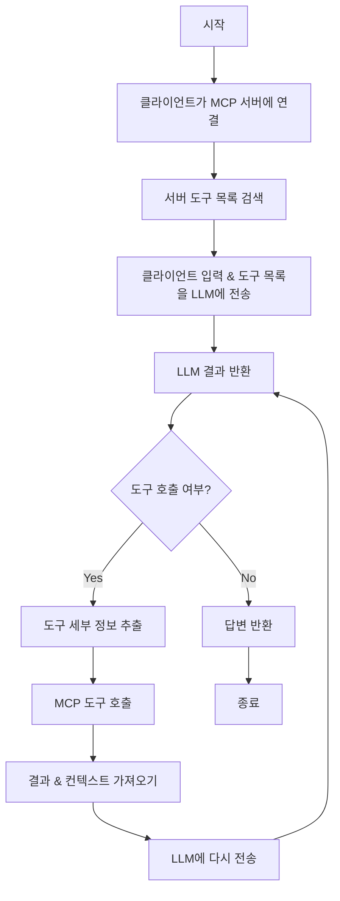

# TypeScript MCP 클라이언트 작성하기

[이전 섹션](/docs/write-ts-server)에서 우리는 날씨 MCP 서버를 성공적으로 개발했으며, 이제 Claude 데스크톱, Cursor 등 MCP 프로토콜을 지원하는 모든 클라이언트에서 사용할 수 있습니다.


하지만 자체 클라이언트를 개발하고 싶다면 어떻게 해야 할까요? MCP 클라이언트를 만드는 방법을 알아보겠습니다.

## 워크플로우

MCP 클라이언트 개발은 간단합니다:

1. 먼저, 클라이언트를 MCP 서버에 연결합니다
2. 연결 후, 서버에서 제공하는 도구 목록(리소스 및 프롬프트 포함)을 가져옵니다
3. 클라이언트의 입력과 도구 목록을 도구 지원 LLM(OpenAI, Anthropic 등)에 전송합니다
4. LLM의 응답에서 도구 이름과 매개변수를 추출합니다
5. 추출한 도구 이름과 매개변수를 사용하여 MCP 서버 도구를 호출합니다
6. 도구 실행 후, 결과와 새로운 컨텍스트(프롬프트 및 리소스 포함)를 LLM에 다시 전송합니다
7. LLM이 완성된 응답을 반환할 때까지 이 단계를 반복합니다

다음 워크플로우를 참조할 수 있습니다:



## 준비

다음으로, 우리는 TypeScript를 사용하여 이전에 개발한 날씨 예보 서비스를 호출할 수 있는 MCP 클라이언트를 개발합니다. 다음 환경이 필요합니다:

- Node.js 16 이상
- npm 최신 버전
- Anthropic API 키 (Claude)

그런 다음, 프로젝트 디렉토리를 만들고 npm 프로젝트를 초기화합니다:

```bash
mkdir mcpclient-demo
cd mcpclient-demo
npm init -y
```

의존성 설치:

```bash
npm install @anthropic-ai/sdk @modelcontextprotocol/sdk dotenv
npm install -D @types/node typescript
```

소스 파일 생성:

```bash
touch index.ts
```

`package.json` 파일 업데이트, `build` 스크립트 추가 및 유형을 `module`로 설정:

```json
{
  "name": "mcpclient-demo",
  "version": "1.0.0",
  "main": "index.js",
  "type": "module",
  "scripts": {
    "build": "tsc && chmod 755 build/index.js"
  },
  "keywords": [],
  "author": "",
  "license": "ISC",
  "description": "",
  "dependencies": {
    "@anthropic-ai/sdk": "^0.39.0",
    "@modelcontextprotocol/sdk": "^1.7.0",
    "dotenv": "^16.4.7"
  },
  "devDependencies": {
    "@types/node": "^22.13.12",
    "typescript": "^5.8.2"
  }
}
```

TypeScript를 사용하고 있으므로, 루트 디렉토리에 `tsconfig.json` 파일도 생성해야 합니다. 이것은 TypeScript의 설정 파일이며, 다음과 같은 내용이 포함되어 있습니다:

```json
{
  "compilerOptions": {
    "target": "ES2022",
    "module": "Node16",
    "moduleResolution": "Node16",
    "outDir": "./build",
    "rootDir": "./",
    "strict": true,
    "esModuleInterop": true,
    "skipLibCheck": true,
    "forceConsistentCasingInFileNames": true
  },
  "include": ["index.ts"],
  "exclude": ["node_modules"]
}
```

그런 다음, 준비된 `ANTHROPIC_API_KEY` 및 기타 환경 변수를 `.env` 파일에 작성합니다:

```text
ANTHROPIC_API_KEY=sk-xxxx
ANTHROPIC_BASE_URL=https://api.anthropic.com
ANTHROPIC_MODEL=claude-3-7-sonnet-20250219
```

## 클라이언트 생성

다음으로, 클라이언트를 생성할 수 있습니다.

> 모든 작업은 `index.ts` 파일에서 수행됩니다.

먼저, 환경 변수에서 API 키 및 기타 구성을 읽어야 합니다:

```typescript
import dotenv from "dotenv";

dotenv.config();

const ANTHROPIC_API_KEY = process.env.ANTHROPIC_API_KEY;
const ANTHROPIC_BASE_URL =
  process.env.ANTHROPIC_BASE_URL || "https://api.anthropic.com";
const ANTHROPIC_MODEL =
  process.env.ANTHROPIC_MODEL || "claude-3-7-sonnet-20250219";

if (!ANTHROPIC_API_KEY) {
  throw new Error("ANTHROPIC_API_KEY is not set");
}

if (!ANTHROPIC_BASE_URL) {
  throw new Error("ANTHROPIC_BASE_URL is not set");
}
```

그런 다음, `MCPClient` 클래스를 생성하고 MCP 클라이언트와 Anthropic 클라이언트를 초기화합니다:

```typescript
import { Client } from "@modelcontextprotocol/sdk/client/index.js";
import { Tool } from "@anthropic-ai/sdk/resources/messages/messages.mjs";
import { StdioClientTransport } from "@modelcontextprotocol/sdk/client/stdio.js";
import { Anthropic } from "@anthropic-ai/sdk";

class MCPClient {
  private mcp: Client;
  private anthropic: Anthropic;
  private transport: StdioClientTransport | null = null;
  private tools: Tool[] = [];

  constructor() {
    this.anthropic = new Anthropic({
      apiKey: ANTHROPIC_API_KEY,
      baseURL: ANTHROPIC_BASE_URL,
    });
    this.mcp = new Client({ name: "mcpclient-demo", version: "1.0.0" });
  }
}
```

여기서는 Claude의 API를 LLM의 구현으로 사용하며, `mcp` 속성은 MCP 클라이언트이며, `new Client`로 직접 생성할 수 있으므로 MCP 클라이언트의 모든 기능을 갖습니다.

다음으로, 우리는 이전에 개발한 MCP 서버에 우리의 MCP 클라이언트를 연결해야 합니다. 우리의 MCP 서버는 Node.js 스크립트이므로, 스크립트 경로만 제공하면 되며, `StdioClientTransport`를 통해 연결할 수 있습니다. 연결이 성공하면 `listTools` 메서드를 사용하여 서버에서 제공하는 도구 목록을 가져올 수 있습니다.

```typescript
async connectToServer(serverScriptPath: string) {
    try {
      const isJs = serverScriptPath.endsWith(".js");
      if (!isJs) {
        throw new Error("Server script must be a .js file");
      }
      const command = process.execPath;

      // Initialize transport
      this.transport = new StdioClientTransport({
        command,
        args: [serverScriptPath],
      });
      // Connect to server
      this.mcp.connect(this.transport);
      // Get tools list
      const toolsResult = await this.mcp.listTools();
      this.tools = toolsResult.tools.map((tool) => {
        return {
          name: tool.name,
          description: tool.description,
          input_schema: tool.inputSchema,
        };
      });
      console.log(
        "Connected to server with tools:",
        this.tools.map(({ name }) => name)
      );
    } catch (e) {
      console.log("Failed to connect to MCP server: ", e);
      throw e;
    }
  }
```

도구 목록을 가져왔으므로, 이제 이러한 도구를 사용하는 방법을 알아야 합니다.
예를 들어, 우리가 채팅 애플리케이션이라면, 일반적인 프로세스는 우리의 요청을 LLM에 보내고, 그 다음 LLM이 결과를 반환하는 것입니다. 이제, 우리는 적절한 시점에 서버에서 제공하는 도구를 호출하고 싶은데, 어떻게 해야 할까요?

이것도 간단합니다. 우리는 단지 우리의 요청과 도구를 LLM(여기서는 Anthropic을 사용)에 보내면 됩니다. 그러면 LLM이 결과를 반환합니다. 만약 결과가 도구를 호출해야 한다면, MCP 클라이언트의 `callTool` 메서드를 통해 도구를 호출하고, 그 다음 도구 실행 결과를 LLM에 다시 보내 한 번 처리하게 할 수 있습니다. 마지막으로, 우리는 최종 결과를 얻을 수 있습니다.

이제, 구체적인 구현을 살펴보겠습니다:

```typescript
  async processQuery(query: string) {
    // Initialize messages
    const messages: MessageParam[] = [
      {
        role: "user",
        content: query,
      },
    ];

    // Call anthropic
    const response = await this.anthropic.messages.create({
      model: ANTHROPIC_MODEL,
      max_tokens: 1000,
      messages,
      tools: this.tools,
    });

    // Initialize finalText and toolResults
    const finalText = [];
    const toolResults = [];

    // Iterate through response.content
    for (const content of response.content) {
      if (content.type === "text") {  // If content is text, it means it's a text
        finalText.push(content.text);
      } else if (content.type === "tool_use") {  // If content is tool_use, it means it needs to call a tool
        // Get toolName and toolArgs
        const toolName = content.name;
        const toolArgs = content.input as { [x: string]: unknown } | undefined;

        // Call tool
        const result = await this.mcp.callTool({
          name: toolName,
          arguments: toolArgs,
        });

        // Add tool call information to finalText
        finalText.push(
          `[Calling tool ${toolName} with args ${JSON.stringify(toolArgs)}]`
        );

        // Add tool call result to messages
        messages.push({
          role: "user",
          content: result.content as string,
        });

        // Call anthropic
        const response = await this.anthropic.messages.create({
          model: ANTHROPIC_MODEL,
          max_tokens: 1000,
          messages,
        });

        // Merge tool call result to finalText
        finalText.push(
          response.content[0].type === "text" ? response.content[0].text : ""
        );
      }
    }

    return finalText.join("\n");
  }

  async chatLoop() {
    const rl = readline.createInterface({
      input: process.stdin,
      output: process.stdout,
    });

    try {
      console.log("\nMCP Client Started!");
      console.log("Type your queries or 'exit' to exit.");

      while (true) {
        // Read user input
        const message = await rl.question("\nQuery: ");
        // If user input exit, exit
        if (message.toLowerCase() === "exit") {
          break;
        }

        try {
          // Process user input
          const response = await this.processQuery(message);
          // Output result
          console.log("\n" + response);
        } catch (e) {
          console.log("Error: ", e);
        }
      }
    } finally {
      rl.close();
    }
  }

  async cleanup() {
    await this.mcp.close();
  }
```

여기서는 우리가 완료한 MCP 클라이언트의 핵심 기능 - 서버에서 제공하는 도구 호출입니다. 마지막으로, 우리는 `main` 함수에서 일부 초기화 작업을 수행하여 채팅을 시작할 수 있습니다.

```typescript
async function main() {
  if (process.argv.length < 3) {
    console.log("Usage: node index.ts <path_to_server_script>");
    return;
  }
  const mcpClient = new MCPClient();
  try {
    await mcpClient.connectToServer(process.argv[2]);
    await mcpClient.chatLoop();
  } finally {
    await mcpClient.cleanup();
    process.exit(0);
  }
}

main();
```

## 테스트

다음으로, 다음 명령을 실행하여 클라이언트를 빌드합니다:

```bash
npm run build
```

위 명령은 `build/index.js` 파일을 생성하며, 이제 테스트를 시작할 수 있습니다.

```bash
node build/index.js
Usage: node index.ts <path_to_server_script>
```

우리는 여기서 단순히 MCP 서버 스크립트 경로를 전달하기만 하면 되며, 이제 테스트를 시작할 수 있습니다.

```bash
node build/index.js /Users/cnych/src/weather-server/build/index.js
# output
Weather MCP server running on stdio
Connected to server with tools: [ 'get_forecast' ]

MCP Client Started!
Type your queries or 'exit' to exit.

Query: Beijing weather for the next 3 days

I can get the weather forecast for Beijing for the next 3 days. Let me do that for you now.
[Calling tool get_forecast with args {"city":"Beijing","days":3}]
# Beijing Weather Forecast

## Next 3 Days:
- **March 24, 2025**: 21°C with overcast clouds
- **March 25, 2025**: 21°C with scattered clouds
- **March 26, 2025**: 20°C with overcast clouds

The temperature will remain relatively stable around 20-21°C over the next three days, with cloudy conditions throughout. March 25th will have partially clear skies with scattered clouds, while the other days will be predominantly overcast.

Query:
```

우리가 제공한 MCP 서버 스크립트는 이전에 개발한 날씨 예보 서비스이며, 여기서는 다음 3일간의 날씨 예보를 요청하고, 우리는 서버에서 제공하는 `get_forecast` 도구를 호출하고, `city`와 `days` 매개변수를 전달하여 최종 결과를 얻을 수 있습니다.


여기서는 매우 간단한 MCP 클라이언트를 개발했으며, 이 클라이언트를 통해 서버에서 제공하는 도구를 호출하고 최종 결과를 얻을 수 있습니다.

물론, 이 클라이언트는 매우 간단하며, 단지 Stdio 프로토콜만 지원합니다. 만약 SSE 프로토콜 MCP 서버에 연결하고 싶다면, 이후 장에서 소개할 SSE 프로토콜 클라이언트를 추가해야 합니다.
