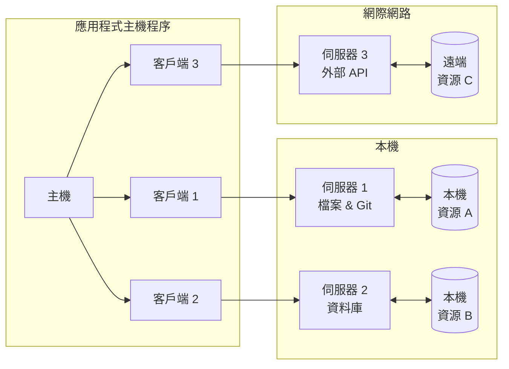

# MCP 架構

MCP 協議遵循客戶端-主機-伺服器架構，其中每個主機可以運行多個客戶端實例。該架構使用戶能夠跨應用程式整合 AI 能力，同時保持清晰的安全邊界並隔離問題。MCP 基於 `JSON-RPC` 建構，提供了一個有狀態會話協議，專注於客戶端和伺服器之間的上下文交換和採樣協調。

## MCP 協議架構

MCP 遵循客戶端-伺服器架構，MCP 協議架構如下圖所示：

這裡主要涉及到三個角色：**主機**、**伺服器**和**客戶端**。

- 主機是發起連線的 LLM 應用程式（如 Claude Desktop 或 IDE）
- 客戶端在主機應用程式內部與伺服器保持 1:1 連線
- 伺服器向客戶端提供上下文、工具和提示

### 主機

主機程序是 MCP 協議的中心元件，負責管理客戶端實例的生命週期，並協調客戶端與伺服器之間的通訊。主機可以執行多個客戶端實例，每個客戶端實例可以連線到不同的伺服器。主機透過 JSON-RPC 協議與客戶端和伺服器進行通訊。

- 管理客戶端實例的生命週期
- 控制連線權限和執行安全策略
- 協調 AI/LLM 整合
- 確保系統穩定運作

### 伺服器

伺服器是 MCP 協議的資源儲存和處理中心，負責儲存和管理本機和遠端資源，並提供給客戶端使用。伺服器可以執行多個伺服器實例，每個伺服器實例可以處理不同的資源類型。伺服器透過 JSON-RPC 協議與主機和客戶端進行通訊。

- 公開特定的資源和工具
- 獨立執行和管理
- 透過客戶端處理請求
- 支援本機和遠端服務

### 客戶端

客戶端用於維護主機與伺服器的獨立連線，並處理使用者的輸入和輸出。每個客戶端都與一個伺服器保持 1:1 的關係，確保連線的隔離性和安全性。

- 維護與伺服器的獨立連線
- 建立有狀態會話
- 處理協議協商
- 管理訊息路由
