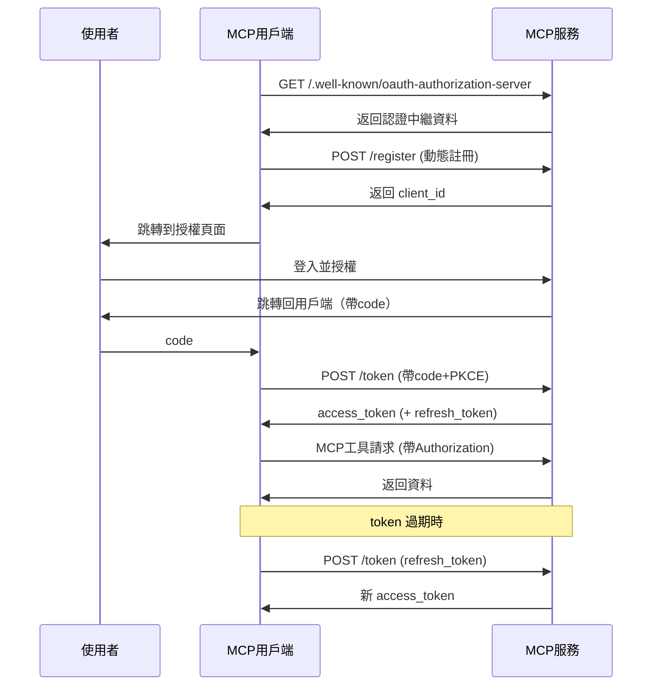

# MCP Authorization 授權機制

MCP 在最開始的 2024-11-05 版本中並沒有支援授權，在 2025-03-26 中，MCP 協定支援了基於 OAuth2.1 的授權機制，在最新的 MCP Draft 中，社群對基於 OAuth 2.1 的授權協定內容進行了調整，適用於 HTTP、SSE、Streamable HTTP 等傳輸模式。透過授權認證，MCP 用戶端可以安全地代表使用者或應用程式存取受限的 MCP 工具和資源。


## MCP 授權規範

MCP 授權規範定義了 MCP 伺服器（遠端）和 MCP 用戶端之間的認證過程。作為授權協定框架的 OAuth 解決了如何允許使用者授權第三方應用程式代表他們存取使用者資源的問題。如果你不熟悉 OAuth，可以查看 [AuthWiki-OAuth](https://auth.wiki/zh/oauth-2.0) 以獲取更多資訊。

在 MCP 用戶端和 MCP 伺服器的場景中，這是關於「使用者授權 MCP 用戶端存取 MCP 伺 vérite 器上的使用者資源」。目前，「MCP 伺服器上的使用者資源」主要指 MCP 伺服器提供的工具或 MCP 伺服器的後端服務提供的資源。

要實現 OAuth 2.1 認證過程，該協定要求 MCP 伺服器提供以下介面，與 MCP 用戶端合作完成 OAuth 2.1 認證過程：

- `/.well-known/oauth-authorization-server`: OAuth 伺服器中繼資料
- `/authorize`: 授權端點，用於授權請求
- `/token`: 權杖端點，用於權杖交換與重新整理
- `/register`: 用戶端註冊端點，用於動態用戶端註冊

認證過程如下所示：


該規範還規定了 MCP 伺服器如何透過第三方授權伺服器支援委託授權。規範中的範例流程如下：


在這種情況下，雖然 MCP 伺服器將授權委託給第三方授權伺服器，但 MCP 伺服器仍然作為 MCP 用戶端的授權伺服器。這是因為 MCP 伺服器需要向 MCP 用戶端頒發自己的存取權杖。

這種場景似乎更適合處理 MCP 伺服器代理 MCP 用戶端（使用者）存取第三方資源（如 Github 倉庫）的情況，而不是 MCP 伺服器代理 MCP 用戶端（使用者）存取 MCP 伺服器自己的資源。

總之，根據協定，MCP 伺服器在 OAuth 中同時擔任授權伺服器和資源伺服器的角色。

接下來，讓我們瞭解下 MCP 伺服器作為授權伺服器和資源伺服器的責任。

### 作為授權服務的 MCP 伺服器

當 MCP 伺服器充當授權伺服器時，意味著 MCP 用戶端的最終使用者在 MCP 伺服器上有自己的身份。MCP 伺服器負責對該最終使用者進行身份驗證，並向其頒發存取權杖以存取 MCP 伺服器資源。

MCP 授權規範中要求的與授權相關的介面意味著 MCP 伺服器必須提供授權伺服器的實現。

然而，在 MCP 伺服器上實現授權伺服器功能對開發人員是一個重大挑戰。一方面，大多數開發人員可能不熟悉 OAuth 相關概念。另一方面，實現授權伺服器時需要考慮許多細節。如果開發人員不是來自相關領域，他們可能在實現過程中引入安全問題等。

然而，協定本身並沒有限制 MCP 伺服器僅自己實現授權伺服器功能。開發人員可以完全重定向或代理這些與授權相關的端點到其他授權伺服器。對於 MCP 用戶端而言，這與 MCP 伺服器自己實現授權伺服器功能沒什麼區別。


你可能會想，這種方法是否應該使用上面提到的委託第三方授權方法？

這主要取決於你所依賴的第三方授權服務的使用者是否與 MCP 伺服器的最終使用者相同。這意味著第三方授權服務頒發給你的存取權杖將直接由你的 MCP 伺服器消耗。

- 如果是，那麼你可以完全將 MCP 伺服器中的 Auth 相關介面轉發到第三方授權服務。
- 如果不是，那麼你應該使用規範中指定的委託第三方授權方法。你需要在 MCP 伺服器中維護 MCP 伺服器本身頒發的存取權杖與第三方授權服務頒發的存取權杖之間的映射關係。

我認為協定中指定的委託第三方授權方法在實際應用場景中有些模糊。協定似乎是讓第三方幫助 MCP 伺服器完成授權過程，但仍然要求 MCP 伺服器頒發自己的存取權杖，實際上意味著 MCP 伺服器仍然承擔著作為授權伺服器頒發存取權杖的責任，這對開發人員來說並不是方便得多。這可能是因為協定的作者考慮到直接向 MCP 用戶端返回第三方存取權杖會帶來一些安全問題（例如洩露/濫用等）。

從經驗來看，協定中指定的委託第三方授權方法最適合的場景應該是「使用者授權 MCP 伺服器存取第三方資源」的場景。例如，MCP 伺服器需要存取使用者的 Github 倉庫並將倉庫的程式碼部署到程式碼部署平台。在這種情況下，使用者需要授權 MCP 伺服器存取其 Github 倉庫以及存取程式碼部署平台。

在這種情況下，MCP 伺服器是 MCP 用戶端的授權伺服器，因為最終使用者在 MCP 伺服器中有自己的身份。MCP 伺服器是第三方資源（在這種情況下是 Github）的第三方用戶端。它需要獲得使用者授權以存取 Github 上的使用者資源。在 MCP 用戶端與 MCP 伺服器之間，以及 MCP 伺服器與第三方資源之間，使用者身份是分隔的。這使得在 MCP 伺服器中維護 MCP 伺服器本身頒發的存取權杖與第三方授權服務頒發的存取權杖之間的映射關係顯得有意義。

因此，協定中的委託第三方授權協定應該解決**如何授權 MCP 伺服器存取第三方資源伺服器上的使用者資源**的問題。

### 作為資源伺服器的 MCP 伺服器

當 MCP 伺服器充當資源伺服器時，MCP 伺服器需要驗證 MCP 用戶端的請求是否攜帶有效的存取權杖。MCP 伺服器將根據存取權杖的範圍決定是否允許 MCP 用戶端存取特定資源。

根據 MCP 的定義，MCP 伺服器提供的資源應供 MCP 用戶端使用。在這個場景中，MCP 伺服器只需決定是否為使用者提供對某些工具的存取。

但在實際場景中，MCP 伺服器提供的這些工具還需要與 MCP 伺服器服務提供商自身的資源伺服器進行互動。此時，MCP 伺服器從用戶端請求獲取的存取權杖需要用於存取它自己的資源伺服器。在大多數情況下，MCP 伺服器和工具背後的資源伺服器是同一開發人員。MCP 伺服器只是自己後台資源為 MCP 用戶端提供的一個介面。此時，MCP 伺服器可以與後台資源共享同一個由一個授權伺服器頒發的存取權杖。

在這種情況下，與其說 MCP 伺服器是一個資源伺服器，提供工具和其自身服務的資源，不如說透過為 MCP 用戶端提供呼叫工具，現有的資源伺服器成為了一個 MCP 伺服器。

將自己資源伺服器提供的資源納入 MCP 伺服器提供的資源更多是從實際場景考慮的。但我個人仍然傾向於讓 MCP 伺服器提供的資源僅限於供 MCP 用戶端使用的工具，而工具依賴的資源應該是 MCP 伺服器從其他資源伺服器（包括第一方和第三方）獲取的資源。這樣可以覆蓋所有實際場景

## 動態用戶端註冊

該規範還定義了授權伺服器如何識別用戶端。OAuth 2.1 提供了動態用戶端註冊協定，允許 MCP 用戶端自動獲取 OAuth 用戶端 ID 而無需人工干預。

根據該規範，MCP 伺服器應支援 OAuth 2.0 的動態用戶端註冊協定。這樣，MCP 用戶端可以自動註冊新伺服器以獲得 OAuth 用戶端 ID。在 MCP 場景中推薦這種方法的原因主要是：

- MCP 用戶端無法提前知道所有可能的伺服器
- 手動註冊會給使用者帶來麻煩
- 使與新伺服器的連接變得無縫
- 伺服器可以實施自己的註冊策略

雖然動態用戶端註冊在理論上為 MCP 生態系統提供了靈活性，但在實際實施中，我們可能需要考慮是否真的需要這種動態註冊機制。對於大多數服務提供商，手動建立和管理 OAuth 用戶端可能是更易於控制和更安全的方法。

## MCP 授權的工作機制

在瞭解了 MCP 伺服器作為授權伺服器和資源伺服器的職責之後，我們可以知道 MCP 授權具體是如何工作的：



1. MCP Client 未攜帶存取權杖，存取 MCP Server；
2. MCP Server 拒絕存取請求，返回 401 Unauthorized；
3. MCP Client 根據 Authorization Server Metadata 協定的約定，存取 MCP Server 的中繼資料發現路徑，標準的髮型流程如下所示：

   - 用戶端請求 `/.well-known/oauth-authorization-server`，獲取 JSON 格式的認證中繼資料。典型響應資料格式如下所示：

     ```json
     {
       "issuer": "https://mcp.example.com",
       "authorization_endpoint": "https://mcp.example.com/authorize",
       "token_endpoint": "https://mcp.example.com/token",
       "registration_endpoint": "https://mcp.example.com/register",
       "scopes_supported": [
         "openid",
         "profile",
         "mcp:tool:read",
         "mcp:tool:write"
       ]
     }
     ```

   - 如果返回 404/未實現 discovery，用戶端需自動 fallback 到預設路徑 `/authorize`、`/token`、`/register`。

4. MCP Server 將授權伺服器中繼資料資訊返回給 MCP Client；
5. MCP Client 根據動態用戶端註冊協定的約定，存取 MCP Server 的註冊端點，流程如下所示：

   - 用戶端向註冊端點發送註冊請求，包含應用資訊、回調地址等。服務端返回 `client_id`（和可選 `client_secret`）。
   - 請求範例：
     ```http
     POST /register
     Content-Type: application/json
     {
         "client_name": "my-mcp-client",
         "redirect_uris": ["https://myapp.com/callback"],
         "grant_types": ["authorization_code"],
         "token_endpoint_auth_method": "none"
     }
     ```
   - 響應範例：

     ```json
     {
       "client_id": "abc123",
       "client_secret": null,
       "redirect_uris": ["https://myapp.com/callback"]
     }
     ```

   - client_id 管理：用戶端需安全儲存 `client_id`，公有用戶端不應儲存 `client_secret`。

6. MCP 伺服器將客戶端 ID 與客戶端憑證回傳給 MCP 客戶端；
7. MCP 客戶端為防止中間人攻擊，啟動 PKCE 流程，產生 `code_verifier` 與 `code_challenge` 等資訊；
8. MCP 客戶端啟動使用者代理程式，攜帶 `code_challenge` 等資訊將使用者導向授權頁面進行登入授權；
9. 使用者授權後，MCP 伺服器會使用先前提供的重新導向 URI（於請求中或客戶端註冊時提供）將使用者代理程式重新導向回 MCP 客戶端，重新導向 URI 中包含授權碼；
10. MCP 客戶端透過包含上一步收到的授權碼及其 `code_verifier`，向 MCP 伺服器的令牌端點請求存取令牌（access_token 與可選的 refresh_token）；
11. MCP 伺服器對客戶端進行身份驗證後，回傳存取令牌與重新整理令牌。若回傳 `refresh_token`，客戶端可在 access_token 過期後自動重新整理。

## 令牌使用與安全

- **Authorization 標頭**：所有 MCP HTTP 請求都需帶有 `Authorization: Bearer <access_token>`。
- **令牌作用域**：令牌僅允許存取 scope 授權的 MCP 工具。
- **令牌重新整理**：遇到 401/403 時，自動使用 refresh_token 換取新令牌。
- **令牌儲存安全**：令牌僅儲存於安全環境，瀏覽器端建議使用 httpOnly cookie 或安全儲存。
- **多會話/多使用者**：客戶端需區分不同使用者/會話的令牌，避免混用。

## 常見問題

- **令牌外洩風險**：令牌僅能放在標頭，嚴禁放在 URL。
- **必須實作 PKCE**：防止授權碼被第三方截獲。
- **redirect_uri 驗證**：伺服器端必須嚴格驗證，防止開放重新導向。
- **令牌作用域最小化**：僅申請/授予必要權限，降低風險。
- **令牌過期處理**：客戶端需自動重新整理或重新授權，避免服務中斷。
- **多 MCP 服務相容性**：客戶端需為每個 MCP 服務獨立進行 discovery、註冊、授權與令牌管理。
- **強制 HTTPS**：所有認證流量必須加密，防止中間人攻擊。
- **動態註冊相容性**：部分 MCP 服務可能不支援動態註冊，需手動設定 `client_id`。

## 認證範例

接下來我們使用 MCP Python SDK 透過 Streamable HTTP 或 SSE 傳輸協定進行 OAuth 認證測試。我們將實作一個整合 GitHub OAuth 認證的 MCP 伺服器範例，用來展示 OAuth 認證授權所需的核心元件。

首先我們需要前往 GitHub 建立一個 GitHub OAuth 應用，造訪 [https://github.com/settings/applications/new](https://github.com/settings/applications/new) 註冊一個新的 OAuth 應用


這裡比較重要的是 `Authorization callback URL` 位址，這裡我們填寫 `http://localhost:8000/github/callback`，這樣我們就需要在這個端點上處理 GitHub 的 OAuth 認證回呼請求，主頁位址 `http://localhost:8000`，點擊註冊應用。

建立後我們需要保留 `Client ID` 和 `Client Secret` 這兩個值，後面會用到。

接下來使用 `uv` 建立一個新專案：

```bash
uv init auth-mcp --python 3.13
cd auth-mcp
uv add mcp[cli]
```

然後在根目錄下建立一個 `.env` 檔案，將我們之前在 GitHub 中建立的 `Client ID` 和 `Client Secret` 這兩個值放到 `.env` 檔案中。

```bash
MCP_GITHUB_CLIENT_ID=your_client_id
MCP_GITHUB_CLIENT_SECRET=your_client_secret
```

接下來我們在 `main.py` 檔案中實作一個 GitHub OAuth Provider，用來實現基本的 OAuth 功能，要實現該功能我們可以直接實作 SDK 提供的 `OAuthAuthorizationServerProvider` 類別，該類別提供了基本的 OAuth 功能，包括：

- 取得客戶端資訊
- 註冊客戶端
- 授權
- 處理回呼
- 重新整理令牌
- 驗證令牌
- 撤銷令牌

詳細程式碼如下所示：

```python
import os
import logging
import secrets
import time
from typing import Any
from dotenv import load_dotenv
from pydantic import AnyHttpUrl
from pydantic_settings import BaseSettings
from starlette.exceptions import HTTPException
from starlette.requests import Request
from starlette.responses import JSONResponse, RedirectResponse, Response

# 匯入 MCP 相關的認證和伺服器模組
from mcp.server.auth.middleware.auth_context import get_access_token
from mcp.server.auth.provider import (
    AccessToken,
    AuthorizationCode,
    AuthorizationParams,
    OAuthAuthorizationServerProvider,
    RefreshToken,
    construct_redirect_uri,
)
from mcp.server.auth.settings import AuthSettings, ClientRegistrationOptions
from mcp.server.fastmcp.server import FastMCP
from mcp.shared._httpx_utils import create_mcp_http_client
from mcp.shared.auth import OAuthClientInformationFull, OAuthToken


# 設定日誌記錄器
logger = logging.getLogger(__name__)

# 載入環境變數
load_dotenv()


class ServerSettings(BaseSettings):
    """伺服器設定類，用於設定 GitHub MCP 伺服器的各項參數"""
    # 伺服器基本設定
    host: str = "localhost"  # 伺服器主機位址
    port: int = 8000  # 伺服器埠號
    server_url: AnyHttpUrl = AnyHttpUrl("http://localhost:8000")  # 伺服器URL

    # GitHub OAuth 設定 - 必須透過環境變數提供
    github_client_id: str = os.getenv("MCP_GITHUB_CLIENT_ID", "")  # GitHub 客戶端 ID
    github_client_secret: str = os.getenv("MCP_GITHUB_CLIENT_SECRET", "")  # GitHub 客戶端密鑰
    github_callback_path: str = "http://localhost:8000/github/callback"  # OAuth 回呼路徑

    # GitHub OAuth 相關 URL
    github_auth_url: str = "https://github.com/login/oauth/authorize"  # GitHub 授權 URL
    github_token_url: str = "https://github.com/login/oauth/access_token"  # GitHub 令牌 URL

    # OAuth 作用域設定
    mcp_scope: str = "user"  # MCP 作用域
    github_scope: str = "read:user"  # GitHub 作用域

    def __init__(self, **data):
        """初始化設定，從環境變數載入設定

        注意：github_client_id 和 github_client_secret 是必需的，但可以透過環境變數
        (MCP_GITHUB_GITHUB_CLIENT_ID 和 MCP_GITHUB_GITHUB_CLIENT_SECRET) 自動載入，
        不需要顯式傳入。
        """
        super().__init__(**data)


class MyGitHubOAuthProvider(OAuthAuthorizationServerProvider): # type: ignore
    """GitHub OAuth Provider 類別，實現基本的 OAuth 功能"""

    def __init__(self, settings: ServerSettings):
        """初始化 OAuth 提供者

        Args:
            settings: 伺服器設定物件
        """
        self.settings = settings
        self.clients: dict[str, OAuthClientInformationFull] = {}  # 儲存客戶端資訊
        self.auth_codes: dict[str, AuthorizationCode] = {}  # 儲存授權碼
        self.tokens: dict[str, AccessToken] = {}  # 儲存存取令牌
        self.state_mapping: dict[str, dict[str, str]] = {}  # 儲存狀態映射
        self.token_mapping: dict[str, str] = {}  # 儲存 MCP 令牌與 GitHub 令牌的映射

    async def get_client(self, client_id: str) -> OAuthClientInformationFull | None:
        """取得 OAuth 客戶端資訊

        Args:
            client_id: 客戶端 ID

        Returns:
            客戶端資訊物件或 None
        """
        return self.clients.get(client_id)

    async def register_client(self, client_info: OAuthClientInformationFull):
        """註冊新的 OAuth 客戶端

        Args:
            client_info: 客戶端資訊物件
        """
        self.clients[client_info.client_id] = client_info

    async def authorize(
        self, client: OAuthClientInformationFull, params: AuthorizationParams
    ) -> str:
        """產生 GitHub OAuth 授權 URL

        Args:
            client: 客戶端資訊物件
            params: 授權參數

        Returns:
            授權 URL
        """
        state = params.state or secrets.token_hex(16)
        # 儲存狀態映射資訊
        self.state_mapping[state] = {
            "redirect_uri": str(params.redirect_uri),
            "code_challenge": params.code_challenge,
            "redirect_uri_provided_explicitly": str(
                params.redirect_uri_provided_explicitly
            ),
            "client_id": client.client_id,
        }
        # 建構 GitHub 授權 URL
        auth_url = (
            f"{self.settings.github_auth_url}"
            f"?client_id={self.settings.github_client_id}"
            f"&redirect_uri={self.settings.github_callback_path}"
            f"&scope={self.settings.github_scope}"
            f"&state={state}"
        )
        return auth_url

    async def handle_github_callback(self, code: str, state: str) -> str:
        """處理 GitHub OAuth 回呼

        Args:
            code: 授權碼
            state: 狀態參數

        Returns:
            重新導向 URI

        Raises:
            HTTPException: 當狀態參數無效或交換令牌失敗時
        """
        state_data = self.state_mapping.get(state)
        if not state_data:
            raise HTTPException(400, "Invalid state parameter")

        redirect_uri = state_data["redirect_uri"]
        code_challenge = state_data["code_challenge"]
        redirect_uri_provided_explicitly = (
            state_data["redirect_uri_provided_explicitly"] == "True"
        )
        client_id = state_data["client_id"]

        # 使用授權碼交換存取令牌
        async with create_mcp_http_client() as client:
            response = await client.post(
                self.settings.github_token_url,
                data={
                    "client_id": self.settings.github_client_id,
                    "client_secret": self.settings.github_client_secret,
                    "code": code,
                    "redirect_uri": self.settings.github_callback_path,
                },
                headers={"Accept": "application/json"},
            )

            if response.status_code != 200:
                raise HTTPException(400, "Failed to exchange code for token")

            data = response.json()

            if "error" in data:
                raise HTTPException(400, data.get("error_description", data["error"]))

            github_token = data["access_token"]

            # 建立 MCP 授權碼
            new_code = f"mcp_{secrets.token_hex(16)}"
            auth_code = AuthorizationCode(
                code=new_code,
                client_id=client_id,
                redirect_uri=AnyHttpUrl(redirect_uri),
                redirect_uri_provided_explicitly=redirect_uri_provided_explicitly,
                expires_at=time.time() + 300,  # 5分鐘有效期
                scopes=[self.settings.mcp_scope],
                code_challenge=code_challenge,
            )
            self.auth_codes[new_code] = auth_code

            # 儲存 GitHub 令牌
            self.tokens[github_token] = AccessToken(
                token=github_token,
                client_id=client_id,
                scopes=[self.settings.github_scope],
                expires_at=None,
            )

        del self.state_mapping[state]
        return construct_redirect_uri(redirect_uri, code=new_code, state=state)

    async def load_authorization_code(
        self, client: OAuthClientInformationFull, authorization_code: str
    ) -> AuthorizationCode | None:
        """載入授權碼

        Args:
            client: 客戶端資訊物件
            authorization_code: 授權碼

        Returns:
            授權碼物件或 None
        """
        return self.auth_codes.get(authorization_code)

    async def exchange_authorization_code(
        self, client: OAuthClientInformationFull, authorization_code: AuthorizationCode
    ) -> OAuthToken:
        """交換授權碼取得存取令牌

        Args:
            client: 客戶端資訊物件
            authorization_code: 授權碼物件

        Returns:
            OAuth 令牌物件

        Raises:
            ValueError: 當授權碼無效時
        """
        if authorization_code.code not in self.auth_codes:
            raise ValueError("Invalid authorization code")

        # 產生 MCP 存取令牌
        mcp_token = f"mcp_{secrets.token_hex(32)}"

        # 儲存 MCP 令牌
        self.tokens[mcp_token] = AccessToken(
            token=mcp_token,
            client_id=client.client_id,
            scopes=authorization_code.scopes,
            expires_at=int(time.time()) + 3600,
        )

        # 查找與該客戶端關聯的 GitHub 令牌
        github_token = next(
            (
                token
                for token, data in self.tokens.items()
                # see https://github.blog/engineering/platform-security/behind-githubs-new-authentication-token-formats/
                # which you get depends on your GH app setup.
                if (token.startswith("ghu_") or token.startswith("gho_"))
                and data.client_id == client.client_id
            ),
            None,
        )
# 儲存 MCP token 與 GitHub token 的對應關係
        if github_token:
            self.token_mapping[mcp_token] = github_token

        del self.auth_codes[authorization_code.code]

        return OAuthToken(
            access_token=mcp_token,
            token_type="bearer",
            expires_in=3600,
            scope=" ".join(authorization_code.scopes),
        )

    async def load_access_token(self, token: str) -> AccessToken | None:
        """載入並驗證存取權杖"""
        access_token = self.tokens.get(token)
        if not access_token:
            return None

        # 檢查權杖是否已過期
        if access_token.expires_at and access_token.expires_at < time.time():
            del self.tokens[token]
            return None

        return access_token

    async def load_refresh_token(
        self, client: OAuthClientInformationFull, refresh_token: str
    ) -> RefreshToken | None:
        """載入刷新權杖 - 不支援"""
        return None

    async def exchange_refresh_token(
        self,
        client: OAuthClientInformationFull,
        refresh_token: RefreshToken,
        scopes: list[str],
    ) -> OAuthToken:
        """交換刷新權杖"""
        raise NotImplementedError("Not supported")

    async def revoke_token(
        self, token: str, token_type_hint: str | None = None
    ) -> None:
        """撤銷權杖"""
        if token in self.tokens:
            del self.tokens[token]
```

上面的程式碼首先定義了一個 `ServerSettings` 類別，用於配置 GitHub OAuth 設定，包含了需要配置的資訊。其中最核心的部分是定義了一個 `MyGitHubOAuthProvider` 類別，用於實現基本的 OAuth 功能。該類別繼承自 `OAuthAuthorizationServerProvider` 類別，並實現了該類別的所有方法，遵循標準的 GitHub OAuth 認證流程。

接下來重點是建立一個 `FastMCP` 伺服器實例：

```python
def create_my_mcp_server(settings: ServerSettings) -> FastMCP:
    """建立帶有 GitHub OAuth 的 FastMCP 伺服器"""
    # 實例化 GitHub OAuth 提供者
    oauth_provider = MyGitHubOAuthProvider(settings)

    # 配置認證設定
    auth_settings = AuthSettings(
        issuer_url=settings.server_url,
        client_registration_options=ClientRegistrationOptions(
            enabled=True,
            valid_scopes=[settings.mcp_scope],
            default_scopes=[settings.mcp_scope],
        ),
        required_scopes=[settings.mcp_scope],
    )

    # 建立帶有 GitHub OAuth 提供者和認證設定的 FastMCP 伺服器實例
    app = FastMCP(
        name="Simple GitHub MCP Server",
        instructions="一個帶有 GitHub OAuth 認證的簡單 MCP 伺服器",
        auth_server_provider=oauth_provider,
        host=settings.host,
        port=settings.port,
        debug=True,
        auth=auth_settings,
    )

    @app.custom_route("/github/callback", methods=["GET"])
    async def github_callback_handler(request: Request) -> Response: # type: ignore
        """處理 GitHub OAuth 回調"""
        code = request.query_params.get("code")
        state = request.query_params.get("state")

        if not code or not state:
            raise HTTPException(400, "Missing code or state parameter")

        try:
            redirect_uri = await oauth_provider.handle_github_callback(code, state)
            return RedirectResponse(status_code=302, url=redirect_uri)
        except HTTPException:
            raise
        except Exception as e:
            logger.error("Unexpected error", exc_info=e)
            return JSONResponse(
                status_code=500,
                content={
                    "error": "server_error",
                    "error_description": "Unexpected error",
                },
            )

    def get_github_token() -> str:
        """取得已認證使用者的 GitHub 權杖"""
        access_token = get_access_token()
        if not access_token:
            raise ValueError("Not authenticated")

        # 從映射中取得 GitHub 權杖
        github_token = oauth_provider.token_mapping.get(access_token.token)

        if not github_token:
            raise ValueError("No GitHub token found for user")

        return github_token

    @app.tool()
    async def get_user_profile() -> dict[str, Any]: # type: ignore
        """取得已認證使用者的 GitHub 個人資料資訊

        這是我們簡單範例中的唯一工具。它需要 'user' 作用域。
        """
        github_token = get_github_token()

        # 建立一個 HTTP 客戶端與 GitHub API 互動
        async with create_mcp_http_client() as client:
            # 使用 GitHub API 取得使用者個人資料
            response = await client.get(
                "https://api.github.com/user",
                headers={
                    "Authorization": f"Bearer {github_token}",
                    "Accept": "application/vnd.github.v3+json",
                },
            )
            if response.status_code != 200:
                raise ValueError(
                    f"GitHub API error: {response.status_code} - {response.text}"
                )
            return response.json()
    return app
```

在上面的程式碼中，我們實例化了一個 `FastMCP` 伺服器實例，這裡的區別是在建立 `FastMCP` 伺服器實例時，我們傳入了一個 `auth_server_provider` 參數（我們前面定義的 `MyGitHubOAuthProvider` 類別）和一個 `auth` 參數（`AuthSettings` 類別），這樣就實現了一個帶有 GitHub OAuth 認證的 MCP 伺服器。

此外我們還使用 `@app.custom_route("/github/callback", methods=["GET"])` 裝飾器定義了一個處理 GitHub OAuth 回調請求的處理程序，該處理程序就是處理我們在 GitHub OAuth 應用中配置的 `Authorization callback URL` 的回調請求。

最後我們在我們的 MCP 伺服器中添加了一個 `get_user_profile` 工具，用於取得認證使用者的 GitHub 個人資料資訊，取得 GitHub 的 token 後，我們就可以用它來取得使用者的個人資料資訊。

啟動服務的入口程式碼配置如下所示：

```python
if __name__ == "__main__":
    """執行 GitHub MCP 伺服器"""
    import argparse
    # 建立命令列參數解析器
    parser = argparse.ArgumentParser(description="GitHub MCP Server")
    parser.add_argument(
        "--transport",
        choices=["sse", "streamable-http"],
        default="sse",
        help="指定傳輸協定 (default: sse)"
    )
    args = parser.parse_args()
    mcp_server = create_my_mcp_server(ServerSettings())
    logger.info(f"Starting server with {args.transport} transport protocol")
    mcp_server.run(transport=args.transport)
    sys.exit(0)
```

直接執行 `python main.py` 即可啟動服務，我們支援兩種傳輸協定，`sse`（預設）和 `streamable-http`，可以透過 `--transport` 參數指定。

```bash
$ python main.py --help
usage: main.py [-h] [--transport {sse,streamable-http}]

GitHub MCP Server

options:
  -h, --help            show this help message and exit
  --transport {sse,streamable-http}
                        Specify transport protocol (default: sse)
$ python main.py --transport streamable-http
INFO:__main__:Starting server with streamable-http transport protocol
INFO:     Started server process [68004]
INFO:     Waiting for application startup.
INFO:mcp.server.streamable_http_manager:StreamableHTTP session manager started
INFO:     Application startup complete.
INFO:     Uvicorn running on http://localhost:8000 (Press CTRL+C to quit)
```

到這裡我們就實現了一個帶有 OAuth 認證的 MCP 伺服器。

目前很多 MCP 客戶端都還沒有支援 OAuth 認證，所以我們可以使用 `inspector` 工具（MCP 官方提供）來測試該服務，詳細使用可以參考[https://github.com/modelcontextprotocol/inspector](https://github.com/modelcontextprotocol/inspector)。

```bash
$ npx @modelcontextprotocol/inspector

Starting MCP inspector...
⚙️ Proxy server listening on port 6277
🔍 MCP Inspector is up and running at http://127.0.0.1:6274 🚀
```

在瀏覽器中開啟 `http://127.0.0.1:6274` 即可進入 MCP Inspector 介面，我們可以透過該工具來測試我們的 MCP 伺服器。

首先設定 `Transport Type` 為 `Streamable HTTP`，然後更新 URL 為 `http://localhost:8000/mcp`，點擊 `Connect` 按鈕進行連接，由於我們添加了 OAuth 認證，所以 MCP 伺服器會首先返回一個 401 狀態碼，`Inspector` 工具會跳轉到 GitHub 的授權頁面，進行使用者授權。


授權通過後，工具會跳轉回 `Inspector` 介面。

切換到 `Auth` 選項卡，可以看到授權成功後的認證狀態。


切換到 `Tools` 選項卡，可以看到我們的 `get_user_profile` 工具，用於取得認證使用者的 GitHub 個人資料，點擊 `Run Tool` 即可取得使用者的個人資料資訊，包括使用者名稱、信箱、個人簡介等。


到這裡我們就實現了一個帶有 OAuth 認證的 MCP 伺服器，並使用 `inspector` 工具進行了測試，當然你也可以自己開發一個支援 OAuth 的 MCP 客戶端來和該服務進行互動。
