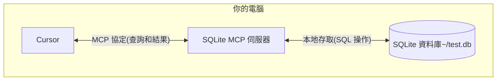

# 使用 MCP Python SDK 開發 MCP 伺服器與客戶端

在瞭解 MCP 的基礎知識後，我們將透過一個簡單範例來演示如何使用 MCP 協定。

## 如何在 Cursor 中使用 MCP

這裡我們將透過 MCP 協定將 Cursor（已支援 MCP 協定）連接到本地 SQLite 資料庫，並進行查詢與安全分析，流程如下圖所示：



這裡的 SQLite MCP 伺服器與本地 SQLite 資料庫之間的通信完全在你的電腦上進行。MCP 協定確保 Cursor 只能透過明確定義的介面執行核准的資料庫操作。這為你提供了一種安全的方式讓 Cursor 分析你的本地資料並與之互動，同時保持對其可存取內容的完全控制。

### 準備工作

開始前，請確保你的系統已安裝以下必備元件:

- macOS 或 Windows 作業系統
- 最新版本的 Claude Desktop
- uv 0.4.18 或更高版本 (使用 `uv --version` 檢查)
- Git (`git --version` 檢查)
- SQLite (`sqlite3 --version` 檢查)

對於 macOS 使用者，可以使用 [Homebrew](https://brew.sh/) 安裝這些元件：

```bash
# 使用 Homebrew
brew install uv git sqlite3

# 或直接下載：
# uv: https://docs.astral.sh/uv/
# Git: https://git-scm.com
# SQLite: https://www.sqlite.org/download.html
```

而對於 Windows 使用者，可以使用 [winget](https://docs.microsoft.com/en-us/windows/package-manager/winget/) 安裝這些元件：

```bash
# 使用 winget 安裝
winget install --id=astral-sh.uv -e
winget install git.git sqlite.sqlite

# 或直接下載：
# uv: https://docs.astral.sh/uv/
# Git: https://git-scm.com
# SQLite: https://www.sqlite.org/download.html
```

接下來我們會以 MacOS 為例進行說明，Windows 使用者可以參考 MacOS 的安裝步驟。

### 建立 SQLite 資料庫

首先我們來建立一個簡單的 SQLite 資料庫，並插入一些資料：

```bash
# 建立一個新的 SQLite 資料庫
sqlite3 ~/test.db <<EOF
CREATE TABLE products (
  id INTEGER PRIMARY KEY,
  name TEXT,
  price REAL
);

INSERT INTO products (name, price) VALUES
  ('Widget', 19.99),
  ('Gadget', 29.99),
  ('Gizmo', 39.99),
  ('Smart Watch', 199.99),
  ('Wireless Earbuds', 89.99),
  ('Portable Charger', 24.99),
  ('Bluetooth Speaker', 79.99),
  ('Phone Stand', 15.99),
  ('Laptop Sleeve', 34.99),
  ('Mini Drone', 299.99),
  ('LED Desk Lamp', 45.99),
  ('Keyboard', 129.99),
  ('Mouse Pad', 12.99),
  ('USB Hub', 49.99),
  ('Webcam', 69.99),
  ('Screen Protector', 9.99),
  ('Travel Adapter', 27.99),
  ('Gaming Headset', 159.99),
  ('Fitness Tracker', 119.99),
  ('Portable SSD', 179.99);
EOF
```

然後下載最新的 [Cursor](https://www.cursor.com/cn/downloads)，直接安裝即可。然後開啟 Cursor Settings 頁面，切換到 MCP 標籤頁，點擊右上角的 **+ Add new global MCP server** 按鈕。


然後會跳轉到一個全域的 MCP 設定檔，該檔案是一個 JSON 格式的檔案，可以在裡面定義所有 MCP 伺服器，這裡我們新增一個名為 `mcp-server-sqlite` 的 MCP 伺服器，如下所示：

```json
{
  "mcpServers": {
    "sqlite": {
      "command": "uvx",
      "args": ["mcp-server-sqlite", "--db-path", "/Users/YOUR_USERNAME/test.db"]
    }
  }
}
```

需要將 `YOUR_USERNAME` 替換為你的實際使用者名稱。上面的設定檔表示我們定義了名為 `sqlite` 的 MCP 伺服器，並指定使用 `uvx` 命令來啟動該伺服器，在 `args` 參數裡面指定了 MCP 伺服器以及實際的資料庫路徑為 `/Users/YOUR_USERNAME/test.db`。

> 我們也可以在特定的專案根目錄下面建立 `.cursor/mcp.json` 檔案，來設定特定專案中使用的 MCP 伺服器，這樣就可以在不同的專案中使用不同的 MCP 伺服器了。

儲存上面的設定後，回到 Cursor 中的 MCP 設定頁面，正常一會兒就可以看到 `sqlite` 的 MCP 伺服器了。


其中會將該 MCP 伺服器提供的所有 Tools 都列出來，然後我們就可以在 Cursor 中直接使用這些 Tools 了。

### 測試

接下來我們就可以在 Cursor 中來測試下這個 MCP 伺服器了。比如我們傳送如下所示的提示詞到 Cursor 中（需要使用 Agent 模式）：

```bash
你能連接到我的 SQLite 資料庫並告訴我有哪些產品及其價格嗎？
```

然後 Cursor 就會根據我們的提示詞去查詢我們的 SQLite 資料庫，可以看到這裡會選擇使用 `list-tables` 的 MCP 工具查詢資料庫中有哪些表，然後呼叫 `describe_table` 工具查看這個表的結構。


接著會去查詢資料庫獲取產品和對應的價格，甚至最後還提供了額外的統計資訊，也是透過 `read_query` 工具來實現的。


### 解析

可能大家還是會有很多疑問，為什麼我們只是在 Cursor 中新增了一個 sqlite 的 MCP 伺服器，就可以查詢到資料庫中的資料了？這幕後到底發生了什麼？

MCP 與 Cursor 互動的流程如下所示：

1. **伺服器發現**：Cursor 在啟動時連接到你設定的 MCP 伺服器
2. **協定握手**：當你詢問資料時，Cursor：

   1. 確定（透過 LLM）哪個 MCP 伺服器可以提供幫助（在本例中為 sqlite）
   2. 透過協定協商能力
   3. 從 MCP 伺服器請求資料或操作

3. **互動流程**：

   ```mermaid
   sequenceDiagram
      participant C as Cursor
      participant M as MCP 伺服器
      participant D as SQLite 資料庫

      C->>M: 初始化連接
      M-->>C: 回傳可用功能

      C->>M: 查詢請求
      M->>D: SQL 查詢
      D-->>M: 回傳結果
      M-->>C: 格式化結果
   ```

4. **安全**:

   - MCP 伺服器僅暴露特定的、受控的功能
   - MCP 伺服器在你的本地電腦上執行，它們存取的資源不會暴露在網際網路上
   - Cursor 需要使用者確認敏感操作

這裡可能大家還有點疑問就是 MCP 伺服器，我們並沒有編寫任何程式碼啊？其實是因為 Cursor 已經 內建實現了一系列的 MCP 伺服器，其中就包括 SQLite 的 MCP 伺服器，我們只需要設定好資料庫路徑即可。我們可以在官方的 git 倉庫中查看[內建的 MCP 伺服器列表](https://github.com/modelcontextprotocol/servers/tree/main/src)。


可以看到其中就包含一個 SQLite 的 MCP 伺服器。透過 SQLite 提供資料庫互動和智慧業務能力，該伺服器支援執行 SQL 查詢、分析業務資料等，所以我們直接設定即可使用。如果我們有自己的業務需求，也可以參考這些內建的實現自訂一個 MCP 伺服器即可。

## 開發 MCP 伺服器

在瞭解了 MCP 的一些基礎知識後，接下來我們將透過一個簡單的範例來演示如何開發一個 MCP 伺服器。

接下來我們將透過 [MCP Python SDK](https://github.com/modelcontextprotocol/python-sdk) 來演示如何編寫一個 MCP 伺服器。我們將建立一個天氣伺服器，提供當前天氣資料作為資源，並讓 Cursor 使用工具取得天氣預報。

這裡我們需要使用 [OpenWeatherMap API](https://openweathermap.org/api) 來取得天氣資料，直接註冊然後在 [API keys](https://home.openweathermap.org/api_keys) 頁面即可取得一個免費的 API 金鑰。

### 環境準備

這裡我們還是使用 [uv](https://docs.astral.sh/uv/) 來管理 Python 環境。

首先使用下面的命令初始化一個 uv 管理的專案：

```bash
uv init mcp-server-weather --python 3.13 # 最好指定下版本
cd mcp-server-weather
```

然後安裝 MCP Python SDK 依賴：

```bash
uv add "mcp[cli]"
```

然後我們就可以使用下面的命令來執行 `mcp` 這個開發工具命令：

```bash
$ uv run mcp

 Usage: mcp [OPTIONS] COMMAND [ARGS]...

 MCP development tools


╭─ Options ────────────────────────────────────────────────────────────────────────────────────────────────────────────────────────────────────────────────────────╮
│ --help          Show this message and exit.                                                                                                                      │
╰──────────────────────────────────────────────────────────────────────────────────────────────────────────────────────────────────────────────────────────────────╯
╭─ Commands ───────────────────────────────────────────────────────────────────────────────────────────────────────────────────────────────────────────────────────╮
│ version   Show the MCP version.                                                                                                                                  │
│ dev       Run a MCP server with the MCP Inspector.                                                                                                               │
│ run       Run a MCP server.                                                                                                                                      │
│ install   Install a MCP server in the Claude desktop app.                                                                                                        │
╰──────────────────────────────────────────────────────────────────────────────────────────────────────────────────────────────────────────────────────────────────╯
```

### 實現 MCP 伺服器

接下來我們就可以開始實現我們的 MCP 伺服器了。

直接在 `main.py` 檔案中實現一個天氣 MCP 伺服器，如下程式碼所示：

```python
"""
MCP Weather Server

一個基於 OpenWeatherMap API 的天氣 MCP 伺服器
提供取得當前天氣資訊和天氣預報的功能
"""

import os
from typing import Dict, Any, List
from datetime import datetime
import requests
from dotenv import load_dotenv

from mcp.server.fastmcp import FastMCP

# 載入環境變數
load_dotenv()

# 建立 MCP 伺服器
mcp = FastMCP("Weather")

# OpenWeatherMap API 設定
OPENWEATHER_API_KEY = os.getenv("OPENWEATHER_API_KEY")
if not OPENWEATHER_API_KEY:
    print("警告: 未找到 OPENWEATHER_API_KEY 環境變數")
    print("請在 .env 檔案中設定你的 OpenWeatherMap API 金鑰")

OPENWEATHER_BASE_URL = "https://api.openweathermap.org/data/2.5"


def format_temperature(temp_kelvin: float) -> str:
    """格式化溫度顯示（開爾文轉攝氏度）"""
    celsius = temp_kelvin - 273.15
    fahrenheit = celsius * 9/5 + 32
    return f"{celsius:.1f}°C ({fahrenheit:.1f}°F)"


def format_weather_info(weather_data: Dict[str, Any]) -> str:
    """格式化天氣資訊為易讀的字串"""
    main = weather_data.get("main", {})
    weather = weather_data.get("weather", [{}])[0]
    wind = weather_data.get("wind", {})
    clouds = weather_data.get("clouds", {})

    location = weather_data.get("name", "未知位置")
    country = weather_data.get("sys", {}).get("country", "")
    if country:
        location += f", {country}"

    # 基本天氣資訊
    description = weather.get("description", "").title()
    temp = format_temperature(main.get("temp", 0))
    feels_like = format_temperature(main.get("feels_like", 0))

    # 詳細資訊
    humidity = main.get("humidity", 0)
    pressure = main.get("pressure", 0)
    wind_speed = wind.get("speed", 0)
    wind_deg = wind.get("deg", 0)
    cloudiness = clouds.get("all", 0)

    # 可見度（以米為單位，轉換為公里）
    visibility = weather_data.get("visibility", 0) / 1000

    result = f"""🌍 **{location}**

🌤️ **當前天氣**: {description}
🌡️ **溫度**: {temp}
🤒 **體感溫度**: {feels_like}
💧 **濕度**: {humidity}%
🌪️ **氣壓**: {pressure} hPa
💨 **風速**: {wind_speed} m/s
🧭 **風向**: {wind_deg}°
☁️ **雲量**: {cloudiness}%
👁️ **能見度**: {visibility:.1f} km"""

    # 新增日出日落時間（如果有的話）
    sys_info = weather_data.get("sys", {})
    if "sunrise" in sys_info and "sunset" in sys_info:
        sunrise = datetime.fromtimestamp(sys_info["sunrise"]).strftime("%H:%M")
        sunset = datetime.fromtimestamp(sys_info["sunset"]).strftime("%H:%M")
        result += f"
🌅 **日出**: {sunrise}"
        result += f"
🌇 **日落**: {sunset}"

    return result


def format_forecast_info(forecast_data: Dict[str, Any]) -> str:
    """格式化天氣預報資訊"""
    city = forecast_data.get("city", {})
    location = city.get("name", "未知位置")
    country = city.get("country", "")
    if country:
        location += f", {country}"

    forecasts = forecast_data.get("list", [])

    result = f"📅 **{location} - 5天天氣預報**\n\n"

    # 按日期分组预报数据
    daily_forecasts: Dict[str, List[Dict[str, Any]]] = {}
    for forecast in forecasts:
        dt = datetime.fromtimestamp(forecast["dt"])
        date_key = dt.strftime("%Y-%m-%d")

        if date_key not in daily_forecasts:
            daily_forecasts[date_key] = []
        daily_forecasts[date_key].append(forecast)

    # 顯示每天的天氣預報
    for date_key, day_forecasts in list(daily_forecasts.items())[:5]:  # 只顯示5天
        date_obj = datetime.strptime(date_key, "%Y-%m-%d")
        date_str = date_obj.strftime("%m月%d日 (%A)")

        result += f"**{date_str}**\n"

        # 獲取當天的溫度範圍
        temps = [f["main"]["temp"] for f in day_forecasts]
        min_temp = format_temperature(min(temps))
        max_temp = format_temperature(max(temps))

        # 獲取主要天氣描述（出現頻率最高的）
        descriptions = [f["weather"][0]["description"] for f in day_forecasts]
        main_desc = max(set(descriptions), key=descriptions.count).title()

        # 獲取平均濕度和風速
        avg_humidity = sum(f["main"]["humidity"] for f in day_forecasts) / len(day_forecasts)
        avg_wind_speed = sum(f["wind"]["speed"] for f in day_forecasts) / len(day_forecasts)

        result += f"  🌤️ {main_desc}\n"
        result += f"  🌡️ {min_temp} - {max_temp}\n"
        result += f"  💧 湿度: {avg_humidity:.0f}%\n"
        result += f"  💨 風速: {avg_wind_speed:.1f} m/s\n\n"

    return result


@mcp.tool()
def get_current_weather(city: str) -> str:
    """
    獲取指定城市的當前天氣資訊

    Args:
        city: 城市名稱（英文或中文）

    Returns:
        格式化的當前天氣資訊
    """
    if not OPENWEATHER_API_KEY:
        return "❌ 錯誤: 未配置 OpenWeatherMap API 密钥。請設定 OPENWEATHER_API_KEY 環境變數。"

    print(f"正在獲取 {city} 的當前天氣資訊...")

    try:
        response = requests.get(
            f"{OPENWEATHER_BASE_URL}/weather",
            params={
                "q": city,
                "appid": OPENWEATHER_API_KEY,
                "lang": "zh_cn"
            },
            timeout=10
        )

        if response.status_code == 404:
            return f"❌ 錯誤: 找不到城市 '{city}'。請檢查城市名稱是否正確。"
        elif response.status_code == 401:
            return "❌ 錯誤: API 密钥無效。請檢查 OPENWEATHER_API_KEY 配置。"
        elif response.status_code != 200:
            return f"❌ 錯誤: API 請求失敗 (狀態碼: {response.status_code})"

        weather_data = response.json()
        return format_weather_info(weather_data)

    except requests.RequestException as e:
        return f"❌ 網路錯誤: {str(e)}"
    except Exception as e:
        return f"❌ 未知錯誤: {str(e)}"


@mcp.tool()
def get_weather_forecast(city: str, days: int = 5) -> str:
    """
    獲取指定城市的天氣預報

    Args:
        city: 城市名稱（英文或中文）
        days: 預報天數（1-5天，預設5天）

    Returns:
        格式化的天氣預報資訊
    """
    if not OPENWEATHER_API_KEY:
        return "❌ 錯誤: 未配置 OpenWeatherMap API 密钥。請設定 OPENWEATHER_API_KEY 環境變數。"

    if days < 1 or days > 5:
        return "❌ 錯誤: 預報天數必須在 1-5 天之間。"

    print(f"正在獲取 {city} 的 {days} 天天氣預報...")

    try:
        response = requests.get(
            f"{OPENWEATHER_BASE_URL}/forecast",
            params={
                "q": city,
                "appid": OPENWEATHER_API_KEY,
                "lang": "zh_cn"
            },
            timeout=10
        )

        if response.status_code == 404:
            return f"❌ 錯誤: 找不到城市 '{city}'。請檢查城市名稱是否正確。"
        elif response.status_code == 401:
            return "❌ 錯誤: API 密钥無效。請檢查 OPENWEATHER_API_KEY 配置。"
        elif response.status_code != 200:
            return f"❌ 錯誤: API 請求失敗 (狀態碼: {response.status_code})"

        forecast_data = response.json()
        return format_forecast_info(forecast_data)

    except requests.RequestException as e:
        return f"❌ 網路錯誤: {str(e)}"
    except Exception as e:
        return f"❌ 未知錯誤: {str(e)}"


@mcp.resource("weather://current/{city}")
def get_current_weather_resource(city: str) -> str:
    """獲取指定城市當前天氣的資源"""
    return f"當前天氣資訊資源: {city}"


@mcp.resource("weather://forecast/{city}")
def get_forecast_resource(city: str) -> str:
    """獲取指定城市天氣預報的資源"""
    return f"天氣預報資源: {city}"


@mcp.resource("weather://api-status")
def get_api_status() -> str:
    """獲取 API 狀態資訊"""
    if OPENWEATHER_API_KEY:
        return "✅ OpenWeatherMap API 密鑰已配置"
    else:
        return "❌ OpenWeatherMap API 密鑰未配置"


def main():
    """運行 MCP 伺服器"""
    print("🌤️ 啟動天氣 MCP 伺服器...")
    print("📍 支持的功能:")
    print("  - 獲取當前天氣 (get_current_weather)")
    print("  - 獲取天氣預報 (get_weather_forecast)")
    print()

    if not OPENWEATHER_API_KEY:
        print("⚠️  警告: 未配置 OpenWeatherMap API 密鑰")
        print("請創建 .env 檔案並添加以下內容:")
        print("OPENWEATHER_API_KEY=your_api_key_here")
        print()
        print("獲取 API 密鑰: https://openweathermap.org/api")
        print()

    mcp.run()


if __name__ == "__main__":
    main()
```

上面代碼其實很簡單，上面大部分都是我們去請求 OpenWeatherMap API 獲取天氣數據，然後組裝成我們想要的数据格式。核心的代碼其實就只有 `@mcp.tool()` 裝飾器修飾的兩個工具函數，分別對應獲取當前天氣和獲取天氣預報。

```python
@mcp.tool()
def get_current_weather(city: str) -> str:

@mcp.tool()
def get_weather_forecast(city: str, days: int = 5) -> str:
```

這裡我們使用 `mcp` 對象的 `tool` 方法來裝飾這兩個工具函數即可，這樣包裝後我們實現的方法會返回一個 MCP 的工具對象，該對象包含工具的名稱、描述、參數和返回值等信息。而 `mcp` 對象是通過前面的 `FastMCP` 類創建的，該類是 MCP 伺服器的一個實現，提供了一些便捷的方法來創建 MCP 伺服器。

```python
from mcp.server.fastmcp import FastMCP

# 創建 MCP 伺服器
mcp = FastMCP("Weather")
```

當然出來 tools 之外，如果還想提供 resources 資源，我們也可以使用 `mcp` 對象的 `resource` 方法來裝飾一個資源函數即可：

```python
@mcp.resource("weather://current/{city}")
def get_current_weather_resource(city: str) -> str:
    """獲取指定城市當前天氣的資源"""
    return f"當前天氣資訊資源: {city}"
```

然後我們在項目根目錄下面創建一個 `.env` 文件，並添加如下所示的環境變量即可：

```bash
OPENWEATHER_API_KEY=your_api_key_here
```

### 調試 MCP 伺服器

然後我們可以使用下面的命令來調試該 MCP 伺服器：

```bash
$ mcp dev main.py
Starting MCP inspector...
⚙️ Proxy server listening on port 6277
New connection
# ......
Stdio transport: command=/opt/homebrew/bin/uv, args=run,--with,mcp,mcp,run,main.py
Spawned stdio transport
Connected MCP client to backing server transport
Created web app transport
Set up MCP proxy
🔍 MCP Inspector is up and running at http://127.0.0.1:6274 🚀
New connection
```

該命令會啟動一個 MCP Inspector 的調試器，我們可以通過瀏覽器 `http://127.0.0.1:6274` 進行訪問，點擊左側的 `Connect` 按鈕，就可以連接到當前的 MCP 伺服器上，我們可以切換到 `Tools` 標籤頁，點擊 `List Tools` 就可以看到該伺服器提供的所有工具了。


我們可以看到當前的 MCP 伺服器提供了兩個工具，分別是 `get_current_weather` 和 `get_weather_forecast`，我們可以點擊其中一個工具，然後輸入參數，點擊 `Run Tool` 按鈕，就可以看到該工具的返回結果了。


### 在 Cursor 中測試

在 MCP Inspector 中測試沒有問題，那麼我們就可以將該 MCP 伺服器安裝到 Cursor 中，然後就可以在 Cursor 中使用該 MCP 伺服器了。

同樣在 Cursor 設置頁面，切換到 `MCP` 標籤頁，點擊右上角的 `+ Add new global MCP server` 按鈕，在彈出的 `mcp.json` 文件中添加如下所示的配置：

```json
{
  "mcpServers": {
    "weather": {
      "command": "uv",
      "args": ["--directory", "/Users/cnych/your-mcp-path", "run", "main.py"],
      "env": {
        "OPENWEATHER_API_KEY": "xxxxx"
      }
    }
  }
}
```

保存後，我們就可以在 Cursor 中看到該 MCP 伺服器了，並有兩個 Tools 工具。


然後我們可以在 Cursor Agent 模式下面詢問關於天氣的問題。


當我們詢問今天天氣的時候可以看到 Cursor 會去主動調用 `get_current_weather` 工具查詢當前城市的天氣，同樣詢問未來天氣的時候則會調用 `get_weather_forcaset` 工具查詢數據。

最後我們可以將這個 weather mcp 伺服器打包後發佈到 pypi 上面去，則其他用戶就可以直接指定我們這個包來安裝這個 MCP 伺服器了。

我們這裡實現的這個 MCP 伺服器是一個典型的 stdio 類型的 MCP 伺服器，它通過標準輸入輸出與客戶端進行交互，此外還可以通過 SSE 和 Streamable HTTP 等方式與客戶端進行交互。

## 开发 MCP 客户端

上面我們自己實現了一個簡單的 MCP 伺服器，並在 Cursor 中測試了該伺服器，那如果想要在其他地方使用該 MCP 伺服器呢？這個就需要我們去實現一個 MCP 客戶端了。

MCP Python SDK 提供了一個高級客戶端接口，用於使用各種方式連接到 MCP 伺服器，如下代碼所示：

```python
from mcp import ClientSession, StdioServerParameters, types
from mcp.client.stdio import stdio_client

# 創建 stdio 類型的 MCP 伺服器參數
server_params = StdioServerParameters(
    command="python",  # 可執行文件
    args=["example_server.py"],  # 可選的命令行參數
    env=None,  # 可選的環境變量
)

async def run():
    async with stdio_client(server_params) as (read, write):  # 創建一個 stdio 類型的客戶端
        async with ClientSession(read, write) as session:  # 創建一個客戶端會話
            # 初始化連接
            await session.initialize()

            # 列出可用的提示詞
            prompts = await session.list_prompts()

            # 獲取一個提示詞
            prompt = await session.get_prompt(
                "example-prompt", arguments={"arg1": "value"}
            )

            # 列出可用的資源
            resources = await session.list_resources()

            # 列出可用的工具
            tools = await session.list_tools()

            # 讀取一個資源
            content, mime_type = await session.read_resource("file://some/path")

            # 調用一個工具
            result = await session.call_tool("tool-name", arguments={"arg1": "value"})


if __name__ == "__main__":
    import asyncio

    asyncio.run(run())
```

上面代碼中我們創建了一個 stdio 類型的 MCP 客戶端，並使用 `stdio_client` 函數創建了一個客戶端會話，然後通過 `ClientSession` 類創建了一個客戶端會話，然後通過 `session.initialize()` 方法初始化連接，然後通過 `session.list_prompts()` 方法列出可用的提示詞，然後通過 `session.get_prompt()` 方法獲取一個提示詞，然後通過 `session.list_resources()` 方法列出可用的資源，然後通過 `session.list_tools()` 方法列出可用的工具，然後通過 `session.read_resource()` 方法讀取一個資源，然後通過 `session.call_tool()` 方法調用一個工具，這些都是 MCP 客戶端的常用方法。

但是在實際的 MCP 客戶端或者主機中我們一般會結合 LLM 來實現更加智能的交互，比如我們要實現一個基於 OpenAI 的 MCP 客戶端，那要怎麼實現呢？我們可以參考 Cursor 的方式：

- 首先通過一個 JSON 配置文件來配置 MCP 伺服器
- 讀取該配置文件，加載 MCP 伺服器列表
- 獲取 MCP 伺服器提供的可用工具列表
- 然後根據用戶的輸入，以及 Tools 列表傳遞給 LLM（如果 LLM 不支持工具調用，那麼就需要在 System 提示詞中告訴 LLM 如何調用這些工具）
- 根據 LLM 的返回結果，循環調用所有的 MCP 伺服器提供的工具
- 得到 MCP 工具的返回結果後，可以將返回結果發送給 LLM 得到更符合用戶意圖的回答

這個流程更符合我們實際情況的交互流程，下面我們實現一個基於 OpenAI 來實現一個簡單的 MCP 客戶端，完整代碼如下所示：

```python
#!/usr/bin/env python
"""
MyMCP 客戶端 - 使用 OpenAI 原生 tools 調用
"""

import asyncio
import json
import os
import sys
from typing import Dict, List, Any, Optional
from dataclasses import dataclass

from openai import AsyncOpenAI
from mcp import StdioServerParameters
from mcp.client.stdio import stdio_client
from mcp.client.session import ClientSession
from mcp.types import Tool, TextContent
from rich.console import Console
from rich.prompt import Prompt
from rich.panel import Panel
from rich.markdown import Markdown
from rich.table import Table
from rich.spinner import Spinner
from rich.live import Live
from dotenv import load_dotenv

# 加載環境變量
load_dotenv()

# 初始化 Rich console 控制台
console = Console()


@dataclass
class MCPServerConfig:
    """MCP 伺服器配置"""
    name: str
    command: str
    args: List[str]
    description: str
    env: Optional[Dict[str, str]] = None


class MyMCPClient:
    """MyMCP 客戶端"""

    def __init__(self, config_path: str = "mcp.json"):
        self.config_path = config_path
        self.servers: Dict[str, MCPServerConfig] = {}
        self.all_tools: List[tuple[str, Any]] = []  # (server_name, tool)
        self.openai_client = AsyncOpenAI(
            api_key=os.getenv("OPENAI_API_KEY")
        )

    def load_config(self):
        """從配置文件加載 MCP 伺服器配置"""
        try:
            with open(self.config_path, 'r', encoding='utf-8') as f:
                config = json.load(f)

            for name, server_config in config.get("mcpServers", {}).items():
                env_dict = server_config.get("env", {})
                self.servers[name] = MCPServerConfig(
                    name=name,
                    command=server_config["command"],
                    args=server_config.get("args", []),
                    description=server_config.get("description", ""),
                    env=env_dict if env_dict else None
                )

            console.print(f"[green]✓ 已加載 {len(self.servers)} 個 MCP 伺服器配置[/green]")
        except Exception as e:
            console.print(f"[red]✗ 加載配置文件失敗: {e}[/red]")
            sys.exit(1)

    async def get_tools_from_server(self, name: str, config: MCPServerConfig) -> List[Tool]:
        """從單個伺服器獲取工具列表"""
        try:
            console.print(f"[blue]→ 正在連接伺服器: {name}[/blue]")

            # 准备环境变量
            env = os.environ.copy()
            if config.env:
                env.update(config.env)

            # 創建伺服器參數
            server_params = StdioServerParameters(
                command=config.command,
                args=config.args,
                env=env
            )

            # 使用 async with 上下文管理器（雙層嵌套）
            async with stdio_client(server_params) as (read, write):
                async with ClientSession(read, write) as session:
                    await session.initialize()

                    # 獲取工具列表
                    tools_result = await session.list_tools()
                    tools = tools_result.tools

                    console.print(f"[green]✓ {name}: {len(tools)} 個工具[/green]")
                    return tools

        except Exception as e:
            console.print(f"[red]✗ 連接伺服器 {name} 失敗: {e}[/red]")
            console.print(f"[red]  錯誤類型: {type(e).__name__}[/red]")
            import traceback
            console.print(f"[red]  詳細錯誤: {traceback.format_exc()}[/red]")
            return []

    async def load_all_tools(self):
        """加載所有伺服器的工具"""
        console.print("\n[blue]→ 正在獲取可用工具列表...[/blue]")

        for name, config in self.servers.items():
            tools = await self.get_tools_from_server(name, config)
            for tool in tools:
                self.all_tools.append((name, tool))

    def display_tools(self):
        """顯示所有可用工具"""
        table = Table(title="可用 MCP 工具", show_header=True)
        table.add_column("伺服器", style="cyan")
        table.add_column("工具名稱", style="green")
        table.add_column("描述", style="white")

        # 按伺服器分組
        current_server = None
        for server_name, tool in self.all_tools:
            # 只在伺服器名稱變化時顯示伺服器名稱
            display_server = server_name if server_name != current_server else ""
            current_server = server_name

            table.add_row(
                display_server,
                tool.name,
                tool.description or "無描述"
            )
        console.print(table)

    def build_openai_tools(self) -> List[Dict[str, Any]]:
        """構建 OpenAI tools 格式的工具定義"""
        openai_tools = []

        for server_name, tool in self.all_tools:
            # 構建 OpenAI function 格式
            function_def = {
                "type": "function",
                "function": {
                    "name": f"{server_name}_{tool.name}",  # 添加伺服器前綴避免衝突
                    "description": f"[{server_name}] {tool.description or '無描述'}",
                    "parameters": tool.inputSchema or {"type": "object", "properties": {}}
                }
            }
            openai_tools.append(function_def)

        return openai_tools

    def parse_tool_name(self, function_name: str) -> tuple[str, str]:
        """解析工具名稱，提取伺服器名稱和工具名稱"""
        # 格式: server_name_tool_name
        parts = function_name.split('_', 1)
        if len(parts) == 2:
            return parts[0], parts[1]
        else:
            # 如果沒有下劃線，假設是第一個伺服器的工具
            if self.all_tools:
                return self.all_tools[0][0], function_name
            return "unknown", function_name

    async def call_tool(self, server_name: str, tool_name: str, arguments: Dict[str, Any]) -> Any:
        """調用指定的工具"""
        config = self.servers.get(server_name)
        if not config:
            raise ValueError(f"伺服器 {server_name} 不存在")

        try:
            # 準備環境變量
            env = os.environ.copy()
            if config.env:
                env.update(config.env)

            # 創建伺服器參數
            server_params = StdioServerParameters(
                command=config.command,
                args=config.args,
                env=env
            )

            # 使用 async with 上下文管理器（雙層嵌套）
            async with stdio_client(server_params) as (read, write):
                async with ClientSession(read, write) as session:
                    await session.initialize()

                    # 調用工具
                    result = await session.call_tool(tool_name, arguments)
                    return result

        except Exception as e:
            console.print(f"[red]✗ 調用工具 {tool_name} 失敗: {e}[/red]")
            raise

    def extract_text_content(self, content_list: List[Any]) -> str:
        """從 MCP 響應中提取文本內容"""
        text_parts: List[str] = []
        for content in content_list:
            if isinstance(content, TextContent):
                text_parts.append(content.text)
            elif hasattr(content, 'text'):
                text_parts.append(str(content.text))
            else:
                # 處理其他類型的內容
                text_parts.append(str(content))
        return "\n".join(text_parts) if text_parts else "✅ 操作完成，但沒有返回文本內容"

    async def process_user_input(self, user_input: str) -> str:
        """處理用戶輸入並返回最終響應"""

        # 構建工具
        openai_tools = self.build_openai_tools()

        try:
            # 第一次調用 - 讓 LLM 決定是否需要使用工具
            messages = [
                {"role": "system", "content": "你是一個智能助手，可以使用各種 MCP 工具來幫助用戶完成任務。如果不需要使用工具，直接返回回答。"},
                {"role": "user", "content": user_input}
            ]

            # 調用 OpenAI API
            kwargs = {
                "model": "deepseek-chat",
                "messages": messages,
                "temperature": 0.7
            }

            # 只有當有工具時才添加 tools 參數
            if openai_tools:
                kwargs["tools"] = openai_tools
                kwargs["tool_choice"] = "auto"

            # 使用 loading 特效
            with Live(Spinner("dots", text="[blue]正在思考...[/blue]"), console=console, refresh_per_second=10):
                response = await self.openai_client.chat.completions.create(**kwargs)  # type: ignore
            message = response.choices[0].message

            # 檢查是否有工具調用
            if hasattr(message, 'tool_calls') and message.tool_calls:  # type: ignore
                # 添加助手消息到歷史
                messages.append({  # type: ignore
                    "role": "assistant",
                    "content": message.content,
                    "tool_calls": [
                        {
                            "id": tc.id,
                            "type": "function",
                            "function": {
                                "name": tc.function.name,
                                "arguments": tc.function.arguments
                            }
                        } for tc in message.tool_calls  # type: ignore
                    ]
                })

                # 執行每個工具調用
                for tool_call in message.tool_calls:
                    function_name = tool_call.function.name  # type: ignore
                    arguments = json.loads(tool_call.function.arguments)  # type: ignore

                    # 解析伺服器名稱和工具名稱
                    server_name, tool_name = self.parse_tool_name(function_name)  # type: ignore

                    try:
                        # 使用 loading 特效調用工具
                        with Live(Spinner("dots", text=f"[cyan]正在調用 {server_name}.{tool_name}...[/cyan]"), console=console, refresh_per_second=10):
                            result = await self.call_tool(server_name, tool_name, arguments)

                        # 從 MCP 響應中提取文本內容
                        result_content = self.extract_text_content(result.content)
                        # 添加工具調用結果
                        messages.append({
                            "role": "tool",
                            "tool_call_id": tool_call.id,
                            "content": result_content
                        })
                        console.print(f"[green]✓ {server_name}.{tool_name} 调用成功[/green]")

                    except Exception as e:
                        # 添加錯誤信息
                        messages.append({
                            "role": "tool",
                            "tool_call_id": tool_call.id,
                            "content": f"錯誤: {str(e)}"
                        })
                        console.print(f"[red]✗ {server_name}.{tool_name} 調用失敗: {e}[/red]")

                # 獲取最終響應
                with Live(Spinner("dots", text="[blue]正在生成最终响应...[/blue]"), console=console, refresh_per_second=10):
                    final_response = await self.openai_client.chat.completions.create(
                        model="deepseek-chat",
                        messages=messages,  # type: ignore
                        temperature=0.7
                    )

                final_content = final_response.choices[0].message.content
                return final_content or "抱歉，我無法生成最終回答。"

            else:
                # 沒有工具調用，直接返回響應
                return message.content or "抱歉，我無法生成回答。"

        except Exception as e:
            console.print(f"[red]✗ 處理請求時出錯: {e}[/red]")
            return f"抱歉，處理您的請求時出現錯誤: {str(e)}"

    async def interactive_loop(self):
        """交互式循環"""
        console.print(Panel.fit(
            "[bold cyan]MyMCP 客戶端已啟動[/bold cyan]\n"
            "輸入您的问题，我會使用可用的 MCP 工具來幫助您。\n"
            "輸入 'tools' 查看可用工具\n"
            "輸入 'exit' 或 'quit' 退出。",
            title="歡迎使用 MCP 客戶端"
        ))

        while True:
            try:
                # 獲取用戶輸入
                user_input = Prompt.ask("\n[bold green]您[/bold green]")

                if user_input.lower() in ['exit', 'quit', 'q']:
                    console.print("\n[yellow]再見！[/yellow]")
                    break

                if user_input.lower() == 'tools':
                    self.display_tools()
                    continue

                # 處理用戶輸入
                response = await self.process_user_input(user_input)

                # 顯示響應
                console.print("\n[bold blue]助手[/bold blue]:")
                console.print(Panel(Markdown(response), border_style="blue"))

            except KeyboardInterrupt:
                console.print("\n[yellow]已中断[/yellow]")
                break
            except Exception as e:
                console.print(f"\n[red]錯誤: {e}[/red]")

    async def run(self):
        """運行客戶端"""
        # 加載配置
        self.load_config()

        if not self.servers:
            console.print("[red]✗ 没有配置的服务器[/red]")
            return

        # 獲取所有工具
        await self.load_all_tools()

        if not self.all_tools:
            console.print("[red]✗ 沒有可用的工具[/red]")
            return

        # 顯示可用工具
        self.display_tools()

        # 進入交互循環
        await self.interactive_loop()


async def main():
    """主函數"""
    # 檢查 OpenAI API Key
    if not os.getenv("OPENAI_API_KEY"):
        console.print("[red]✗ 請設置環境變量 OPENAI_API_KEY[/red]")
        console.print("提示: 创建 .env 文件并添加: OPENAI_API_KEY=your-api-key")
        sys.exit(1)

    # 创建并运行客户端
    client = MyMCPClient()
    await client.run()


if __name__ == "__main__":
    try:
        asyncio.run(main())
    except KeyboardInterrupt:
        console.print("\n[yellow]程序已退出[/yellow]")
    except Exception as e:
        console.print(f"\n[red]程序錯誤: {e}[/red]")
        sys.exit(1)
```

上面代碼中我們首先加載 `mcp.json` 文件，配置格式和 Cursor 的一致，來獲取所有我們自己配置的 MCP 伺服器，比如我們配置如下所示的 `mcp.json` 文件：

```json
{
  "mcpServers": {
    "weather": {
      "command": "uv",
      "args": ["--directory", ".", "run", "main.py"],
      "description": "天氣信息伺服器 - 獲取當前天氣和天氣預報",
      "env": {
        "OPENWEATHER_API_KEY": "xxxx"
      }
    },
    "filesystem": {
      "command": "npx",
      "args": ["-y", "@modelcontextprotocol/server-filesystem", "/tmp"],
      "description": "文件系統操作伺服器 - 文件讀寫和目錄管理"
    }
  }
}
```

然后在 `run` 方法中接着我們調用 `load_all_tools` 方法加載所有的工具列表，這裡的實現核心就是去調用 MCP 伺服器端的工具列表，如下所示：

```python
async def get_tools_from_server(self, name: str, config: MCPServerConfig) -> List[Tool]:
    """從單個伺服器獲取工具列表"""
    try:
        console.print(f"[blue]→ 正在連接伺服器: {name}[/blue]")

        # 準備環境變量
        env = os.environ.copy()
        if config.env:
            env.update(config.env)

        # 創建伺服器參數
        server_params = StdioServerParameters(
            command=config.command,
            args=config.args,
            env=env
        )

        # 使用 async with 上下文管理器（雙層嵌套）
        async with stdio_client(server_params) as (read, write):
            async with ClientSession(read, write) as session:
                await session.initialize()

                # 獲取工具列表
                tools_result = await session.list_tools()
                tools = tools_result.tools

                console.print(f"[green]✓ {name}: {len(tools)} 個工具[/green]")
                return tools

    except Exception as e:
        console.print(f"[red]✗ 連接伺服器 {name} 失敗: {e}[/red]")
        console.print(f"[red]  錯誤類型: {type(e).__name__}[/red
        return []
```

這裡核心就是直接使用 MCP Python SDK 提供的客戶端接口去調用 MCP 伺服器獲取工具列表。

接下來就是處理用戶的輸入了，這裡首先我們要做的是將獲取到的 MCP 工具列表轉換成 OpenAI 能夠識別的 function tools 格式，然後將用戶的輸入和工具一起發給 OpenAI 進行處理，然後根據返回結果判斷是否應該調用某個工具，如果需要同樣直接調用 MCP 的工具即可，最後將獲得的结果一起組裝發給 OpenAI 獲得一個更加完整的回答結果。這整個流程不複雜，當然還有很多細節可以優化，更多的還是根據我們自己的需求進行集成。

現在我們可以直接測試下結果：

```bash
$ python simple_client.py
✓ 已加載 1 個 MCP 伺服器配置

→ 正在獲取可用工具列表...
→ 正在連接伺服器: weather
[05/25/25 11:42:51] INFO     Processing request of type ListToolsRequest  server.py:551
✓ weather: 2 個工具
                              可用 MCP 工具
┏━━━━━━━━━┳━━━━━━━━━━━━━━━━━━━━━━┳━━━━━━━━━━━━━━━━━━━━━━━━━━━━━━━━━━━━━━┓
┃ 服务器  ┃ 工具名称             ┃ 描述                                 ┃
┡━━━━━━━━━╇━━━━━━━━━━━━━━━━━━━━━━╇━━━━━━━━━━━━━━━━━━━━━━━━━━━━━━━━━━━━━━┩
│ weather │ get_current_weather  │                                      │
│         │                      │ 獲取指定城市的當前天氣信息           │
│         │                      │                                      │
│         │                      │ Args:                                │
│         │                      │     city: 城市名称（英文）           │
│         │                      │                                      │
│         │                      │ Returns:                             │
│         │                      │     格式化的當前天氣信息             │
│         │                      │                                      │
│         │ get_weather_forecast │                                      │
│         │                      │ 獲取指定城市的天氣預報               │
│         │                      │                                      │
│         │                      │ Args:                                │
│         │                      │     city: 城市名称（英文）           │
│         │                      │     days: 预报天数（1-5天，默认5天） │
│         │                      │                                      │
│         │                      │ Returns:                             │
│         │                      │     格式化的天氣預報信息             │
│         │                      │                                      │
└─────────┴──────────────────────┴──────────────────────────────────────┘
╭────────────── 歡迎使用 MCP 客戶端 ──────────────╮
│ MyMCP 客戶端已啟動                              │
│ 輸入您的问题，我會使用可用的 MCP 工具來幫助您。 │
│ 輸入 'tools' 查看可用工具                       │
│ 輸入 'exit' 或 'quit' 退出。                    │
╰─────────────────────────────────────────────────╯

您: 你好,你是誰?
⠹ 正在思考...

助手:
╭──────────────────────────────────────────────────────────────────────────────────────────────────────────────────────────────────────────╮
│ 你好！我是一個智能助手，可以幫助你完成各種任務，比如回答問題、查詢天氣、提供建議等等。如果你有任何需要，隨時告訴我！ 😊                  │
╰──────────────────────────────────────────────────────────────────────────────────────────────────────────────────────────────────────────╯

您: 成都今天的天气咋样?明天适合穿裙子吗?
⠧ 正在思考...
⠴ 正在调用 weather.get_current_weather...[05/25/25 11:44:03] INFO     Processing request of type CallToolRequest                                                        server.py:551
⠴ 正在调用 weather.get_current_weather...
✓ weather.get_current_weather 调用成功
⠸ 正在调用 weather.get_weather_forecast...[05/25/25 11:44:04] INFO     Processing request of type CallToolRequest                                                        server.py:551
⠋ 正在调用 weather.get_weather_forecast...
✓ weather.get_weather_forecast 调用成功
⠧ 正在生成最终响应...

助手:
╭──────────────────────────────────────────────────────────────────────────────────────────────────────────────────────────────────────────╮
│ 成都今天天气晴朗，当前温度26.9°C，湿度44%，风力较小，非常适合外出活动。                                                                  │
│                                                                                                                                          │
│ 明天(5月25日)天气预报：                                                                                                                  │
│                                                                                                                                          │
│  • 天气：多云                                                                                                                            │
│  • 温度：26.4°C~29.3°C                                                                                                                   │
│  • 风力：3.1 m/s                                                                                                                         │
│  • 湿度：41%                                                                                                                             │
│                                                                                                                                          │
│ 建议：明天温度适中，风力不大，穿裙子完全没问题。不过建议搭配一件薄外套或防晒衣，因为多云天气紫外线可能较强。如果计划长时间在户外，可以带 │
│ 把晴雨伞备用。                                                                                                                           │
╰──────────────────────────────────────────────────────────────────────────────────────────────────────────────────────────────────────────╯

您:
```

从输出可以看到能够正常调用我们配置的 MCP 服务器提供的工具。
