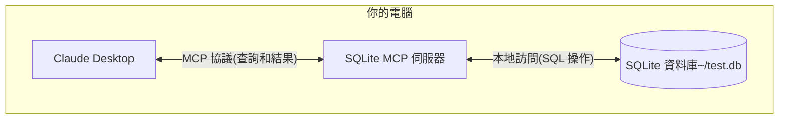

# 快速入門

在了解了 MCP 的一些基礎知識後，接下來我們將透過一個簡單的範例來示範如何使用 MCP 協議。這裡我們以官方提供的 [MCP 範例](https://modelcontextprotocol.io/tw/quickstart) 為例進行說明。

在這裡我們將透過 MCP 協議將 Claude Desktop 連接到本機 SQLite 資料庫，並進行查詢和安全分析，整個流程如下圖所示：



這裡的 SQLite MCP 伺服器和本地 SQLite 資料庫之間的通信完全在您的計算機上 — 您的 SQLite 資料庫不會暴露在互聯網上。MCP 協議確保 Claude Desktop 只能通過明確定義的介面執行批准的資料庫操作。這為您提供了一種安全的方式讓 Claude 分析您的本地資料並與之交互，同時保持對其可以訪問的內容的完全控制。

> Claude Desktop 的 MCP 支持目前正在開發人員預覽中，僅支持連接到機器上運行的本地 MCP 伺服器。尚未支持遠程 MCP 連接。此集成僅在 Claude Desktop 應用中可用，而不是 Claude Web 界面（Claude.ai）。

## 準備工作

在開始之前，請確保你的系統已經安裝了以下必備組件:

- macOS 或 Windows 作業系統
- 最新版本的 Claude Desktop
- uv 0.4.18 或更高版本 (使用 `uv --version` 檢查)
- Git (`git --version` 檢查)
- SQLite (`sqlite3 --version` 檢查)

對於 macOS 用戶，可以使用 [Homebrew](https://brew.sh/) 安裝這些組件：

```bash
# 使用 Homebrew
brew install uv git sqlite3

# 或者直接下載：
# uv: https://docs.astral.sh/uv/
# Git: https://git-scm.com
# SQLite: https://www.sqlite.org/download.html
```

對於 Windows 用戶，可以使用 [winget](https://docs.microsoft.com/en-us/windows/package-manager/winget/) 安裝這些組件：

```bash
# 使用 winget 安裝
winget install --id=astral-sh.uv -e
winget install git.git sqlite.sqlite

# 或者直接下載：
# uv: https://docs.astral.sh/uv/
# Git: https://git-scm.com
# SQLite: https://www.sqlite.org/download.html
```

## 安裝

接下來我們會以 macOS 為例進行說明，Windows 用戶可以參考 macOS 的安裝步驟。

首先我們來創建一個簡單的 SQLite 資料庫，並插入一些資料：

```bash
# 創建一個新的 SQLite 資料庫
sqlite3 ~/test.db <<EOF
CREATE TABLE products (
  id INTEGER PRIMARY KEY,
  name TEXT,
  price REAL
);

INSERT INTO products (name, price) VALUES
  ('Widget', 19.99),
  ('Gadget', 29.99),
  ('Gizmo', 39.99),
  ('Smart Watch', 199.99),
  ('Wireless Earbuds', 89.99),
  ('Portable Charger', 24.99),
  ('Bluetooth Speaker', 79.99),
  ('Phone Stand', 15.99),
  ('Laptop Sleeve', 34.99),
  ('Mini Drone', 299.99),
  ('LED Desk Lamp', 45.99),
  ('Keyboard', 129.99),
  ('Mouse Pad', 12.99),
  ('USB Hub', 49.99),
  ('Webcam', 69.99),
  ('Screen Protector', 9.99),
  ('Travel Adapter', 27.99),
  ('Gaming Headset', 159.99),
  ('Fitness Tracker', 119.99),
  ('Portable SSD', 179.99);
EOF
```

然後下載最新的 [Claude Desktop 應用](https://claude.ai/download)，直接安裝即可，打開後登錄你的 Claude 帳號即可正常使用。

然後使用任意編輯器來打開 Claude Desktop 的配置文件 `~/Library/Application Support/Claude/claude_desktop_config.json`。

比如我們這裡使用 VSCode 來打開配置文件：

```bash
# 打开配置文件
code ~/Library/Application\ Support/Claude/claude_desktop_config.json
```

然後添加以下配置：

```json
{
  "mcpServers": {
    "sqlite": {
      "command": "uvx",
      "args": ["mcp-server-sqlite", "--db-path", "/Users/YOUR_USERNAME/test.db"]
    }
  }
}
```

需要將 `YOUR_USERNAME` 替換為你的實際用戶名。上面的配置文件表示我們定義了名為 `sqlite` 的 MCP 伺服器，並指定使用 `uvx` 命令來啟動該伺服器，在 `args` 參數裡面指定了 MCP 伺服器以及實際的資料庫路徑為 `/Users/YOUR_USERNAME/test.db`。

保存上面的配置后，我們需要重新啟動 Claude Desktop 應用，然後就可以在應用內看到 `sqlite` 的 MCP 伺服器了。

## 測試

當重新啟動 Claude Desktop 後，我們可以在首頁輸入框右下角發現會多一個如下圖所示的按鈕：


這裡其實表示 Claude Desktop 已經成功加載了 SQLite MCP 伺服器，並且可以正常使用。我們點擊這個按鈕後，就可以看到可用的 MCP Tools 工具列表，如下圖所示：


從上圖可以看到我們可以進行很多操作，比如查詢資料庫中的資料，創建新的資料，更新資料，刪除資料等。

比如我們發送如下所示的提示詞到 Claude Desktop 中：

```
你能連接到我的 SQLite 資料庫並告訴我有哪些產品及其價格嗎？
```

然後 Claude Desktop 就會根據我們的提示詞去查詢我們的 SQLite 資料庫，第一次會彈出一個授權的對話框，如下圖所示：


可以看到這裡會選擇使用 `list-tables` 的 MCP 工具，這裡需要我們點擊 `Allow for This Chat` 按鈕來授權，然後後續可能會使用到其他工具，同樣需要授權。


授權完成後，我們就可以看到查詢結果了，如下圖所示：


正常情況下，Claude Desktop 會根據我們的提示詞去查詢資料庫，並返回結果。如果這個過程遇到了一些問題，我們可以查看下 Claude Desktop 的日誌來排查問題。

```bash
tail -n 20 -f ~/Library/Logs/Claude/mcp*.log


==> /Users/cnych/Library/Logs/Claude/mcp-server-sqlite.log <==
Installed 18 packages in 19ms

==> /Users/cnych/Library/Logs/Claude/mcp.log <==
2024-12-02T08:00:38.208Z [info] Attempting to connect to MCP server sqlite...
2024-12-02T08:00:38.217Z [info] Connected to MCP server sqlite!
```

## 解析

可能大家還是會有很多疑問，為什麼我們只是在 Claude Desktop 中添加了一個 sqlite 的 MCP 伺服器，就可以查詢到資料庫中的資料了？這幕後到底發生了什麼？

MCP 與 Claude Desktop 交互的流程如下所示：

1. **伺服器發現**：Claude Desktop 在啟動時連接到您配置的 MCP 伺服器
2. **協議握手**：當你詢問資料時，Claude Desktop：

   1. 確定哪個 MCP 伺服器可以提供幫助（在本例中為 sqlite）
   2. 通過協議協商能力
   3. 從 MCP 伺服器請求資料或操作

3. **交互流程**：

   ```mermaid
   sequenceDiagram
      participant C as Claude Desktop
      participant M as MCP 伺服器
      participant D as SQLite 資料庫

      C->>M: 初始化連接
      M-->>C: 返回可用功能

      C->>M: 查詢請求
      M->>D: SQL 查詢
      D-->>M: 返回結果
      M-->>C: 格式化結果
   ```

4. **安全**:

   - MCP 伺服器僅暴露特定的、受控的功能
   - MCP 伺服器在你的本地計算機上運行，它們訪問的資源不會暴露在互聯網上
   - Claude Desktop 需要用戶確認敏感操作

這裡可能大家還有些疑問，就是 MCP 伺服器的部分，我們並沒有編寫任何程式碼啊？其實是因為 Claude Desktop 已經內建實作了一系列的 MCP 伺服器，其中就包含了 SQLite 的 MCP 伺服器，我們只需要設定好資料庫路徑即可。我們可以在官方的 git 倉庫中查看 [內建的 MCP 伺服器清單](https://github.com/modelcontextprotocol/servers/tree/main/src)。


可以看到其中就包含了一個 SQLite 的 MCP 伺服器。透過 SQLite 提供資料庫互動和智慧業務能力，該伺服器支援執行 SQL 查詢、分析業務資料等，所以我們直接設定即可使用。如果我們有自己的業務需求，也可以參考這些內建的實作來自訂一個 MCP 伺服器。

## 存取檔案系統

同樣的方式我們可以來新增一個存取檔案系統的 MCP 伺服器，這樣我們就可以讓 Claude Desktop 管理我們本地的檔案系統了，我們可以直接使用 `filesystem` 這個 MCP 伺服器。

`filesystem` 這個 MCP 伺服器為檔案系統操作實作了模型上下文協定 (MCP)：

- 讀取/寫入檔案
- 建立/列出/刪除目錄
- 移動檔案/目錄
- 搜尋檔案
- 取得檔案中繼資料

這個伺服器支援的 Tools 清單如下：

- `read_file`：

  - 讀取檔案的完整內容
  - 輸入：`path`
  - 使用 UTF-8 編碼讀取完整的檔案內容

- `read_multiple_files`：

  - 同時讀取多個檔案
  - 輸入：`paths`
  - 讀取失敗不會停止整個操作

- `write_file`：

  - 建立新檔案或覆寫現有檔案
  - 輸入：
    - `path`：檔案位置
    - `content`：檔案內容

- `create_directory`：

  - 建立新目錄或確保其存在
  - 輸入：`path`
  - 如果需要，建立父目錄
  - 如果目錄已存在，則會默默成功

- `list_directory`：

  - 列出目錄中的檔案或目錄，並加上[file]或[dir]前綴
  - 輸入：`path`

- `move_file`：

  - 移動或重新命名檔案和目錄
  - 輸入：
    - `source`
    - `destination`
  - 如果目標已存在，則會失敗

- `search_files`：

  - 遞迴搜尋檔案/目錄
  - 輸入：
    - `path`：起始目錄
    - `pattern`：搜尋模式
  - 回傳符合的完整路徑

- `get_file_info`：

  - 取得詳細的檔案/目錄中繼資料
  - 輸入：`path`
  - 回傳：
    - 檔案大小
    - 建立時間
    - 修改時間
    - 存取時間
    - 類型（檔案/目錄）
    - 權限

- `list_allowed_directories`：
  - 列出允許伺服器存取的所有目錄
  - 無需輸入
  - 回傳：
    - 該伺服器可以讀取/寫入的目錄

同樣地，如果你要在 Claude Desktop 中使用這個 MCP 伺服器，只需要設定好檔案路徑即可，例如我們這裡使用桌面路徑：

```bash
code ~/Library/Application\ Support/Claude/claude_desktop_config.json
```

接著新增以下設定：

```json
{
  "mcpServers": {
    "filesystem": {
      "command": "npx",
      "args": [
        "-y",
        "@modelcontextprotocol/server-filesystem",
        "/Users/username/Desktop",
        "/path/to/other/allowed/dir"
      ]
    }
  }
}
```

將上述路徑參數替換為您的實際路徑即可，例如我們這裡的完整設定如下：

```json
{
  "mcpServers": {
    "sqlite": {
      "command": "uvx",
      "args": ["mcp-server-sqlite", "--db-path", "/Users/cnych/test.db"]
    },
    "filesystem": {
      "command": "npx",
      "args": [
        "-y",
        "@modelcontextprotocol/server-filesystem",
        "/Users/cnych/src"
      ]
    }
  }
}
```

這裡我們指定的是 `/Users/cnych/src` 目錄，接著儲存設定檔並重新啟動 Claude Desktop 應用程式即可。我們可以在輸入框右下角看到現在變成了一個 `15` 的按鈕：


點擊後可以看到可用的 MCP 工具列表，如下圖所示：


可以看到我們這裡可以讀取檔案、建立檔案、列出目錄、移動檔案、搜尋檔案等功能。

我們發送提示詞 `Can you list the contents of my src directory?` 後，Claude Desktop 就會列出我們指定目錄下的所有檔案和目錄，如下圖所示，當然過程也需要我們授權。


讓它幫我們寫一份 markdown 的使用指南，並儲存到 `markdown-usage.md` 檔案中 `Write a complete guide to markdown and save it to markdown-usage.md file`。


經過授權後，我們就可以看到 Claude Desktop 會自動將檔案寫入到我們本機的指定路徑了，如下圖所示：


