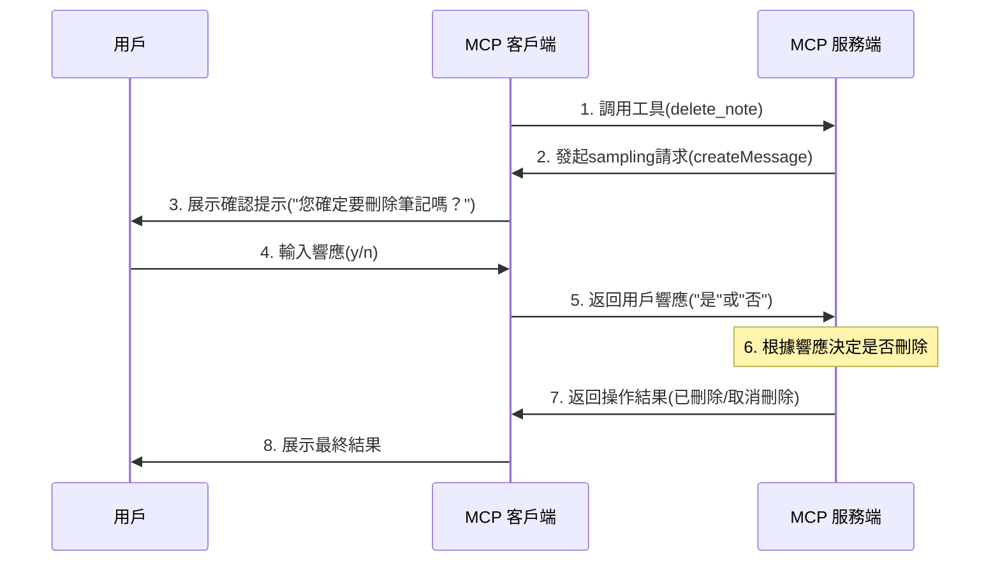

# MCP 中的 Sampling 功能

前面我們有提到 MCP 除了 `Resources`、`Prompts`、`Tools` 之外，還為我們提供了一個 `Sampling` 的功能，從字面上看可能有點難以理解，實際上這個功能就是允許伺服器在執行某些操作時請求用戶確認或進行互動式決策。比如當我們調用本地文件的刪除的工具的時候，肯定是期望我們確認後再進行刪除，這個時候就可以使用這個功能。

這是 MCP 協議中的一個特殊能力，讓開發者能夠在關鍵操作前請求用戶輸入。採樣（Sampling）在 MCP 中指的是伺服器向客戶端發起一個請求，要求用戶（通常是透過大語言模型）提供特定輸入。這個輸入可以是對某個問題的回答，或者是對某個操作的確認。

這與傳統的伺服器-客戶端模型不同，在 MCP 中，伺服器可以主動向客戶端發送請求，要求客戶端提供某種形式的"樣本"或"輸入"，這就是"採樣"的含義。

## 工作原理

`Sampling` 功能整體流程如下所示：

1. Server 向 client 發送 `sampling/createMessage` 請求
2. Client 審查請求並可以修改它
3. Client 從 LLM 中 `sampling`
4. Client 審查補全結果
5. Client 將結果返回給 server

這種人機交互設計確保用戶可以控制 LLM 看到和生成的內容。

## 消息格式

同樣 `Sampling` 功能請求使用標準化的消息格式：

```json
{
  messages: [
    {
      role: "user" | "assistant",
      content: {
        type: "text" | "image",
        // 對於文本：
        text?: string,
        // 對於圖像：
        data?: string,             // base64 編碼
        mimeType?: string
      }
    }
  ],
  modelPreferences?: {  // 模型偏好
    hints?: [{
      name?: string                // 模型名稱
    }],
    costPriority?: number,         // 成本優先級
    speedPriority?: number,        // 速度優先級
    intelligencePriority?: number  // 智能優先級
  },
  systemPrompt?: string,          // 系統提示
  includeContext?: "none" | "thisServer" | "allServers", // 上下文包含
  temperature?: number,           // 溫度
  maxTokens: number,             // 最大 tokens 數
  stopSequences?: string[],      // 停止序列
  metadata?: Record<string, unknown> // 元數據
}
```

其中 `messages` 陣列包含要發送給 LLM 的對話歷史。每條消息都有：

- `role`：`user` 或 `assistant`
- `content`：消息內容，可以是：
  - 帶有 `text` 字段的文本內容
  - 帶有 `data (base64)` 和 `mimeType` 字段的圖像內容

然後是模型偏好設置，`modelPreferences` 物件允許 servers 指定他們的模型選擇偏好：

- `hints`：模型名稱建議的陣列，clients 可以使用它來選擇合適的模型：
  - `name`：可以匹配完整或部分模型名稱的字串（例如 "claude-3", "sonnet"）
  - 客戶端可能會將提示詞映射到來自不同提供商的等效模型
  - 多個提示按優先順序評估
- 優先級：
  - `costPriority`：成本最小化的重要性
  - `speedPriority`：低延遲響應的重要性
  - `intelligencePriority`：高級模型功能的重要性

客戶端根據這些偏好及其可用模型進行最終的模型選擇。

然後是系統提示，`systemPrompt` 字段允許 mcp server 請求特定的 system prompt。客戶端可以修改或忽略它。

`includeContext` 參數用於指定需要包含的 MCP 上下文內容：

- `none`：不包含任何額外的上下文
- `thisServer`：包含來自請求 server 的上下文
- `allServers`：包含來自所有已連接 MCP server 的上下文

客戶端控制實際包含的上下文。

然後是 sampling 參數，使用以下參數微調 LLM sampling：

- `temperature`：控制隨機性（0.0 到 1.0）
- `maxTokens`：要生成的最大 tokens 數
- `stopSequences`：停止生成的序列陣列
- `metadata`：其他特定於提供商的參數

最後是響應格式，客戶端返回一個補全結果：

```json
{
  model: string, // 使用的模型的名稱
  stopReason?: "endTurn" | "stopSequence" | "maxTokens" | string,
  role: "user" | "assistant",
  content: {
    type: "text" | "image",
    text?: string,
    data?: string,
    mimeType?: string
  }
}
```

其中 `model` 是用於生成補全結果的模型名稱，`stopReason` 是停止生成的原因，`role` 是補全結果的角色，`content` 是補全結果的內容。

## 最佳實踐

在實現 sampling 功能時，我們可以遵循以下最佳實踐：

- 始終提供清晰、結構良好的 prompts
- 妥善處理文本和圖像內容
- 設置合理的 token 限制
- 透過 `includeContext` 包含相關上下文
- 使用前驗證響應內容
- 優雅地處理錯誤
- 考慮限制 sampling 請求的速率
- 記錄預期的 sampling 行為
- 使用各種模型參數進行測試
- 監控 sampling 成本

## 人工干預控制

Sampling 的設計考慮到了人工監督：

**對於提示詞**

- Clients 應該向用戶顯示建議的提示詞
- 用戶應該能夠修改或拒絕提示詞
- System prompts 可以被過濾或修改
- 上下文包含由客戶端控制

**對於補全結果**

- Clients 應該向用戶顯示補全結果
- 用戶應該能夠修改或拒絕補全結果
- Clients 可以過濾或修改補全結果
- 用戶控制使用哪個模型

**安全考慮**

在實現 sampling 時：

- 驗證所有消息內容
- 清理敏感信息
- 實現適當的速率限制
- 監控 sampling 使用情況
- 加密傳輸中的數據
- 處理用戶數據隱私
- 審計 sampling 請求
- 控制成本暴露
- 實現超時
- 優雅地處理模型錯誤

## 常見模式

**Agentic 自主工作流**

Sampling 實現了 agentic 自主行為模式，例如：

- 讀取和分析資源
- 根據上下文做出決策
- 生成結構化數據
- 處理多步任務
- 提供互動式幫助

**上下文管理**

上下文的最佳實踐：

- 請求最少必要的上下文
- 清楚地構建上下文
- 處理上下文大小限制
- 根據需要更新上下文
- 清理過時的上下文

**錯誤處理**

強大的錯誤處理應：

- 捕獲 sampling 失敗
- 處理超時錯誤
- 管理速率限制
- 驗證響應
- 提供回退行為
- 正確記錄錯誤

**限制**

請注意以下限制：

- Sampling 依賴於 client 的功能
- 用戶控制 sampling 行為
- 上下文大小有限制
- 可能會應用速率限制
- 應該考慮成本
- 模型可用性各不相同
- 響應時間各不相同
- 並非所有內容類型都受支持

## 實戰

接下來我們就來實現一個有刪除文件功能的 MCP 伺服器，並使用 `Sampling` 功能來實現刪除文件的 agentic 自主行為。



首先，初始化 MCP 伺服器：

```bash
$ npx @modelcontextprotocol/create-server mcpdemo
? What is the name of your MCP server? mcpdemo
? What is the description of your server? A Model Context Protocol server
? Would you like to install this server for Claude.app? No
✔ MCP server created successfully!

Next steps:
  cd mcpdemo
  npm install
  npm run build  # or: npm run watch
  npm link       # optional, to make available globally

$ cd mcpdemo
$ npm i

> mcpdemo@0.1.0 prepare
> npm run build


> mcpdemo@0.1.0 build
> tsc && node -e "require('fs').chmodSync('build/index.js', '755')"


added 17 packages, and audited 18 packages in 6s

1 package is looking for funding
  run `npm fund` for details

found 0 vulnerabilities
```

接下來直接修改 `src/index.ts` 文件。首先在 Server 的配置中啟用 `sampling` 功能：

```ts
const server = new Server(
  {
    name: "mcpdemo",
    version: "0.1.0",
  },
  {
    capabilities: {
      resources: {},
      tools: {},
      prompts: {},
      sampling: {}, // 啟用sampling功能
    },
  }
);
```

然後接下來我們添加一個刪除筆記的工具：

```ts
/**
 * Handler that lists available tools.
 * Exposes tools for creating and deleting notes.
 */
server.setRequestHandler(ListToolsRequestSchema, async () => {
  return {
    tools: [
      // {  // 原有的創建筆記工具
      //   name: "create_note",
      //   // ...
      // },
      {
        name: "delete_note",
        description: "Delete an existing note with confirmation",
        inputSchema: {
          type: "object",
          properties: {
            id: {
              type: "string",
              description: "ID of the note to delete",
            },
          },
          required: ["id"],
        },
      },
    ],
  };
});
```

然後重點就是在實現 `delete_note` 工具的請求處理：

```ts
/**
 * Handler for tool calls.
 * Handles both create_note and delete_note tools.
 */
server.setRequestHandler(CallToolRequestSchema, async (request) => {
  switch (request.params.name) {
    case "create_note": {
      // ...原有創建筆記的邏輯
    }

    case "delete_note": {
      const id = String(request.params.arguments?.id);
      if (!id) {
        throw new Error("Note ID is required");
      }

      const note = notes[id];
      if (!note) {
        throw new Error(`Note ${id} not found`);
      }

      try {
        // 向客戶端發送一個採樣請求，讓用戶確認是否要刪除筆記
        const confirmationResponse = await server.createMessage({
          messages: [
            {
              role: "user",
              content: {
                type: "text",
                text: `您確定要刪除筆記「${note.title}」嗎？請回覆"是"或"否"。`,
              },
            },
          ],
          systemPrompt:
            "您是一個幫助用戶確認是否刪除文件的助手。請只回覆'是'或'否'。",
          maxTokens: 10,
          temperature: 0.1,
          includeContext: "none",
        });

        // 獲取用戶的響應文本
        let userResponse = "";
        if (
          confirmationResponse?.content?.type === "text" &&
          typeof confirmationResponse?.content?.text === "string"
        ) {
          userResponse = confirmationResponse.content.text.toLowerCase();
        }

        // 檢查用戶是否確認刪除
        if (userResponse.includes("是") || userResponse.includes("yes")) {
          // 刪除筆記
          delete notes[id];
          return {
            content: [
              {
                type: "text",
                text: `已刪除筆記${id}: ${note.title}`,
              },
            ],
          };
        } else {
          // 用戶未確認，取消刪除
          return {
            content: [
              {
                type: "text",
                text: `取消刪除筆記${id}: ${note.title}`,
              },
            ],
          };
        }
      } catch (error) {
        // 處理sampling或刪除過程中的錯誤
        const errorMessage =
          error instanceof Error ? error.message : String(error);
        return {
          content: [
            {
              type: "text",
              text: `刪除操作失敗: ${errorMessage}`,
            },
          ],
        };
      }
    }

    default:
      throw new Error("Unknown tool");
  }
});
```

在處理刪除筆記的時候，我們向客戶端發送了一個採樣請求，讓用戶確認是否要刪除筆記，這裡我們使用的是 `server.createMessage` 方法，這個方法就是用來發送採樣請求的，然後請求參數參考前面介紹的 `Sampling` 功能消息格式，如下所示：

```ts
const confirmationResponse = await server.createMessage({
  messages: [
    {
      role: "user",
      content: {
        type: "text",
        text: `您確定要刪除筆記「${note.title}」嗎？請回覆"是"或"否"。`,
      },
    },
  ],
  systemPrompt: "您是一個幫助用戶確認是否刪除文件的助手。請只回覆'是'或'否'。",
  maxTokens: 10,
  temperature: 0.1,
  includeContext: "none",
});
```

這樣在 MCP 客戶端我們就需要接受這個採樣請求，並給出響應，然後 MCP 伺服器會根據用戶的響應來決定是否刪除筆記。我們這裡的邏輯是如果用戶回覆中包含了 "是" 或者 "yes"，則刪除筆記，否則不刪除。

所以需要客戶端支持採樣請求，並給出響應，接下來我們需要在客戶端中來接受這個採樣請求，並給出響應。

```ts
// 初始化客戶端的時候需要啟用採樣功能
const client = new Client(
  { name: "mcpdemo-client", version: "0.1.0" },
  {
    capabilities: {
      sampling: {}, // 啟用採樣功能
    },
  }
);

// 處理採樣請求
function setupSampling(client: Client) {
  const confirmHandler = new SamplingConfirmHandler();

  client.setRequestHandler(CreateMessageRequestSchema, async (request) => {
    // 提取用戶消息
    const userMessages = request.params.messages.filter(
      (m) => m.role === "user"
    );
    const lastUserMessage = userMessages[userMessages.length - 1];

    // 獲取文本內容
    let userRequest = "未提供明確操作";
    if (lastUserMessage?.content.type === "text") {
      userRequest = lastUserMessage.content.text;
    }

    // 分析請求內容
    const analysis = await confirmHandler.analyzeRequest({
      model: "model",
      role: "assistant",
      content: {
        type: "text",
        text: userRequest,
      },
      systemPrompt: request.params.systemPrompt,
    });

    // 獲取用戶確認
    const isConfirmed = await confirmHandler.getConfirmation(
      `您是否同意執行此操作? (y/n): `,
      20000
    );

    // 返回響應
    const response = isConfirmed ? "是" : "否";

    return {
      model: "stub-model",
      stopReason: "endTurn",
      role: "assistant",
      content: {
        type: "text",
        text: response,
      },
    };
  });
}
```

上面客戶端代碼中透過 `client.setRequestHandler(CreateMessageRequestSchema, async (request) => {}` 方法來接受採樣請求，我們可以將伺服器端發送過來的參數組裝成一個 LLM 的請求，因為在服務端我們傳遞了 `systemPrompt`、`maxTokens`、`temperature`、`messages` 等參數，客戶端這裡的處理邏輯要看具體的場景，比如我們也可以不進行 LLM 的分析，直接給一個提示，詢問用戶是否同意執行此操作。

下面是我們的測試過程：

```bash
npm run client

> mcpdemo@0.1.0 client
> node dist/client.js


[成功] 已連接到伺服器
[信息] 輸入命令或exit退出:

> 列出所有筆記資源
✓ 分析完成 (用時: 6.03s)
[AI] 決定: 我將列出所有可用資源

--- 列出所有資源 ---
[信息] 找到 2 個資源
[信息] 以下是所有可用資源:
1. First Note (note:///1)
   A text note: First Note
2. Second Note (note:///2)
   A text note: Second Note


> 刪除筆記 1
✓ 分析完成 (用時: 8.23s)
[AI] 決定: 我將調用工具刪除指定的筆記
[AI] 我將調用工具 "delete_note" 來完成您的請求

--- 調用工具: delete_note ---
[信息] 工具描述: Delete an existing note with confirmation
[信息] 輸入參數:
[信息]   id: "1"

--- 收到伺服器採樣請求 ---
✓ 分析結果: 否 (用時: 4.29s)
[信息] 請在20秒內回答，否則默認為"否"
您是否同意執行此操作? (y/n):
[分析結果: 否]y
[信息] 用戶決定: 是
[信息] 工具返回內容:
[信息] 已刪除筆記1: First Note

>
```

從上面的測試過程我們可以看到，當輸入 `刪除筆記 1` 的時候，經過 LLM 的分析，告訴我們需要調用 `delete_note` 工具來刪除筆記，然後 MCP 伺服器會向客戶端調用這個工具的請求，這個時候在伺服器端的 `delete_note` 工具的請求處理中，會向客戶端發送一個採樣請求，詢問用戶是否同意刪除筆記，如果用戶同意，則刪除筆記，否則不刪除。

## 總結

通過上面的實戰，我們可以看到 `Sampling` 功能在 MCP 中是非常重要的一個功能，它允許 servers 透過 client 請求 LLM 補全，從而實現複雜的 agentic 行為，同時保持安全性和隱私性。