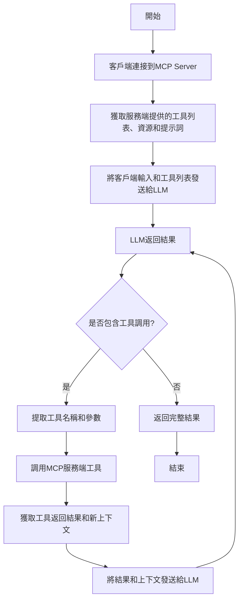

# 開發一個 TypeScript MCP 客戶端

在[上一節](/docs/write-ts-server)中，我們已經成功開發了一個天氣預報的 MCP Server，現在我們可以在支援 MCP 協定的客戶端中使用它，例如 Claude Desktop、Cursor 等。


但如果我們希望能夠自己開發一個客戶端，該怎麼做呢？

接下來我們將為大家介紹如何開發一個 MCP 客戶端。

## 流程

開發一個 MCP 客戶端其實很簡單：

1. 首先需要透過客戶端連接到 MCP Server
2. 連接後就可以透過客戶端取得伺服器提供的工具清單（包含資源、提示詞）
3. 然後將客戶端的輸入和工具清單傳送給支援工具的 LLM（如 OpenAI、Anthropic 等）
4. 從 LLM 的回應中取得工具名稱和參數
5. 使用上述工具名稱和參數來呼叫 MCP 伺服器工具
6. 呼叫工具後，將工具的返回結果和新的上下文（包含提示詞、資源）傳送給 LLM
7. 重複上述步驟，直到 LLM 返回完整結果

可以參考以下流程：



## 准备工作

接下來我們將使用 TypeScript 來開發一個能夠調用前面天氣預報的 MCP 客戶端。需要準備的環境如下：

- Node.js 16 及以上版本
- npm 最新版本
- Anthropic API key (Claude)

接下來我們將創建一個專案目錄，並初始化 npm 專案：

```bash
mkdir mcpclient-demo
cd mcpclient-demo
npm init -y
```

安裝依賴：

```bash
npm install @anthropic-ai/sdk @modelcontextprotocol/sdk dotenv
npm install -D @types/node typescript
```

創建源文件：

```bash
touch index.ts
```

更新 `package.json` 文件內容，添加 `build` 腳本並設置類型為 `module`：

```json
{
  "name": "mcpclient-demo",
  "version": "1.0.0",
  "main": "index.js",
  "type": "module",
  "scripts": {
    "build": "tsc && chmod 755 build/index.js"
  },
  "keywords": [],
  "author": "",
  "license": "ISC",
  "description": "",
  "dependencies": {
    "@anthropic-ai/sdk": "^0.39.0",
    "@modelcontextprotocol/sdk": "^1.7.0",
    "dotenv": "^16.4.7"
  },
  "devDependencies": {
    "@types/node": "^22.13.12",
    "typescript": "^5.8.2"
  }
}
```

由於我們這裡使用的是 TypeScript，所以還需要做根目錄下創建一個 `tsconfig.json` 文件，該文件是 TypeScript 的配置文件，內容如下：

```json
{
  "compilerOptions": {
    "target": "ES2022",
    "module": "Node16",
    "moduleResolution": "Node16",
    "outDir": "./build",
    "rootDir": "./",
    "strict": true,
    "esModuleInterop": true,
    "skipLibCheck": true,
    "forceConsistentCasingInFileNames": true
  },
  "include": ["index.ts"],
  "exclude": ["node_modules"]
}
```

接下來我們將準備好的 `ANTHROPIC_API_KEY` 等環境變量寫入到 `.env` 文件中：

```text
ANTHROPIC_API_KEY=sk-xxxx
ANTHROPIC_BASE_URL=https://api.anthropic.com
ANTHROPIC_MODEL=claude-3-7-sonnet-20250219
```

## 創建客戶端

接下來我們就可以開始創建客戶端了。

> 下面的所有操作都在 `index.ts` 文件中進行。

首先我們需要讀取環境變量中的 API Key 等配置：

```typescript
import dotenv from "dotenv";

dotenv.config();

const ANTHROPIC_API_KEY = process.env.ANTHROPIC_API_KEY;
const ANTHROPIC_BASE_URL =
  process.env.ANTHROPIC_BASE_URL || "https://api.anthropic.com";
const ANTHROPIC_MODEL =
  process.env.ANTHROPIC_MODEL || "claude-3-7-sonnet-20250219";

if (!ANTHROPIC_API_KEY) {
  throw new Error("ANTHROPIC_API_KEY is not set");
}

if (!ANTHROPIC_BASE_URL) {
  throw new Error("ANTHROPIC_BASE_URL is not set");
}
```

接下來我們將創建一個 `MCPClient` 類，並初始化 MCP 客戶端和 Anthropic 客戶端：

```typescript
import { Client } from "@modelcontextprotocol/sdk/client/index.js";
import { Tool } from "@anthropic-ai/sdk/resources/messages/messages.mjs";
import { StdioClientTransport } from "@modelcontextprotocol/sdk/client/stdio.js";
import { Anthropic } from "@anthropic-ai/sdk";

class MCPClient {
  private mcp: Client;
  private anthropic: Anthropic;
  private transport: StdioClientTransport | null = null;
  private tools: Tool[] = [];

  constructor() {
    this.anthropic = new Anthropic({
      apiKey: ANTHROPIC_API_KEY,
      baseURL: ANTHROPIC_BASE_URL,
    });
    this.mcp = new Client({ name: "mcpclient-demo", version: "1.0.0" });
  }
}
```

這裡我們使用 Claude 的 API 來作為 LLM 的實現，其中的 `mcp` 屬性是一個 MCP 客戶端，直接通過 `new Client` 創建即可，這樣我們就擁有了 MCP 客戶端的全部能力。

接下來就是讓我們的 MCP 客戶端連接到前面開發好的 MCP Server，由於我們這裡的 MCP Server 是一個 Node.js 的腳本，所以我們只需要提供腳本的路徑，然後通過 `StdioClientTransport` 來連接即可。連接成功後，我們就可以通過 `listTools` 方法來獲取服務端提供的工具列表。

```typescript
async connectToServer(serverScriptPath: string) {
    try {
      const isJs = serverScriptPath.endsWith(".js");
      if (!isJs) {
        throw new Error("Server script must be a .js file");
      }
      const command = process.execPath;

      // 初始化transport
      this.transport = new StdioClientTransport({
        command,
        args: [serverScriptPath],
      });
      // 連接到server
      this.mcp.connect(this.transport);
      // 獲取tools列表
      const toolsResult = await this.mcp.listTools();
      this.tools = toolsResult.tools.map((tool) => {
        return {
          name: tool.name,
          description: tool.description,
          input_schema: tool.inputSchema,
        };
      });
      console.log(
        "Connected to server with tools:",
        this.tools.map(({ name }) => name)
      );
    } catch (e) {
      console.log("Failed to connect to MCP server: ", e);
      throw e;
    }
  }
```

工具列表獲取到了，接下來就是如何使用這些工具了。

比如我們現在是一個聊天應用，那麼正常的流程就是將我的需求發送給 LLM，然後 LLM 返回結果，但是現在我們希望在合適的時候能夠調用我們服務端提供的工具，那麼這個時候怎麼辦呢？

也很簡單，我們只需要將我們的需求和工具一起發送給 LLM（我們這裡是 Anthropic），然後 LLM 返回結果，如果返回的結果是需要調用工具的，那麼我們就可以通過 MCP 客戶端的 `callTool` 方法來調用工具，當然工具執行的結果我們還需要發送給 LLM 進行處理一次，最後我們就可以得到最終的結果。

下面我們來看下具體的實現：

```typescript
  async processQuery(query: string) {
    // 初始化messages
    const messages: MessageParam[] = [
      {
        role: "user",
        content: query,
      },
    ];

    // 調用anthropic
    const response = await this.anthropic.messages.create({
      model: ANTHROPIC_MODEL,
      max_tokens: 1000,
      messages,
      tools: this.tools,
    });

    // 初始化finalText和toolResults
    const finalText = [];
    const toolResults = [];

    // 遍歷response.content
    for (const content of response.content) {
      if (content.type === "text") {  // 如果content的類型是text，則表示是文本
        finalText.push(content.text);
      } else if (content.type === "tool_use") {  // 如果content的類型是tool_use，則表示需要調用工具
        // 獲取toolName和toolArgs
        const toolName = content.name;
        const toolArgs = content.input as { [x: string]: unknown } | undefined;

        // 調用tool
        const result = await this.mcp.callTool({
          name: toolName,
          arguments: toolArgs,
        });

        // 添加tool調用信息到finalText
        finalText.push(
          `[Calling tool ${toolName} with args ${JSON.stringify(toolArgs)}]`
        );

        // 添加tool調用結果到messages
        messages.push({
          role: "user",
          content: result.content as string,
        });

        // 調用anthropic
        const response = await this.anthropic.messages.create({
          model: ANTHROPIC_MODEL,
          max_tokens: 1000,
          messages,
        });

        // 合併tool調用結果到finalText
        finalText.push(
          response.content[0].type === "text" ? response.content[0].text : ""
        );
      }
    }

    return finalText.join("\n");
  }

  async chatLoop() {
    const rl = readline.createInterface({
      input: process.stdin,
      output: process.stdout,
    });

    try {
      console.log("\nMCP Client Started!");
      console.log("Type your queries or 'exit' to exit.");

      while (true) {
        // 讀取用戶輸入
        const message = await rl.question("\nQuery: ");
        // 如果用戶輸入exit，則退出
        if (message.toLowerCase() === "exit") {
          break;
        }

        try {
          // 處理用戶輸入
          const response = await this.processQuery(message);
          // 輸出結果
          console.log("\n" + response);
        } catch (e) {
          console.log("Error: ", e);
        }
      }
    } finally {
      rl.close();
    }
  }

  async cleanup() {
    await this.mcp.close();
  }
```

到這裡我們就完成了一個 MCP 客戶端的核心功能 - 調用服務端提供的工具。最後只需要在 `main` 函數中進行一些初始化操作，就可以開始我們的聊天了。

```typescript
async function main() {
  if (process.argv.length < 3) {
    console.log("Usage: node index.ts <path_to_server_script>");
    return;
  }
  const mcpClient = new MCPClient();
  try {
    await mcpClient.connectToServer(process.argv[2]);
    await mcpClient.chatLoop();
  } finally {
    await mcpClient.cleanup();
    process.exit(0);
  }
}

main();
```

## 測試

接下來執行下面的命令構建客戶端：

```bash
npm run build
```

上面的命令會生成一個 `build/index.js` 文件，然後我們就可以開始測試了。

```bash
node build/index.js
Usage: node index.ts <path_to_server_script>
```

可以看到我們這裡只需要傳入一個 MCP Server 的腳本路徑，然後我們就可以開始測試了。

```bash
node build/index.js /Users/cnych/src/weather-server/build/index.js
# output
Weather MCP server running on stdio
Connected to server with tools: [ 'get_forecast' ]

MCP Client Started!
Type your queries or 'exit' to exit.

Query: Beijing weather for the next 3 days

I can get the weather forecast for Beijing for the next 3 days. Let me do that for you now.
[Calling tool get_forecast with args {"city":"Beijing","days":3}]
# Beijing Weather Forecast

## Next 3 Days:
- **March 24, 2025**: 21°C with overcast clouds
- **March 25, 2025**: 21°C with scattered clouds
- **March 26, 2025**: 20°C with overcast clouds

The temperature will remain relatively stable around 20-21°C over the next three days, with cloudy conditions throughout. March 25th will have partially clear skies with scattered clouds, while the other days will be predominantly overcast.

Query:
```

上面我們提供的 MCP Server 腳本就是前面我們開發好的天氣預報服務，這裡我們要求查詢北京未來 3 天的天氣情況，可以看到我們這裡就調用了服務端提供的 `get_forecast` 工具，並傳入了 `city` 和 `days` 參數，然後我們就可以得到最終的結果。


到這裡我們就完成了一個非常簡單的 MCP 客戶端的開發，並且通過這個客戶端我們就可以調用服務端提供的工具，並得到最終的結果。

當然我們這裡的這個客戶端非常簡單，只是一個 Stdio 協議的，如果要鏈接 SSE 協議的 MCP Server，那麼我們就需要添加一個 SSE 協議的客戶端，我們將在後續的章節中為大家介紹。
