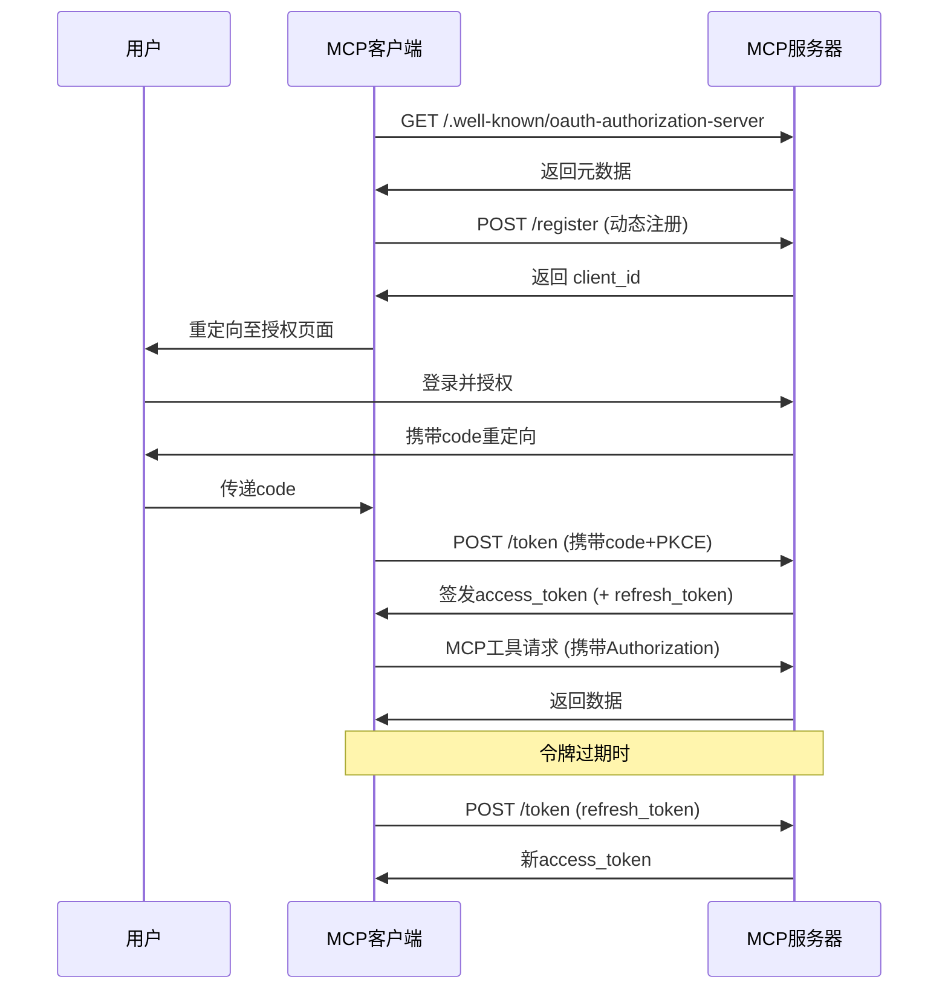

# MCP 授权机制解析

2024 年 11 月 5 日发布的 MCP 初始版本未包含授权功能。在 2025 年 3 月 26 日的更新中，MCP 协议引入了基于 OAuth 2.1 的授权机制。最新版 MCP 草案中，社区进一步完善了这套支持 HTTP、SSE、Streamable HTTP 等多种传输模式的授权协议。通过授权机制，MCP 客户端能够安全地代表用户或应用程序访问受限制的 MCP 工具和资源。


## MCP 授权规范

MCP 授权规范定义了 MCP 服务器（远程）与 MCP 客户端之间的认证流程。OAuth 作为授权框架，主要解决用户如何授权第三方应用访问其资源的问题。如需了解 OAuth 详情，请参阅[AuthWiki-OAuth](https://auth.wiki/zh/oauth-2.0)。

在 MCP 客户端与服务端的场景中，这表现为"用户授权 MCP 客户端访问其在 MCP 服务器上的资源"。当前，"MCP 服务器上的用户资源"主要指 MCP 服务器提供的工具或后端服务资源。

为实现 OAuth 2.1 认证流程，协议要求 MCP 服务器提供以下端点，与客户端协作完成 OAuth 2.1 流程：

- `/.well-known/oauth-authorization-server`：OAuth 服务元数据
- `/authorize`：授权请求端点
- `/token`：令牌交换与刷新端点
- `/register`：客户端动态注册端点

认证流程如下图所示：


规范还规定了 MCP 服务器如何通过第三方授权服务器支持委托授权。示例如下：


在此场景中，即使 MCP 服务器将授权委托给第三方，对 MCP 客户端而言它仍是授权服务器，因为必须签发自己的访问令牌。

这种方式更适合 MCP 服务器代理客户端访问第三方资源（如 GitHub 仓库）的场景，而非访问自身资源。

综上，协议将 MCP 服务器定位为 OAuth 框架中的授权服务器和资源服务器双重角色。

接下来，我们来研究一下 MCP 服务器在这些角色中的职责。

### 作为授权服务器的 MCP 服务端

当 MCP 服务器作为授权服务器时，意味着终端用户在 MCP 服务器上拥有身份。服务器需认证这些用户并签发访问令牌以获取资源。

必需的授权端点意味着 MCP 服务器必须实现授权服务器功能，这对开发者存在挑战：

- 许多开发者不熟悉 OAuth 概念
- 实现授权服务器涉及大量安全考量

协议不限制 MCP 服务器必须自行实现此功能。开发者可将这些端点重定向或代理到第三方授权服务器。对 MCP 客户端而言，这与服务器自行处理授权无区别。


你可能会想知道这种方法是否应该使用前面提到的委托第三方授权方法。

这取决于第三方授权服务是否与 MCP 服务器共享相同的用户群：

- 如果是，MCP 服务器可以将与 Auth 相关的端点转发给第三方服务。
- 如果不是，则应使用协议中指定的委托第三方授权方法，要求 MCP 服务器维护其令牌与第三方令牌之间的映射关系。

委托方式在实际场景中较为模糊。协议要求即使委托时 MCP 服务器也需签发自身令牌，增加了实现复杂度。这可能是出于安全考虑（如令牌泄露/滥用）。

从经验看，委托方式最适合"用户授权 MCP 服务器访问第三方资源"的场景。例如 MCP 服务器需要访问用户 GitHub 仓库来部署代码。此时 MCP 服务器既是客户端的授权服务器（针对自身资源），又是 GitHub 的客户端（针对第三方资源）。

因此，委托协议解决的是**如何授权 MCP 服务器访问用户在第三方服务器上的资源**。

### 作为资源服务器的 MCP 服务端

作为资源服务器，MCP 服务器需验证客户端请求是否携带有效访问令牌，并通过 scope 检查资源访问权限。

按 MCP 定义，资源应是面向 MCP 客户端的工具。但实践中这些工具常与 MCP 服务器后端资源交互。此时从客户端获取的访问令牌会被复用于后端访问。

这种情况下，MCP 服务器与后端资源服务器通常由同一开发者运营，共享同一授权服务器签发的令牌。

虽然协议支持这种模式，但更佳实践是将 MCP 服务器资源限定为面向客户端的工具，由工具从其他服务器（第一方或第三方）获取额外资源。这能覆盖所有实际场景。

## 动态客户端注册

规范还定义了授权服务器如何识别客户端。OAuth 2.1 的动态客户端注册协议允许 MCP 客户端自动获取 OAuth 客户端 ID。

建议 MCP 服务器支持此协议以实现无缝客户端注册，原因包括：

- 客户端无法预注册所有可能的服务器
- 手动注册会增加用户负担
- 简化新服务器连接流程
- 服务器可强制执行注册策略

但实践中，手动管理 OAuth 客户端可能提供更好的控制与安全性。

## MCP 授权工作流程

理解 MCP 服务器角色后，授权流程如下：



1.  MCP 客户端无令牌访问 MCP 服务器。
2.  服务器拒绝请求(401 Unauthorized)。
3.  客户端从`/.well-known/oauth-authorization-server`获取元数据。标准响应包括：
    ```json
    {
      "issuer": "https://mcp.example.com",
      "authorization_endpoint": "https://mcp.example.com/authorize",
      "token_endpoint": "https://mcp.example.com/token",
      "registration_endpoint": "https://mcp.example.com/register",
      "scopes_supported": [
        "openid",
        "profile",
        "mcp:tool:read",
        "mcp:tool:write"
      ]
    }
    ```
    若发现失败(404)，客户端回退到默认路径(`/authorize`, `/token`, `/register`)。
4.  服务器返回元数据。
5.  客户端动态注册：
    - 请求：
      ```http
      POST /register
      Content-Type: application/json
      {
          "client_name": "my-mcp-client",
          "redirect_uris": ["https://myapp.com/callback"],
          "grant_types": ["authorization_code"],
          "token_endpoint_auth_method": "none"
      }
      ```
    - 响应：
      ```json
      {
        "client_id": "abc123",
        "client_secret": null,
        "redirect_uris": ["https://myapp.com/callback"]
      }
      ```
    - 客户端需安全存储`client_id`；公开客户端不应存储`client_secret`。
6.  MCP 服务器返回客户端 ID 和客户端凭证给 MCP 客户端。
7.  为防止中间人攻击，MCP 客户端启动 PKCE 流程，生成`code_verifier`和`code_challenge`等信息。
8.  MCP 客户端启动用户代理，引导用户至携带`code_challenge`等信息的授权页面进行登录授权。
9.  用户授权后，MCP 服务器使用预先提供的重定向 URI（请求中或客户端注册时）将用户代理重定向回 MCP 客户端，URI 中包含授权码。
10. MCP 客户端向 MCP 服务器的 token 端点请求访问令牌(access_token 和可选的 refresh_token)，需包含上步获得的授权码及其`code_verifier`。
11. 认证客户端后，MCP 服务器返回访问令牌和刷新令牌。若提供`refresh_token`，客户端可在 access_token 过期后自动刷新令牌。

## 令牌使用与安全

- **Authorization 头**：所有 MCP HTTP 请求须包含`Authorization: Bearer <access_token>`。
- **令牌作用域**：令牌只能访问其 scope 授权的 MCP 工具。
- **令牌刷新**：遇到 401/403 错误时，自动使用 refresh_token 刷新令牌。
- **令牌存储安全**：令牌应仅存储在安全环境。浏览器端存储应使用 httpOnly cookie 或安全存储机制。
- **多会话/用户**：客户端须区分不同用户/会话的令牌以防滥用。

## 常见问题

- **令牌泄露风险**：令牌必须仅包含在头部，绝不在 URL 中。
- **必须实现 PKCE**：防止授权码被第三方截获。
- **redirect_uri 验证**：服务器必须严格验证 redirect_uri 以防开放重定向漏洞。
- **最小令牌作用域**：仅请求/授予必要权限以降低风险。
- **令牌过期处理**：客户端应自动刷新令牌或重新授权以避免服务中断。
- **多 MCP 服务兼容**：客户端须为每个 MCP 服务独立管理发现、注册、授权和令牌管理。
- **强制 HTTPS**：所有认证流量必须加密以防中间人攻击。
- **动态注册兼容**：部分 MCP 服务可能不支持动态注册，需手动配置`client_id`。

## 认证实践示例

接下来我们将使用 MCP Python SDK 通过 Streamable HTTP 或 SSE 传输协议测试 OAuth 认证。我们将实现集成 GitHub OAuth 的 MCP 服务器示例，展示 OAuth 认证授权所需的核心组件。

首先访问[https://github.com/settings/applications/new](https://github.com/settings/applications/new)创建 GitHub OAuth 应用。


最关键的是`Authorization callback URL`字段，我们设置为`http://localhost:8000/github/callback`。这意味着需要在该端点处理 GitHub 的 OAuth 回调请求。主页 URL 设为`http://localhost:8000`。点击"Register application"。

创建后需保存`Client ID`和`Client Secret`值备用。

接着使用`uv`创建新项目：

```bash
uv init auth-mcp --python 3.13
cd auth-mcp
uv add mcp[cli]
```

然后在根目录创建`.env`文件，添加 GitHub 的`Client ID`和`Client Secret`值：

```bash
MCP_GITHUB_CLIENT_ID=your_client_id
MCP_GITHUB_CLIENT_SECRET=your_client_secret
```

现在`main.py`中实现 GitHub OAuth Provider 来处理基础 OAuth 功能。我们可以直接实现 SDK 提供的`OAuthAuthorizationServerProvider`类，它包含以下 OAuth 核心功能：

- 获取客户端信息
- 客户端注册
- 授权
- 回调处理
- 令牌刷新
- 令牌验证
- 令牌撤销

详细代码如下：

```python
import os
import logging
import secrets
import time
from typing import Any
from dotenv import load_dotenv
from pydantic import AnyHttpUrl
from pydantic_settings import BaseSettings
from starlette.exceptions import HTTPException
from starlette.requests import Request
from starlette.responses import JSONResponse, RedirectResponse, Response

# 导入MCP认证和服务器模块
from mcp.server.auth.middleware.auth_context import get_access_token
from mcp.server.auth.provider import (
    AccessToken,
    AuthorizationCode,
    AuthorizationParams,
    OAuthAuthorizationServerProvider,
    RefreshToken,
    construct_redirect_uri,
)
from mcp.server.auth.settings import AuthSettings, ClientRegistrationOptions
from mcp.server.fastmcp.server import FastMCP
from mcp.shared._httpx_utils import create_mcp_http_client
from mcp.shared.auth import OAuthClientInformationFull, OAuthToken


# 配置日志记录器
logger = logging.getLogger(__name__)

# 加载环境变量
load_dotenv()


class ServerSettings(BaseSettings):
    """服务器设置类，用于配置GitHub MCP服务器参数。"""
    # 基本服务器设置
    host: str = "localhost"  # 服务器主机地址
    port: int = 8000  # 服务器端口
    server_url: AnyHttpUrl = AnyHttpUrl("http://localhost:8000")  # 服务器URL

    # GitHub OAuth配置 - 必须通过环境变量提供
    github_client_id: str = os.getenv("MCP_GITHUB_CLIENT_ID", "")  # GitHub客户端ID
    github_client_secret: str = os.getenv("MCP_GITHUB_CLIENT_SECRET", "")  # GitHub客户端密钥
    github_callback_path: str = "http://localhost:8000/github/callback"  # OAuth回调路径

    # GitHub OAuth URL
    github_auth_url: str = "https://github.com/login/oauth/authorize"  # GitHub授权URL
    github_token_url: str = "https://github.com/login/oauth/access_token"  # GitHub令牌URL

    # OAuth作用域设置
    mcp_scope: str = "user"  # MCP作用域
    github_scope: str = "read:user"  # GitHub作用域

    def __init__(self, **data):
        """初始化设置，从环境变量加载配置。

        注意：github_client_id和github_client_secret是必需的，但可以
        从环境变量（MCP_GITHUB_GITHUB_CLIENT_ID和
        MCP_GITHUB_GITHUB_CLIENT_SECRET）自动加载，无需显式输入。
        """
        super().__init__(**data)


class MyGitHubOAuthProvider(OAuthAuthorizationServerProvider): # type: ignore
    """实现基本OAuth功能的GitHub OAuth Provider类。"""

    def __init__(self, settings: ServerSettings):
        """初始化OAuth provider。

        Args:
            settings: 服务器设置对象
        """
        self.settings = settings
        self.clients: dict[str, OAuthClientInformationFull] = {}  # 存储客户端信息
        self.auth_codes: dict[str, AuthorizationCode] = {}  # 存储授权码
        self.tokens: dict[str, AccessToken] = {}  # 存储访问令牌
        self.state_mapping: dict[str, dict[str, str]] = {}  # 存储状态映射
        self.token_mapping: dict[str, str] = {}  # 映射MCP令牌到GitHub令牌

    async def get_client(self, client_id: str) -> OAuthClientInformationFull | None:
        """获取OAuth客户端信息。

        Args:
            client_id: 客户端ID

        Returns:
            客户端信息对象或None
        """
        return self.clients.get(client_id)

    async def register_client(self, client_info: OAuthClientInformationFull):
        """注册新的OAuth客户端。

        Args:
            client_info: 客户端信息对象
        """
        self.clients[client_info.client_id] = client_info

    async def authorize(
        self, client: OAuthClientInformationFull, params: AuthorizationParams
    ) -> str:
        """生成GitHub OAuth授权URL。

        Args:
            client: 客户端信息对象
            params: 授权参数

        Returns:
            授权URL
        """
        state = params.state or secrets.token_hex(16)
        # 存储状态映射信息
        self.state_mapping[state] = {
            "redirect_uri": str(params.redirect_uri),
            "code_challenge": params.code_challenge,
            "redirect_uri_provided_explicitly": str(
                params.redirect_uri_provided_explicitly
            ),
            "client_id": client.client_id,
        }
        # 构建GitHub授权URL
        auth_url = (
            f"{self.settings.github_auth_url}"
            f"?client_id={self.settings.github_client_id}"
            f"&redirect_uri={self.settings.github_callback_path}"
            f"&scope={self.settings.github_scope}"
            f"&state={state}"
        )
        return auth_url

    async def handle_github_callback(self, code: str, state: str) -> str:
        """处理GitHub OAuth回调。

        Args:
            code: 授权码
            state: 状态参数

        Returns:
            重定向URI

        Raises:
            HTTPException: 如果状态参数无效或令牌交换失败
        """
        state_data = self.state_mapping.get(state)
        if not state_data:
            raise HTTPException(400, "无效的状态参数")

        redirect_uri = state_data["redirect_uri"]
        code_challenge = state_data["code_challenge"]
        redirect_uri_provided_explicitly = (
            state_data["redirect_uri_provided_explicitly"] == "True"
        )
        client_id = state_data["client_id"]

        # 用授权码交换访问令牌
        async with create_mcp_http_client() as client:
            response = await client.post(
                self.settings.github_token_url,
                data={
                    "client_id": self.settings.github_client_id,
                    "client_secret": self.settings.github_client_secret,
                    "code": code,
                    "redirect_uri": self.settings.github_callback_path,
                },
                headers={"Accept": "application/json"},
            )

            if response.status_code != 200:
                raise HTTPException(400, "交换授权码获取令牌失败")

            data = response.json()

            if "error" in data:
                raise HTTPException(400, data.get("error_description", data["error"]))

            github_token = data["access_token"]

            # 创建MCP授权码
            new_code = f"mcp_{secrets.token_hex(16)}"
            auth_code = AuthorizationCode(
                code=new_code,
                client_id=client_id,
                redirect_uri=AnyHttpUrl(redirect_uri),
                redirect_uri_provided_explicitly=redirect_uri_provided_explicitly,
                expires_at=time.time() + 300,  # 5分钟有效期
                scopes=[self.settings.mcp_scope],
                code_challenge=code_challenge,
            )
            self.auth_codes[new_code] = auth_code

            # 存储GitHub令牌
            self.tokens[github_token] = AccessToken(
                token=github_token,
                client_id=client_id,
                scopes=[self.settings.github_scope],
                expires_at=None,
            )

        del self.state_mapping[state]
        return construct_redirect_uri(redirect_uri, code=new_code, state=state)

    async def load_authorization_code(
        self, client: OAuthClientInformationFull, authorization_code: str
    ) -> AuthorizationCode | None:
        """加载授权码。

        Args:
            client: 客户端信息对象
            authorization_code: 授权码

        Returns:
            授权码对象或None
        """
        return self.auth_codes.get(authorization_code)

    async def exchange_authorization_code(
        self, client: OAuthClientInformationFull, authorization_code: AuthorizationCode
    ) -> OAuthToken:
        """用授权码交换访问令牌。

        Args:
            client: 客户端信息对象
            authorization_code: 授权码对象

        Returns:
            OAuth令牌对象

        Raises:
            ValueError: 如果授权码无效
        """
        if authorization_code.code not in self.auth_codes:
            raise ValueError("无效的授权码")

        # 生成MCP访问令牌
        mcp_token = f"mcp_{secrets.token_hex(32)}"

        # 存储MCP令牌
        self.tokens[mcp_token] = AccessToken(
            token=mcp_token,
            client_id=client.client_id,
            scopes=authorization_code.scopes,
            expires_at=int(time.time()) + 3600,
        )

        # 查找与此客户端关联的GitHub令牌
        github_token = next(
            (
                token
                for token, data in self.tokens.items()
                # 参见 https://github.blog/engineering/platform-security/behind-githubs-new-authentication-token-formats/
                # 获取哪种取决于你的GH应用设置。
                if (token.startswith("ghu_") or token.startswith("gho_"))
                and data.client_id == client.client_id
            ),
            None,
        )
        # 存储MCP令牌和GitHub令牌之间的映射关系
        if github_token:
            self.token_mapping[mcp_token] = github_token

        del self.auth_codes[authorization_code.code]

        return OAuthToken(
            access_token=mcp_token,
            token_type="bearer",
            expires_in=3600,
            scope=" ".join(authorization_code.scopes),
        )

    async def load_access_token(self, token: str) -> AccessToken | None:
        """加载并验证访问令牌"""
        access_token = self.tokens.get(token)
        if not access_token:
            return None

        # 检查令牌是否已过期
        if access_token.expires_at and access_token.expires_at < time.time():
            del self.tokens[token]
            return None

        return access_token

    async def load_refresh_token(
        self, client: OAuthClientInformationFull, refresh_token: str
    ) -> RefreshToken | None:
        """加载刷新令牌 - 不支持"""
        return None

    async def exchange_refresh_token(
        self,
        client: OAuthClientInformationFull,
        refresh_token: RefreshToken,
        scopes: list[str],
    ) -> OAuthToken:
        """交换刷新令牌"""
        raise NotImplementedError("不支持")

    async def revoke_token(
        self, token: str, token_type_hint: str | None = None
    ) -> None:
        """撤销令牌"""
        if token in self.tokens:
            del self.tokens[token]
```

上述代码首先定义了`ServerSettings`类来配置 GitHub OAuth 设置，包含必要的配置信息。核心部分是定义`MyGitHubOAuthProvider`类，它实现了基本的 OAuth 功能。该类继承自`OAuthAuthorizationServerProvider`并实现了其所有方法，遵循标准的 GitHub OAuth 认证流程。

接下来，重点是创建一个`FastMCP`服务器实例：

```python
def create_my_mcp_server(settings: ServerSettings) -> FastMCP:
    """创建带有GitHub OAuth的FastMCP服务器"""
    # 实例化GitHub OAuth provider
    oauth_provider = MyGitHubOAuthProvider(settings)

    # 配置认证设置
    auth_settings = AuthSettings(
        issuer_url=settings.server_url,
        client_registration_options=ClientRegistrationOptions(
            enabled=True,
            valid_scopes=[settings.mcp_scope],
            default_scopes=[settings.mcp_scope],
        ),
        required_scopes=[settings.mcp_scope],
    )

    # 创建带有GitHub OAuth provider和认证设置的FastMCP服务器实例
    app = FastMCP(
        name="Simple GitHub MCP Server",
        instructions="一个带有GitHub OAuth认证的简单MCP服务器",
        auth_server_provider=oauth_provider,
        host=settings.host,
        port=settings.port,
        debug=True,
        auth=auth_settings,
    )

    @app.custom_route("/github/callback", methods=["GET"])
    async def github_callback_handler(request: Request) -> Response: # type: ignore
        """处理GitHub OAuth回调"""
        code = request.query_params.get("code")
        state = request.query_params.get("state")

        if not code or not state:
            raise HTTPException(400, "缺少code或state参数")

        try:
            redirect_uri = await oauth_provider.handle_github_callback(code, state)
            return RedirectResponse(status_code=302, url=redirect_uri)
        except HTTPException:
            raise
        except Exception as e:
            logger.error("意外错误", exc_info=e)
            return JSONResponse(
                status_code=500,
                content={
                    "error": "server_error",
                    "error_description": "意外错误",
                },
            )

    def get_github_token() -> str:
        """获取已认证用户的GitHub令牌"""
        access_token = get_access_token()
        if not access_token:
            raise ValueError("未认证")

        # 从映射中获取GitHub令牌
        github_token = oauth_provider.token_mapping.get(access_token.token)

        if not github_token:
            raise ValueError("未找到用户的GitHub令牌")

        return github_token

    @app.tool()
    async def get_user_profile() -> dict[str, Any]: # type: ignore
        """获取已认证用户的GitHub个人资料信息。

        这是我们简单示例中的唯一工具。它需要'user'作用域。
        """
        github_token = get_github_token()

        # 创建一个HTTP客户端与GitHub API交互
        async with create_mcp_http_client() as client:
            # 使用GitHub API获取用户个人资料
            response = await client.get(
                "https://api.github.com/user",
                headers={
                    "Authorization": f"Bearer {github_token}",
                    "Accept": "application/vnd.github.v3+json",
                },
            )
            if response.status_code != 200:
                raise ValueError(
                    f"GitHub API错误: {response.status_code} - {response.text}"
                )
            return response.json()
    return app
```

在上述代码中，我们实例化了一个`FastMCP`服务器实例。关键区别在于创建`FastMCP`服务器实例时，我们传递了`auth_server_provider`参数（之前定义的`MyGitHubOAuthProvider`类）和`auth`参数（`AuthSettings`类），从而实现了带有 GitHub OAuth 认证的 MCP 服务器。

我们还使用`@app.custom_route("/github/callback", methods=["GET"])`装饰器定义了 GitHub OAuth 回调请求的处理程序。该处理程序处理发送到 GitHub OAuth 应用中配置的`Authorization callback URL`的回调请求。

最后，我们在 MCP 服务器中添加了一个`get_user_profile`工具，用于获取认证用户的 GitHub 个人资料信息。获取到 GitHub 令牌后，我们就可以用它来获取个人资料数据。

启动服务的入口代码配置如下：

```python
if __name__ == "__main__":
    """运行GitHub MCP服务器"""
    import argparse
    import sys
    # 创建命令行参数解析器
    parser = argparse.ArgumentParser(description="GitHub MCP Server")
    parser.add_argument(
        "--transport",
        choices=["sse", "streamable-http"],
        default="sse",
        help="指定传输协议 (默认: sse)"
    )
    args = parser.parse_args()
    mcp_server = create_my_mcp_server(ServerSettings())
    logger.info(f"使用 {args.transport} 传输协议启动服务器")
    mcp_server.run(transport=args.transport)
    sys.exit(0)
```

只需运行`python main.py`即可启动服务器。我们支持两种传输协议：`sse`（默认）和`streamable-http`，可以通过`--transport`参数指定。

```bash
$ python main.py --help
用法: main.py [-h] [--transport {sse,streamable-http}]

GitHub MCP Server

选项:
  -h, --help            显示此帮助消息并退出
  --transport {sse,streamable-http}
                        指定传输协议 (默认: sse)
$ python main.py --transport streamable-http
INFO:__main__:使用streamable-http传输协议启动服务器
INFO:     启动服务器进程 [68004]
INFO:     等待应用程序启动。
INFO:mcp.server.streamable_http_manager:StreamableHTTP会话管理器已启动
INFO:     应用程序启动完成。
INFO:     Uvicorn运行在 http://localhost:8000 (按CTRL+C退出)
```

至此，我们已经实现了一个带有 OAuth 认证的 MCP 服务器。

目前许多 MCP 客户端尚未支持 OAuth 认证，因此我们可以使用`inspector`工具（由 MCP 提供）来测试服务器。详细用法请参考[https://github.com/modelcontextprotocol/inspector](https://github.com/modelcontextprotocol/inspector)。

```bash
$ npx @modelcontextprotocol/inspector

启动MCP inspector...
⚙️  代理服务器正在监听端口 6277
🔍 MCP Inspector已在 http://127.0.0.1:6274 启动并运行 🚀
```

在浏览器中打开`http://127.0.0.1:6274`即可访问 MCP Inspector 界面。我们可以使用这个工具来测试我们的 MCP 服务器。

首先将`Transport Type`设置为`Streamable HTTP`，更新 URL 为`http://localhost:8000/mcp`。点击`Connect`按钮建立连接。由于我们添加了 OAuth 认证，MCP 服务器最初会返回 401 状态码，`Inspector`会重定向到 GitHub 的授权页面请求用户同意。


授权后，工具会重定向回`Inspector`界面。

切换到`Auth`选项卡可以查看授权成功后的认证状态。


导航到`Tools`选项卡可以看到我们的`get_user_profile`工具，它获取认证用户的 GitHub 个人资料。点击`Run Tool`即可获取并显示个人资料数据，包括用户名、邮箱和个人简介。


至此，我们已经实现了一个带有 OAuth 认证的 MCP 服务器，并使用`inspector`工具进行了测试。当然，您也可以开发自己的支持 OAuth 的 MCP 客户端来与此服务器交互。
