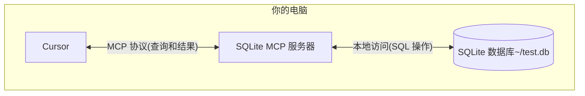

# 使用 MCP Python SDK 开发 MCP 服务器与客户端

在了解了 MCP 的一些基础知识后，接下来我们将通过一个简单的示例来演示如何使用 MCP 协议。

## 如何在 Cursor 中使用 MCP

这里我们将通过 MCP 协议将 Cursor（已经支持 MCP 协议）连接到本地 SQLite 数据库，并进行查询和安全分析，整个流程如下图所示：



这里的 SQLite MCP 服务器和本地 SQLite 数据库之间的通信完全在您的计算机上。MCP 协议确保 Cursor 只能通过明确定义的接口执行批准的数据库操作。这为您提供了一种安全的方式让 Cursor 分析你的本地数据并与之交互，同时保持对其可以访问的内容的完全控制。

### 准备工作

在开始之前，请确保你的系统已经安装了以下必备组件:

- macOS 或 Windows 操作系统
- 最新版本的 Claude Desktop
- uv 0.4.18 或更高版本 (使用 `uv --version` 检查)
- Git (`git --version` 检查)
- SQLite (`sqlite3 --version` 检查)

对于 macOS 用户，可以使用 [Homebrew](https://brew.sh/) 安装这些组件：

```bash
# Using Homebrew
brew install uv git sqlite3

# 或者直接下载：
# uv: https://docs.astral.sh/uv/
# Git: https://git-scm.com
# SQLite: https://www.sqlite.org/download.html
```

而对于 Windows 用户，可以使用 [winget](https://docs.microsoft.com/en-us/windows/package-manager/winget/) 安装这些组件：

```bash
# 使用 winget 安装
winget install --id=astral-sh.uv -e
winget install git.git sqlite.sqlite

# Or download directly:
# uv: https://docs.astral.sh/uv/
# Git: https://git-scm.com
# SQLite: https://www.sqlite.org/download.html
```

接下来我们会以 MacOS 为例进行说明，Windows 用户可以参考 MacOS 的安装步骤。

### 创建 SQLite 数据库

首先我们来创建一个简单的 SQLite 数据库，并插入一些数据：

```bash
# 创建一个新的 SQLite 数据库
sqlite3 ~/test.db <<EOF
CREATE TABLE products (
  id INTEGER PRIMARY KEY,
  name TEXT,
  price REAL
);

INSERT INTO products (name, price) VALUES
  ('Widget', 19.99),
  ('Gadget', 29.99),
  ('Gizmo', 39.99),
  ('Smart Watch', 199.99),
  ('Wireless Earbuds', 89.99),
  ('Portable Charger', 24.99),
  ('Bluetooth Speaker', 79.99),
  ('Phone Stand', 15.99),
  ('Laptop Sleeve', 34.99),
  ('Mini Drone', 299.99),
  ('LED Desk Lamp', 45.99),
  ('Keyboard', 129.99),
  ('Mouse Pad', 12.99),
  ('USB Hub', 49.99),
  ('Webcam', 69.99),
  ('Screen Protector', 9.99),
  ('Travel Adapter', 27.99),
  ('Gaming Headset', 159.99),
  ('Fitness Tracker', 119.99),
  ('Portable SSD', 179.99);
EOF
```

然后下载最新的 [Cursor](https://www.cursor.com/cn/downloads)，直接安装即可。然后打开 Cursor Settings 页面，切换到 MCP 标签页，点击右上角的 **+ Add new global MCP server** 按钮。


然后会跳转到一个全局的 MCP 配置文件，该文件是一个 JSON 格式的文件，可以在里面定义所有 MCP 服务器，这里我们添加一个名为 `mcp-server-sqlite` 的 MCP 服务器，如下所示：

```json
{
  "mcpServers": {
    "sqlite": {
      "command": "uvx",
      "args": ["mcp-server-sqlite", "--db-path", "/Users/YOUR_USERNAME/test.db"]
    }
  }
}
```

需要将 `YOUR_USERNAME` 替换为你的实际用户名。上面的配置文件表示我们定义了名为 `sqlite` 的 MCP 服务器，并指定使用 `uvx` 命令来启动该服务器，在 `args` 参数里面指定了 MCP 服务器以及实际的数据库路径为 `/Users/YOUR_USERNAME/test.db`。

> 我们也可以在特定的项目根目录下面创建 `.cursor/mcp.json` 文件，来配置特定项目中使用的 MCP 服务器，这样就可以在不同的项目中使用不同的 MCP 服务器了。

保存上面的配置后，回到 Cursor 中的 MCP 设置页面，正常一会儿就可以看到 `sqlite` 的 MCP 服务器了。


其中会将该 MCP 服务器提供的所有 Tools 都列出来，然后我们就可以在 Cursor 中直接使用这些 Tools 了。

### 测试

接下来我们就可以在 Cursor 中来测试下这个 MCP 服务器了。比如我们发送如下所示的提示词到 Cursor 中（需要使用 Agent 模式）：

```bash
你能连接到我的 SQLite 数据库并告诉我有哪些产品及其价格吗？
```

然后 Cursor 就会根据我们的提示词去查询我们的 SQLite 数据库，可以看到这里会选择使用 `list-tables` 的 MCP 工具查询数据库中有哪些表，然后调用 `describe_table` 工具查看这个表的结构。


接着会去查询数据库获取产品和对应的价格，甚至最后还提供了额外的统计信息，也是通过 `read_query` 工具来实现的。


### 解析

可能大家还是会有很多疑问，为什么我们只是在 Cursor 中添加了一个 sqlite 的 MCP 服务器，就可以查询到数据库中的数据了？这幕后到底发生了什么？

MCP 与 Cursor 交互的流程如下所示：

1. **服务器发现**：Cursor 在启动时连接到您配置的 MCP 服务器
2. **协议握手**：当你询问数据时，Cursor：

   1. 确定（通过 LLM）哪个 MCP 服务器可以提供帮助（在本例中为 sqlite）
   2. 通过协议协商能力
   3. 从 MCP 服务器请求数据或操作

3. **交互流程**：

   ```mermaid
   sequenceDiagram
      participant C as Cursor
      participant M as MCP 服务器
      participant D as SQLite 数据库

      C->>M: 初始化连接
      M-->>C: 返回可用功能

      C->>M: 查询请求
      M->>D: SQL 查询
      D-->>M: 返回结果
      M-->>C: 格式化结果
   ```

4. **安全**:

   - MCP 服务器仅暴露特定的、受控的功能
   - MCP 服务器在你的本地计算机上运行，它们访问的资源不会暴露在互联网上
   - Cursor 需要用户确认敏感操作

这里可能大家还有点疑问就是 MCP 服务器，我们并没有编写任何代码啊？其实是因为 Cursor 已经 内置实现了一系列的 MCP 服务器，其中就包括 SQLite 的 MCP 服务器，我们只需要配置好数据库路径即可。我们可以在官方的 git 仓库中查看[内置的 MCP 服务器列表](https://github.com/modelcontextprotocol/servers/tree/main/src)。


可以看到其中就包含一个 SQLite 的 MCP 服务器。通过 SQLite 提供数据库交互和智能业务能力，该服务器支持运行 SQL 查询、分析业务数据等，所以我们直接配置即可使用了。如果我们有自己的业务需求，也可以参考这些内置的实现自定义一个 MCP 服务器即可。

## 开发 MCP 服务器

在了解了 MCP 的一些基础知识后，接下来我们将通过一个简单的示例来演示如何开发一个 MCP 服务器。

接下来我们将通过 [MCP Python SDK](https://github.com/modelcontextprotocol/python-sdk) 来演示如何编写一个 MCP 服务器。我们将创建一个天气服务器，提供当前天气数据作为资源，并让 Cursor 使用工具获取天气预报。

这里我们需要使用 [OpenWeatherMap API](https://openweathermap.org/api) 来获取天气数据，直接注册然后在 [API keys](https://home.openweathermap.org/api_keys) 页面即可获取一个免费的 API 密钥。

### 环境准备

这里我们还是使用 [uv](https://docs.astral.sh/uv/) 来管理 Python 环境。

首先使用下面的命令初始化一个 uv 管理的项目：

```bash
uv init mcp-server-weather --python 3.13 # 最好指定下版本
cd mcp-server-weather
```

然后安装 MCP Python SDK 依赖：

```bash
uv add "mcp[cli]"
```

然后我们就可以使用下面的命令来运行 `mcp` 这个开发工具命令：

```bash
$ uv run mcp

 Usage: mcp [OPTIONS] COMMAND [ARGS]...

 MCP development tools


╭─ Options ────────────────────────────────────────────────────────────────────────────────────────────────────────────────────────────────────────────────────────╮
│ --help          Show this message and exit.                                                                                                                      │
╰──────────────────────────────────────────────────────────────────────────────────────────────────────────────────────────────────────────────────────────────────╯
╭─ Commands ───────────────────────────────────────────────────────────────────────────────────────────────────────────────────────────────────────────────────────╮
│ version   Show the MCP version.                                                                                                                                  │
│ dev       Run a MCP server with the MCP Inspector.                                                                                                               │
│ run       Run a MCP server.                                                                                                                                      │
│ install   Install a MCP server in the Claude desktop app.                                                                                                        │
╰──────────────────────────────────────────────────────────────────────────────────────────────────────────────────────────────────────────────────────────────────╯
```

### 实现 MCP 服务器

接下来我们就可以开始实现我们的 MCP 服务器了。

直接在 `main.py` 文件中实现一个天气 MCP 服务器，如下代码所示：

```python
"""
MCP Weather Server

一个基于 OpenWeatherMap API 的天气 MCP 服务器
提供获取当前天气信息和天气预报的功能
"""

import os
from typing import Dict, Any, List
from datetime import datetime
import requests
from dotenv import load_dotenv

from mcp.server.fastmcp import FastMCP

# 加载环境变量
load_dotenv()

# 创建 MCP 服务器
mcp = FastMCP("Weather")

# OpenWeatherMap API 配置
OPENWEATHER_API_KEY = os.getenv("OPENWEATHER_API_KEY")
if not OPENWEATHER_API_KEY:
    print("警告: 未找到 OPENWEATHER_API_KEY 环境变量")
    print("请在 .env 文件中设置你的 OpenWeatherMap API 密钥")

OPENWEATHER_BASE_URL = "https://api.openweathermap.org/data/2.5"


def format_temperature(temp_kelvin: float) -> str:
    """格式化温度显示（开尔文转摄氏度）"""
    celsius = temp_kelvin - 273.15
    fahrenheit = celsius * 9/5 + 32
    return f"{celsius:.1f}°C ({fahrenheit:.1f}°F)"


def format_weather_info(weather_data: Dict[str, Any]) -> str:
    """格式化天气信息为易读的字符串"""
    main = weather_data.get("main", {})
    weather = weather_data.get("weather", [{}])[0]
    wind = weather_data.get("wind", {})
    clouds = weather_data.get("clouds", {})

    location = weather_data.get("name", "未知位置")
    country = weather_data.get("sys", {}).get("country", "")
    if country:
        location += f", {country}"

    # 基本天气信息
    description = weather.get("description", "").title()
    temp = format_temperature(main.get("temp", 0))
    feels_like = format_temperature(main.get("feels_like", 0))

    # 详细信息
    humidity = main.get("humidity", 0)
    pressure = main.get("pressure", 0)
    wind_speed = wind.get("speed", 0)
    wind_deg = wind.get("deg", 0)
    cloudiness = clouds.get("all", 0)

    # 可见度（以米为单位，转换为公里）
    visibility = weather_data.get("visibility", 0) / 1000

    result = f"""🌍 **{location}**

🌤️ **当前天气**: {description}
🌡️ **温度**: {temp}
🤒 **体感温度**: {feels_like}
💧 **湿度**: {humidity}%
🌪️ **气压**: {pressure} hPa
💨 **风速**: {wind_speed} m/s
🧭 **风向**: {wind_deg}°
☁️ **云量**: {cloudiness}%
👁️ **能见度**: {visibility:.1f} km"""

    # 添加日出日落时间（如果有的话）
    sys_info = weather_data.get("sys", {})
    if "sunrise" in sys_info and "sunset" in sys_info:
        sunrise = datetime.fromtimestamp(sys_info["sunrise"]).strftime("%H:%M")
        sunset = datetime.fromtimestamp(sys_info["sunset"]).strftime("%H:%M")
        result += f"\n🌅 **日出**: {sunrise}"
        result += f"\n🌇 **日落**: {sunset}"

    return result


def format_forecast_info(forecast_data: Dict[str, Any]) -> str:
    """格式化天气预报信息"""
    city = forecast_data.get("city", {})
    location = city.get("name", "未知位置")
    country = city.get("country", "")
    if country:
        location += f", {country}"

    forecasts = forecast_data.get("list", [])

    result = f"📅 **{location} - 5天天气预报**\n\n"

    # 按日期分组预报数据
    daily_forecasts: Dict[str, List[Dict[str, Any]]] = {}
    for forecast in forecasts:
        dt = datetime.fromtimestamp(forecast["dt"])
        date_key = dt.strftime("%Y-%m-%d")

        if date_key not in daily_forecasts:
            daily_forecasts[date_key] = []
        daily_forecasts[date_key].append(forecast)

    # 显示每天的天气预报
    for date_key, day_forecasts in list(daily_forecasts.items())[:5]:  # 只显示5天
        date_obj = datetime.strptime(date_key, "%Y-%m-%d")
        date_str = date_obj.strftime("%m月%d日 (%A)")

        result += f"**{date_str}**\n"

        # 获取当天的温度范围
        temps = [f["main"]["temp"] for f in day_forecasts]
        min_temp = format_temperature(min(temps))
        max_temp = format_temperature(max(temps))

        # 获取主要天气描述（出现频率最高的）
        descriptions = [f["weather"][0]["description"] for f in day_forecasts]
        main_desc = max(set(descriptions), key=descriptions.count).title()

        # 获取平均湿度和风速
        avg_humidity = sum(f["main"]["humidity"] for f in day_forecasts) / len(day_forecasts)
        avg_wind_speed = sum(f["wind"]["speed"] for f in day_forecasts) / len(day_forecasts)

        result += f"  🌤️ {main_desc}\n"
        result += f"  🌡️ {min_temp} - {max_temp}\n"
        result += f"  💧 湿度: {avg_humidity:.0f}%\n"
        result += f"  💨 风速: {avg_wind_speed:.1f} m/s\n\n"

    return result


@mcp.tool()
def get_current_weather(city: str) -> str:
    """
    获取指定城市的当前天气信息

    Args:
        city: 城市名称（英文或中文）

    Returns:
        格式化的当前天气信息
    """
    if not OPENWEATHER_API_KEY:
        return "❌ 错误: 未配置 OpenWeatherMap API 密钥。请设置 OPENWEATHER_API_KEY 环境变量。"

    print(f"正在获取 {city} 的当前天气信息...")

    try:
        response = requests.get(
            f"{OPENWEATHER_BASE_URL}/weather",
            params={
                "q": city,
                "appid": OPENWEATHER_API_KEY,
                "lang": "zh_cn"
            },
            timeout=10
        )

        if response.status_code == 404:
            return f"❌ 错误: 找不到城市 '{city}'。请检查城市名称是否正确。"
        elif response.status_code == 401:
            return "❌ 错误: API 密钥无效。请检查 OPENWEATHER_API_KEY 配置。"
        elif response.status_code != 200:
            return f"❌ 错误: API 请求失败 (状态码: {response.status_code})"

        weather_data = response.json()
        return format_weather_info(weather_data)

    except requests.RequestException as e:
        return f"❌ 网络错误: {str(e)}"
    except Exception as e:
        return f"❌ 未知错误: {str(e)}"


@mcp.tool()
def get_weather_forecast(city: str, days: int = 5) -> str:
    """
    获取指定城市的天气预报

    Args:
        city: 城市名称（英文或中文）
        days: 预报天数（1-5天，默认5天）

    Returns:
        格式化的天气预报信息
    """
    if not OPENWEATHER_API_KEY:
        return "❌ 错误: 未配置 OpenWeatherMap API 密钥。请设置 OPENWEATHER_API_KEY 环境变量。"

    if days < 1 or days > 5:
        return "❌ 错误: 预报天数必须在 1-5 天之间。"

    print(f"正在获取 {city} 的 {days} 天天气预报...")

    try:
        response = requests.get(
            f"{OPENWEATHER_BASE_URL}/forecast",
            params={
                "q": city,
                "appid": OPENWEATHER_API_KEY,
                "lang": "zh_cn"
            },
            timeout=10
        )

        if response.status_code == 404:
            return f"❌ 错误: 找不到城市 '{city}'。请检查城市名称是否正确。"
        elif response.status_code == 401:
            return "❌ 错误: API 密钥无效。请检查 OPENWEATHER_API_KEY 配置。"
        elif response.status_code != 200:
            return f"❌ 错误: API 请求失败 (状态码: {response.status_code})"

        forecast_data = response.json()
        return format_forecast_info(forecast_data)

    except requests.RequestException as e:
        return f"❌ 网络错误: {str(e)}"
    except Exception as e:
        return f"❌ 未知错误: {str(e)}"


@mcp.resource("weather://current/{city}")
def get_current_weather_resource(city: str) -> str:
    """获取指定城市当前天气的资源"""
    return f"当前天气信息资源: {city}"


@mcp.resource("weather://forecast/{city}")
def get_forecast_resource(city: str) -> str:
    """获取指定城市天气预报的资源"""
    return f"天气预报资源: {city}"


@mcp.resource("weather://api-status")
def get_api_status() -> str:
    """获取 API 状态信息"""
    if OPENWEATHER_API_KEY:
        return "✅ OpenWeatherMap API 密钥已配置"
    else:
        return "❌ OpenWeatherMap API 密钥未配置"


def main():
    """运行 MCP 服务器"""
    print("🌤️ 启动天气 MCP 服务器...")
    print("📍 支持的功能:")
    print("  - 获取当前天气 (get_current_weather)")
    print("  - 获取天气预报 (get_weather_forecast)")
    print()

    if not OPENWEATHER_API_KEY:
        print("⚠️  警告: 未配置 OpenWeatherMap API 密钥")
        print("请创建 .env 文件并添加以下内容:")
        print("OPENWEATHER_API_KEY=your_api_key_here")
        print()
        print("获取 API 密钥: https://openweathermap.org/api")
        print()

    mcp.run()


if __name__ == "__main__":
    main()
```

上面代码其实很简单，上面大部分都是我们去请求 OpenWeatherMap API 获取天气数据，然后组装成我们想要的数据格式。核心的代码其实就只有 `@mcp.tool()` 装饰器修饰的两个工具函数，分别对应获取当前天气和获取天气预报。

```python
@mcp.tool()
def get_current_weather(city: str) -> str:

@mcp.tool()
def get_weather_forecast(city: str, days: int = 5) -> str:
```

这里我们使用 `mcp` 对象的 `tool` 方法来装饰这两个工具函数即可，这样包装后我们实现的方法会返回一个 MCP 的工具对象，该对象包含工具的名称、描述、参数和返回值等信息。而 `mcp` 对象是通过前面的 `FastMCP` 类创建的，该类是 MCP 服务器的一个实现，提供了一些便捷的方法来创建 MCP 服务器。

```python
from mcp.server.fastmcp import FastMCP

# 创建 MCP 服务器
mcp = FastMCP("Weather")
```

当然出来 tools 之外，如果还想提供 resources 资源，我们也可以使用 `mcp` 对象的 `resource` 方法来装饰一个资源函数即可：

```python
@mcp.resource("weather://current/{city}")
def get_current_weather_resource(city: str) -> str:
    """获取指定城市当前天气的资源"""
    return f"当前天气信息资源: {city}"
```

然后我们在项目根目录下面创建一个 `.env` 文件，并添加如下所示的环境变量即可：

```bash
OPENWEATHER_API_KEY=your_api_key_here
```

### 调试 MCP 服务器

然后我们可以使用下面的命令来调试该 MCP 服务器：

```bash
$ mcp dev main.py
Starting MCP inspector...
⚙️ Proxy server listening on port 6277
New connection
# ......
Stdio transport: command=/opt/homebrew/bin/uv, args=run,--with,mcp,mcp,run,main.py
Spawned stdio transport
Connected MCP client to backing server transport
Created web app transport
Set up MCP proxy
🔍 MCP Inspector is up and running at http://127.0.0.1:6274 🚀
New connection
```

该命令会启动一个 MCP Inspector 的调试器，我们可以通过浏览器 `http://127.0.0.1:6274` 进行访问，点击左侧的 `Connect` 按钮，就可以连接到当前的 MCP 服务器上，我们可以切换到 `Tools` 标签页，点击 `List Tools` 就可以看到该服务器提供的所有工具了。


我们可以看到当前的 MCP 服务器提供了两个工具，分别是 `get_current_weather` 和 `get_weather_forecast`，我们可以点击其中一个工具，然后输入参数，点击 `Run Tool` 按钮，就可以看到该工具的返回结果了。


### 在 Cursor 中测试

在 MCP Inspector 中测试没有问题，那么我们就可以将该 MCP 服务器安装到 Cursor 中，然后就可以在 Cursor 中使用该 MCP 服务器了。

同样在 Cursor 设置页面，切换到 `MCP` 标签页，点击右上角的 `+ Add new global MCP server` 按钮，在弹出的 `mcp.json` 文件中添加如下所示的配置：

```json
{
  "mcpServers": {
    "weather": {
      "command": "uv",
      "args": ["--directory", "/Users/cnych/your-mcp-path", "run", "main.py"],
      "env": {
        "OPENWEATHER_API_KEY": "xxxxx"
      }
    }
  }
}
```

保存后，我们就可以在 Cursor 中看到该 MCP 服务器了，并有两个 Tools 工具。


然后我们可以在 Cursor Agent 模式下面询问关于天气的问题。


当我们询问今天天气的时候可以看到 Cursor 会去主动调用 `get_current_weather` 工具查询当前城市的天气，同样询问未来天气的时候则会调用 `get_weather_forcaset` 工具查询数据。

最后我们可以将这个 weather mcp 服务器打包后发布到 pypi 上面去，则其他用户就可以直接指定我们这个包来安装这个 MCP 服务器了。

我们这里实现的这个 MCP 服务器是一个典型的 stdio 类型的 MCP 服务器，它通过标准输入输出与客户端进行交互，此外还可以通过 SSE 和 Streamable HTTP 等方式与客户端进行交互。

## 开发 MCP 客户端

上面我们自己实现了一个简单的 MCP 服务器，并在 Cursor 中测试了该服务器，那如果想要在其他地方使用该 MCP 服务器呢？这个就需要我们去实现一个 MCP 客户端了。

MCP Python SDK 提供了一个高级客户端接口，用于使用各种方式连接到 MCP 服务器，如下代码所示：

```python
from mcp import ClientSession, StdioServerParameters, types
from mcp.client.stdio import stdio_client

# 创建 stdio 类型的 MCP 服务器参数
server_params = StdioServerParameters(
    command="python",  # 可执行文件
    args=["example_server.py"],  # 可选的命令行参数
    env=None,  # 可选的环境变量
)

async def run():
    async with stdio_client(server_params) as (read, write):  # 创建一个 stdio 类型的客户端
        async with ClientSession(read, write) as session:  # 创建一个客户端会话
            # 初始化连接
            await session.initialize()

            # 列出可用的提示词
            prompts = await session.list_prompts()

            # 获取一个提示词
            prompt = await session.get_prompt(
                "example-prompt", arguments={"arg1": "value"}
            )

            # 列出可用的资源
            resources = await session.list_resources()

            # 列出可用的工具
            tools = await session.list_tools()

            # 读取一个资源
            content, mime_type = await session.read_resource("file://some/path")

            # 调用一个工具
            result = await session.call_tool("tool-name", arguments={"arg1": "value"})


if __name__ == "__main__":
    import asyncio

    asyncio.run(run())
```

上面代码中我们创建了一个 stdio 类型的 MCP 客户端，并使用 `stdio_client` 函数创建了一个客户端会话，然后通过 `ClientSession` 类创建了一个客户端会话，然后通过 `session.initialize()` 方法初始化连接，然后通过 `session.list_prompts()` 方法列出可用的提示词，然后通过 `session.get_prompt()` 方法获取一个提示词，然后通过 `session.list_resources()` 方法列出可用的资源，然后通过 `session.list_tools()` 方法列出可用的工具，然后通过 `session.read_resource()` 方法读取一个资源，然后通过 `session.call_tool()` 方法调用一个工具，这些都是 MCP 客户端的常用方法。

但是在实际的 MCP 客户端或者主机中我们一般会结合 LLM 来实现更加智能的交互，比如我们要实现一个基于 OpenAI 的 MCP 客户端，那要怎么实现呢？我们可以参考 Cursor 的方式：

- 首先通过一个 JSON 配置文件来配置 MCP 服务器
- 读取该配置文件，加载 MCP 服务器列表
- 获取 MCP 服务器提供的可用工具列表
- 然后根据用户的输入，以及 Tools 列表传递给 LLM（如果 LLM 不支持工具调用，那么就需要在 System 提示词中告诉 LLM 如何调用这些工具）
- 根据 LLM 的返回结果，循环调用所有的 MCP 服务器提供的工具
- 得到 MCP 工具的返回结果后，可以将返回结果发送给 LLM 得到更符合用户意图的回答

这个流程更符合我们实际情况的交互流程，下面我们实现一个基于 OpenAI 来实现一个简单的 MCP 客户端，完整代码如下所示：

```python
#!/usr/bin/env python
"""
MyMCP 客户端 - 使用 OpenAI 原生 tools 调用
"""

import asyncio
import json
import os
import sys
from typing import Dict, List, Any, Optional
from dataclasses import dataclass

from openai import AsyncOpenAI
from mcp import StdioServerParameters
from mcp.client.stdio import stdio_client
from mcp.client.session import ClientSession
from mcp.types import Tool, TextContent
from rich.console import Console
from rich.prompt import Prompt
from rich.panel import Panel
from rich.markdown import Markdown
from rich.table import Table
from rich.spinner import Spinner
from rich.live import Live
from dotenv import load_dotenv

# 加载环境变量
load_dotenv()

# 初始化 Rich console
console = Console()


@dataclass
class MCPServerConfig:
    """MCP 服务器配置"""
    name: str
    command: str
    args: List[str]
    description: str
    env: Optional[Dict[str, str]] = None


class MyMCPClient:
    """MyMCP 客户端"""

    def __init__(self, config_path: str = "mcp.json"):
        self.config_path = config_path
        self.servers: Dict[str, MCPServerConfig] = {}
        self.all_tools: List[tuple[str, Any]] = []  # (server_name, tool)
        self.openai_client = AsyncOpenAI(
            api_key=os.getenv("OPENAI_API_KEY")
        )

    def load_config(self):
        """从配置文件加载 MCP 服务器配置"""
        try:
            with open(self.config_path, 'r', encoding='utf-8') as f:
                config = json.load(f)

            for name, server_config in config.get("mcpServers", {}).items():
                env_dict = server_config.get("env", {})
                self.servers[name] = MCPServerConfig(
                    name=name,
                    command=server_config["command"],
                    args=server_config.get("args", []),
                    description=server_config.get("description", ""),
                    env=env_dict if env_dict else None
                )

            console.print(f"[green]✓ 已加载 {len(self.servers)} 个 MCP 服务器配置[/green]")
        except Exception as e:
            console.print(f"[red]✗ 加载配置文件失败: {e}[/red]")
            sys.exit(1)

    async def get_tools_from_server(self, name: str, config: MCPServerConfig) -> List[Tool]:
        """从单个服务器获取工具列表"""
        try:
            console.print(f"[blue]→ 正在连接服务器: {name}[/blue]")

            # 准备环境变量
            env = os.environ.copy()
            if config.env:
                env.update(config.env)

            # 创建服务器参数
            server_params = StdioServerParameters(
                command=config.command,
                args=config.args,
                env=env
            )

            # 使用 async with 上下文管理器（双层嵌套）
            async with stdio_client(server_params) as (read, write):
                async with ClientSession(read, write) as session:
                    await session.initialize()

                    # 获取工具列表
                    tools_result = await session.list_tools()
                    tools = tools_result.tools

                    console.print(f"[green]✓ {name}: {len(tools)} 个工具[/green]")
                    return tools

        except Exception as e:
            console.print(f"[red]✗ 连接服务器 {name} 失败: {e}[/red]")
            console.print(f"[red]  错误类型: {type(e).__name__}[/red]")
            import traceback
            console.print(f"[red]  详细错误: {traceback.format_exc()}[/red]")
            return []

    async def load_all_tools(self):
        """加载所有服务器的工具"""
        console.print("\n[blue]→ 正在获取可用工具列表...[/blue]")

        for name, config in self.servers.items():
            tools = await self.get_tools_from_server(name, config)
            for tool in tools:
                self.all_tools.append((name, tool))

    def display_tools(self):
        """显示所有可用工具"""
        table = Table(title="可用 MCP 工具", show_header=True)
        table.add_column("服务器", style="cyan")
        table.add_column("工具名称", style="green")
        table.add_column("描述", style="white")

        # 按服务器分组
        current_server = None
        for server_name, tool in self.all_tools:
            # 只在服务器名称变化时显示服务器名称
            display_server = server_name if server_name != current_server else ""
            current_server = server_name

            table.add_row(
                display_server,
                tool.name,
                tool.description or "无描述"
            )
        console.print(table)

    def build_openai_tools(self) -> List[Dict[str, Any]]:
        """构建 OpenAI tools 格式的工具定义"""
        openai_tools = []

        for server_name, tool in self.all_tools:
            # 构建 OpenAI function 格式
            function_def = {
                "type": "function",
                "function": {
                    "name": f"{server_name}_{tool.name}",  # 添加服务器前缀避免冲突
                    "description": f"[{server_name}] {tool.description or '无描述'}",
                    "parameters": tool.inputSchema or {"type": "object", "properties": {}}
                }
            }
            openai_tools.append(function_def)

        return openai_tools

    def parse_tool_name(self, function_name: str) -> tuple[str, str]:
        """解析工具名称，提取服务器名称和工具名称"""
        # 格式: server_name_tool_name
        parts = function_name.split('_', 1)
        if len(parts) == 2:
            return parts[0], parts[1]
        else:
            # 如果没有下划线，假设是第一个服务器的工具
            if self.all_tools:
                return self.all_tools[0][0], function_name
            return "unknown", function_name

    async def call_tool(self, server_name: str, tool_name: str, arguments: Dict[str, Any]) -> Any:
        """调用指定的工具"""
        config = self.servers.get(server_name)
        if not config:
            raise ValueError(f"服务器 {server_name} 不存在")

        try:
            # 准备环境变量
            env = os.environ.copy()
            if config.env:
                env.update(config.env)

            # 创建服务器参数
            server_params = StdioServerParameters(
                command=config.command,
                args=config.args,
                env=env
            )

            # 使用 async with 上下文管理器（双层嵌套）
            async with stdio_client(server_params) as (read, write):
                async with ClientSession(read, write) as session:
                    await session.initialize()

                    # 调用工具
                    result = await session.call_tool(tool_name, arguments)
                    return result

        except Exception as e:
            console.print(f"[red]✗ 调用工具 {tool_name} 失败: {e}[/red]")
            raise

    def extract_text_content(self, content_list: List[Any]) -> str:
        """从 MCP 响应中提取文本内容"""
        text_parts: List[str] = []
        for content in content_list:
            if isinstance(content, TextContent):
                text_parts.append(content.text)
            elif hasattr(content, 'text'):
                text_parts.append(str(content.text))
            else:
                # 处理其他类型的内容
                text_parts.append(str(content))
        return "\n".join(text_parts) if text_parts else "✅ 操作完成，但没有返回文本内容"

    async def process_user_input(self, user_input: str) -> str:
        """处理用户输入并返回最终响应"""

        # 构建工具定义
        openai_tools = self.build_openai_tools()

        try:
            # 第一次调用 - 让 LLM 决定是否需要使用工具
            messages = [
                {"role": "system", "content": "你是一个智能助手，可以使用各种 MCP 工具来帮助用户完成任务。如果不需要使用工具，直接返回回答。"},
                {"role": "user", "content": user_input}
            ]

            # 调用 OpenAI API
            kwargs = {
                "model": "deepseek-chat",
                "messages": messages,
                "temperature": 0.7
            }

            # 只有当有工具时才添加 tools 参数
            if openai_tools:
                kwargs["tools"] = openai_tools
                kwargs["tool_choice"] = "auto"

            # 使用 loading 特效
            with Live(Spinner("dots", text="[blue]正在思考...[/blue]"), console=console, refresh_per_second=10):
                response = await self.openai_client.chat.completions.create(**kwargs)  # type: ignore
            message = response.choices[0].message

            # 检查是否有工具调用
            if hasattr(message, 'tool_calls') and message.tool_calls:  # type: ignore
                # 添加助手消息到历史
                messages.append({  # type: ignore
                    "role": "assistant",
                    "content": message.content,
                    "tool_calls": [
                        {
                            "id": tc.id,
                            "type": "function",
                            "function": {
                                "name": tc.function.name,
                                "arguments": tc.function.arguments
                            }
                        } for tc in message.tool_calls  # type: ignore
                    ]
                })

                # 执行每个工具调用
                for tool_call in message.tool_calls:
                    function_name = tool_call.function.name  # type: ignore
                    arguments = json.loads(tool_call.function.arguments)  # type: ignore

                    # 解析服务器名称和工具名称
                    server_name, tool_name = self.parse_tool_name(function_name)  # type: ignore

                    try:
                        # 使用 loading 特效调用工具
                        with Live(Spinner("dots", text=f"[cyan]正在调用 {server_name}.{tool_name}...[/cyan]"), console=console, refresh_per_second=10):
                            result = await self.call_tool(server_name, tool_name, arguments)

                        # 从 MCP 响应中提取文本内容
                        result_content = self.extract_text_content(result.content)
                        # 添加工具调用结果
                        messages.append({
                            "role": "tool",
                            "tool_call_id": tool_call.id,
                            "content": result_content
                        })
                        console.print(f"[green]✓ {server_name}.{tool_name} 调用成功[/green]")

                    except Exception as e:
                        # 添加错误信息
                        messages.append({
                            "role": "tool",
                            "tool_call_id": tool_call.id,
                            "content": f"错误: {str(e)}"
                        })
                        console.print(f"[red]✗ {server_name}.{tool_name} 调用失败: {e}[/red]")

                # 获取最终响应
                with Live(Spinner("dots", text="[blue]正在生成最终响应...[/blue]"), console=console, refresh_per_second=10):
                    final_response = await self.openai_client.chat.completions.create(
                        model="deepseek-chat",
                        messages=messages,  # type: ignore
                        temperature=0.7
                    )

                final_content = final_response.choices[0].message.content
                return final_content or "抱歉，我无法生成最终回答。"

            else:
                # 没有工具调用，直接返回响应
                return message.content or "抱歉，我无法生成回答。"

        except Exception as e:
            console.print(f"[red]✗ 处理请求时出错: {e}[/red]")
            return f"抱歉，处理您的请求时出现错误: {str(e)}"

    async def interactive_loop(self):
        """交互式循环"""
        console.print(Panel.fit(
            "[bold cyan]MyMCP 客户端已启动[/bold cyan]\n"
            "输入您的问题，我会使用可用的 MCP 工具来帮助您。\n"
            "输入 'tools' 查看可用工具\n"
            "输入 'exit' 或 'quit' 退出。",
            title="欢迎使用 MCP 客户端"
        ))

        while True:
            try:
                # 获取用户输入
                user_input = Prompt.ask("\n[bold green]您[/bold green]")

                if user_input.lower() in ['exit', 'quit', 'q']:
                    console.print("\n[yellow]再见！[/yellow]")
                    break

                if user_input.lower() == 'tools':
                    self.display_tools()
                    continue

                # 处理用户输入
                response = await self.process_user_input(user_input)

                # 显示响应
                console.print("\n[bold blue]助手[/bold blue]:")
                console.print(Panel(Markdown(response), border_style="blue"))

            except KeyboardInterrupt:
                console.print("\n[yellow]已中断[/yellow]")
                break
            except Exception as e:
                console.print(f"\n[red]错误: {e}[/red]")

    async def run(self):
        """运行客户端"""
        # 加载配置
        self.load_config()

        if not self.servers:
            console.print("[red]✗ 没有配置的服务器[/red]")
            return

        # 获取所有工具
        await self.load_all_tools()

        if not self.all_tools:
            console.print("[red]✗ 没有可用的工具[/red]")
            return

        # 显示可用工具
        self.display_tools()

        # 进入交互循环
        await self.interactive_loop()


async def main():
    """主函数"""
    # 检查 OpenAI API Key
    if not os.getenv("OPENAI_API_KEY"):
        console.print("[red]✗ 请设置环境变量 OPENAI_API_KEY[/red]")
        console.print("提示: 创建 .env 文件并添加: OPENAI_API_KEY=your-api-key")
        sys.exit(1)

    # 创建并运行客户端
    client = MyMCPClient()
    await client.run()


if __name__ == "__main__":
    try:
        asyncio.run(main())
    except KeyboardInterrupt:
        console.print("\n[yellow]程序已退出[/yellow]")
    except Exception as e:
        console.print(f"\n[red]程序错误: {e}[/red]")
        sys.exit(1)
```

上面代码中我们首先加载 `mcp.json` 文件，配置格式和 Cursor 的一致，来获取所有我们自己配置的 MCP 服务器，比如我们配置如下所示的 `mcp.json` 文件：

```json
{
  "mcpServers": {
    "weather": {
      "command": "uv",
      "args": ["--directory", ".", "run", "main.py"],
      "description": "天气信息服务器 - 获取当前天气和天气预报",
      "env": {
        "OPENWEATHER_API_KEY": "xxxx"
      }
    },
    "filesystem": {
      "command": "npx",
      "args": ["-y", "@modelcontextprotocol/server-filesystem", "/tmp"],
      "description": "文件系统操作服务器 - 文件读写和目录管理"
    }
  }
}
```

然后在 `run` 方法中接着我们调用 `load_all_tools` 方法加载所有的工具列表，这里的实现核心就是去调用 MCP 服务器端的工具列表，如下所示：

```python
async def get_tools_from_server(self, name: str, config: MCPServerConfig) -> List[Tool]:
    """从单个服务器获取工具列表"""
    try:
        console.print(f"[blue]→ 正在连接服务器: {name}[/blue]")

        # 准备环境变量
        env = os.environ.copy()
        if config.env:
            env.update(config.env)

        # 创建服务器参数
        server_params = StdioServerParameters(
            command=config.command,
            args=config.args,
            env=env
        )

        # 使用 async with 上下文管理器（双层嵌套）
        async with stdio_client(server_params) as (read, write):
            async with ClientSession(read, write) as session:
                await session.initialize()

                # 获取工具列表
                tools_result = await session.list_tools()
                tools = tools_result.tools

                console.print(f"[green]✓ {name}: {len(tools)} 个工具[/green]")
                return tools

    except Exception as e:
        console.print(f"[red]✗ 连接服务器 {name} 失败: {e}[/red]")
        console.print(f"[red]  错误类型: {type(e).__name__}[/red]")
        import traceback
        console.print(f"[red]  详细错误: {traceback.format_exc()}[/red]")
        return []
```

这里核心就是直接使用 MCP Python SDK 提供的客户端接口去调用 MCP 服务器获取工具列表。

接下来就是处理用户的输入了，这里首先我们要做的是将获取到的 MCP 工具列表转换成 OpenAI 能够识别的 function tools 格式，然后将用户的输入和工具一起发给 OpenAI 进行处理，然后根据返回结果判断是否应该调用某个工具，如果需要同样直接调用 MCP 的工具即可，最后将获得的结果一起组装发给 OpenAI 获得一个更加完整的回答结果。这整个流程不复杂，当然还有很多细节可以优化，更多的还是根据我们自己的需求进行集成。

现在我们可以直接测试下结果：

```bash
$ python simple_client.py
✓ 已加载 1 个 MCP 服务器配置

→ 正在获取可用工具列表...
→ 正在连接服务器: weather
[05/25/25 11:42:51] INFO     Processing request of type ListToolsRequest  server.py:551
✓ weather: 2 个工具
                              可用 MCP 工具
┏━━━━━━━━━┳━━━━━━━━━━━━━━━━━━━━━━┳━━━━━━━━━━━━━━━━━━━━━━━━━━━━━━━━━━━━━━┓
┃ 服务器  ┃ 工具名称             ┃ 描述                                 ┃
┡━━━━━━━━━╇━━━━━━━━━━━━━━━━━━━━━━╇━━━━━━━━━━━━━━━━━━━━━━━━━━━━━━━━━━━━━━┩
│ weather │ get_current_weather  │                                      │
│         │                      │ 获取指定城市的当前天气信息           │
│         │                      │                                      │
│         │                      │ Args:                                │
│         │                      │     city: 城市名称（英文）           │
│         │                      │                                      │
│         │                      │ Returns:                             │
│         │                      │     格式化的当前天气信息             │
│         │                      │                                      │
│         │ get_weather_forecast │                                      │
│         │                      │ 获取指定城市的天气预报               │
│         │                      │                                      │
│         │                      │ Args:                                │
│         │                      │     city: 城市名称（英文）           │
│         │                      │     days: 预报天数（1-5天，默认5天） │
│         │                      │                                      │
│         │                      │ Returns:                             │
│         │                      │     格式化的天气预报信息             │
│         │                      │                                      │
└─────────┴──────────────────────┴──────────────────────────────────────┘
╭────────────── 欢迎使用 MCP 客户端 ──────────────╮
│ MyMCP 客户端已启动                              │
│ 输入您的问题，我会使用可用的 MCP 工具来帮助您。 │
│ 输入 'tools' 查看可用工具                       │
│ 输入 'exit' 或 'quit' 退出。                    │
╰─────────────────────────────────────────────────╯

您: 你好,你是谁?
⠹ 正在思考...

助手:
╭──────────────────────────────────────────────────────────────────────────────────────────────────────────────────────────────────────────╮
│ 你好！我是一个智能助手，可以帮助你完成各种任务，比如回答问题、查询天气、提供建议等等。如果你有任何需要，随时告诉我！ 😊                  │
╰──────────────────────────────────────────────────────────────────────────────────────────────────────────────────────────────────────────╯

您: 成都今天的天气咋样?明天适合穿裙子吗?
⠧ 正在思考...
⠴ 正在调用 weather.get_current_weather...[05/25/25 11:44:03] INFO     Processing request of type CallToolRequest                                                        server.py:551
⠴ 正在调用 weather.get_current_weather...
✓ weather.get_current_weather 调用成功
⠸ 正在调用 weather.get_weather_forecast...[05/25/25 11:44:04] INFO     Processing request of type CallToolRequest                                                        server.py:551
⠋ 正在调用 weather.get_weather_forecast...
✓ weather.get_weather_forecast 调用成功
⠧ 正在生成最终响应...

助手:
╭──────────────────────────────────────────────────────────────────────────────────────────────────────────────────────────────────────────╮
│ 成都今天天气晴朗，当前温度26.9°C，湿度44%，风力较小，非常适合外出活动。                                                                  │
│                                                                                                                                          │
│ 明天(5月25日)天气预报：                                                                                                                  │
│                                                                                                                                          │
│  • 天气：多云                                                                                                                            │
│  • 温度：26.4°C~29.3°C                                                                                                                   │
│  • 风力：3.1 m/s                                                                                                                         │
│  • 湿度：41%                                                                                                                             │
│                                                                                                                                          │
│ 建议：明天温度适中，风力不大，穿裙子完全没问题。不过建议搭配一件薄外套或防晒衣，因为多云天气紫外线可能较强。如果计划长时间在户外，可以带 │
│ 把晴雨伞备用。                                                                                                                           │
╰──────────────────────────────────────────────────────────────────────────────────────────────────────────────────────────────────────────╯

您:
```

从输出可以看到能够正常调用我们配置的 MCP 服务器提供的工具。
