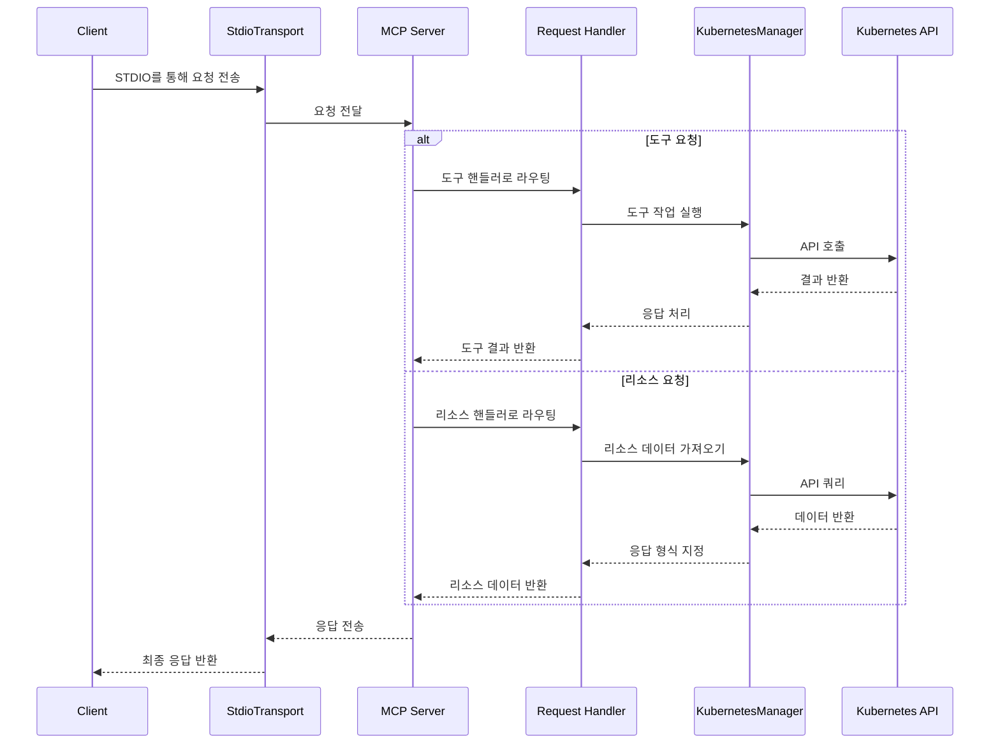

Kubernetes 클러스터에 연결하고 관리할 수 있는 MCP 서버입니다.

## Claude Desktop과 함께 사용하기

```json
{
  "mcpServers": {
    "kubernetes": {
      "command": "npx",
      "args": ["mcp-server-kubernetes"]
    }
  }
}
```

서버는 현재 kubectl 컨텍스트에 자동으로 연결됩니다. 다음 사항이 준비되어 있는지 확인하세요:

1. PATH에 kubectl이 설치되어 있어야 함
2. 컨텍스트가 구성된 유효한 kubeconfig 파일
3. kubectl용으로 구성된 Kubernetes 클러스터 접근 권한 (예: minikube, Rancher Desktop, GKE 등)
4. PATH에 Helm v3가 설치되어 있어야 함 (Tiller 불필요). Helm을 사용하지 않을 경우 선택 사항입니다.

Claude에게 파드를 나열하거나 테스트 배포를 생성하도록 요청하여 연결을 확인할 수 있습니다.

오류가 발생하면 표준 터미널을 열고 `kubectl get pods`를 실행하여 자격 증명 문제 없이 클러스터에 연결할 수 있는지 확인하세요.

## mcp-chat와 함께 사용하기

[mcp-chat](https://github.com/Flux159/mcp-chat)는 MCP 서버와 상호 작용하기 위한 CLI 채팅 클라이언트입니다. Kubernetes 서버와 상호 작용하는 데 사용할 수 있습니다.

```shell
npx mcp-chat --server "npx mcp-server-kubernetes"
```

또는 기존 Claude Desktop 구성 파일을 전달할 수 있습니다 (Linux는 구성 파일에 대한 올바른 경로를 전달해야 함):

Mac:

```shell
npx mcp-chat --config "~/Library/Application Support/Claude/claude_desktop_config.json"
```

Windows:

```shell
npx mcp-chat --config "%APPDATA%\Claude\claude_desktop_config.json"
```

## 기능

- [x] Kubernetes 클러스터에 연결
- [x] 모든 파드, 서비스, 배포 나열
- [x] 노드 나열 및 설명
- [x] 파드 생성, 설명, 삭제
- [x] 모든 네임스페이스 나열, 네임스페이스 생성
- [x] 사용자 정의 파드 및 배포 구성 생성, 배포 복제본 업데이트
- [x] 서비스 생성, 설명, 삭제, 업데이트
- [x] ConfigMap 생성, 가져오기, 업데이트, 삭제
- [x] 디버깅을 위한 파드 로그 가져오기 (파드, 배포, 작업 및 레이블 선택기 지원)
- [x] 차트 설치를 위한 Helm v3 지원
  - 사용자 정의 값으로 차트 설치
  - 릴리스 제거
  - 기존 릴리스 업그레이드
  - 네임스페이스 지원
  - 버전 지정 지원
  - 사용자 정의 저장소 지원
- [x] kubectl explain 및 kubectl api-resources 지원
- [x] 클러스터에서 Kubernetes 이벤트 가져오기
- [x] 파드 또는 서비스로 포트 포워딩
- [x] 크론잡 생성, 나열 및 설명
- [x] 읽기 및 생성/업데이트 전용 액세스를 위한 비파괴 모드

## 로컬 개발

[bun 설치](https://bun.sh/docs/installation)가 되어 있는지 확인하세요. 저장소를 복제하고 종속성을 설치합니다:

```bash
git clone https://github.com/Flux159/mcp-server-kubernetes.git
cd mcp-server-kubernetes
bun install
```

### 개발 워크플로우

1. 개발 모드로 서버 시작 (파일 변경 사항 감시):

```bash
bun run dev
```

2. 단위 테스트 실행:

```bash
bun run test
```

3. 프로젝트 빌드:

```bash
bun run build
```

4. [Inspector](https://github.com/modelcontextprotocol/inspector)로 로컬 테스트

```bash
npx @modelcontextprotocol/inspector node dist/index.js
# 터미널의 추가 지침에 따라 Inspector 링크 확인
```

5. Claude Desktop으로 로컬 테스트

```json
{
  "mcpServers": {
    "mcp-server-kubernetes": {
      "command": "node",
      "args": ["/path/to/your/mcp-server-kubernetes/dist/index.js"]
    }
  }
}
```

6. [mcp-chat](https://github.com/Flux159/mcp-chat)로 로컬 테스트

```bash
bun run chat
```

## 고급 기능

### 추가 고급 기능

SSE 전송 사용, `ALLOW_ONLY_NON_DESTRUCTIVE_TOOLS`를 통한 비파괴 모드 등 더 고급 정보는 [ADVANCED_README.md](https://github.com/Flux159/mcp-server-kubernetes/blob/main/ADVANCED_README.md)를 참조하세요.

## 아키텍처

이 섹션에서는 MCP Kubernetes 서버의 고수준 아키텍처를 설명합니다.

### 요청 흐름

아래 시퀀스 다이어그램은 시스템을 통해 요청이 흐르는 방식을 보여줍니다:



## 새 릴리스 출시

[릴리스 페이지](https://github.com/Flux159/mcp-server-kubernetes/releases)로 이동하여 "Draft New Release"를 클릭하고 "Choose a tag"를 클릭한 후 "v{major}.{minor}.{patch}" 형식의 새 버전 번호를 입력하여 새 태그를 생성합니다. 그런 다음 "Release v{major}.{minor}.{patch}"라는 릴리스 제목과 필요한 경우 설명/변경 로그를 작성하고 "Publish Release"를 클릭합니다.

이렇게 하면 새 태그가 생성되고 cd.yml 워크플로우를 통해 새 릴리스 빌드가 트리거됩니다. 성공하면 새 릴리스가 [npm](https://www.npmjs.com/package/mcp-server-kubernetes)에 게시됩니다. package.json 버전을 수동으로 업데이트할 필요는 없으며, 워크플로우가 package.json 파일의 버전 번호를 자동으로 업데이트하고 main에 커밋을 푸시합니다.
