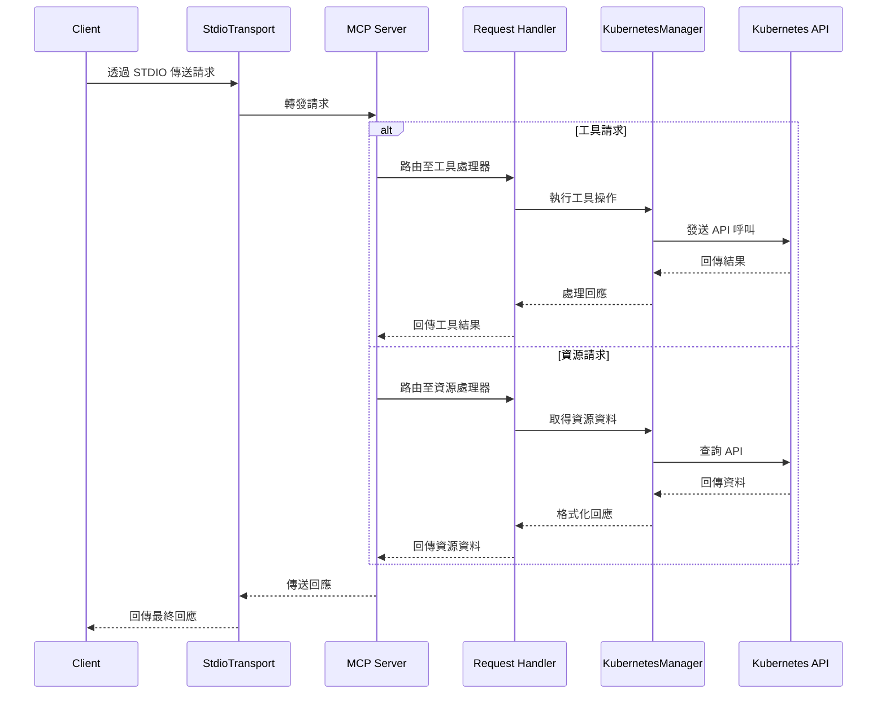

MCP Server 可連接至 Kubernetes 叢集並進行管理。

## 與 Claude Desktop 搭配使用

```json
{
  "mcpServers": {
    "kubernetes": {
      "command": "npx",
      "args": ["mcp-server-kubernetes"]
    }
  }
}
```

伺服器將自動連接至您當前的 kubectl 上下文。請確保您已具備：

1. 已安裝 kubectl 並加入 PATH
2. 有效的 kubeconfig 檔案且已配置上下文
3. 可存取已為 kubectl 配置的 Kubernetes 叢集（例如 minikube、Rancher Desktop、GKE 等）
4. 已安裝 Helm v3 並加入 PATH（無需 Tiller）。若無需使用 Helm 則為選配。

您可透過要求 Claude 列出 Pod 或建立測試部署來驗證連線。

若出現錯誤，請開啟標準終端機並執行 `kubectl get pods` 以確認是否能在無憑證問題下連接至叢集。

## 與 mcp-chat 搭配使用

[mcp-chat](https://github.com/Flux159/mcp-chat) 是 MCP 伺服器的 CLI 聊天客戶端。您可用其與 Kubernetes 伺服器互動。

```shell
npx mcp-chat --server "npx mcp-server-kubernetes"
```

或傳遞現有的 Claude Desktop 設定檔案（Linux 應傳遞正確的設定路徑）：

Mac：

```shell
npx mcp-chat --config "~/Library/Application Support/Claude/claude_desktop_config.json"
```

Windows：

```shell
npx mcp-chat --config "%APPDATA%\Claude\claude_desktop_config.json"
```

## 功能

- [x] 連接至 Kubernetes 叢集
- [x] 列出所有 Pod、服務、部署
- [x] 列出、描述節點
- [x] 建立、描述、刪除 Pod
- [x] 列出所有命名空間，建立命名空間
- [x] 建立自訂 Pod 與部署配置，更新部署副本數
- [x] 建立、描述、刪除、更新服務
- [x] 建立、取得、更新、刪除 ConfigMap
- [x] 從 Pod 取得日誌以進行除錯（支援 Pod、部署、任務及標籤選擇器）
- [x] 支援 Helm v3 安裝圖表
  - 使用自訂值安裝圖表
  - 解除安裝版本
  - 升級現有版本
  - 支援命名空間
  - 支援版本指定
  - 支援自訂儲存庫
- [x] 支援 kubectl explain 與 kubectl api-resources
- [x] 從叢集取得 Kubernetes 事件
- [x] 將埠轉發至 Pod 或服務
- [x] 建立、列出及描述 CronJob
- [x] 非破壞性模式，僅限讀取與建立/更新叢集存取

## 本地開發

請確保已安裝 [bun](https://bun.sh/docs/installation)。複製儲存庫並安裝相依套件：

```bash
git clone https://github.com/Flux159/mcp-server-kubernetes.git
cd mcp-server-kubernetes
bun install
```

### 開發流程

1. 以開發模式啟動伺服器（監視檔案變更）：

```bash
bun run dev
```

2. 執行單元測試：

```bash
bun run test
```

3. 建置專案：

```bash
bun run build
```

4. 使用 [Inspector](https://github.com/modelcontextprotocol/inspector) 進行本地測試

```bash
npx @modelcontextprotocol/inspector node dist/index.js
# 依照終端機指示取得 Inspector 連結
```

5. 使用 Claude Desktop 進行本地測試

```json
{
  "mcpServers": {
    "mcp-server-kubernetes": {
      "command": "node",
      "args": ["/path/to/your/mcp-server-kubernetes/dist/index.js"]
    }
  }
}
```

6. 使用 [mcp-chat](https://github.com/Flux159/mcp-chat) 進行本地測試

```bash
bun run chat
```

## 進階

### 其他進階功能

如需更多進階資訊，例如使用 SSE 傳輸、搭配 `ALLOW_ONLY_NON_DESTRUCTIVE_TOOLS` 的非破壞性模式，請參閱 [ADVANCED_README.md](https://github.com/Flux159/mcp-server-kubernetes/blob/main/ADVANCED_README.md)。

## 架構

本節描述 MCP Kubernetes 伺服器的高階架構。

### 請求流程

下方順序圖說明請求在系統中的流動：



## 發布新版本

前往 [發布頁面](https://github.com/Flux159/mcp-server-kubernetes/releases)，點擊「Draft New Release」，點擊「Choose a tag」並透過輸入「v{major}.{minor}.{patch}」語意化版本格式建立新標籤。接著，填寫發布標題「Release v{major}.{minor}.{patch}」及必要的描述/變更日誌，點擊「Publish Release」。

此將建立新標籤並觸發 cd.yml 工作流程的新版本建置。成功後，新版本將發布至 [npm](https://www.npmjs.com/package/mcp-server-kubernetes)。請注意，無需手動更新 package.json 版本，工作流程將自動更新 package.json 中的版本號並推送提交至 main 分支。
